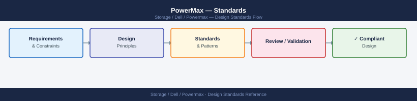

---
tags:
  - architecture
  - dell
---
# PowerMax — Standards


<div class="kb-summary">
Standards reference covering Naming Conventions, Build Baseline, Configuration Checklist, Sizing Guidelines.

*Applies to: PowerMax 2500 / 8500*
</div>



```d2
direction: right

hosts: Production Hosts {
  h1: Open Systems\n(FC / iSCSI / NVMe) {shape: rectangle}
  h2: Mainframe\n(FICON) {shape: rectangle}
}

array: PowerMax 2500 / 8500 {
  fa: FA Directors\n(Masking Views) {shape: rectangle}
  slo: Service Level Objectives\nDiamond · Platinum · Gold {shape: rectangle}
  sg: Storage Groups\n(app containers + SLO) {shape: rectangle}
  srp: SRP — NVMe capacity pool {shape: cylinder}
  srdf: RDF Directors\nSRDF/S · SRDF/A {shape: rectangle}
  fa -> slo: SLO enforced
  slo -> sg
  sg -> srp: thin allocation
}

remote: Remote PowerMax\n(DR site) {shape: rectangle}

hosts.h1 -> array.fa: FC / iSCSI
hosts.h2 -> array.fa: FICON
array.srdf -> remote: SRDF replication
```

## Naming Conventions

| Object | Convention | Example |
|---|---|---|
| Symmetrix ID (SID) | 3–12 digit serial, used as-is | `000123456789` |
| Storage Group | `<site>-<app>-<tier>-SG` | `LON-ORACLE-P1-SG` |
| Device Group | `<site>-<app>-DG` | `LON-ORACLE-DG` |
| Port Group | `<site>-<fabric>-PG` | `LON-FAB-A-PG` |
| Initiator Group | `<hostname>-IG` | `db01-LON-IG` |
| Masking View | `<hostname>-<sg>-MV` | `db01-LON-LON-ORACLE-P1-MV` |
| SRDF Group | `RDFg<number>-<site-pair>` | `RDFg10-LON-AMS` |
| SnapVX Snapshot | `<app>-snap-<YYYYMMDD>` | `ORACLE-snap-20260501` |
| RDF Port Group | `<site>-RDF-PG` | `LON-RDF-PG` |

## Build Baseline

Every new PowerMax deployment should meet the following baseline before handover to operations:

- **Solutions Enabler** installed on at least two management hosts (primary and secondary) and pointing to the production SID.
- **Unisphere for PowerMax** deployed as a vApp or physical appliance; connected to the array and secondary SE host.
- **Embedded Management** enabled on the array for break-glass SYMCLI access without external SE.
- **PowerPath/VE** (VMware) or **PowerPath** (Linux/Windows) installed on all production hosts; multipath policy set to `Optimized`.
- **SRDF groups** defined with the remote array and tested for both SRDF/S (synchronous) and SRDF/A (asynchronous) pairs where required.
- **FAST VP** policies configured; at minimum one SLO assigned to production storage groups.
- **SnapVX** expiry policies configured on all storage groups to enforce maximum snapshot retention.
- **Alert thresholds** configured in Unisphere: response time >2 ms, port utilisation >70%, thin pool >75%.
- **Service Level Objectives (SLOs)** assigned to all production storage groups (`Diamond`, `Platinum`, `Gold`, `Silver`, `Bronze`, or `Optimized`).
- **Solutions Enabler symapi.db** backed up after initial configuration.

## Configuration Checklist

- [ ] Array registered in CMDB with SID, model, location, and owning team
- [ ] Solutions Enabler `netcnfg` file updated to include the array SID and IP
- [ ] Unisphere for PowerMax configured with LDAP/AD authentication and local admin account disabled
- [ ] All front-end director ports zoned correctly; zoning validated with `symcfg -sid <SID> show`
- [ ] Storage groups created per application with correct SLO assigned
- [ ] Masking views created and verified — hosts can see LUNs and I/O is confirming on both paths
- [ ] SRDF groups created, pairs established, and pair states confirmed `Synchronized` or `Consistent`
- [ ] SnapVX policy set on all production storage groups; first snapshot tested and linked
- [ ] FAST VP policy active; tier movement verified after 24 hours of production I/O
- [ ] Syslog and SNMP trap forwarding configured to monitoring platform
- [ ] Quarterly review schedule set for capacity, SRDF health, and SnapVX quota usage

## Sizing Guidelines

| Dimension | Guidance |
|---|---|
| Model selection | PowerMax 2500 for mid-enterprise tier-1 (up to ~4 PB raw); PowerMax 8500 for large enterprise requiring more engines, SRDF metro, or mainframe (up to ~9 PB raw) |
| Global memory | 1.5 TB (2500) to 16 TB (8500); more memory improves write-cache hit rate and reduces drive latency |
| Drive count | Scale drives per engine based on workload IOPS and capacity requirements; target <70% of raw capacity used |
| SRDF bandwidth | Size SRDF links at 120% of peak write throughput for SRDF/S; use SRDF/A delta set size to estimate bandwidth for async |
| Thin provisioning | Allow 2:1 to 3:1 oversubscription for general-purpose workloads; monitor subscribed vs. consumed capacity weekly |
| SnapVX impact | Each snapshot session consumes metadata capacity; plan for <128 snapshots per device to maintain headroom |
| Data reduction | Expected effective capacity ratio: 4:1 to 5:1 for mixed workloads with compression and deduplication enabled |

---

## See also

- [Powermax — How It Works](how-it-works/)
- [Powermax — Integrations](integrations/)
- [Powermax — Deploy](../deploy/)
