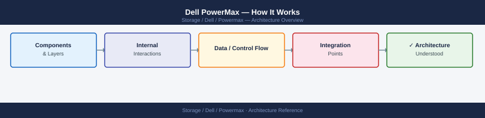
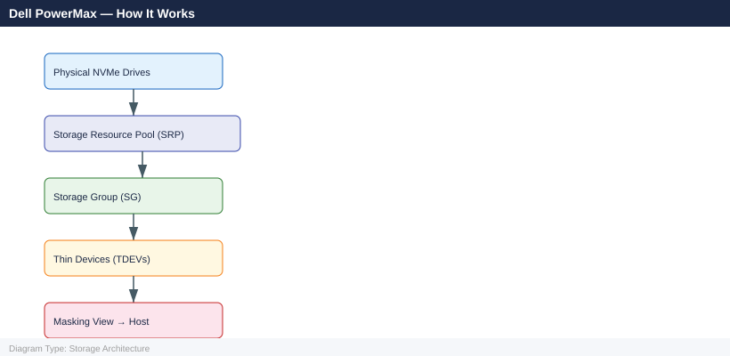

---
tags:
  - architecture
  - dell
---
# Dell PowerMax — How It Works


<div class="kb-summary">
Internal architecture and data-path reference: Director architecture, Global Cache, SRDF replication, storage resource management, host connectivity, and Unisphere management.

*Applies to: PowerMax 2500 / 8500*
</div>



```d2
direction: right

hosts: Hosts {
  h1: Host A {shape: rectangle}
  h2: Host B {shape: rectangle}
}

pm1: PowerMax (Site A) {
  fe_a: Front-End Directors\n(FC / iSCSI / NVMe) {shape: rectangle}
  gc_a: Global Cache\n(DRAM · RAID-1 mirrored) {shape: rectangle}
  be_a: Back-End Directors {shape: rectangle}
  rdf_a: RDF Directors {shape: rectangle}
  flash_a: NVMe Flash Bays {shape: cylinder}
  fe_a -> gc_a: write to cache
  gc_a -> be_a: async destage
  gc_a -> rdf_a: SRDF path
  be_a -> flash_a
}

pm2: PowerMax (Site B) {
  fe_b: Front-End Directors {shape: rectangle}
  gc_b: Global Cache\n(DRAM · RAID-1 mirrored) {shape: rectangle}
  be_b: Back-End Directors {shape: rectangle}
  rdf_b: RDF Directors {shape: rectangle}
  flash_b: NVMe Flash Bays {shape: cylinder}
  fe_b -> gc_b: write to cache
  gc_b -> be_b: async destage
  gc_b -> rdf_b: SRDF path
  be_b -> flash_b
}

unisphere: Unisphere\n(management) {shape: rectangle}

hosts.h1 -> pm1.fe_a: FC / NVMe-oF
hosts.h2 -> pm2.fe_b: FC / NVMe-oF

pm1.rdf_a -> pm2.rdf_b: SRDF replication\n(sync / async / STAR)

unisphere -> pm1: manage
unisphere -> pm2: manage
```

## Architecture Overview

PowerMax is Dell's flagship enterprise all-NVMe storage array, purpose-built for mission-critical tier-1 workloads including mainframe, OLTP databases, ERP platforms, and financial transaction systems. It uses a massively parallel director-based architecture: multiple independent processing boards (Directors) share access to a large global DRAM cache and back-end NVMe flash drives.

Two models are available:

| Model | Max Engines | Max Raw Capacity | Target Workload |
|---|---|---|---|
| PowerMax 2500 | 2 engines | ~4 PB | Mid-enterprise; tier-1 databases |
| PowerMax 8500 | 8 engines | ~9 PB | Large enterprise; SRDF metro clusters, mainframe |

The Hypermax OS runs on all director boards simultaneously. There is no single master controller — every director is a fully active processing node sharing the same global state through the crossbar interconnect and global cache. This architecture delivers millions of IOPS at sub-millisecond latency without creating bottlenecks at a centralised controller.

## Director Architecture

Directors are the compute and I/O processing units inside a PowerMax engine. Each engine contains at least two director boards, and all directors share a common crossbar interconnect to reach global cache and the back-end NVMe drives.

There are three classes of directors, each with a distinct role:

**Front-End (FA) Directors**

Front-end directors face the host network. They terminate host I/O sessions and pass data into global cache.

- Connect to hosts via FC (32 Gb/s), iSCSI (25 GbE), NVMe/FC, or FICON (mainframe)
- Each FA director hosts multiple host-facing ports; zoning and masking views are applied here
- ALUA path states are managed per FA director port — preferred and non-preferred paths are defined in Masking Views

**Back-End (DA) Directors**

Back-end directors face the NVMe flash drives. They move data between global cache and the physical flash media.

- Connect to NVMe drive bays via a direct PCIe fabric
- Manage RAID protection (RAID-5 3+1, RAID-6 6+2 or 8+2) across NVMe drives
- Execute destage operations — moving dirty write data from global cache to NVMe drives during idle periods and continuously under load

**RDF Directors (RA)**

RDF directors handle SRDF replication traffic between PowerMax arrays.

- Connect to remote PowerMax arrays via dedicated FC or IP links
- All SRDF replication traffic is isolated to RA director ports — it does not compete with host I/O on FA director ports
- Each SRDF group (RDF group) is bound to a specific pair of RA directors at source and target

## Global Cache

The global cache is a large DRAM memory pool shared by all directors in the array. It acts as the staging area for all reads and writes.

Key properties:

- Size ranges from tens of GB to over 2 TB depending on model and configuration
- All host writes land in global cache first; the host ACK is returned after the write is in cache and mirrored to the peer director's cache — not after it is written to NVMe drives
- All reads are checked in global cache first; a cache hit avoids a back-end NVMe read entirely, reducing latency to DRAM speeds (microseconds)
- Write data in global cache is destaged to NVMe drives by back-end directors asynchronously; destage policy is managed by the Dynamic Cache Management (DCM) subsystem
- Cache is RAID-1 mirrored across directors within the same engine — a single director failure does not cause data loss

**Vault protection:** In the event of a power failure, PowerMax uses battery-backed NVRAM to safely flush the contents of global cache to a dedicated vault area on the NVMe drives. On power restoration, the array replays the vault log and restores the cache to its pre-failure state before accepting new host I/O.

## I/O Architecture

```d2
direction: right

hosts: Host Layer {
  h1: Production Hosts\nOracle · SQL · SAP\nFC / iSCSI / FICON {shape: rectangle}
}

fe: Front-End Directors {
  fa1: FA Director A\nFC / iSCSI ports\nMasking Views {shape: rectangle}
  fa2: FA Director B\nFC / iSCSI ports\nMasking Views {shape: rectangle}
}

cache: Global Cache {
  gc: DRAM Cache\nHundreds of GB\nRAID-1 · Vault-safe {shape: rectangle}
}

be: Back-End Directors {
  da1: DA Director A\nNVMe drive control\nRAID-5/6 protection {shape: rectangle}
  da2: DA Director B\nNVMe drive control\nRAID-5/6 protection {shape: rectangle}
}

nvme: NVMe Flash {
  drv: NVMe Drive Bays\neTLC / SCM\nRAID protected {shape: cylinder}
}

srdf: SRDF Replication {
  ra1: RA Director A\nRDF Group links {shape: rectangle}
  ra2: RA Director B\nRDF Group links {shape: rectangle}
}

remote: Remote PowerMax\nSRDF/S or SRDF/A target {shape: rectangle}

hosts.h1 -> fe.fa1: FC / iSCSI host I/O
hosts.h1 -> fe.fa2: FC / iSCSI host I/O
fe.fa1 -> cache.gc
fe.fa2 -> cache.gc
cache.gc -> be.da1
cache.gc -> be.da2
be.da1 -> nvme.drv
be.da2 -> nvme.drv
cache.gc -> srdf.ra1
cache.gc -> srdf.ra2
srdf.ra1 -> remote: SRDF/S or SRDF/A\nRDF protocol over FC or IP
srdf.ra2 -> remote: SRDF/S or SRDF/A
```

## SRDF Replication

SRDF (Symmetrix Remote Data Facility) is PowerMax's native replication protocol, used for disaster recovery and metro high availability. SRDF operates at the volume (device) level — individual devices or groups of devices are paired between a source (R1) and a target (R2) PowerMax.

**SRDF/S — Synchronous**

- Every host write to an R1 device is immediately mirrored to the R2 device on the remote PowerMax before the ACK is returned to the host
- RPO = 0 — no data can be lost at the R2 site if the R1 site fails
- RTO depends on the failover procedure, but R2 data is always fully current
- Requires low-latency network between sites — typically <10 ms RTT; higher latency degrades host write response time directly
- Best suited for metro distances (same city or campus)

**SRDF/A — Asynchronous**

- Writes are buffered at the R1 site and transmitted to R2 in periodic delta sets (typically every 15–30 seconds)
- RPO = the delta set cycle time — typically less than 30 seconds for configured workloads
- R2 data lags R1 by one delta set; the lag is consistent and monitored
- No latency impact on host writes — the host ACK does not wait for R2 confirmation
- Suitable for any network distance, including intercontinental replication

**SRDF pair states:**

| State | Meaning |
|---|---|
| Synchronized | Normal SRDF/S state — R1 and R2 are in sync |
| Consistent | Normal SRDF/A state — R2 consistent, receiving delta sets |
| Synchronizing | Data transfer in progress — catching up after a pause |
| Suspended | SRDF link paused; writes queuing on R1 |
| Partitioned | Network connectivity lost between R1 and R2 |
| Failed Over | R2 is read-write; R1 is not ready — post-failover state |

## Storage Resource Management

PowerMax organises storage through a hierarchy of logical constructs:



**Thin Devices (TDEVs):** The logical block devices presented to hosts. TDEVs are thin-provisioned — physical capacity is allocated from the SRP only as data is written. A TDEV can be presented as much larger than the physical capacity available.

**Storage Groups (SGs):** A named container grouping one or more TDEVs together. Service Levels (Diamond, Platinum, Gold, Silver, Bronze) are applied at the SG level to set performance expectations enforced by DPTM (Dynamic Performance and Tiering Management).

**Storage Resource Pools (SRPs):** Aggregate the physical NVMe drive capacity. All TDEVs draw physical capacity from an SRP. In models with mixed media (NVMe + SCM), FAST (Fully Automated Storage Tiering) automatically migrates hot data to the faster tier and cold data to the denser tier.

**Masking Views:** Define the access relationship between a host, a port group (set of FA director ports), and a storage group. A Masking View is what causes a TDEV to appear as a block device on a specific host — without a Masking View, no host can see any device, regardless of zoning.

## Host Connectivity

PowerMax supports a wide range of host protocols, all serviced through Front-End Directors.

| Protocol | Speed | Notes |
|---|---|---|
| Fibre Channel | 32 Gb/s | Standard for enterprise block; dual-fabric zoning required |
| iSCSI | 25 GbE | IP SAN; requires dedicated network or VLAN |
| NVMe/FC | 32 Gb/s | NVMe over FC; lowest host-visible latency |
| NVMe/TCP | 25 GbE+ | NVMe over TCP; supported on PowerMax 2500/8500 |
| FICON | Mainframe | IBM z-series channel attachment; dedicated FA director cards |

**PowerPath** is Dell's multipathing software, installed on hosts. It aggregates multiple paths (from different FA directors) into a single virtual device, provides automatic path failover on director or port failure, and applies intelligent load balancing across active paths. PowerPath/VE is the VMware-specific variant.

Cross-director zoning is the recommended practice — each host HBA should be zoned to ports on both FA Director A and FA Director B. This ensures that a director failure leaves at least one active path per host without requiring manual intervention.

## Unisphere for PowerMax

Unisphere is the browser-based management interface for PowerMax. It runs as a virtual appliance (vApp) on a vCenter environment and exposes both a GUI and a REST API.

- REST API base: `https://<unisphere-host>:8443/univmax/restapi/`
- All operations available in the GUI are also available via REST — array configuration, storage group management, masking, SRDF management, snapshot management, and performance metrics
- Multiple PowerMax arrays can be managed from a single Unisphere instance

**Solutions Enabler (SYMCLI)** is the host-based command-line toolkit for PowerMax management. It communicates with the array directly over a gatekeeper device (a small SCSI device presented to the Solutions Enabler host).

Commonly used SYMCLI command families:

| Command Prefix | Scope |
|---|---|
| `symcfg` | Array-level configuration and status |
| `symsg` | Storage group management |
| `sympd` | Physical drive status |
| `symrdf` | SRDF pair management and failover |
| `symsnap` | TimeFinder SnapVX snapshot management |
| `symmaskdb` | Masking view and initiator group management |

## SRDF Replication Topology — R1/R2 Groups, Director Ports, and Modes

**Part 1 — R1 site internal write path:** host I/O enters through FA directors, stages in Global Cache, and splits to either back-end NVMe (normal destage) or the RA directors (replication path).

```d2
direction: right

hosts: Production Hosts {
  h: Oracle RAC · SAP HANA\nFC 32 Gb/s dual-fabric {shape: rectangle}
}

fa: FA Directors A/B\nFC · iSCSI · NVMe/FC\nMasking Views {shape: rectangle}

gc: Global Cache — Site A\nDRAM · RAID-1 mirrored\nAll writes land here first {shape: rectangle}

ra: RDF Directors — Site A {
  ra_s: RA Director S — RDFg1\nSRDF/S Synchronous\nHolds write until R2 ACKs {shape: rectangle}
  ra_a: RA Director A — RDFg2\nSRDF/A Asynchronous\nACKs host · buffers deltas {shape: rectangle}
}

da: DA Directors A/B\nNVMe-oF · RAID-5/6 {shape: rectangle}

flash: NVMe Flash Bays\neTLC / SCM media {shape: cylinder}

hosts.h -> fa: FC host write
fa -> gc: write to cache
gc -> da: async destage
gc -> ra.ra_s: SRDF/S path
gc -> ra.ra_a: SRDF/A path
da -> flash
```

**Part 2 — Inter-site SRDF topology:** the two RA director pairs connect over dedicated links; SRDF/S holds the host ACK until Site B confirms, SRDF/A releases the host immediately and transmits delta sets periodically.

```d2
direction: right

ra1: Site A — RDF Directors {
  s1: RA-S · RDFg1\nSRDF/S Synchronous\nRPO = 0 {shape: rectangle}
  a1: RA-A · RDFg2\nSRDF/A Asynchronous\nRPO ~30 s {shape: rectangle}
}

links: Inter-Site Links {
  ls: Sync Link\nFC / DWDM · Max 10 ms RTT {shape: rectangle}
  la: Async Link\nFC or IP · Any distance {shape: rectangle}
}

ra2: Site B — RDF Directors {
  s2: RA-S · RDFg1\nReceives SRDF/S write\nACKs back to R1 {shape: rectangle}
  a2: RA-A · RDFg2\nReceives SRDF/A deltas\nApplies in order {shape: rectangle}
}

gc2: Global Cache — Site B\nDRAM · RAID-1 mirrored\nR2 staging area {shape: rectangle}

da2: DA Directors A/B\nNVMe-oF · RAID-5/6 {shape: rectangle}

flash2: NVMe Flash Bays — Site B\neTLC / SCM media {shape: cylinder}

dev: R2 Devices (TDEVs)\nRead-only normally\nRead-write on failover {shape: rectangle}

ra1.s1 -> links.ls: SRDF/S frames
ra1.a1 -> links.la: delta sets every 15–30 s
links.ls -> ra2.s2
links.la -> ra2.a2
ra2.s2 -> gc2: confirm to R1 first
ra2.a2 -> gc2: apply delta in order
gc2 -> da2: destage
da2 -> flash2
flash2 -> dev
```

Key points illustrated:

- **SRDF/S (synchronous):** The R1 Global Cache holds the host write and does not issue the ACK until the remote RA director at Site B has confirmed the write is in the R2 cache. Every millisecond of RTT on the inter-site link adds directly to host write latency — this is why SRDF/S is limited to metro distances of less than 10 ms RTT.
- **SRDF/A (asynchronous):** The host ACK is returned as soon as the write is committed to the R1 Global Cache. RA Director A at Site A accumulates writes into a timestamped delta set and transmits it to Site B every 15–30 seconds. The R2 side applies delta sets in order, preserving write consistency. Network distance is unlimited because host I/O is never blocked waiting for R2.
- **RDF groups** are numbered groups that bind a set of R1 devices to a set of R2 devices via specific RA director port pairs. Each RDF group can independently be in SRDF/S or SRDF/A mode — a single array commonly runs both modes simultaneously for different application tiers.
- **R2 devices** are read-only under normal operation. Failover (symrdf failover) promotes R2 to read-write and suspends the SRDF relationship, allowing hosts at Site B to take over production I/O.

## Key Terms Glossary

| Term | Definition |
|---|---|
| Director | An independent processing board inside a PowerMax engine; comes in FA (front-end), DA (back-end), and RA (RDF/replication) variants |
| Global Cache | A large DRAM pool shared by all directors; all reads and writes pass through it; RAID-1 protected across director pairs |
| SRDF/S | SRDF Synchronous — writes are mirrored to the remote R2 array before host ACK; RPO=0; suitable for metro distances |
| SRDF/A | SRDF Asynchronous — writes are batched into delta sets and sent to R2 periodically; configurable RPO (~30 seconds); suitable for any distance |
| TDEV | Thin Device — the thin-provisioned logical block volume presented to a host; physical capacity allocated from an SRP on write |
| SRP | Storage Resource Pool — the aggregate of physical NVMe drives from which TDEVs draw capacity |
| FAST | Fully Automated Storage Tiering — automatically migrates data between NVMe tiers (e.g., SCM for hot, eTLC for warm) based on access frequency |
| Masking View | The access-control object that binds a host initiator group, a port group, and a storage group — determines which devices a host can see |
| PowerPath | Dell multipathing software installed on hosts; aggregates multiple FA director paths, provides failover and load balancing |
| Hypermax OS | The operating system running on all PowerMax director boards; manages cache, scheduling, SRDF, and data services |
| RDF Group | A numbered replication group on PowerMax; binds R1 and R2 devices together for SRDF replication on specific RA director ports |
| Solutions Enabler | Dell's host-based CLI toolkit (SYMCLI) for PowerMax; required for scripted and advanced management operations |

---

## See also

- [Powermax — Design Standards](../design-standards/)
- [Powermax — Integrations](../integrations/)
- [Powermax — Deploy](../deploy/)
