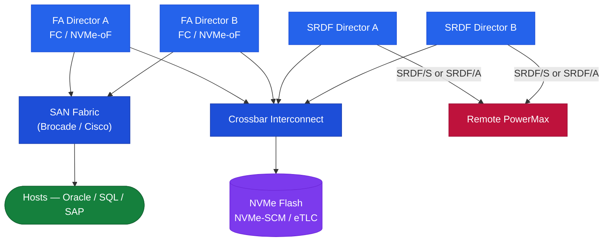

# PowerMax — How It Works


<div class="kb-summary">
How It Works reference covering Overview, Architecture, HA Topology, Components, Connectivity and 3 more sections.
</div>
```text
┌──────────────────────────────────── Dell PowerMax — How It Works ─────────────────────────────────────┐
│                                                                                                       │
│   ┌───────────────────────────────────────────────────────────────────────────────────────────────┐   │
│   │     PowerMax operational flow: request → controller → data service → host acknowledgement     │   │
│   │          Data path: host I/O → PowerMax controller → storage media → persistent write         │   │
│   │ Management: Unisphere for PowerMax / Solutions Enabler provides unified control for all opera │   │
│   │           Protection: snapshots, replication, and redundancy ensure data durability           │   │
│   └───────────────────────────────────────────────────────────────────────────────────────────────┘   │
│                                                                                                       │
│    Host I/O → PowerMax controller → storage media → acknowledge → replicate                           │
│                                                                                                       │
│                  ▼                                ▼                                ▼                  │
│                                                                                                       │
│   ┌─────────────────────────────┐  ┌─────────────────────────────┐  ┌─────────────────────────────┐   │
│   │            Layer            │  │          Component          │  │           Function          │   │
│   │            Cache            │  │          DRAM 2 TB+         │  │        Sub-ms latency       │   │
│   │         FE director         │  │        FC/iSCSI ports       │  │         Host facing         │   │
│   │         BE director         │  │         NVMe drives         │  │        Storage facing       │   │
│   │             SRDF            │  │         RDF director        │  │       Metro/remote DR       │   │
│   │          TimeFinder         │  │         SnapVX/Clone        │  │       Local protection      │   │
│   └─────────────────────────────┘  └─────────────────────────────┘  └─────────────────────────────┘   │
│                                                                                                       │
│                          ▼                                                 ▼                          │
│                                                                                                       │
│   ┌───────────────────────────────────────────────────────────────────────────────────────────────┐   │
│   │    Component     │     Purpose      │      Protocol     │       Auth       │      Notes       │   │
│   │    SRDF Sync     │   Zero-RPO DR    │    RDF protocol   │   Certificate    │   Metro <200ms   │   │
│   │    SRDF Async    │  Near-zero RPO   │    RDF protocol   │   Certificate    │   Any distance   │   │
│   │    TimeFinder    │ Local snapshots  │      Internal     │ Solutions Enabl  │   256 snaps/SG   │   │
│   │Solutions Enabler │   CLI/API mgmt   │    HTTPS/symcli   │   Certificate    │     Symm CLI     │   │
│   └───────────────────────────────────────────────────────────────────────────────────────────────┘   │
│                                                                                                       │
│    Physical: PowerMax 2500/8500 engine · FE/BE/RDF directors · DRAM cache · expansion bays            │
│                                                                                                       │
│    Key terms:                                                                                         │
│                                                                                                       │
│    PowerMax           = Dell flagship NVMe all-flash array; millions of IOPS at sub-millisecond lat...│
│    SRDF               = Symmetrix Remote Data Facility; sync/async metro and remote site replication  │
│    TimeFinder SnapVX  = space-efficient snapshot technology; up to 256 snapshots per storage group    │
│    Storage group      = logical container for volumes sharing service level and host access policy    │
│    Service level      = performance target for a storage group: Diamond, Platinum, Gold, Silver       │
│    FE director        = front-end director providing FC or iSCSI host-facing ports on the engine      │
│    BE director        = back-end director connecting engine cache to NVMe flash drive bays            │
│    RDF director       = SRDF director providing dedicated bandwidth for replication traffic           │
│    Solutions Enabler  = CLI and API toolkit; symcli commands cover all PowerMax management            │
│    Unisphere          = web GUI and REST API server for PowerMax; unified management interface        │
│    DCM                = Dynamic Cache Management; auto-balances workloads across available cache re...│
│    Service level obj. = workload performance class assigned to storage group; enforced by DPTM        │
│                                                                                                       │
└───────────────────────────────────────────────────────────────────────────────────────────────────────┘
```


## Overview

Dell PowerMax is an enterprise NVMe-oF all-flash array engineered for mission-critical tier-1 workloads. It is available in two models: **PowerMax 2000** (1–4 engines) and **PowerMax 8000** (1–8 engines). All flash media is NVMe, data is served over NVMe-oF (NVMe over FC or NVMe/TCP) or traditional FC/iSCSI, and latency is consistently sub-millisecond at scale. The array runs PowerMaxOS and is managed via Unisphere for PowerMax or SYMCLI (Solutions Enabler).

## Architecture



## HA Topology

PowerMax is architected around no single point of failure:

- **Director redundancy**: Every engine has two directors (A and B). If one director fails, the peer director takes over all I/O for that engine without host disruption.
- **Global memory mirroring**: Write cache is mirrored across both directors of an engine. A director failure does not result in data loss.
- **Multi-pathing**: Hosts connect to ports on both directors. PowerPath or native MPIO ensures automatic path failover on director or port failure.
- **NVMe drive protection**: Data is protected by RAID-5 (3+1) or RAID-6 (6+2 / 8+2). No single drive loss causes data unavailability.
- **SRDF replication**: SRDF/S (zero RPO, ≤10ms RTT) and SRDF/A (~30s RPO, any distance) provide site-level redundancy.
- **Power and cooling**: Dual redundant power feeds and N+1 cooling fans per engine.

## Components

| Component | Description |
|---|---|
| Engine | Physical cabinet unit; each engine contains two directors. PowerMax 2000 supports 1–4 engines; PowerMax 8000 supports 1–8 engines. |
| Director | The compute and I/O controller within an engine. Each engine has two directors in an active-active pair. |
| Front-end Director (FED) | Handles host connectivity via FC, FICON, and NVMe/FC port adapters. |
| Back-end Director (BED) | Manages the NVMe flash drives. All drives are NVMe-AF (all-flash NVMe). |
| SRDF Director (RDF) | Dedicated director ports for SRDF replication links. |
| Global Memory | DRAM shared across all directors; stores write cache and metadata; RAID 1 across directors. |
| Unisphere for PowerMax | Web-based management; deployed as a vApp or virtual appliance. |
| Solutions Enabler (SE) | Host-based toolkit; provides SYMCLI for scripted operations. |

## Connectivity

| Protocol | Director Type | Notes |
|---|---|---|
| Fibre Channel (FC) | Front-end | 32 Gb/s FC ports; standard for tier-1 block workloads |
| NVMe/FC | Front-end | NVMe over FC for lowest-latency host access |
| NVMe/TCP | Front-end | NVMe over TCP; supported on PowerMax 2000/8000 with appropriate firmware |
| iSCSI | Front-end | 25 GbE iSCSI for IP-connected hosts |
| SRDF (FC) | RDF | Dedicated RDF ports; 8 Gb/s or 16 Gb/s FC |
| SRDF/IP | RDF | IP-based SRDF for sites without FC dark fibre |

Zone each host HBA port to ports on **both** directors of an engine (cross-director zoning). Use PowerPath/VE for VMware environments.

## SRDF Pair States

| State | Meaning |
|---|---|
| Synchronized | In sync — normal SRDF/S production state |
| Consistent | R2 consistent, receiving cycles — normal SRDF/A state |
| Synchronizing | Catching up — data transfer in progress |
| Suspended | Paused — writes queued on R1 |
| Partitioned | Communication lost between R1 and R2 |
| Failed Over | R2 is R/W, R1 is NR — after failover |

## Key SYMCLI Commands

```bash
# Array health and configuration
symcfg list
symcfg -sid <SID> show

# SRDF pair states
symrdf -sid <SID> -rdfg <rdfg_id> query
symrdf -sid <SID> list -rdfg all | grep -v "Synchronized\|Consistent"

# Storage groups and devices
symsg list -sid <SID>
sympd list -sid <SID>

# SnapVX snapshots
symsnap list -sid <SID> -sg <storage-group>

# Suspend / resume SRDF
symrdf -sid <SID> -rdfg <rdfg_id> suspend -noprompt
symrdf -sid <SID> -rdfg <rdfg_id> resume -noprompt
```

## Sizing

| Model | Engines | Max Raw Capacity | Use Case |
|---|---|---|---|
| PowerMax 2000 | 1–4 | Up to ~4.5 PB | Mid-enterprise; tier-1 databases |
| PowerMax 8000 | 1–8 | Up to ~9 PB | Large enterprise; SRDF/S metro clusters |
