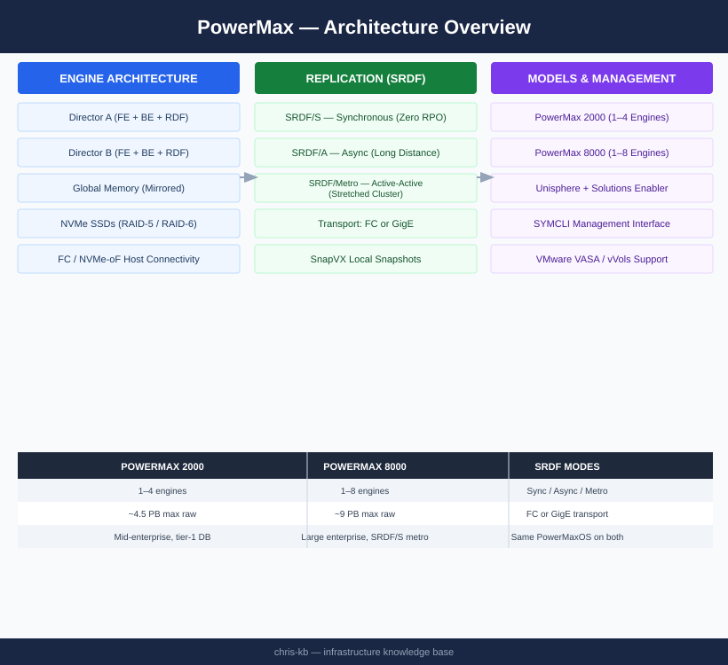

# PowerMax — Architecture

Dell PowerMax is an enterprise all-flash NVMe-oF array with an active-active director-pair architecture and global memory mirroring. It supports SRDF synchronous (zero RPO) and asynchronous replication for metro and long-distance DR.

  <a class="kb-card" href="how-it-works/">
    
⚙️

    
How It Works

    
Director-pair HA, SRDF replication modes, NVMe-oF fabric, SnapVX snapshots, and SYMCLI reference.

  </a>
  <a class="kb-card" href="integrations/">
    
🔗

    
Integrations

    
VMware VASA/vVols, Oracle RMAN, SQL Server, VPLEX back-end, and Solutions Enabler scripting.

  </a>
  <a class="kb-card" href="design-standards/">
    
📐

    
Design Standards

    
SRDF topology decisions, director layout, zoning standards, and host connectivity design rules.

  </a>

## Models

| Model | Engines | Max Raw Capacity | Primary Use Case |
|---|---|---|---|
| PowerMax 2000 | 1–4 | ~4.5 PB | Mid-enterprise; tier-1 databases |
| PowerMax 8000 | 1–8 | ~9 PB | Large enterprise; SRDF/S metro clusters |

Both models share the same PowerMaxOS, SRDF feature set, and NVMe-oF architecture. The 8000 supports more engines and higher drive counts.

## Topology

