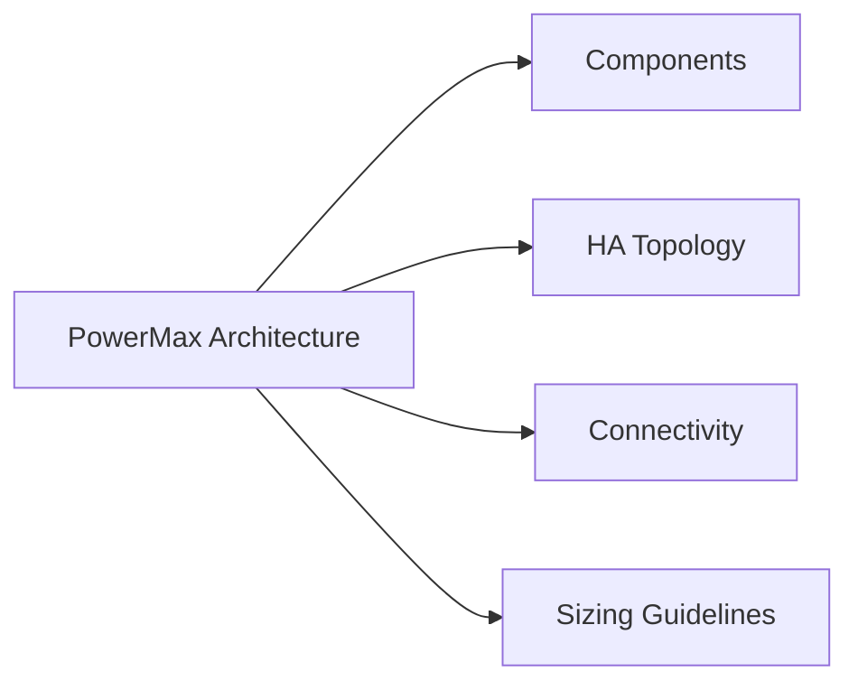

# PowerMax Architecture

## Overview

Dell PowerMax is an enterprise NVMe-oF all-flash array engineered for mission-critical tier-1 workloads. It is available in two models: **PowerMax 2000** (1–4 engines) and **PowerMax 8000** (1–8 engines). All flash media is NVMe, data is served over NVMe-oF (NVMe over Fibre Channel or NVMe/TCP) or traditional FC/iSCSI, and latency is consistently sub-millisecond at scale. The array runs PowerMaxOS (formerly Enginuity/HYPERMAX OS) and is managed via Unisphere for PowerMax or SYMCLI (Solutions Enabler).

## Components

| Component | Description |
|---|---|
| Engine | Physical cabinet unit; each engine contains two directors (director pair). PowerMax 2000 supports 1–4 engines; PowerMax 8000 supports 1–8 engines. |
| Director | The compute and I/O controller within an engine. Each engine has two directors in an active-active pair for redundancy. |
| Front-end Director (FED) | Handles host connectivity. Ports exposed here are mapped to host initiators via masking views. Supports FC, FICON, and NVMe/FC port adapters. |
| Back-end Director (BED) | Manages the NVMe flash drives. All drives are NVMe-AF (all-flash NVMe). |
| RDFA Director (RDF) | Dedicated director ports for SRDF replication links. Can be shared with FED ports on smaller configurations. |
| Global Memory | DRAM shared across all directors in the array. Stores write cache and metadata. Protected by RAID 1 across directors. |
| NVMe-AF Drives | All flash, NVMe form factor. PowerMax 2000 supports SCM (Storage Class Memory) in mixed configurations. |
| Unisphere for PowerMax | Web-based management interface. Deployed as a vApp or virtual appliance. |
| Solutions Enabler (SE) | Host-based management toolkit; provides SYMCLI for scripted and automated operations. |
| EmbeddedManagement | Embedded SE instance running on the array; enables array-native CLI operations without an external SE host. |

## HA Topology

PowerMax is architected around no single point of failure:

- **Director redundancy**: Every engine has two directors (A and B). If one director fails, the peer director takes over all I/O for that engine without host disruption.
- **Global memory mirroring**: Write cache is mirrored across both directors of an engine. A director failure does not result in data loss.
- **Multi-pathing**: Hosts connect to ports on both directors. PowerPath or native MPIO ensures automatic path failover on director or port failure.
- **NVMe drive protection**: Data is protected by RAID-5 (3+1), RAID-6 (6+2 or 8+2), or SRDF-based site-level redundancy. No single drive loss causes data unavailability.
- **SRDF (Symmetrix Remote Data Facility)**: Synchronous (SRDF/S) and asynchronous (SRDF/A) replication to a remote array. SRDF/S provides zero RPO and is used for metropolitan DR; SRDF/A tolerates higher RTT for longer-distance DR with a bounded RPO.
- **Power and cooling**: Dual redundant power feeds and N+1 cooling fans per engine.

## Connectivity

| Protocol | Director Type | Notes |
|---|---|---|
| Fibre Channel (FC) | Front-end | 32 Gb/s FC ports; standard for tier-1 block workloads |
| NVMe/FC | Front-end | NVMe over FC for lowest-latency host access |
| NVMe/TCP | Front-end | NVMe over TCP; supported on PowerMax 2000/8000 with appropriate firmware |
| iSCSI | Front-end | 25 GbE iSCSI for IP-connected hosts |
| SRDF (FC-based) | RDF | Dedicated RDF ports for inter-array replication; 8 Gb/s or 16 Gb/s FC |
| SRDF/IP | RDF | IP-based SRDF for sites without FC dark fibre |

Host connectivity best practices:
- Zone each host HBA port to ports on **both** directors of an engine (cross-director zoning) to maximise redundancy.
- Avoid connecting all host paths to a single engine; spread paths across at least two engines on large arrays.
- Use PowerPath/VE for VMware environments to provide automated path management and load balancing.

## Sizing Guidelines

| Dimension | Guidance |
|---|---|
| Model selection | PowerMax 2000 for up to ~8 PB effective capacity and moderate I/O; PowerMax 8000 for up to ~4 PB raw / 350+ PB effective with data reduction |
| Global memory | 1.5 TB (2000) to 16 TB (8000); more memory improves write-cache hit rate and reduces drive latency |
| Drive count | Scale drives per engine based on workload IOPS and capacity requirements; target <70% of raw capacity used |
| SRDF bandwidth | Size SRDF links at 120% of peak write throughput for SRDF/S; use SRDF/A delta set size to estimate bandwidth for async |
| Thin provisioning | Allow 2:1 to 3:1 oversubscription for general-purpose workloads; monitor subscribed vs. consumed capacity weekly |
| SnapVX impact | Each snapshot session consumes metadata capacity; plan for <128 snapshots per device to maintain headroom |
| Data reduction | Expected effective capacity ratio: 4:1 to 5:1 for mixed workloads with compression and deduplication enabled |
