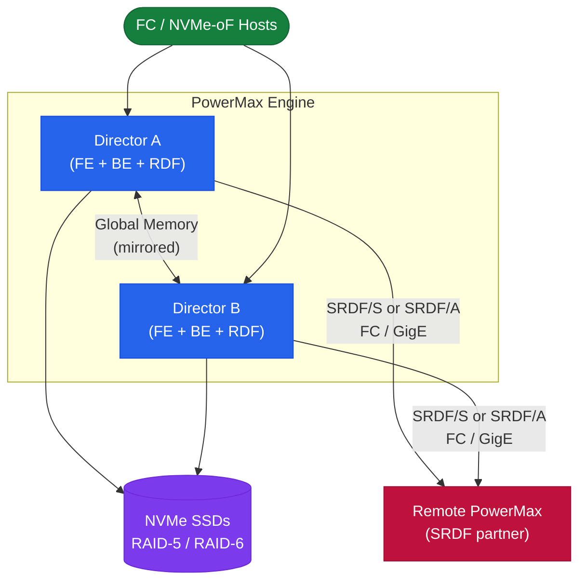

---
tags:
  - architecture
  - dell
---
# PowerMax — Architecture

<div class="kb-summary">
Dell PowerMax is an enterprise all-flash NVMe-oF array with an active-active director-pair architecture and global memory mirroring. It supports SRDF synchronous (zero RPO) and asynchronous replication for metro and long-distance DR.

*Applies to: PowerMax 2500 / 8500*
</div>

```text
┌────────────────────────────── Dell PowerMax — High-End AFA Architecture ──────────────────────────────┐
│                                                                                                       │
│  All-NVMe all-flash array for mission-critical workloads; DirectPath I/O to NVMe;                     │
│  SRDF replication (sync/async/Metro); TimeFinder snapshots; FICON for mainframe.                      │
│                                                                                                       │
│   ┌──────────────────────────────────────────────┐  ┌─────────────────────────────────────────────┐   │
│   │                   Platform                   │  │                Data Services                │   │
│   │           All-NVMe AFA (2500/8500)           │  │        SRDF: synchronous replication        │   │
│   │          DirectPath I/O: host→NVMe           │  │           TimeFinder: snap + clone          │   │
│   │          NVMe-oF: fabric attachment          │  │            FAST VP: auto-tiering            │   │
│   │         FICON: mainframe FC support          │  │          Inline dedup + compression         │   │
│   │         5-nines: 99.9999% HA target          │  │          Thin provisioning: dynamic         │   │
│   └──────────────────────────────────────────────┘  └─────────────────────────────────────────────┘   │
│                                                                                                       │
│  SRDF/Metro enables active-active stretched clusters with zero RPO across two sites.                  │
│                                                                                                       │
│                          ▼                                                 ▼                          │
│                                                                                                       │
│   ┌──────────────────────────────────────────────┐  ┌─────────────────────────────────────────────┐   │
│   │            Replication Topologies            │  │                  Management                 │   │
│   │          SRDF/S: sync; 0 RPO metro           │  │            Unisphere for PowerMax           │   │
│   │        SRDF/A: async; low RPO remote         │  │             SYMCLI: command line            │   │
│   │          SRDF/Metro: active-active           │  │               REST API: v100+               │   │
│   │         Concurrent: SRDF/S + SRDF/A          │  │            PowerMax OS: embedded            │   │
│   │          Cascade: 3-site protection          │  │           CloudIQ: AIOps analytics          │   │
│   └──────────────────────────────────────────────┘  └─────────────────────────────────────────────┘   │
│                                                                                                       │
│  Physical Infrastructure (the hardware everything above runs on):                                     │
│  PowerMax 2500 (entry) or 8500 (enterprise); dual-engine active-active internally;                    │
│  FC/NVMe-oF SAN fabric connections; dedicated management network for Unisphere.                       │
│                                                                                                       │
│  Key terms:                                                                                           │
│                                                                                                       │
│  PowerMax       = Dell high-end AFA; successor to VMAX; mission-critical storage                      │
│  SRDF           = Symmetrix Remote Data Facility; synchronous/async replication                       │
│  TimeFinder     = PowerMax snap (instant, no copy) and clone (full copy) tech                         │
│  SRDF/Metro     = synchronous active-active; both sides serve IO simultaneously                       │
│  NVMe-oF        = NVMe over Fabrics; FC-NVMe or RoCE; lower latency than SCSI                         │
│  DirectPath I/O = host OS bypasses storage controller; direct PCIe to NVMe                            │
│  FICON          = IBM mainframe FC protocol; PowerMax is mainframe-compatible                         │
│  5-nines        = 99.9999% availability; ~32 seconds unplanned downtime per year                      │
│  FAST VP        = Fully Automated Storage Tiering; auto-moves data to right tier                      │
│  Unisphere      = PowerMax web management UI; also manages multiple arrays                            │
│  SYMCLI         = command-line interface for PowerMax/VMAX operations                                 │
│  Concurrent SRDF= same volume replicated to two different sites simultaneously                        │
│                                                                                                       │
└───────────────────────────────────────────────────────────────────────────────────────────────────────┘
```




<div class="kb-grid kb-grid-3">
  <a class="kb-card" href="how-it-works/">
    <div class="kb-card-icon">⚙️</div>
    <div class="kb-card-title">How It Works</div>
    <div class="kb-card-desc">Director-pair HA, SRDF replication modes, NVMe-oF fabric, SnapVX snapshots, and SYMCLI reference.</div>
  </a>
  <a class="kb-card" href="integrations/">
    <div class="kb-card-icon">🔗</div>
    <div class="kb-card-title">Integrations</div>
    <div class="kb-card-desc">VMware VASA/vVols, Oracle RMAN, SQL Server, VPLEX back-end, and Solutions Enabler scripting.</div>
  </a>
  <a class="kb-card" href="design-standards/">
    <div class="kb-card-icon">📐</div>
    <div class="kb-card-title">Design Standards</div>
    <div class="kb-card-desc">SRDF topology decisions, director layout, zoning standards, and host connectivity design rules.</div>
  </a>
</div>

## Models

| Model | Engines | Max Raw Capacity | Primary Use Case |
|---|---|---|---|
| PowerMax 2000 | 1–4 | ~4.5 PB | Mid-enterprise; tier-1 databases |
| PowerMax 8000 | 1–8 | ~9 PB | Large enterprise; SRDF/S metro clusters |

Both models share the same PowerMaxOS, SRDF feature set, and NVMe-oF architecture. The 8000 supports more engines and higher drive counts.

## Topology


