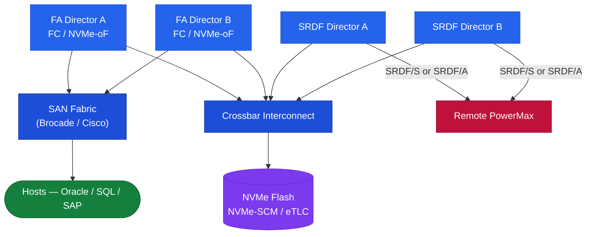

# PowerMax — Architecture Overview

## Overview

Dell PowerMax is an enterprise NVMe-oF all-flash array engineered for mission-critical tier-1 workloads. It is available in two models: **PowerMax 2000** (1–4 engines) and **PowerMax 8000** (1–8 engines). All flash media is NVMe, data is served over NVMe-oF (NVMe over Fibre Channel or NVMe/TCP) or traditional FC/iSCSI, and latency is consistently sub-millisecond at scale. The array runs PowerMaxOS (formerly Enginuity/HYPERMAX OS) and is managed via Unisphere for PowerMax or SYMCLI (Solutions Enabler).

## HA Topology

PowerMax is architected around no single point of failure:

- **Director redundancy**: Every engine has two directors (A and B). If one director fails, the peer director takes over all I/O for that engine without host disruption.
- **Global memory mirroring**: Write cache is mirrored across both directors of an engine. A director failure does not result in data loss.
- **Multi-pathing**: Hosts connect to ports on both directors. PowerPath or native MPIO ensures automatic path failover on director or port failure.
- **NVMe drive protection**: Data is protected by RAID-5 (3+1), RAID-6 (6+2 or 8+2), or SRDF-based site-level redundancy. No single drive loss causes data unavailability.
- **SRDF (Symmetrix Remote Data Facility)**: Synchronous (SRDF/S) and asynchronous (SRDF/A) replication to a remote array. SRDF/S provides zero RPO and is used for metropolitan DR; SRDF/A tolerates higher RTT for longer-distance DR with a bounded RPO.
- **Power and cooling**: Dual redundant power feeds and N+1 cooling fans per engine.

---

## In this section

<a class="kb-card" href="components/"><strong>Components</strong>Core components, services, and technical specifications.</a>
<a class="kb-card" href="integrations/"><strong>Integrations</strong>Integration with other platforms and external systems.</a>
<a class="kb-card" href="standards/"><strong>Standards</strong>Sizing guidelines, design standards, and best practices.</a>

