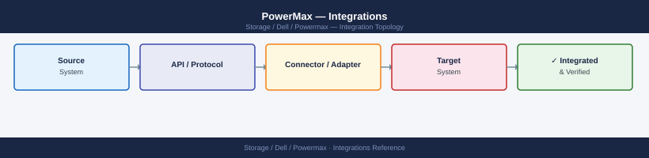
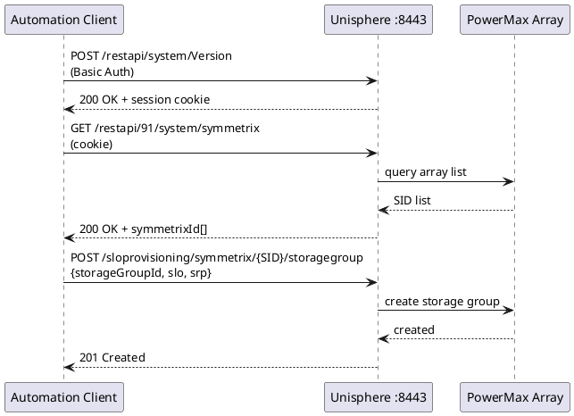

---
tags:
  - architecture
  - dell
---
# PowerMax — Integrations


<div class="kb-summary">
Integrations reference covering VMware Integration, Backup Integration, CloudIQ Monitoring, Active Directory / LDAP, Integration Topology and 1 more sections.

*Applies to: PowerMax 2500 / 8500*
</div>



```d2
direction: right

powermax: PowerMax {
  uni: Unisphere :8443\nREST API {shape: rectangle}
  array: Array {shape: cylinder}
  uni -> array
}

vmware: VMware {
  vc: vCenter\nSPBM / SRM {shape: rectangle}
  esx: ESXi Hosts\nVMFS / vVols {shape: rectangle}
}

backup: Backup {
  vbr: Veeam / NetBackup\nCommVault {shape: rectangle}
}

monitor: Monitoring {
  ciq: CloudIQ\n(SaaS) {shape: rectangle}
}

directory: Directory {
  ad: Active Directory\n/ LDAP {shape: rectangle}
}

vmware.vc -> powermax.uni: VASA / SRA
vmware.esx -> powermax.array: FC / NVMe-oF
backup.vbr -> powermax.uni: REST API
monitor.ciq -> powermax.uni: telemetry
directory.ad -> powermax.uni: LDAPS :636
```

## VMware Integration

PowerMax integrates with VMware vSphere via several paths:

- **VMFS datastores over FC/iSCSI**: Present thin devices to ESXi hosts via masking views. Use PowerPath/VE as the multipath driver for automated path failover and load balancing across directors.
- **vVols (Virtual Volumes)**: PowerMax supports VMware vVols with the Dell VASA Provider. vVols map individual VM disk objects directly to PowerMax thin devices, enabling per-VM storage policies and snapshot integration.
- **vSphere Storage Policy Based Management (SPBM)**: Dell Storage Provider publishes PowerMax capabilities (SLO, SRDF, SnapVX) as datastore capabilities. Assign VM storage policies that map to PowerMax SLOs.
- **VAAI (VMware APIs for Array Integration)**: PowerMax supports VAAI primitives — Hardware Accelerated Copy, Hardware Accelerated Move, Hardware Accelerated Locking — to offload VMFS clone and snapshot operations onto the array.
- **Site Recovery Manager (SRM)**: PowerMax SRDF integrates with VMware SRM via the Dell Storage Replication Adapter (SRA). SRM automates failover and failback of VM groups using SRDF pairs.

## Backup Integration

**DD Boost / NetBackup / Avamar**:
- Use SnapVX snapshots as backup source; integrate with Veritas NetBackup or Dell Avamar backup-from-snapshot workflows.
- Linked clones from SnapVX sessions can be mounted on media servers to offload backup I/O from production volumes.

**Veeam Backup & Replication**:
- Veeam integrates with PowerMax via the Dell PowerMax Plugin for Veeam. This allows Veeam to orchestrate SnapVX snapshots for application-consistent backups.
- Veeam mounts linked snapshot clones to proxy servers, avoiding production I/O impact.

**CommVault**:
- CommVault IntelliSnap supports PowerMax SnapVX for array-based snapshot backup. Configure the PowerMax array in CommVault → Storage → Arrays with the SE API credentials.

## CloudIQ Monitoring

Dell CloudIQ provides SaaS-based proactive monitoring and anomaly detection for PowerMax:

- **Setup**: Register the array in CloudIQ via Unisphere → Connectivity → CloudIQ. Requires outbound HTTPS (port 443) to `cloudiq.dell.com`.
- **Capabilities**: Capacity forecasting, performance anomaly detection, SRDF health scoring, and proactive alert notifications.
- **SupportAssist integration**: CloudIQ uses SupportAssist telemetry data. Ensure SupportAssist is enabled on the array.
- **Dashboards**: Per-SID health score, capacity trending, and workload analysis available in the CloudIQ portal.

## Active Directory / LDAP

Unisphere for PowerMax supports LDAP and Active Directory for administrator authentication:

- Configure under Unisphere → Settings → Security → LDAP.
- Map AD groups to Unisphere roles: `StorageAdmin`, `SecurityAdmin`, `Operator`, `Monitor`.
- Use a service account with read-only LDAP bind permissions; avoid using a personal account.
- Test LDAP connectivity with `ldapsearch` before completing configuration to avoid lockout.
- Retain at least one local admin account as a break-glass credential in the password vault.

## Integration Topology

```d2
direction: right

vmware: VMware Layer {
  vc: vCenter\n(SPBM / SRM) {shape: rectangle}
  esx: ESXi Hosts\n(VMFS / vVols) {shape: rectangle}
  vasa: VASA Provider\n(Dell) {shape: rectangle}
  sra: SRA Adapter\n(SRM failover) {shape: rectangle}
}

backup: Backup Layer {
  vbr: Veeam / NetBackup\n/ CommVault {shape: rectangle}
  proxy: Backup Proxy\n(linked clone) {shape: rectangle}
}

monitor: Monitoring Layer {
  ciq: CloudIQ\n(SaaS — dell.com) {shape: rectangle}
  sa: SupportAssist\n(auto SR creation) {shape: rectangle}
}

directory: Directory Layer {
  ad: Active Directory\n/ LDAP {shape: rectangle}
}

powermax: PowerMax Array {
  uni: Unisphere\nREST API :8443 {shape: rectangle}
  array: PowerMax Array {shape: cylinder}
  snapvx: SnapVX Engine {shape: rectangle}
  uni -> array
  array -> snapvx
}

vmware.vc -> vmware.vasa: VASA capabilities
vmware.vasa -> powermax.uni
vmware.esx -> powermax.array: FC / NVMe-oF
vmware.sra -> powermax.uni: REST API
backup.vbr -> powermax.uni: REST API\nsnap establish/link
backup.proxy -> powermax.array: FC / iSCSI\nlinked clone
powermax.uni -> monitor.ciq: HTTPS telemetry
powermax.uni -> monitor.sa: call-home
directory.ad -> powermax.uni: LDAPS :636
```

## REST API

PowerMax exposes a REST API through Unisphere for PowerMax (RESTAPI):



```bash
# Base URL format
https://<unisphere-host>:8443/univmax/restapi/<version>/

# Authentication: HTTP Basic or session token
# Obtain a session token
curl -k -u admin:password -X POST \
  https://<unisphere-host>:8443/univmax/restapi/system/Version

# List all arrays visible to this Unisphere instance
curl -k -u admin:password \
  https://<unisphere-host>:8443/univmax/restapi/91/system/symmetrix

# Get storage group details
curl -k -u admin:password \
  https://<unisphere-host>:8443/univmax/restapi/91/sloprovisioning/symmetrix/<SID>/storagegroup/<sg-name>

# Create a new storage group (POST with JSON body)
curl -k -u admin:password -X POST \
  -H "Content-Type: application/json" \
  -d '{"storageGroupId":"<sg-name>","slo":"Diamond","srp":"SRP_1"}' \
  https://<unisphere-host>:8443/univmax/restapi/91/sloprovisioning/symmetrix/<SID>/storagegroup
```

- API version is included in the URL path (e.g., `91` for v9.1). Increment for newer Unisphere releases.
- Use the interactive API documentation at `https://<unisphere-host>:8443/univmax/restapi/docs`.
- For programmatic automation, use the `PyU4V` Python library (open source, maintained by Dell): `pip install PyU4V`.

---

## See also

- [Powermax — How It Works](how-it-works/)
- [Powermax — Design Standards](design-standards/)
