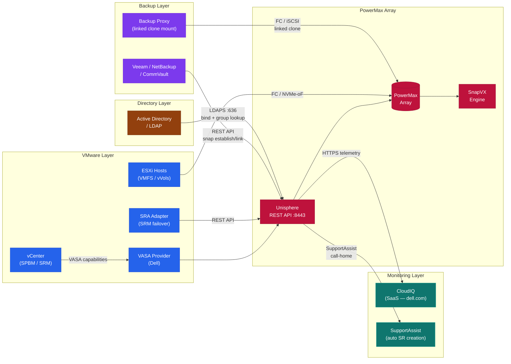
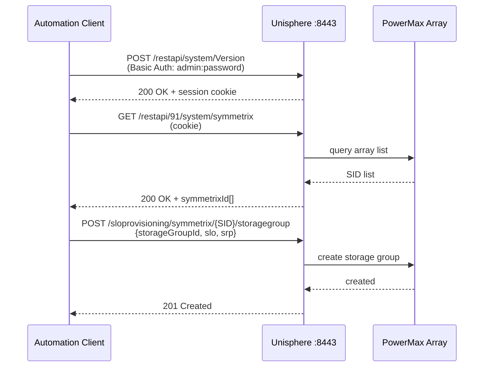

# PowerMax — Integrations


<div class="kb-summary">
Integrations reference covering VMware Integration, Backup Integration, CloudIQ Monitoring, Active Directory / LDAP, Integration Topology and 1 more sections.
</div>
```
┌──────────────────────────────────── Dell PowerMax — Integrations ─────────────────────────────────────┐
│                                                                                                       │
│   ┌───────────────────────────────────────────────────────────────────────────────────────────────┐   │
│   │     PowerMax integrations: VMware vSphere, Kubernetes CSI, backup software, and monitoring    │   │
│   │                      Protocols: FC · iSCSI · NVMe-oF · SRDF (replication)                     │   │
│   │ API: Unisphere for PowerMax / Solutions Enabler REST API enables automation and third-party t │   │
│   │             Plug-ins available for vCenter, OpenShift, Splunk, and SIEM platforms             │   │
│   └───────────────────────────────────────────────────────────────────────────────────────────────┘   │
│                                                                                                       │
│    PowerMax → REST API / plug-ins → VMware / K8s / backup / monitoring                                │
│                                                                                                       │
│                  ▼                                ▼                                ▼                  │
│                                                                                                       │
│   ┌─────────────────────────────┐  ┌─────────────────────────────┐  ┌─────────────────────────────┐   │
│   │            Layer            │  │          Component          │  │           Function          │   │
│   │            Cache            │  │          DRAM 2 TB+         │  │        Sub-ms latency       │   │
│   │         FE director         │  │        FC/iSCSI ports       │  │         Host facing         │   │
│   │         BE director         │  │         NVMe drives         │  │        Storage facing       │   │
│   │             SRDF            │  │         RDF director        │  │       Metro/remote DR       │   │
│   │          TimeFinder         │  │         SnapVX/Clone        │  │       Local protection      │   │
│   └─────────────────────────────┘  └─────────────────────────────┘  └─────────────────────────────┘   │
│                                                                                                       │
│                          ▼                                                 ▼                          │
│                                                                                                       │
│   ┌───────────────────────────────────────────────────────────────────────────────────────────────┐   │
│   │    Component     │     Purpose      │      Protocol     │       Auth       │      Notes       │   │
│   │    SRDF Sync     │   Zero-RPO DR    │    RDF protocol   │   Certificate    │   Metro <200ms   │   │
│   │    SRDF Async    │  Near-zero RPO   │    RDF protocol   │   Certificate    │   Any distance   │   │
│   │    TimeFinder    │ Local snapshots  │      Internal     │ Solutions Enabl  │   256 snaps/SG   │   │
│   │Solutions Enabler │   CLI/API mgmt   │    HTTPS/symcli   │   Certificate    │     Symm CLI     │   │
│   └───────────────────────────────────────────────────────────────────────────────────────────────┘   │
│                                                                                                       │
│    Physical: PowerMax 2500/8500 engine · FE/BE/RDF directors · DRAM cache · expansion bays            │
│                                                                                                       │
│    Key terms:                                                                                         │
│                                                                                                       │
│    PowerMax           = Dell flagship NVMe all-flash array; millions of IOPS at sub-millisecond lat...│
│    SRDF               = Symmetrix Remote Data Facility; sync/async metro and remote site replication  │
│    TimeFinder SnapVX  = space-efficient snapshot technology; up to 256 snapshots per storage group    │
│    Storage group      = logical container for volumes sharing service level and host access policy    │
│    Service level      = performance target for a storage group: Diamond, Platinum, Gold, Silver       │
│    FE director        = front-end director providing FC or iSCSI host-facing ports on the engine      │
│    BE director        = back-end director connecting engine cache to NVMe flash drive bays            │
│    RDF director       = SRDF director providing dedicated bandwidth for replication traffic           │
│    Solutions Enabler  = CLI and API toolkit; symcli commands cover all PowerMax management            │
│    Unisphere          = web GUI and REST API server for PowerMax; unified management interface        │
│    DCM                = Dynamic Cache Management; auto-balances workloads across available cache re...│
│    Service level obj. = workload performance class assigned to storage group; enforced by DPTM        │
│                                                                                                       │
└───────────────────────────────────────────────────────────────────────────────────────────────────────┘
```


## VMware Integration

PowerMax integrates with VMware vSphere via several paths:

- **VMFS datastores over FC/iSCSI**: Present thin devices to ESXi hosts via masking views. Use PowerPath/VE as the multipath driver for automated path failover and load balancing across directors.
- **vVols (Virtual Volumes)**: PowerMax supports VMware vVols with the Dell VASA Provider. vVols map individual VM disk objects directly to PowerMax thin devices, enabling per-VM storage policies and snapshot integration.
- **vSphere Storage Policy Based Management (SPBM)**: Dell Storage Provider publishes PowerMax capabilities (SLO, SRDF, SnapVX) as datastore capabilities. Assign VM storage policies that map to PowerMax SLOs.
- **VAAI (VMware APIs for Array Integration)**: PowerMax supports VAAI primitives — Hardware Accelerated Copy, Hardware Accelerated Move, Hardware Accelerated Locking — to offload VMFS clone and snapshot operations onto the array.
- **Site Recovery Manager (SRM)**: PowerMax SRDF integrates with VMware SRM via the Dell Storage Replication Adapter (SRA). SRM automates failover and failback of VM groups using SRDF pairs.

## Backup Integration

**DD Boost / NetBackup / Avamar**:
- Use SnapVX snapshots as backup source; integrate with Veritas NetBackup or Dell Avamar backup-from-snapshot workflows.
- Linked clones from SnapVX sessions can be mounted on media servers to offload backup I/O from production volumes.

**Veeam Backup & Replication**:
- Veeam integrates with PowerMax via the Dell PowerMax Plugin for Veeam. This allows Veeam to orchestrate SnapVX snapshots for application-consistent backups.
- Veeam mounts linked snapshot clones to proxy servers, avoiding production I/O impact.

**CommVault**:
- CommVault IntelliSnap supports PowerMax SnapVX for array-based snapshot backup. Configure the PowerMax array in CommVault → Storage → Arrays with the SE API credentials.

## CloudIQ Monitoring

Dell CloudIQ provides SaaS-based proactive monitoring and anomaly detection for PowerMax:

- **Setup**: Register the array in CloudIQ via Unisphere → Connectivity → CloudIQ. Requires outbound HTTPS (port 443) to `cloudiq.dell.com`.
- **Capabilities**: Capacity forecasting, performance anomaly detection, SRDF health scoring, and proactive alert notifications.
- **SupportAssist integration**: CloudIQ uses SupportAssist telemetry data. Ensure SupportAssist is enabled on the array.
- **Dashboards**: Per-SID health score, capacity trending, and workload analysis available in the CloudIQ portal.

## Active Directory / LDAP

Unisphere for PowerMax supports LDAP and Active Directory for administrator authentication:

- Configure under Unisphere → Settings → Security → LDAP.
- Map AD groups to Unisphere roles: `StorageAdmin`, `SecurityAdmin`, `Operator`, `Monitor`.
- Use a service account with read-only LDAP bind permissions; avoid using a personal account.
- Test LDAP connectivity with `ldapsearch` before completing configuration to avoid lockout.
- Retain at least one local admin account as a break-glass credential in the password vault.

## Integration Topology



## REST API

PowerMax exposes a REST API through Unisphere for PowerMax (RESTAPI):



```bash
# Base URL format
https://<unisphere-host>:8443/univmax/restapi/<version>/

# Authentication: HTTP Basic or session token
# Obtain a session token
curl -k -u admin:password -X POST \
  https://<unisphere-host>:8443/univmax/restapi/system/Version

# List all arrays visible to this Unisphere instance
curl -k -u admin:password \
  https://<unisphere-host>:8443/univmax/restapi/91/system/symmetrix

# Get storage group details
curl -k -u admin:password \
  https://<unisphere-host>:8443/univmax/restapi/91/sloprovisioning/symmetrix/<SID>/storagegroup/<sg-name>

# Create a new storage group (POST with JSON body)
curl -k -u admin:password -X POST \
  -H "Content-Type: application/json" \
  -d '{"storageGroupId":"<sg-name>","slo":"Diamond","srp":"SRP_1"}' \
  https://<unisphere-host>:8443/univmax/restapi/91/sloprovisioning/symmetrix/<SID>/storagegroup
```

- API version is included in the URL path (e.g., `91` for v9.1). Increment for newer Unisphere releases.
- Use the interactive API documentation at `https://<unisphere-host>:8443/univmax/restapi/docs`.
- For programmatic automation, use the `PyU4V` Python library (open source, maintained by Dell): `pip install PyU4V`.
