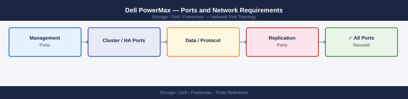

---
tags:
  - powermax
  - dell
  - vmax
  - networking
  - firewall
  - ports
  - storage
---
# Dell PowerMax — Ports and Network Requirements

<div class="kb-summary">
Firewall port reference for Dell PowerMax (formerly VMAX). Covers Unisphere for PowerMax management, iSCSI data paths, and SRDF replication. FC fabric paths are not IP-based.

*Applies to: PowerMax 2500 / 8500 / PowerMaxOS 10.x*
</div>



```d2
direction: right

clients: Clients {
  admin: Admin Workstations {shape: rectangle}
  symcli: SYMCLI Hosts {shape: rectangle}
  iscsi: iSCSI Hosts {shape: rectangle}
}

powermax: PowerMax {
  uni: Unisphere\n:8443 REST / Web {shape: rectangle}
  stored: Solutions Enabler\nstorEd :2707 {shape: rectangle}
  iscsi_port: iSCSI Ports\n:3260 {shape: rectangle}
  rdf: RDF Directors\nSRDF over IP :3260 {shape: rectangle}
}

external: External Services {
  esrs: ESRS / CloudIQ\n:443 {shape: rectangle}
  snmp: SNMP Receiver\n:162 UDP {shape: rectangle}
  syslog: Syslog Server\n:514 UDP {shape: rectangle}
  ntp: NTP Server\n:123 UDP {shape: rectangle}
}

remote: Remote PowerMax\n(SRDF target) {shape: rectangle}

clients.admin -> powermax.uni: TCP 8443
clients.symcli -> powermax.stored: TCP 2707
clients.iscsi -> powermax.iscsi_port: TCP 3260
powermax.uni -> external.esrs: TCP 443
powermax.uni -> external.snmp: UDP 162
powermax.uni -> external.syslog: UDP 514
powermax.uni -> external.ntp: UDP 123
powermax.rdf -> remote: TCP 3260\n(SRDF/A over IP)
```

## Inbound — Management

| Port | Protocol | Source | Purpose |
|---|---|---|---|
| 8443 | TCP | Admin workstations | Unisphere for PowerMax web UI and REST API (primary) |
| 443 | TCP | Admin workstations | Unisphere alternate HTTPS port |
| 22 | TCP | Jump hosts | SSH — Solutions Enabler / symcli management |

## Outbound — Array to External

| Port | Protocol | Destination | Purpose |
|---|---|---|---|
| 162 | UDP | SNMP receiver | SNMP traps |
| 514 | UDP | Syslog server | Syslog forwarding |
| 123 | UDP | NTP | Time sync |
| 443 | TCP | esrs.dell.com, cloudiq.dell.com | ESRS / CloudIQ support phone-home |

## iSCSI (SAN)

| Port | Protocol | Source | Purpose |
|---|---|---|---|
| 3260 | TCP | iSCSI initiator hosts | iSCSI block storage (PowerMax iSCSI ports) |

## SRDF Replication (if iSCSI-based SRDF)

For SRDF/Star, SRDF/Metro, or SRDF/A configured over IP links:

| Port | Protocol | Between | Purpose |
|---|---|---|---|
| 3260 | TCP | Source PowerMax iSCSI port → Target PowerMax | SRDF over iSCSI |

Fibre Channel SRDF uses FC fabric — no IP ports needed.

## Solutions Enabler (SYMCLI) Host-Based Management

| Port | Protocol | Source | Destination | Purpose |
|---|---|---|---|---|
| 2707 | TCP | SYMCLI host | SE server / GigE port on array | Solutions Enabler daemon (storEd) |

## Firewall Zone Summary

| From | To | Ports | Notes |
|---|---|---|---|
| Admin clients | PowerMax | 8443 | Unisphere UI |
| SYMCLI hosts | PowerMax | 2707 | Solutions Enabler CLI |
| iSCSI hosts | PowerMax iSCSI ports | 3260 | Block access |
| Source PowerMax | Target PowerMax | 3260 | SRDF/A over IP (if iSCSI SRDF) |
| PowerMax | ESRS / CloudIQ | 443 | Support telemetry |

## Verify

```bash
# From admin workstation — test Unisphere API
curl -sk -o /dev/null -w "%{http_code}" https://<powermax-mgmt-ip>:8443/univmax/restapi/version

# From iSCSI host — discover targets
iscsiadm -m discovery -t sendtargets -p <powermax-iscsi-ip>:3260
```


```text title="Expected output"
200
10.100.50.25:3260,1 iqn.1992-04.com.emc:60000970000195701234567890abcdef
10.100.50.26:3260,1 iqn.1992-04.com.emc:60000970000195701234567890abcdef
10.100.50.25:3260,2 iqn.1992-04.com.emc:60000970000195702345678901bcdefg
10.100.50.26:3260,2 iqn.1992-04.com.emc:60000970000195702345678901bcdefg
```

!!! warning "Common errors"
    **`curl: (60) SSL certificate problem: self signed certificate`** — Add `-k` flag to skip certificate verification (already present in example; if still failing, verify Unisphere is running with `systemctl status unisphere` on the array).
    **`iscsiadm: No records found`** — Verify the iSCSI portal IP is correct and reachable with `ping <powermax-iscsi-ip>`, and confirm iSCSI service is enabled on the PowerMax array.
## See also

- [Dell PowerMax — Architecture](../how-it-works/)
- [Dell PowerMax — Operations](../../operations/)
- [Dell SRDF-A — Ports](../../srdf-a/architecture/ports.md)
- [Dell SRDF-S — Ports](../../srdf-s/architecture/ports.md)
