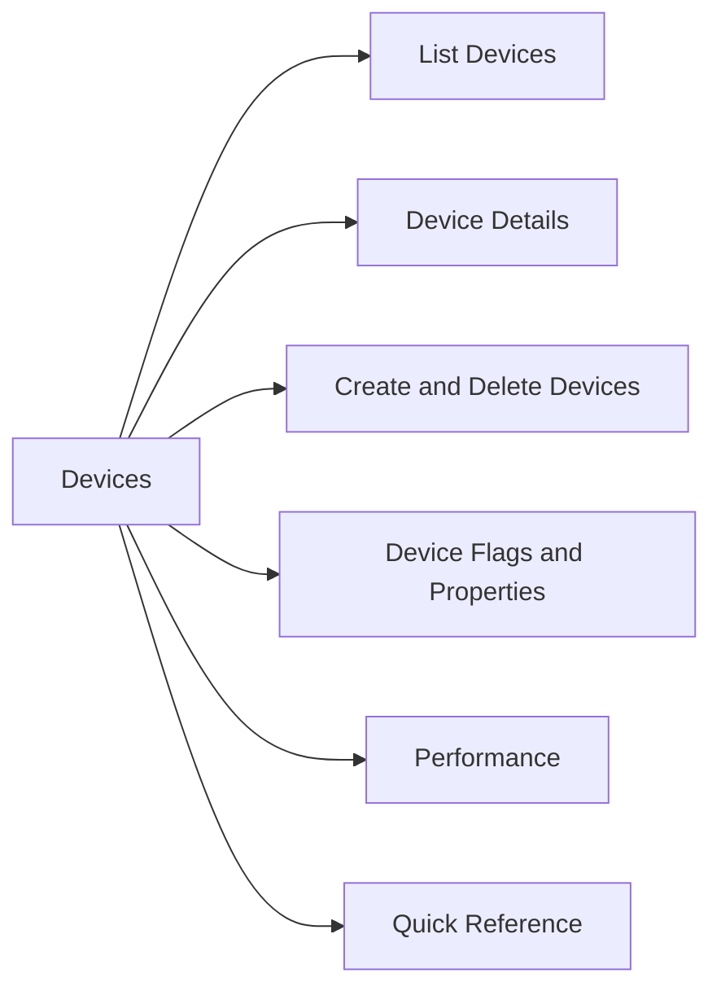

# Devices

> Part of the Dell PowerMax CLI Reference (SYMCLI). Devices are the thin or thick volumes presented to hosts. All production devices on PowerMax should be thin (TDEV).



## List Devices

```bash
# All devices
symdev list -sid <sid>
symdev list -sid <sid> -v

# Assigned (in a masking view) vs unassigned
symdev list -sid <sid> -assigned
symdev list -sid <sid> -unassigned

# Mapped to hosts
symdev list -sid <sid> -mapped

# Thin devices (TDEV) — should be all production volumes
symdev list -sid <sid> -tdev

# Failed or degraded devices
symdev list -sid <sid> -failed

# Spare devices
symdev list -sid <sid> -spare
```

## Device Details

```bash
# Full device info (capacity, SG membership, SRDF state, host mapping)
symdev show <devname> -sid <sid>
symdev show <devname> -sid <sid> -v

# Show SRDF pair info for a device
symdev show <devname> -sid <sid> | grep -E "RDF|Pair State|R1|R2"

# Show storage group membership
symdev show <devname> -sid <sid> | grep "Storage Group"
```

## Create and Delete Devices

```bash
# Create thin devices (preferred method — add directly to SG)
symconfigure -sid <sid> -cmd "create dev count=10, size=100GB, emulation=FBA, config=TDEV, sg=<sg_name>;" commit -noprompt

# Delete a device (must be unmasked and removed from all SGs)
symdev -sid <sid> not_ready <devname> -noprompt
symconfigure -sid <sid> -cmd "delete dev <devname>;" commit -noprompt
```

## Device Flags and Properties

```bash
# Check if device is write-disabled (RDF R2 side in sync)
symdev show <devname> -sid <sid> | grep "Write Disable"

# Check thin pool subscription
symcfg -sid <sid> show -pool -thin -demand | grep -E "Total|Subscribed|Free"

# Check device binding to SRDF group
symdev list -sid <sid> -rdfg <rdfg_number>
```

## Performance

```bash
# Device I/O stats (requires Solutions Enabler perf daemon)
symstat -sid <sid> list -type dev -devn <devname>

# All device stats (output can be large)
symstat -sid <sid> list -type dev

# Top devices by IOPS
symstat -sid <sid> list -type dev | sort -k4 -rn | head -20
```

## Quick Reference

| Task | Command |
|---|---|
| List all thin devices | `symdev list -sid <sid> -tdev` |
| Show device detail | `symdev show <devname> -sid <sid>` |
| List failed devices | `symdev list -sid <sid> -failed` |
| List unassigned devices | `symdev list -sid <sid> -unassigned` |
| Create TDEVs in SG | `symconfigure ... create dev ... sg=<sg>` |
