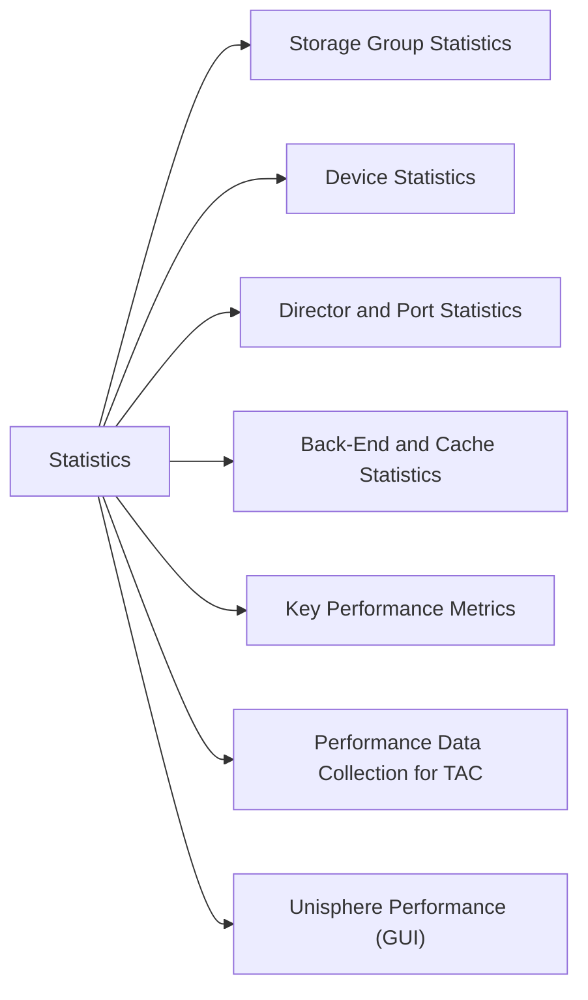

# Performance & Statistics

> Part of the Dell PowerMax CLI Reference (SYMCLI). `symstat` provides real-time and historical performance data. For richer analysis, use Unisphere for PowerMax Performance or Dell CloudIQ.



## Storage Group Statistics

```bash
# Stats for all storage groups
symstat -sid <sid> list -type sg

# Stats for a specific storage group
symstat -sid <sid> list -type sg -sg <sg_name>

# Continuous monitoring (refresh every 30 seconds)
symstat -sid <sid> list -type sg -i 30
```

## Device Statistics

```bash
# All device stats
symstat -sid <sid> list -type dev

# Specific device
symstat -sid <sid> list -type dev -devn <devname>

# Sort by IOPS (field 4 = Read IOPS, field 5 = Write IOPS)
symstat -sid <sid> list -type dev | sort -k4 -rn | head -20
```

## Director and Port Statistics

```bash
# Front-end director stats (host I/O)
symstat -sid <sid> list -type dir

# Specific director
symstat -sid <sid> list -type dir -dir <director_id>

# Port-level stats
symstat -sid <sid> list -type port
symstat -sid <sid> list -type port -dir <director_id> -p <port_id>
```

## Back-End and Cache Statistics

```bash
# Back-end disk stats (DA directors)
symstat -sid <sid> list -type be

# Cache hit ratio and usage
symstat -sid <sid> list -type cache

# SRDF director stats
symstat -sid <sid> list -type rdf
```

## Key Performance Metrics

| Metric | SYMCLI Type | Healthy Range |
|---|---|---|
| Host Read IOPS | `sg` / `dev` | Application-dependent |
| Host Write IOPS | `sg` / `dev` | Application-dependent |
| Read Response Time | `dev` | < 1 ms (all-flash) |
| Write Response Time | `dev` | < 1 ms (all-flash) |
| Cache Write Pending % | `cache` | < 31% (warning at 50%) |
| BE Read IOPS | `be` | Proportional to FE IOPS |
| Port Utilisation % | `port` | < 70% sustained |

## Performance Data Collection for TAC

```bash
# Collect 15-minute performance snapshot for Dell TAC
symstat -sid <sid> list -type sg -i 60 -c 15 > /tmp/sg-perf-$(date +%Y%m%d).txt &
symstat -sid <sid> list -type dev -i 60 -c 15 > /tmp/dev-perf-$(date +%Y%m%d).txt &
symstat -sid <sid> list -type cache -i 60 -c 15 > /tmp/cache-perf-$(date +%Y%m%d).txt &
wait
```

## Unisphere Performance (GUI)

For historical trending, SLA reporting, and forecasting:
- Unisphere → System → Performance → Storage Group / Array
- CloudIQ → Performance dashboard (14-day retention on free tier, longer with subscription)
