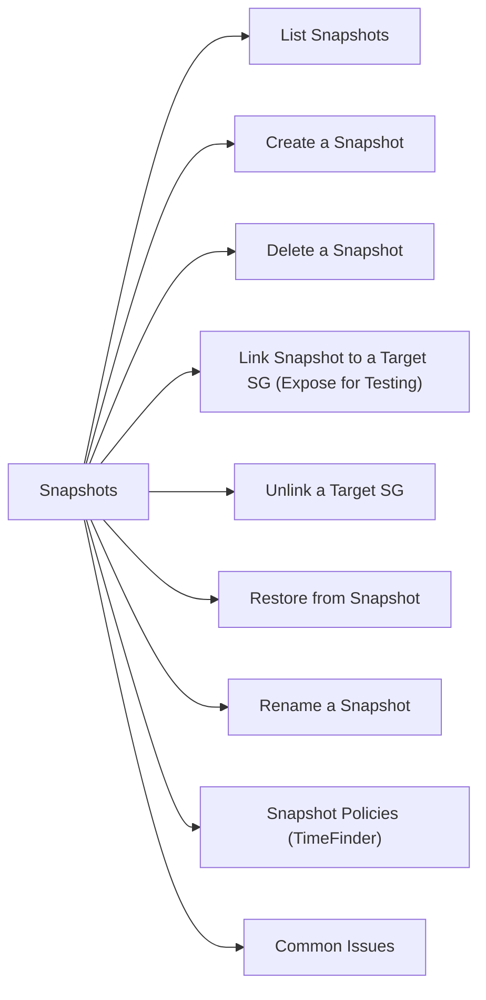

# SnapVX — Snapshots

> Part of the Dell PowerMax CLI Reference (SYMCLI).

SnapVX provides near-instantaneous, space-efficient snapshots of storage groups on PowerMax.



## List Snapshots

```bash
# All snapshots on the array
symsnapvx list -sid <sid>

# Snapshots for a specific storage group
symsnapvx list -sid <sid> -sg <sg_name>

# Specific snapshot detail
symsnapvx list -sid <sid> -sg <sg_name> -snapshot_name <snap_name>
```

## Create a Snapshot

```bash
symsnapvx -sid <sid> snap -sg <sg_name> -name <snap_name> establish
```

Snapshots are instant and do not require I/O quiesce, though application-consistent snapshots require application coordination.

## Delete a Snapshot

```bash
# Terminate (delete) a snapshot
symsnapvx -sid <sid> snap -sg <sg_name> -name <snap_name> terminate

# Force terminate (if linked)
symsnapvx -sid <sid> snap -sg <sg_name> -name <snap_name> terminate --force
```

## Link Snapshot to a Target SG (Expose for Testing)

```bash
# Link (read-only view for testing)
symsnapvx -sid <sid> snap -sg <sg_name> -name <snap_name> link -lnsg <target_sg>

# Link with copy (full copy — writable)
symsnapvx -sid <sid> snap -sg <sg_name> -name <snap_name> link -lnsg <target_sg> -copy
```

## Unlink a Target SG

```bash
symsnapvx -sid <sid> snap -sg <sg_name> -name <snap_name> unlink -lnsg <target_sg>
```

## Restore from Snapshot

```bash
symsnapvx -sid <sid> snap -sg <sg_name> -name <snap_name> restore
```

Restore overwrites the source SG with snapshot data. Quiesce or offline the source devices from the host before restoring.

## Rename a Snapshot

```bash
symsnapvx -sid <sid> snap -sg <sg_name> -name <snap_name> rename -new_name <new_snap_name>
```

## Snapshot Policies (TimeFinder)

For automated snapshot scheduling, use Unisphere for PowerMax or Solutions Enabler snapshot policies.

## Common Issues

| Issue | Check | Action |
|---|---|---|
| Terminate fails | Snapshot is linked | Unlink first: `unlink -lnsg` |
| Restore fails | Host has active I/O | Offline volumes on host before restore |
| Link fails | Target SG size mismatch | Target SG must match source capacity |
| Snapshot count at limit | Per-device snapshot limit | Delete older snapshots |
