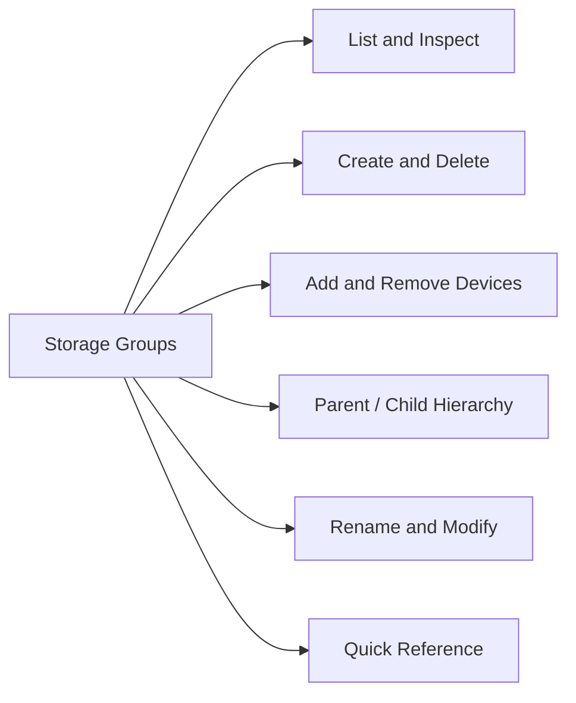

# Storage Groups

> Part of the Dell PowerMax CLI Reference (SYMCLI). Storage Groups are the primary logical grouping mechanism in Unisphere for PowerMax and SYMCLI. Every device that is presented to a host must be in a Storage Group that is part of a Masking View.



## List and Inspect

```bash
# List all storage groups
symsg list -sid <sid>
symsg list -sid <sid> -v

# Show contents and properties of a specific SG
symsg show <sg_name> -sid <sid>
symsg show <sg_name> -sid <sid> -v

# Show SRP (Storage Resource Pool) and service level
symsg show <sg_name> -sid <sid> | grep -E "SRP|Service Level|Compression"

# List SGs containing a specific device
symdev show <devname> -sid <sid> | grep "Storage Group"
```

## Create and Delete

```bash
# Create a regular (leaf) storage group
symsg create <sg_name> -sid <sid> -type regular

# Create with SRP and service level
symsg create <sg_name> -sid <sid> -srp SRP_1 -slo Diamond

# Create a parent storage group (contains child SGs)
symsg create <parent_sg> -sid <sid> -type parent

# Delete a storage group (must have no devices and no masking views)
symsg delete <sg_name> -sid <sid>
```

## Add and Remove Devices

```bash
# Add a device to a storage group
symsg -sid <sid> -sg <sg_name> add dev <devname>

# Add a range of devices
symsg -sid <sid> -sg <sg_name> add dev <start>:<end>

# Remove a device from a storage group
symsg -sid <sid> -sg <sg_name> remove dev <devname>

# Create new devices and add to SG
symsg -sid <sid> -sg <sg_name> addnew dev count=5 emulation=FBA size=100GB
```

## Parent / Child Hierarchy

```bash
# Add child SG to parent SG
symsg -sid <sid> -sg <parent_sg> add sg <child_sg>

# Remove child SG from parent SG
symsg -sid <sid> -sg <parent_sg> remove sg <child_sg>

# Show hierarchy
symsg show <parent_sg> -sid <sid> | grep -A 20 "Child Storage Group"
```

## Rename and Modify

```bash
# Rename a storage group
symsg rename <old_sg> -new_sg_name <new_sg> -sid <sid>

# Change service level
symsg -sid <sid> -sg <sg_name> set -slo Platinum

# Enable/disable compression
symsg -sid <sid> -sg <sg_name> set -compression enabled
```

## Quick Reference

| Task | Command |
|---|---|
| List all SGs | `symsg list -sid <sid>` |
| Show SG contents | `symsg show <sg> -sid <sid>` |
| Add device to SG | `symsg -sid <sid> -sg <sg> add dev <dev>` |
| Create SG with service level | `symsg create <sg> -sid <sid> -srp SRP_1 -slo Diamond` |
| Add child to parent SG | `symsg -sid <sid> -sg <parent> add sg <child>` |
