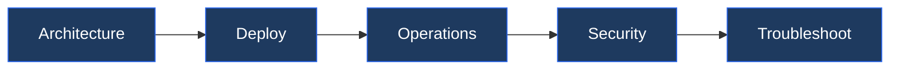

---
tags:
  - dell
  - learning-path
---
# Dell PowerMax — Learning Path

<div class="kb-summary">
Recommended reading order for Dell PowerMax. Follow these stages in order to build a complete mental model before working with it in production.
</div>

```text
┌────────────────────────────────────── PowerMax — Learning Path ───────────────────────────────────────┐
│                                                                                                       │
│    5 stages in order: Architecture → Deploy → Operations → Security → Troubleshoot                    │
│                                                                                                       │
│   ┌────────────────┐  ┌────────────────┐  ┌─────────────────┐  ┌────────────────┐  ┌────────────────┐ │
│   │  Architecture  │  │     Deploy     │  │    Operations   │  │    Security    │  │  Troubleshoot  │ │
│   │                │  │                │  │                 │  │                │  │                │ │
│   │  How It Works  │  │ Initial Setup  │  │  Health Checks  │  │ Access Control │  │ Common Issues  │ │
│   │Design Standards│  │Install/Upgrade │  │  CLI Reference  │  │ Authentication │  │  Diagnostics   │ │
│   │  Integrations  │  │                │  │    Procedures   │  │   Encryption   │  │   Escalation   │ │
│   │                │  │                │  │ Backup & Restore│  │   Hardening    │  │                │ │
│   │                │  │                │  │     Scripts     │  │                │  │                │ │
│   └────────────────┘  └────────────────┘  └─────────────────┘  └────────────────┘  └────────────────┘ │
│                                                                                                       │
│    Stage 1 (Architecture) builds understanding. Stage 3 (Operations) is daily work. Troubleshoot last.│
│                                                                                                       │
└───────────────────────────────────────────────────────────────────────────────────────────────────────┘
```


## Stage 1 — Architecture
**Goal**: Understand how PowerMax is structured internally — directors, engines, service levels, SRDF topology — before you touch a single configuration.

**Read in this order**:
- [How It Works](../architecture/how-it-works/) — NVMe-native data path, front-end directors, back-end NVMe SSDs, and the HYPERMAX OS engine that drives all I/O.
- [Design Standards](../architecture/design-standards/) — Service level objectives (SLOs), FAST policy tiering, host I/O limits, and workload placement rules.
- [Integrations](../architecture/integrations/) — Unisphere for PowerMax REST API, Solutions Enabler (SYMCLI), VMware vVols, and SRDF replication topology across sites.

**Why first**: PowerMax's performance model depends on SLOs and directors. Without this foundation, deploy and operations decisions are made blind.

---

## Stage 2 — Deployment
**Goal**: Know what it takes to rack, register, and present storage before handling a production workload.

**Read**:
- [Deploy](../deploy/) — Unisphere initial configuration, host registration, storage group and port group creation, and masking view setup.
- [Install & Upgrade](../operations/install-upgrade/) — HYPERMAX OS upgrades, non-disruptive upgrade (NDU) process, and rollback checkpoints.

**Why second**: Deployment decisions (director zoning, host connectivity type, NVMe-oF vs FC) directly constrain your operations and DR options.

---

## Stage 3 — Operations
**Goal**: Run PowerMax day-to-day — monitor health, execute procedures, manage snapshots and SRDF replication.

**Read in this order**:
- [Health Checks](../operations/health-checks/) — run the routine first on every shift; covers director utilisation, cache hit ratio, SLO compliance dashboard in Unisphere.
- [CLI Reference](../operations/cli-reference/) — SYMCLI and Unisphere REST API commands for storage groups, volumes, SRDF pairs, and performance queries.
- [Procedures](../operations/procedures/) — Snap creation and restore, SRDF failover/failback, volume expansion, and host migration between storage groups.
- [Backup & Restore](../operations/backup-restore/) — TimeFinder SnapVX schedules, Consistency Group snaps, and integration with Data Domain via DD Boost.
- [Scripts](../operations/scripts/) — Automation examples: bulk volume creation, SRDF group validation, SLO compliance reporting via REST.

**Why third**: You need the architecture context to interpret health metrics and understand what a failover actually does before you execute one.

---

## Stage 4 — Security
**Goal**: Harden PowerMax against unauthorised access and ensure audit trails satisfy compliance requirements.

**Read**:
- [Access Control](../security/access-control/) — Role-based access in Unisphere, Solutions Enabler daemon security, and masking view locking.
- [Authentication](../security/authentication/) — LDAP/AD integration, local Unisphere accounts, certificate-based Solutions Enabler auth.
- [Encryption](../security/encryption/) — D@RE (Data at Rest Encryption) using self-encrypting drives, key management server (KMIP), and key rotation procedures.
- [Hardening](../security/hardening/) — Disable unused management interfaces, TLS cipher restrictions, audit log export to SIEM.

**Why fourth**: Security configuration is non-disruptive and can be applied post-deploy, but you need to know the normal operating state first.

---

## Stage 5 — Troubleshooting
**Goal**: Diagnose and resolve I/O performance drops, SRDF link faults, director failures, and Unisphere connectivity issues.

**Read**:
- [Common Issues](../troubleshooting/common-issues/) — SLO violations, SRDF link degradation, NVMe path loss, and masking view mismatches.
- [Diagnostics](../troubleshooting/diagnostics/) — Performance Analyser collection, director event log review, SYMCLI diagnostic commands, and gathers for Dell support.
- [Escalation](../troubleshooting/escalation/) — When to open a Dell support case, what logs and SRs to collect, and how to engage Dell engineering.

**Why last**: Troubleshooting makes most sense once you know the normal operating state.
