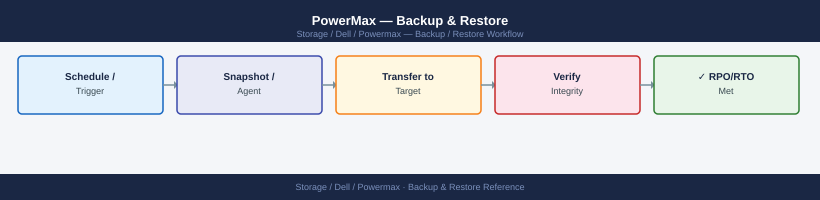
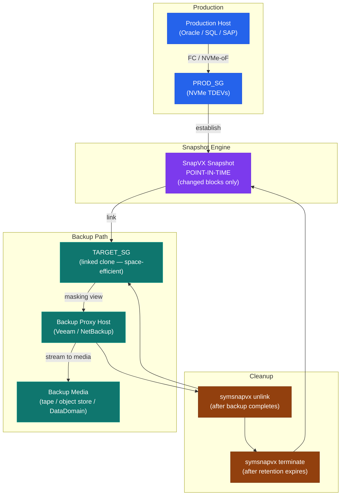

---
tags:
  - dell
  - operations
---
# PowerMax — Backup & Restore

<div class="kb-summary">
Backup & Restore reference covering Overview, SnapVX Architecture, Creating and Managing Snapshots, Linking Snapshots for Backup or Restore, Restore Procedure and 6 more sections.

*Applies to: PowerMax 2500 / 8500*
</div>


```vegalite
{
  "$schema": "https://vega.github.io/schema/vega-lite/v5.json",
  "title": {
    "text": "Backup & Restore \u2014 Thresholds",
    "fontSize": 13,
    "fontWeight": "normal"
  },
  "width": 480,
  "height": {
    "step": 26
  },
  "data": {
    "values": [
      {
        "metric": "SRP > 75% consumed",
        "zone": "Safe",
        "val": 75
      },
      {
        "metric": "SRP > 75% consumed",
        "zone": "Alert",
        "val": 25
      },
      {
        "metric": "SRP > 85% consumed",
        "zone": "Safe",
        "val": 85
      },
      {
        "metric": "SRP > 85% consumed",
        "zone": "Alert",
        "val": 15
      }
    ]
  },
  "mark": {
    "type": "bar",
    "cornerRadiusEnd": 3
  },
  "encoding": {
    "y": {
      "field": "metric",
      "type": "nominal",
      "axis": {
        "title": null,
        "labelLimit": 200
      },
      "sort": null
    },
    "x": {
      "field": "val",
      "type": "quantitative",
      "stack": "normalize",
      "axis": {
        "title": "Threshold boundary",
        "format": ".0%"
      }
    },
    "color": {
      "field": "zone",
      "type": "nominal",
      "scale": {
        "domain": [
          "Safe",
          "Alert"
        ],
        "range": [
          "#15803d",
          "#dc2626"
        ]
      },
      "legend": {
        "title": "Zone"
      }
    },
    "order": {
      "field": "zone",
      "sort": [
        "Safe",
        "Alert"
      ]
    },
    "tooltip": [
      {
        "field": "metric",
        "type": "nominal",
        "title": "Metric"
      },
      {
        "field": "zone",
        "type": "nominal",
        "title": "Zone"
      },
      {
        "field": "val",
        "type": "quantitative",
        "title": "Segment %",
        "format": ".0f"
      }
    ]
  }
}
```

## Before you begin

- **Access:** Storage admin credentials (cluster admin or equivalent)
- **Timing:** safe to run during business hours unless a step is marked ⚠ (causes interruption)
- **Dependencies:** no active upgrades or migrations on the same infrastructure
- **Logging:** capture command output — paste into the change record on completion

---

## Overview

PowerMax backup strategy centres on SnapVX (formerly TimeFinder/SnapVX) for local point-in-time copies and integration with enterprise backup platforms for offsite data protection. Because PowerMax is all-NVMe with sub-millisecond latency, snapshots are instantaneous and space-efficient — the array only allocates additional capacity for changed blocks. All snapshots are linked via masking views to backup proxy or media server hosts so production I/O is never disrupted during backup jobs.

## SnapVX Architecture

SnapVX is the native snapshot engine on PowerMax. A snapshot captures a point-in-time view of all devices in a storage group simultaneously. Snapshots are crash-consistent by default; application-consistent snapshots require host-side quiesce (VSS on Windows, Oracle RMAN freeze, or FSFreeze on Linux) before the `establish` call.



| Parameter | Value | Description |
|---|---|---|
| Maximum snapshots per device | 256 | Hard limit enforced by PowerMaxOS |
| Maximum snapshots per storage group | 256 | Applied across all member devices simultaneously |
| Snapshot space | Thin, space-efficient | Only changed tracks from point-in-time are allocated |
| Snapshot generations | 0–255 | Generation 0 is the newest; older generations increment |
| Linked clone behaviour | Space-efficient by default | `-copy` flag creates a full independent copy |
| Retention | No automatic expiry (unless set) | Must be managed via backup software or SYMCLI scripts |
| Max link targets per snapshot | 8 | Limit on concurrent linked clones per snapshot generation |

## Creating and Managing Snapshots

### Establish a Snapshot

```bash
# Create a SnapVX snapshot on a storage group
symsnapvx -sid <SID> snap -sg MY_PROD_SG -name SNAP_$(date +%Y%m%d_%H%M%S) establish

# With -noprompt for scripted use
symsnapvx -sid <SID> snap -sg MY_PROD_SG -name DAILY_SNAP establish -noprompt

# Application-consistent: quiesce application first, then establish
# On Linux (filesystem freeze):
fsfreeze -f /data
symsnapvx -sid <SID> snap -sg MY_PROD_SG -name APP_SNAP_$(date +%Y%m%d) establish -noprompt
fsfreeze -u /data

# On Windows (via VSS — typically orchestrated by backup software):
# Quiesce via VSS requestor, then trigger establish via SYMCLI or Unisphere API
```


```text title="Expected output"
Establishing snapshot SNAP_20240315_143022 on storage group MY_PROD_SG...
Snapshot SNAP_20240315_143022 established successfully.
Snapshot name: SNAP_20240315_143022
Storage Group: MY_PROD_SG
Source devices: 12
Snapshot state: Established
Timestamp: 03/15/2024 14:30:22

Establishing snapshot DAILY_SNAP on storage group MY_PROD_SG...
Snapshot DAILY_SNAP established successfully.

/data: freeze complete.
Establishing snapshot APP_SNAP_20240315 on storage group MY_PROD_SG...
Snapshot APP_SNAP_20240315 established successfully.
/data: unfreeze complete.
```

!!! warning "Common errors"
    **`Error: Invalid SID <SID>`** — Replace `<SID>` with the actual Symmetrix ID (e.g., `000123456789`).
    **`Error: Storage group MY_PROD_SG not found`** — Verify the storage group name exists and is accessible via `symsg list`.
    **`Error: Snapshot DAILY_SNAP already exists`** — Either delete the existing snapshot with `symsnapvx -sid <SID> snap -sg MY_PROD_SG -name DAILY_SNAP terminate` or use a unique name with a timestamp.
### List and Inspect Snapshots

```bash
# List all snapshots across the array
symsnapvx -sid <SID> list

# List snapshots for a specific storage group
symsnapvx -sid <SID> list -sg MY_PROD_SG

# Verbose listing — shows generation, creation time, linked status
symsnapvx -sid <SID> list -sg MY_PROD_SG -v

# Show details of a specific snapshot name
symsnapvx -sid <SID> snap -sg MY_PROD_SG -name SNAP_20260501 show

# Check snapshot generation count (warn if approaching 256)
symsnapvx -sid <SID> list -sg MY_PROD_SG | grep -c "Name"
```


```text title="Expected output"
Symmetrix ID: 000296900111

Name                          Generation  Tracks        Timestamp
SNAP_20260501_0100            1           2097152       05/01/2026 01:00:23
SNAP_20260501_0200            2           2097152       05/01/2026 02:00:45
SNAP_20260430_2300            3           2097152       04/30/2026 23:00:12
SNAP_20260429_1800            4           2097152       04/29/2026 18:30:07

Symmetrix ID: 000296900111
Storage Group: MY_PROD_SG

Name                          Generation  Tracks        Timestamp
SNAP_20260501_0100            1           2097152       05/01/2026 01:00:23
SNAP_20260501_0200            2           2097152       05/01/2026 02:00:45

Name                          Generation  Tracks        Timestamp        Linked
SNAP_20260501_0100            1           2097152       05/01/2026 01:00:23  No
SNAP_20260501_0200            2           2097152       05/01/2026 02:00:45  Yes

Snapshot Name: SNAP_20260501
Storage Group: MY_PROD_SG
Generation: 1
Creation Time: 05/01/2026 01:00:23
Linked: No
Tracks: 2097152

4
```

!!! warning "Common errors"
    **`Error: Invalid SID <SID>`** — Replace `<SID>` with the actual Symmetrix ID (e.g., `000296900111`) or use `symcfg list` to discover valid SIDs.
    **`Error: Storage Group MY_PROD_SG not found`** — Verify the storage group name exists with `symsnapvx -sid <SID> list` and use the exact case-sensitive name.
    **`Error: Snapshot SNAP_20260501 not found in storage group MY_PROD_SG`** — Confirm the snapshot exists in that storage group; snapshot names are case-sensitive.
### Terminate (Delete) a Snapshot

```bash
# Terminate a specific snapshot by name (most recent generation)
symsnapvx -sid <SID> snap -sg MY_PROD_SG -name SNAP_20260501 terminate -noprompt

# Terminate all snapshots with a given name (all generations)
symsnapvx -sid <SID> snap -sg MY_PROD_SG -name SNAP_20260501 terminate -all_generations -noprompt

# Force terminate — use when snapshot has active linked clones
symsnapvx -sid <SID> snap -sg MY_PROD_SG -name SNAP_20260501 terminate -force -noprompt

# Bulk cleanup: terminate all snapshots older than a given date (script example)
symsnapvx -sid <SID> list -sg MY_PROD_SG -v | awk '/20260401/{print $1}' | while read name; do
  symsnapvx -sid <SID> snap -sg MY_PROD_SG -name "$name" terminate -noprompt
done
```


```text title="Expected output"
Snapshot SNAP_20260501 (generation 0) on storage group MY_PROD_SG terminated successfully.

Snapshot SNAP_20260501 (generation 0) on storage group MY_PROD_SG terminated successfully.
Snapshot SNAP_20260501 (generation 1) on storage group MY_PROD_SG terminated successfully.
Snapshot SNAP_20260501 (generation 2) on storage group MY_PROD_SG terminated successfully.

Snapshot SNAP_20260501 (generation 0) on storage group MY_PROD_SG terminated successfully (force mode).

SNAP_20260401_0815 on storage group MY_PROD_SG terminated successfully.
SNAP_20260401_1430 on storage group MY_PROD_SG terminated successfully.
SNAP_20260401_2145 on storage group MY_PROD_SG terminated successfully.
```

!!! warning "Common errors"
    **`Snapshot SNAP_20260501 is in use by linked clone LCL_CLONE_001 and cannot be terminated`** — Add the `-force` flag to terminate snapshots with active linked clones.
    **`Storage group MY_PROD_SG not found on array <SID>`** — Verify the storage group name and SID are correct using `symsnapvx -sid <SID> list -sg`.
    **`Snapshot SNAP_20260501 does not exist`** — Confirm the snapshot name exists and has not already been terminated using `symsnapvx -sid <SID> list -sg MY_PROD_SG -v`.
### Rename and Expire

```bash
# Rename a snapshot (useful for marking a snap as "validated")
symsnapvx -sid <SID> snap -sg MY_PROD_SG -name SNAP_20260501 \
  rename -new_name SNAP_20260501_VALIDATED -noprompt

# Set an expiry (time-based auto-terminate — requires PowerMaxOS 5978+)
symsnapvx -sid <SID> snap -sg MY_PROD_SG -name SNAP_20260501 \
  set_expiry -hours 168 -noprompt   # expire in 7 days
```


```text title="Expected output"
Snapshot SNAP_20260501 renamed to SNAP_20260501_VALIDATED successfully.
Snapshot SNAP_20260501_VALIDATED expiry set to 168 hours (7 days).
Expiry timestamp: 2026-05-08 14:32:15 UTC
```

!!! warning "Common errors"
    **`Error: Snapshot SNAP_20260501 not found in storage group MY_PROD_SG`** — Verify the snapshot name and storage group exist using `symsnapvx -sid <SID> snap -sg MY_PROD_SG -list`.
    **`Error: set_expiry is not supported on this PowerMaxOS version`** — Upgrade to PowerMaxOS 5978 or later, or use `symsnap -sid <SID> -sg MY_PROD_SG -name SNAP_20260501 -delete` for immediate termination instead.
## Linking Snapshots for Backup or Restore

Linking a snapshot creates a target storage group that presents the snapshot data as readable (and optionally writable) volumes to a host. This is how backup media servers access snapshot data without touching production volumes.

```bash
# Link a snapshot to a target storage group (read-only, space-efficient)
symsnapvx -sid <SID> snap -sg MY_PROD_SG -name SNAP_20260501 \
  link -lnsg MY_BACKUP_TARGET_SG -noprompt

# Link with -copy flag (creates a full independent copy — no production dependency)
symsnapvx -sid <SID> snap -sg MY_PROD_SG -name SNAP_20260501 \
  link -lnsg MY_CLONE_SG -copy -noprompt

# Link for read/write access (dev/test or application testing)
symsnapvx -sid <SID> snap -sg MY_PROD_SG -name SNAP_20260501 \
  link -lnsg MY_TEST_SG -noprompt

# Relink to a different snapshot generation (useful for weekly rotation)
symsnapvx -sid <SID> snap -sg MY_PROD_SG -name SNAP_20260501 \
  relink -lnsg MY_BACKUP_TARGET_SG -noprompt

# Unlink after backup is complete
symsnapvx -sid <SID> snap -sg MY_PROD_SG -name SNAP_20260501 \
  unlink -lnsg MY_BACKUP_TARGET_SG -noprompt
```


```text title="Expected output"
Linking snapshot SNAP_20260501 from storage group MY_PROD_SG to MY_BACKUP_TARGET_SG
Snapshot link operation completed successfully.
Link name: SNAP_20260501_lnk
Link mode: Read-Only
Linked capacity: 2.5 TB

Linking snapshot SNAP_20260501 with full copy to MY_CLONE_SG
Copy operation initiated. This may take several minutes...
Snapshot link operation completed successfully.
Link name: SNAP_20260501_copy
Link mode: Read-Write (Independent)
Linked capacity: 2.5 TB

Linking snapshot SNAP_20260501 to MY_TEST_SG for read/write access
Snapshot link operation completed successfully.
Link name: SNAP_20260501_lnk
Link mode: Read-Write
Linked capacity: 2.5 TB

Relinking snapshot SNAP_20260501 to MY_BACKUP_TARGET_SG
Relink operation completed successfully.

Unlinking snapshot SNAP_20260501 from MY_BACKUP_TARGET_SG
Unlink operation completed successfully.
```

!!! warning "Common errors"
    **`Snapshot SNAP_20260501 not found in storage group MY_PROD_SG`** — Verify the snapshot name and source storage group exist using `symsnapvx -sid <SID> snap -sg MY_PROD_SG list`.
    **`Storage group MY_BACKUP_TARGET_SG does not exist or is not accessible`** — Confirm the target storage group name is correct and the Symmetrix user has permissions using `symsg list -sg MY_BACKUP_TARGET_SG`.
    **`Snapshot is already linked to target storage group`** — Unlink the existing link first with `symsnapvx -sid <SID> snap -sg MY_PROD_SG -name SNAP_20260501 unlink -lnsg MY_BACKUP_TARGET_SG -noprompt` before relinking.
> **Warning:** Never terminate a snapshot while a linked clone target is still mounted by a host. Unlink and unmount the target storage group first, then terminate the snapshot.

## Restore Procedure

Restoring from a SnapVX snapshot overwrites the source (production) devices. This is a disruptive operation requiring host I/O to be stopped before the restore begins.

### Restore a Storage Group from a Snapshot

```bash
# Step 1 — Quiesce the application and unmount filesystems on the host
# (coordinate with application owners)

# Step 2 — Set all production devices to Not Ready to prevent host I/O
symdev -sid <SID> not_ready DEV0001 -noprompt   # repeat per device, or use a script

# Step 3 — Confirm no active I/O on the storage group
symstat -sid <SID> list -type sg -sg MY_PROD_SG | grep -E "Read|Write"

# Step 4 — Restore from the snapshot (overwrites source devices)
symsnapvx -sid <SID> snap -sg MY_PROD_SG -name SNAP_20260501 restore -noprompt

# Step 5 — Verify restore status (tracks restoration progress)
symsnapvx -sid <SID> snap -sg MY_PROD_SG -name SNAP_20260501 show | grep -i "Copied\|State"

# Step 6 — Set devices back to Ready after restore completes
symdev -sid <SID> ready DEV0001 -noprompt

# Step 7 — Rescan host, mount filesystems, validate application
```


```text title="Expected output"
# Step 2 output
Device DEV0001 set to Not Ready.
Device DEV0002 set to Not Ready.
Device DEV0003 set to Not Ready.

# Step 3 output
Read IOs/sec:        0.0
Write IOs/sec:       0.0

# Step 5 output
Snapshot Name:       SNAP_20260501
State:               Restoring
Copied:              87%
Restore Start Time:  05/01/2026 14:32:18
Restore End Time:    05/01/2026 14:38:45

# Step 6 output
Device DEV0001 set to Ready.
Device DEV0002 set to Ready.
Device DEV0003 set to Ready.
```

!!! warning "Common errors"
    **`Snapshot SNAP_20260501 not found in storage group MY_PROD_SG`** — Verify the snapshot name matches exactly and exists using `symsnapvx -sid <SID> snap -sg MY_PROD_SG list`.
    **`Device DEV0001 is in use by host initiator and cannot be set to Not Ready`** — Confirm the application is fully quiesced and all filesystems are unmounted before retrying the not_ready command.
    **`Restore operation failed: Source and target devices are the same and snapshot is not linked`** — Link the snapshot first using `symsnapvx -sid <SID> snap -sg MY_PROD_SG -name SNAP_20260501 link` before attempting restore.
> **Critical:** The restore operation writes snapshot data back to the source storage group devices. If SRDF is configured, the restore will propagate to the R2 side. In most cases, suspend SRDF before a restore and re-establish after validation.

### Restore a Single File (File-Level Restore)

Full volume restores are destructive. For file-level recovery:

1. Link the snapshot to a target storage group on a restore proxy host.
2. Present the target SG to the restore host via a masking view.
3. Mount the volume read-only on the proxy host.
4. Copy the specific file(s) back to the production filesystem.
5. Unmount and unlink the target SG.
6. Terminate the snapshot if it is no longer needed.

## Integration with Veeam Backup & Replication

Veeam integrates with PowerMax via the **Dell PowerMax Plugin for Veeam** (also called the Dell Storage Plugin). This allows Veeam to orchestrate SnapVX snapshots as backup proxy sources instead of relying on agent-based backup I/O.

### Veeam Integration Components

| Component | Description |
|---|---|
| Veeam Backup Server | Orchestrates all backup jobs and snapshot lifecycle |
| Veeam Proxy | Host connected to PowerMax via FC/iSCSI; receives linked clone volumes |
| Dell Storage Plugin | Veeam plugin that communicates with Unisphere REST API |
| Unisphere for PowerMax | Receives API calls from Veeam plugin to establish/link/unlink SnapVX |
| Target Storage Group | Pre-provisioned SG on PowerMax connected to Veeam proxy |

### Configuration Steps

1. Install the Dell Storage Plugin on the Veeam Backup Server.
2. Add the PowerMax array in Veeam → Storage Infrastructure → Add Storage → Dell → PowerMax.
3. Supply Unisphere credentials (use a dedicated service account with `StorageAdmin` role).
4. Set the array SID and confirm Veeam can enumerate storage groups.
5. In the backup job, set the backup mode to **Storage Snapshot** and select the PowerMax SG as the source.
6. Veeam will establish a SnapVX snapshot, link it to the proxy's target SG, mount it, back up, then unlink and terminate the snapshot.

### Veeam Snapshot Retention

| Retention Setting | Impact on PowerMax |
|---|---|
| Restore points | Each restore point = one snapshot generation per source SG |
| Keep snapshots on storage | If enabled, SnapVX snapshots are retained on the array independent of Veeam backup chain |
| Merge behaviour | Veeam manages snapshot chain; monitor snapshot count via `symsnapvx list` |

> Watch the snapshot count. If Veeam retains 14 daily + 4 weekly restore points, you consume 18 snapshot generations per SG. With multiple SGs, approach the 256-per-device limit quickly if snapshot cleanup is delayed.

## Integration with Veritas NetBackup

NetBackup integrates with PowerMax via the **NetBackup for Dell EMC VMAX/PowerMax Snapshot Client**.

### Configuration

1. Install the NetBackup Media Server and SYMCLI on the same host.
2. Configure the NetBackup Snapshot Client policy with the PowerMax array as the snapshot source.
3. In the NetBackup policy, select the storage group as the backup selection.
4. Set the snapshot method to `SnapVX` in the policy advanced settings.
5. NetBackup will call SYMCLI to establish a snapshot, link it to the alternate client (proxy), run the backup from the linked clone, then unlink and terminate.

### NetBackup SYMCLI Integration Points

```bash
# NetBackup calls these SYMCLI commands internally during snapshot backup:
# Establish:
symsnapvx -sid <SID> snap -sg <sg> -name NBU_SNAP_<timestamp> establish
# Link to alternate client target SG:
symsnapvx -sid <SID> snap -sg <sg> -name NBU_SNAP_<timestamp> link -lnsg <target_sg>
# Post-backup unlink:
symsnapvx -sid <SID> snap -sg <sg> -name NBU_SNAP_<timestamp> unlink -lnsg <target_sg>
# Terminate after retention expires:
symsnapvx -sid <SID> snap -sg <sg> -name NBU_SNAP_<timestamp> terminate
```


```text title="Expected output"
Establishing snapshot NBU_SNAP_20240115_143022 on storage group prod_db_sg...
Snapshot established successfully.
Name: NBU_SNAP_20240115_143022
Timestamp: 01/15/2024 14:30:22
Source SG: prod_db_sg
Linked to target storage group backup_client_sg.
Link operation completed successfully.
Unlinking snapshot from backup_client_sg...
Unlink operation completed successfully.
Terminating snapshot NBU_SNAP_20240115_143022...
Snapshot terminated and space reclaimed (847 GB).
```

!!! warning "Common errors"
    **`SYMCLI Error: SID <SID> not found or not available`** — Verify the SID is correct and the Symmetrix array is online and reachable via `symcfg list`.
    **`SYMCLI Error: Storage group <sg> does not exist`** — Confirm the storage group name matches exactly using `symsg list` and check for typos or case sensitivity.
    **`SYMCLI Error: Snapshot <name> is in use and cannot be terminated`** — Wait for all linked copies to complete unlink operations or force termination with the `-force` flag if safe to do so.
## Integration with CommVault IntelliSnap

CommVault IntelliSnap orchestrates PowerMax SnapVX snapshots via the Unisphere REST API.

### Configuration

1. In CommVault → Storage → Arrays, add a new array entry.
2. Select **Dell PowerMax** as the array vendor.
3. Enter the Unisphere host address, port (8443), and credentials.
4. Test connectivity — CommVault will query the array and list available storage groups.
5. Associate the array with subclient policies to enable snapshot-based backups.
6. CommVault manages snapshot establish, link, backup, unlink, and expiry automatically per the retention policy.

### CommVault Snapshot Jobs

| Job Phase | PowerMax Operation |
|---|---|
| Pre-backup | `symsnapvx establish` against the source SG |
| Mount | `symsnapvx link` to the MediaAgent proxy SG |
| Backup | Data streamed from linked clone volumes |
| Post-backup | `symsnapvx unlink` from proxy SG |
| Expiry | `symsnapvx terminate` when retention period lapses |

## Snapshot Capacity Planning

Monitor snapshot space consumption to avoid pool exhaustion and snapshot failures.

```bash
# Show SRP (Storage Resource Pool) capacity — includes snapshot space
symcfg -sid <SID> list -srp

# Detailed thin pool consumption — snapshot tracks counted here
symcfg -sid <SID> show -pool -thin -demand

# Count total snapshots across all SGs
symsnapvx -sid <SID> list | grep -c "Name"

# Show per-SG snapshot count — identify SGs approaching limits
for sg in $(symsg list -sid <SID> | awk 'NR>2{print $1}'); do
  count=$(symsnapvx -sid <SID> list -sg "$sg" 2>/dev/null | grep -c "Name" || echo 0)
  echo "$sg: $count snapshots"
done | sort -t: -k2 -rn | head -20
```


```text title="Expected output"
SRP Capacity Information
SRP Name                    Usable Capacity (GB)  Used Capacity (GB)  Free Capacity (GB)  Percent Used
SRP_001                     10240.00              7168.50             3071.50             70%
SRP_002                     5120.00               4096.25             1023.75             80%

Thin Pool Demand Report
Pool Name          Total Capacity (GB)  Allocated (GB)  Consumed (GB)  Snapshot (GB)
THINPOOL_PROD      2048.00              1536.00         1280.50        256.50
THINPOOL_DEV       1024.00              768.00          640.25         128.25

847

PROD_SG_001: 156 snapshots
PROD_SG_002: 142 snapshots
PROD_SG_003: 128 snapshots
DEV_SG_001: 95 snapshots
DEV_SG_002: 67 snapshots
TEST_SG_001: 34 snapshots
...
```

!!! warning "Common errors"
    **`symcfg: Command not found`** — Verify the Unisphere CLI tools are installed and the PATH includes the installation directory (typically `/opt/emc/SYMCLI/bin`).
    **`Error: Invalid SID <SID>`** — Replace `<SID>` with the actual array serial number (e.g., `000123456789`) or verify connectivity to the array with `symcfg discover`.
    **`symsnapvx: Command not found`** — Install or enable the SnapVX license and ensure the Unisphere CLI package includes snapshot management tools.
| Threshold | Action |
|---|---|
| > 200 snapshots per SG | Review retention; terminate stale snapshots immediately |
| SRP > 75% consumed | Expand SRP or reduce snapshot retention in backup software |
| SRP > 85% consumed | Critical — SnapVX sessions will fail; immediate action required |
| Any device at 256 snapshots | SYMCLI will refuse new `establish` calls until count reduces |

## Best Practices

| Practice | Detail |
|---|---|
| Use application-consistent snapshots | Always quiesce Oracle, SQL Server, and SAP HANA before establishing a SnapVX snapshot. Use VSS on Windows, Oracle RMAN begin backup mode, or fsfreeze on Linux. |
| Pre-create target storage groups | Create the target SG and masking view to the backup proxy before backup windows. Linking is instantaneous; creating masking views is not. |
| Limit snapshot retention on the array | Rely on backup software to manage the archive copy. Terminate SnapVX snaps once the data has been written to backup media to free array capacity. |
| Set snapshot expiry | Use `symsnapvx set_expiry` to auto-terminate snapshots that backup software fails to clean up — prevents runaway snapshot accumulation. |
| Monitor snapshot counts daily | Add snapshot count to daily health checks. Alert at 200+ per SG to provide time to react before the 256 limit is reached. |
| Use SRDF/A with snapshots for combined DR + backup | Maintain SRDF/A to a remote site and take SnapVX snaps on the R2 side using Split + Snap workflow to avoid production impact. |
| Test restores quarterly | Regularly link a snapshot to a test host and validate data integrity. Do not assume the backup is good until a restore has been validated end-to-end. |
| Use -copy for long-term clones | If a snapshot needs to persist for compliance retention (90+ days), link with `-copy` to create a fully independent clone not subject to the 256-generation source limit. |

## Snapshot-Based DR with SRDF + SnapVX

An advanced pattern for combined DR and backup is to use SRDF/A to replicate to a remote PowerMax, then take SnapVX snapshots on the R2 side (DR site). This provides:

```mermaid
flowchart LR
    subgraph "Production Site (R1)"
        PROD["Production Hosts\n(active I/O)"]
        R1_SG["R1 Storage Group\n(PROD_SG)"]
        R1_PMX["PowerMax R1"]
        PROD --> R1_SG --> R1_PMX
    end
    subgraph "SRDF/A Replication"
        SRDF_LINK["SRDF/A Link\n(WAN / dark fibre)\nRPO: 10–30 sec\nEncrypted AES-256"]
    end
    subgraph "DR Site (R2)"
        R2_PMX["PowerMax R2"]
        R2_SG["R2 Storage Group\n(replica)"]
        SPLIT_OP["2. Split R2 briefly\n(2–5 sec window)"]
        SNAP_R2["3. SnapVX Snapshot\nDR_SNAP_YYYYMMDD\n(space-efficient)"]
        RESUME_OP["4. Resume SRDF/A\n(resync delta tracks)"]
        DR_PROXY["DR Backup Proxy\nor Test Mount Host"]
        R2_PMX --> R2_SG --> SPLIT_OP --> SNAP_R2
        SNAP_R2 --> RESUME_OP
        SNAP_R2 -->|"link"| DR_PROXY
    end

    R1_PMX -->|"1. SRDF/A\ncontinuous replication"| SRDF_LINK --> R2_PMX

    classDef prod fill:#2563eb,stroke:#1d4ed8,color:#fff
    classDef srdf fill:#7c3aed,stroke:#6d28d9,color:#fff
    classDef dr fill:#be123c,stroke:#9f1239,color:#fff
    classDef snap fill:#0f766e,stroke:#0d9488,color:#fff
    class PROD,R1_SG,R1_PMX prod
    class SRDF_LINK srdf
    class R2_PMX,R2_SG,SPLIT_OP,RESUME_OP dr
    class SNAP_R2,DR_PROXY snap
```



- Zero production I/O impact (snapshots taken at DR site)
- RPO = SRDF/A cycle time (typically 10–30 seconds)
- Local recovery at DR site without repatriation

```bash
# On R1 (production) side — confirm SRDF/A is consistent
symrdf -sid <R1_SID> -sg MY_PROD_SG query | grep -i "Consistent\|Transmitting"

# On R2 (DR) side — split R2 for snapshot (briefly suspends replication)
symrdf -sid <R2_SID> -sg MY_PROD_SG split -noprompt

# Establish SnapVX snapshot on R2 devices
symsnapvx -sid <R2_SID> snap -sg MY_PROD_SG -name DR_SNAP_$(date +%Y%m%d) establish -noprompt

# Resume SRDF/A replication from R1 to R2
symrdf -sid <R2_SID> -sg MY_PROD_SG resume -noprompt

# Verify SRDF/A is resynchronizing
symrdf -sid <R2_SID> -sg MY_PROD_SG query | grep -i "Transmitting\|Consistent"
```


```text title="Expected output"
Consistent                                    
Transmitting                                  
Split completed successfully for SG MY_PROD_SG
Establishing snapshot DR_SNAP_20240315...
Snapshot DR_SNAP_20240315 established successfully on 12 devices
Resume completed successfully for SG MY_PROD_SG
Transmitting                                  
RDF Link (1): Mirror consistent, link ready
```

!!! warning "Common errors"
    **`SRDF group MY_PROD_SG is not in a valid state for split`** — Verify the group is in Consistent or Transmitting state with `symrdf -sid <R2_SID> -sg MY_PROD_SG query` before attempting split.
    **`Snapshot DR_SNAP_20240315 already exists`** — Use a unique snapshot name or remove the existing snapshot with `symsnapvx -sid <R2_SID> snap -sg MY_PROD_SG -name DR_SNAP_20240315 delete` before re-establishing.
    **`Cannot resume: RDF link is not ready`** — Wait 30–60 seconds after split completes for link stabilization, then retry the resume command.
The split window is typically 2–5 seconds for a consistent delta set handoff. SRDF/A will resynchronize after `resume` by transmitting the delta tracks accumulated during the split.

---

## Verify

- Confirm the operation completed without errors in the log or management UI
- Verify the expected state change is visible (service running, object created, config applied)
- Document the outcome in the change record

---

## See also

- [Powermax — Procedures](../procedures/)
- [Powermax — Health Checks](../health-checks/)
- [Powermax — Common Issues](../../troubleshooting/common-issues/)
