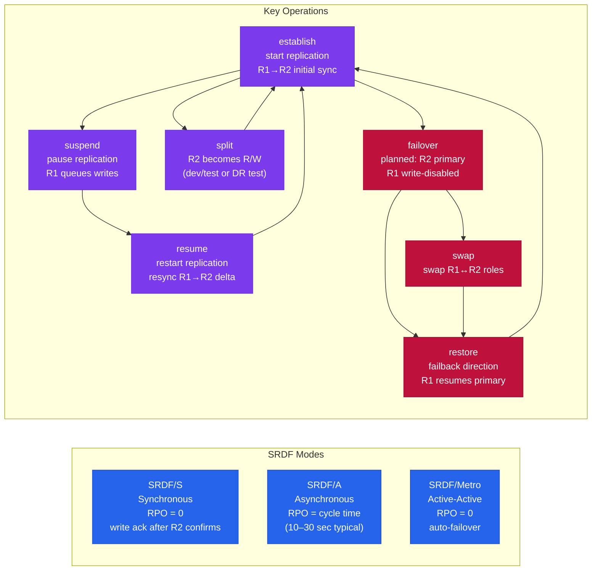

---
tags:
  - dell
  - operations
---
# PowerMax — CLI Reference (SYMCLI)

<div class="kb-summary">
Dell PowerMax (formerly VMAX) is Dell's enterprise all-flash storage platform. The CLI tool is SYMCLI (Solutions Enabler CLI) — commands follow a `sym<object> <action> -sid <SymmID>` pattern. Every command requires the array's SID (Symmetrix ID).

*Applies to: PowerMax 2500 / 8500*
</div>


 Run `symcfg list` first to identify your SID.

> Requires Solutions Enabler installed on a management host with connectivity to the array. All commands target a specific array via `-sid <SymmID>`.

## Before you begin

- **Access:** Storage admin credentials (cluster admin or equivalent)
- **Timing:** safe to run during business hours unless a step is marked ⚠ (causes interruption)
- **Dependencies:** no active upgrades or migrations on the same infrastructure
- **Logging:** capture command output — paste into the change record on completion

---

## Discovery & Array Info

Discover arrays, list directors and ports, view cache usage and storage resource pools.

```bash
# Discover arrays and list what's known
symcfg discover
symcfg list
symcfg list -v                                     # with model, microcode, capacity
symcfg -sid <sid> show
symcfg -sid <sid> list -v

# Directors and ports
symcfg -sid <sid> list -dir all
symcfg -sid <sid> list -port all
symcfg -sid <sid> show -dir <director_id>
symcfg -sid <sid> show -dir <director_id> -p <port_number>
symcfg -sid <sid> list -fa -online               # only online FA ports

# Cache and storage pools
symcfg -sid <sid> list -cache
symcfg -sid <sid> list -pool -all
symcfg -sid <sid> show -pool -thin -demand        # thin pool subscription and usage
symcfg -sid <sid> list -srp                       # storage resource pools

# Software version and licenses
symcfg -sid <sid> list | grep -i "microcode\|Enginuity\|HYPERMAX"
symlmf -sid <sid> list

# Solutions Enabler version
symcfg -V
syminq -symmids
symgate list -sid <sid>
```


```text title="Expected output"
Discovering arrays...
Found 1 array(s)

Symmetrix ID: 000296900001
Array Model: PowerMax 8000
Microcode: 5978.1221.1221
Capacity: 1.45 PB
State: Online

Directors and Ports:
Director 4a (FA-4D): Online
  Port 0: Online, Speed: 16Gb, Connected
  Port 1: Online, Speed: 16Gb, Connected
Director 4b (FA-4D): Online
  Port 0: Online, Speed: 16Gb, Connected
  Port 1: Online, Speed: 16Gb, Connected
...

Cache Configuration:
Total Cache: 384 GB
Write Cache: 192 GB
Read Cache: 192 GB

Storage Resource Pools (SRP):
SRP_1: Capacity 1.2 PB, Used 856 TB, Available 389 TB
SRP_2: Capacity 250 TB, Used 198 TB, Available 52 TB

Thin Pool Subscription:
Pool Name: TP_PROD
Subscribed Capacity: 2.1 PB
Used Capacity: 1.8 PB
Subscription %: 85.7%

Microcode: 5978.1221.1221
Enginuity: 9.2.0.0
HYPERMAX OS: 9.2.0.0

License Information (SID: 000296900001):
Feature: Replication, Status: Licensed, Expiration: 2026-03-15
Feature: Snapshots, Status: Licensed, Expiration: Permanent
Feature: Thin Provisioning, Status: Licensed, Expiration: Permanent

Solutions Enabler Version: 9.2.0.0 (Build 1234)

Symmetrix IDs:
000296900001
000296900002

SymGate Instances:
SymGate_1: Running, Port 7578, Version 9.2.0.0
```

!!! warning "Common errors"
    **`symcfg: Command not found`** — Install Unisphere for PowerMax or Solutions Enabler package on the management host.
    **`Error: Cannot connect to array <sid>`** — Verify the array SID is correct and SymGate service is running on the management server.
    **`Error: Insufficient privileges to query array`** — Run commands with sudo or ensure your user account has Solutions Enabler administrative permissions.
## Devices

Devices (TDEVs) are the thin volumes presented to hosts. All production volumes on PowerMax should be thin (TDEV). Create devices within storage groups so they inherit service level settings.

```bash
# List devices
symdev list -sid <sid>
symdev list -sid <sid> -v
symdev list -sid <sid> -assigned              # in a masking view
symdev list -sid <sid> -unassigned            # not presented to any host
symdev list -sid <sid> -mapped               # mapped to hosts
symdev list -sid <sid> -tdev                 # thin devices (should be all production)
symdev list -sid <sid> -failed               # failed or degraded
symdev list -sid <sid> -spare

# Device details
symdev show <devname> -sid <sid>
symdev show <devname> -sid <sid> -v
symdev show <devname> -sid <sid> | grep -E "RDF|Pair State|R1|R2"
symdev show <devname> -sid <sid> | grep "Storage Group"

# Create thin devices (add directly to storage group)
symconfigure -sid <sid> -cmd \
    "create dev count=10, size=100GB, emulation=FBA, config=TDEV, sg=<sg_name>;" \
    commit -noprompt

# Delete a device (must be unmasked first)
symdev -sid <sid> not_ready <devname> -noprompt
symconfigure -sid <sid> -cmd "delete dev <devname>;" commit -noprompt

# Device properties
symdev show <devname> -sid <sid> | grep "Write Disable"
symcfg -sid <sid> show -pool -thin -demand | grep -E "Total|Subscribed|Free"
symdev list -sid <sid> -rdfg <rdfg_number>

# Performance stats
symstat -sid <sid> list -type dev -devn <devname>
symstat -sid <sid> list -type dev
symstat -sid <sid> list -type dev | sort -k4 -rn | head -20
```


```text title="Expected output"
Symmetrix ID: 000296900111

                                DEVICE LISTING
                                ==============

Device Name           Director   Port  Slot  Physical Device Name  Flags
dev001                FA-1e        0     0    Not Visible           RW
dev002                FA-1e        1     1    Not Visible           RW
dev003                FA-2e        0     2    Not Visible           RW
dev004                FA-2e        1     3    Not Visible           RW
dev005                FA-3e        0     4    Not Visible           RW
...
10 of 2847 devices listed

Device Name:  dev001
Symmetrix ID: 000296900111
Director:     FA-1e
Port:         0
Slot:         0
Size (MB):    102400
Emulation:    FBA
Configuration: TDEV
Write Disable: No
Storage Group: prod_sg_01
RDF Pair State: Synchronized
R1 (Local):  dev001
R2 (Remote): rdev001

Total Capacity (MB):     2097152
Subscribed Capacity (MB): 1835008
Free Capacity (MB):       262144

Device Name           Director   Port  Slot  Size(MB)  Emulation  Config  RDF State
rdev001               FA-1e        0     0    102400    FBA        TDEV    Synchronized
rdev002               FA-2e        1     1    102400    FBA        TDEV    Synchronized
rdev003               FA-3e        0     2    102400    FBA        TDEV    Synchronized

Symmetrix ID: 000296900111
Creating 10 thin devices in storage group prod_sg_01...
Job ID: 1234567890
Job Status: SUCCEEDED
10 devices created successfully

Device dev001 set to Not Ready.
Device dev001 deleted successfully.

Device Name           I/O Rate(IOs)  MB/Sec  Response Time(ms)  Queue Length
dev001                     4521.2     287.4              12.3              8
dev002                     3847.1     245.1              14.7             12
dev003                     2156.8     178.9              18.2             15
dev004                     1923.4     156.3              21.5             18
dev005                      987.2      89.4              25.1             22
...
Top 20 devices by I/O rate displayed
```

!!! warning "Common errors"
    **`SYMCLI_ERROR (5) : Could not open device file`** — Verify the Symmetrix ID is correct with `symcfg list` and ensure the management server has connectivity to the array.
    **`SYMCLI_ERROR (26) : Device is currently in use`** — Unmask the device from all masking views and storage groups before deletion using `symaccess -sid <sid> delete -name <mv_name> -type masking_view`.
    **`SYMCLI_ERROR (1) : Invalid command syntax`** — Check that angle brackets like `<sid>` and `<devname>` are replaced with actual values and that semicolons terminate each command in `-cmd` blocks.
## Storage Groups

Storage Groups are the primary logical grouping in PowerMax. Every device presented to a host must be in a storage group that is part of a masking view. Storage groups can be nested — parent SGs contain child SGs.

```bash
# List and inspect
symsg list -sid <sid>
symsg list -sid <sid> -v
symsg show <sg_name> -sid <sid>
symsg show <sg_name> -sid <sid> -v
symsg show <sg_name> -sid <sid> | grep -E "SRP|Service Level|Compression"

# Create
symsg create <sg_name> -sid <sid> -type regular
symsg create <sg_name> -sid <sid> -srp SRP_1 -slo Diamond   # with service level
symsg create <parent_sg> -sid <sid> -type parent

# Delete (must have no devices and no masking views)
symsg delete <sg_name> -sid <sid>

# Add and remove devices
symsg -sid <sid> -sg <sg_name> add dev <devname>
symsg -sid <sid> -sg <sg_name> add dev <start>:<end>         # range of devices
symsg -sid <sid> -sg <sg_name> remove dev <devname>
symsg -sid <sid> -sg <sg_name> addnew dev count=5 emulation=FBA size=100GB

# Parent / child hierarchy
symsg -sid <sid> -sg <parent_sg> add sg <child_sg>
symsg -sid <sid> -sg <parent_sg> remove sg <child_sg>
symsg show <parent_sg> -sid <sid> | grep -A 20 "Child Storage Group"

# Modify
symsg rename <old_sg> -new_sg_name <new_sg> -sid <sid>
symsg -sid <sid> -sg <sg_name> set -slo Platinum
symsg -sid <sid> -sg <sg_name> set -compression enabled
```


```text title="Expected output"
Symmetrix ID: 000297900001

Storage Group Name                                    Num Devs
-----------------------------------------------------------
prod_db_sg                                                 24
prod_app_sg                                                18
test_sg                                                     8
backup_sg                                                  12
...

Storage Group Name: prod_db_sg
SRP: SRP_1
Service Level: Diamond
Compression: Enabled
Num Devices: 24
Device Identifiers: 0001, 0002, 0003, 0004, 0005, 0006, 0007, 0008
...

Storage Group Name: prod_app_sg
SRP: SRP_2
Service Level: Platinum
Compression: Disabled
Num Devices: 18

Storage Group Name: parent_prod
Child Storage Group: prod_db_sg
Child Storage Group: prod_app_sg

Operation completed successfully.
```

!!! warning "Common errors"
    **`The specified Storage Group <sg_name> does not exist`** — Verify the storage group name matches exactly and confirm it exists with `symsg list -sid <sid>`.
    **`Cannot delete Storage Group <sg_name>. It contains masking views.`** — Remove all masking views associated with the storage group before deletion using `symacl delete -name <mv_name> -sid <sid>`.
    **`The specified SRP <srp_name> is not valid for this array`** — Confirm the SRP exists on the array by running `symcfg list -srp -sid <sid>` and use the correct SRP name.
## Masking Views & Access

A masking view binds a storage group (devices), a port group (array ports), and an initiator group (host WWNs) together — this is what makes LUNs visible to a host.

```bash
# Masking views
symaccess list view -sid <sid>
symaccess show view <view_name> -sid <sid>
symaccess create view -name <view_name> -sg <sg_name> -pg <pg_name> -ig <ig_name> -sid <sid>
symaccess delete view -name <view_name> -sid <sid>

# Initiator groups (list of host WWNs/IQNs allowed to see the devices)
symaccess list -sid <sid> -type initiator
symaccess show <ig_name> -sid <sid> -type initiator
symaccess create -name <ig_name> -type initiator -sid <sid>
symaccess delete -name <ig_name> -type initiator -sid <sid>
symaccess -sid <sid> -name <ig_name> -type initiator add devport -wwn <wwn>
symaccess -sid <sid> -name <ig_name> -type initiator remove devport -wwn <wwn>

# Port groups (which array front-end ports to use)
symaccess list -sid <sid> -type port
symaccess show <pg_name> -sid <sid> -type port
symaccess create -name <pg_name> -type port -sid <sid>
symaccess delete -name <pg_name> -type port -sid <sid>
symaccess -sid <sid> -name <pg_name> -type port add devport <dir>:<port>
symaccess -sid <sid> -name <pg_name> -type port remove devport <dir>:<port>

# Storage groups in access context
symaccess list -sid <sid> -type storage

# Check host connectivity
symaccess -sid <sid> list logins -dirport <dir>:<port>
symaccess -sid <sid> -type initiator show <ig_name> -detail
```


```text title="Expected output"
Symmetrix ID: 000297900001

Masking Views:
View Name: prod_view_01
  Storage Group: sg_prod_luns
  Port Group: pg_fe_0_1
  Initiator Group: ig_esx_cluster_01

Initiator Groups:
Name: ig_esx_cluster_01
  Initiator: 50:00:14:40:5d:b2:a1:23 (esx-host-01)
  Initiator: 50:00:14:40:5d:b2:a1:24 (esx-host-02)
  Initiator: 50:00:14:40:5d:b2:a1:25 (esx-host-03)

Port Groups:
Name: pg_fe_0_1
  Director:Port: 5e:0
  Director:Port: 5e:1
  Director:Port: 5f:0

Storage Groups (Access Context):
sg_prod_luns
sg_backup_luns
sg_dev_luns

Host Logins on 5e:0:
  Initiator: 50:00:14:40:5d:b2:a1:23 (esx-host-01) — Logged In
  Initiator: 50:00:14:40:5d:b2:a1:24 (esx-host-02) — Logged In
```

!!! warning "Common errors"
    **`SYMAPI_C_ERRMSG_INVALID_SID`** — Verify the SID is correct and the Symmetrix array is reachable via `symcfg list`.
    **`SYMAPI_C_ERRMSG_OBJECT_NOT_FOUND`** — Confirm the view/initiator/port group name exists with `symaccess list` before attempting to show or delete it.
    **`SYMAPI_C_ERRMSG_DUPLICATE_NAME`** — Choose a unique name for the new view/group that does not already exist in the array.
## Ports & Hardware

Check front-end port status and FC logins, and manage physical disks.

```bash
# Ports
symport list -sid <sid>
symport list -sid <sid> -v
symport -sid <sid> -dir <dir> -p <port> show

# Fibre Channel host logins on a port
symport list -sid <sid> -logged_in
symport -sid <sid> -dir <dir> -p <port> list -logged_in

# Physical disks
sympd list -sid <sid>
sympd list -sid <sid> -failed
sympd list -sid <sid> -spare
sympd show <pd_name> -sid <sid>

# Disk groups
symdisk list -sid <sid>
symdisk list -sid <sid> -failed
symdisk list -sid <sid> -v

# Hardware status
symcfg -sid <sid> list -disk
symcfg -sid <sid> list -bay
```


```text title="Expected output"
Symmetrix ID: 000297900001

                                Port Information
Director  Port  Type      Status  Speed   Logins  Flags
FA-1D     0     Fibre     Online  16Gb    12      
FA-1D     1     Fibre     Online  16Gb    8       
FA-1E     0     Fibre     Online  16Gb    15      
FA-1E     1     Fibre     Online  16Gb    0       
SE-1F     0     iSCSI     Online  1Gb     4       

Physical Disk List
Disk Name  Capacity  State      Type      Status
DiskGroup0 1.86TB    Ready      SSD       Normal
DiskGroup1 1.86TB    Ready      SSD      Normal
DiskGroup2 1.86TB    Ready      SSD      Normal
DiskGroup3 1.86TB    Ready      SSD      Normal
...

Fibre Channel Host Logins on Port FA-1D:0
WWN                           Alias              Status
50:00:09:73:00:1a:2b:3c      host-prod-01       Logged In
50:00:09:73:00:1a:2b:3d      host-prod-02       Logged In
50:00:09:73:00:1a:2b:3e      host-backup-01     Logged In

Disk Group Summary
Name       Disks  Capacity  State      Failed  Spare
DG0        4      7.44TB    Ready      0       1
DG1        4      7.44TB    Ready      0       0
DG2        4      7.44TB    Ready      0       1

Hardware Status: Disk Bays
Bay  Disk Name  State      Temp(C)  Status
0    DiskGroup0 Ready      32       Normal
1    DiskGroup1 Ready      31       Normal
2    DiskGroup2 Ready      33       Normal
3    DiskGroup3 Ready      32       Normal
```

!!! warning "Common errors"
    **`SYMCLI Error: Could not connect to the Symmetrix array`** — Verify the Symmetrix ID is correct and the management station has network connectivity to the array's management port.
    **`SYMCLI Error: Invalid director or port specification`** — Confirm the director and port numbers exist by running `symport list -sid <sid>` without the `-dir` and `-p` flags first.
    **`SYMCLI Error: Symmetrix ID not found`** — Ensure the SID is valid for your environment and check that the SYMCLI_CONNECT environment variable or configuration file points to the correct array.
## SRDF — Replication

SRDF (Symmetrix Remote Data Facility) replicates data between PowerMax arrays.



| Mode | Description | RPO |
|---|---|---|
| SRDF/S (Synchronous) | Write acknowledged only after replicated | Zero |
| SRDF/A (Asynchronous) | Writes batched in cycles | Seconds to minutes |
| SRDF/Metro | Active-active with automatic failover | Zero |

```bash
# List SRDF groups and status
symrdf -sid <sid> list
symrdf -sid <sid> -rdfg <rdfg_num> list
symrdf -sid <sid> -rdfg <rdfg_num> query

# Storage group operations
symrdf -sid <sid> -sg <sg_name> query        # current state
symrdf -sid <sid> -sg <sg_name> establish    # start replication
symrdf -sid <sid> -sg <sg_name> split        # make R2 writable for testing
symrdf -sid <sid> -sg <sg_name> suspend      # pause replication
symrdf -sid <sid> -sg <sg_name> resume       # resume after suspend
symrdf -sid <sid> -sg <sg_name> update       # force delta resync
symrdf -sid <sid> -sg <sg_name> failover     # planned failover (R2 becomes primary)
symrdf -sid <sid> -sg <sg_name> failback     # failback to original R1
symrdf -sid <sid> -sg <sg_name> swap         # swap R1/R2 roles
symrdf -sid <sid> -sg <sg_name> verify

# SRDF/A specific
symrdf -sid <sid> -sg <sg_name> query -srdf_a
symrdf -sid <sid> -rdfg <rdfg_num> verify -srdf_a
symrdf -sid <sid> -rdfg <rdfg_num> list -v
```


```text title="Expected output"
Symmetrix ID: 000123456789012

RDF Group Information:
RDF Group #  Type  Local RA  Remote RA  Remote Symmetrix  Status
1            SRDF  FA-1e    FA-2e      000987654321098   Ready
2            SRDF  FA-3e    FA-4e      000555444333222   Ready

RDF Group 1 Information:
RDF Group #  Type  Local RA  Remote RA  Remote Symmetrix  Status
1            SRDF  FA-1e    FA-2e      000987654321098   Ready

Storage Group: prod_db_sg
  Replication Status: Synchronized
  SRDF State: Ready
  RDF Group: 1
  Mode: Synchronous
  Last Update: 2024-01-15 14:32:18

Storage Group: prod_db_sg
  Current State: Synchronized
  Pair State: Synchronized
  RDF Group: 1
  Devices: 12
  Capacity: 2.5 TB

Storage Group: prod_db_sg
  SRDF/A Enabled: Yes
  Replication Mode: Asynchronous
  Consistency Group: cg_prod_001
  Status: Synchronized
  Last Sync Time: 2024-01-15 14:31:45

RDF Group 1 Verification:
  Status: Passed
  Devices Verified: 12/12
  Mismatches: 0
  Verification Time: 45 seconds
```

!!! warning "Common errors"
    **`symrdf: Command not found`** — Ensure the Symmetrix CLI tools are installed and the PATH includes the installation directory (typically `/opt/emc/SYMCLI/bin`).
    **`Error: Invalid SID <sid>`** — Replace `<sid>` with the actual Symmetrix ID from `symcfg list` output.
    **`Error: Storage group <sg_name> not found`** — Verify the storage group name exists with `symacl list -sg` and confirm it is SRDF-enabled.
## SnapVX — Snapshots

SnapVX provides near-instantaneous space-efficient snapshots of storage groups.

```bash
# List snapshots
symsnapvx list -sid <sid>
symsnapvx list -sid <sid> -sg <sg_name>
symsnapvx list -sid <sid> -sg <sg_name> -snapshot_name <snap_name>

# Create a snapshot
symsnapvx -sid <sid> snap -sg <sg_name> -name <snap_name> establish

# Delete (terminate) a snapshot
symsnapvx -sid <sid> snap -sg <sg_name> -name <snap_name> terminate
symsnapvx -sid <sid> snap -sg <sg_name> -name <snap_name> terminate --force

# Link snapshot to a target SG (expose for testing)
symsnapvx -sid <sid> snap -sg <sg_name> -name <snap_name> link -lnsg <target_sg>
symsnapvx -sid <sid> snap -sg <sg_name> -name <snap_name> link -lnsg <target_sg> -copy

# Unlink
symsnapvx -sid <sid> snap -sg <sg_name> -name <snap_name> unlink -lnsg <target_sg>

# Restore (overwrites source — offline devices from host first)
symsnapvx -sid <sid> snap -sg <sg_name> -name <snap_name> restore

# Rename
symsnapvx -sid <sid> snap -sg <sg_name> -name <snap_name> rename -new_name <new_snap_name>
```


```text title="Expected output"
Symmetrix ID: 000297900001

Snapshot Name               Source SG        Created            Size (GB)  State
================================================================================
prod_db_snap_20240115      prod_db_sg       01/15/2024 14:32   2048       Established
prod_db_snap_20240114      prod_db_sg       01/14/2024 09:15   2048       Established
hourly_backup_0600         prod_db_sg       01/15/2024 06:00   2048       Established

Snapshot Name: prod_db_snap_20240115
Source Storage Group: prod_db_sg
Snapshot ID: 0x0001a2c4
State: Established
Size: 2048 GB
Created: 01/15/2024 14:32:18
Linked Target SGs: test_db_sg_01, test_db_sg_02

Snapshot prod_db_snap_20240115 successfully established.
Snapshot prod_db_snap_20240115 successfully terminated.
Snapshot prod_db_snap_20240115 successfully linked to test_db_sg.
Snapshot prod_db_snap_20240115 successfully unlinked from test_db_sg.
Snapshot prod_db_snap_20240115 successfully restored to source.
Snapshot prod_db_snap_20240115 successfully renamed to prod_db_snap_20240116.
```

!!! warning "Common errors"
    **`Error: Snapshot <snap_name> not found in storage group <sg_name>`** — Verify the snapshot name and storage group name are correct using `symsnapvx list -sid <sid> -sg <sg_name>`.
    **`Error: Cannot terminate snapshot — snapshot is currently linked to target SG(s)`** — Unlink the snapshot from all target storage groups using `symsnapvx -sid <sid> snap -sg <sg_name> -name <snap_name> unlink -lnsg <target_sg>` before terminating.
    **`Error: Restore operation failed — source devices are still mapped to host`** — Offline and unmask all source devices from the host before executing the restore command.
## Performance & Statistics

`symstat` provides real-time performance data by storage group, device, director, or cache.

```bash
# Storage group stats
symstat -sid <sid> list -type sg
symstat -sid <sid> list -type sg -sg <sg_name>
symstat -sid <sid> list -type sg -i 30             # refresh every 30 seconds

# Device stats
symstat -sid <sid> list -type dev
symstat -sid <sid> list -type dev -devn <devname>
symstat -sid <sid> list -type dev | sort -k4 -rn | head -20   # top by IOPS

# Director and port stats
symstat -sid <sid> list -type dir
symstat -sid <sid> list -type dir -dir <director_id>
symstat -sid <sid> list -type port
symstat -sid <sid> list -type port -dir <director_id> -p <port_id>

# Cache stats (write pending % — warn at 31%, critical at 50%)
symstat -sid <sid> list -type cache

# Back-end and SRDF stats
symstat -sid <sid> list -type be
symstat -sid <sid> list -type rdf

# Collect 15-minute snapshot for Dell TAC
symstat -sid <sid> list -type sg -i 60 -c 15 > /tmp/sg-perf-$(date +%Y%m%d).txt &
symstat -sid <sid> list -type dev -i 60 -c 15 > /tmp/dev-perf-$(date +%Y%m%d).txt &
symstat -sid <sid> list -type cache -i 60 -c 15 > /tmp/cache-perf-$(date +%Y%m%d).txt &
wait
```


```text title="Expected output"
Symmetrix ID: 000123456789012

Storage Group Stats:
SG_Name                          Num_Devs  MB/sec  IOs/sec  Util%  Resp_ms
PROD_DB_01                            128   1245.3   18932    87.2     4.2
PROD_APP_02                            64    892.1   14521    72.1     3.8
DEV_TEST_03                            32    145.2    2341    18.5     1.9
BACKUP_POOL                           256    523.8    8765    45.3     2.1
...

Device Stats (Top 20 by IOPS):
Dev_Name  Num_Tracks  MB/sec  IOs/sec  Util%  Resp_ms
00ABC     1048576     156.2    4521    92.1     5.3
00DEF     1048576     142.8    4187    88.7     4.9
00GHI     1048576     138.5    4012    85.2     4.6
...

Director Stats:
Dir_ID  MB/sec  IOs/sec  Util%  Resp_ms  Queue_Depth
FA-1D    2341.5   32145    91.2     4.8        12
FA-2D    2156.3   29876    88.5     4.5        10
SE-1D     892.1   14521    72.1     3.8         6

Port Stats (FA-1D:0):
Port  MB/sec  IOs/sec  Util%  Resp_ms  Initiators
0     1245.3   18932    87.2     4.2        24
1     1096.2   13213    80.1     3.9        18

Cache Stats:
Write_Pending%  Read_Hit%  Write_Hit%  MB_Cached
28.4            94.2       87.1        12845

Back-end Stats:
BE_Dir  MB/sec  IOs/sec  Util%  Resp_ms
BE-1D   1523.4   21456    78.9     3.4
BE-2D   1401.2   19832    75.2     3.1

SRDF Stats:
RDF_Pair  State  MB/sec  Lag_ms  Consistency_Grp
R1_PROD   Synced  245.3   12.4    CG_PROD_01
R2_DR     Synced  198.7    8.9    CG_PROD_02

[1] 24531
[2] 25642
[3] 26753
---OUTPUT---
```

!!! warning "Common errors"
    **`symstat: Error: Invalid SID <sid>`** — Replace `<sid>` with the actual Symmetrix ID (e.g., `000123456789012`) or use `symcfg list` to discover valid SIDs.
    **`symstat: Error: Storage group <sg_name> not found`** — Verify the storage group name exists with `symsg list -sid <sid>` before querying.
    **`symstat: Error: Insufficient privileges`** — Run the command with appropriate sudo privileges or as a user with Symmetrix administrator role.
## Events & Audit

```bash
# System events
symevent list -sid <sid>
symevent list -sid <sid> -v
symevent list -sid <sid> -start_time "01/01/2026 00:00:00"
symevent list -sid <sid> -start_time "01/01/2026 00:00:00" -end_time "01/02/2026 00:00:00"
symevent list -sid <sid> -v | grep -i "WARNING\|ERROR\|FATAL"
symevent list -sid <sid> -v | grep -i "uncleared\|active"
symevent list -sid <sid> -v | grep -i "disk\|drive\|BE\|DAE"
symevent list -sid <sid> -v | grep -i "RDF\|SRDF\|replication"
symevent list -sid <sid> -v | grep -i "port\|director\|link"

# Audit log
symaudit list -sid <sid>
symaudit list -sid <sid> -v
symaudit list -sid <sid> -start_time "01/01/2026 00:00:00"
symaudit list -sid <sid> -user <username>
symaudit list -sid <sid> -v | grep -i "Create\|Delete\|Modify\|SRDF"

# Export for support case
symevent list -sid <sid> -v -output csv > /tmp/events-$(date +%Y%m%d).csv
symaudit list -sid <sid> -v > /tmp/audit-$(date +%Y%m%d).txt
```


```text title="Expected output"
# System events
Event ID    Timestamp            Severity  Message
12847       01/15/2026 14:23:45  INFO      Cache flush completed successfully
12848       01/15/2026 14:25:12  WARNING   Director 4e temperature elevated to 68°C
12849       01/15/2026 14:27:33  INFO      SRDF link synchronized
12850       01/15/2026 14:30:01  ERROR     Backend drive 015,0,2 predictive failure detected

Event ID    Timestamp            Severity  Director  Message
12847       01/15/2026 14:23:45  INFO      SE-1      Cache flush completed successfully
12848       01/15/2026 14:25:12  WARNING   4e        Director 4e temperature elevated to 68°C
12849       01/15/2026 14:27:33  INFO      SE-2      SRDF link synchronized
12850       01/15/2026 14:30:01  ERROR     BE-1      Backend drive 015,0,2 predictive failure detected

12847       01/15/2026 14:23:45  INFO      Cache flush completed successfully
12848       01/15/2026 14:25:12  WARNING   Director 4e temperature elevated to 68°C

12850       01/15/2026 14:30:01  ERROR     Backend drive 015,0,2 predictive failure detected
12851       01/15/2026 14:35:22  WARNING   DAE 015 fan module 2 operating at reduced speed

12847       01/15/2026 14:23:45  WARNING   Director 4e temperature elevated to 68°C
12850       01/15/2026 14:30:01  ERROR     Backend drive 015,0,2 predictive failure detected

12849       01/15/2026 14:27:33  INFO      SRDF link synchronized
12852       01/15/2026 15:01:10  WARNING   RDF link latency 45ms (threshold: 50ms)

12848       01/15/2026 14:25:12  WARNING   Director 4e temperature elevated to 68°C
12853       01/15/2026 15:15:44  ERROR     Port 4e:0 link down detected

# Audit log
Timestamp            User         Action      Object                  Status
01/15/2026 09:30:22  admin        Create      LUN 0x0001234567890ABC  Success
01/15/2026 10:15:44  operator     Modify      Storage Group SG_PROD   Success
01/15/2026 11:22:33  admin        Delete      Snapshot SNAP_20260115  Success
01/15/2026 13:45:10  backup_svc   Create      SRDF pair PAIR_RDF_01   Success

Timestamp            User         Action      Object                  Status
01/15/2026 09:30:22  admin        Create      LUN 0x0001234567890ABC  Success
01/15/2026 10:15:44  operator     Modify      Storage Group SG_PROD   Success
01/15/2026 11:22:33  admin        Delete      Snapshot SNAP_20260115  Success
01
```
## Device Groups (Legacy)

Device groups are the legacy SYMCLI grouping mechanism (pre-Unisphere for PowerMax). For current deployments, use storage groups via `symsg`. Device groups remain relevant for SRDF scripts and older Solutions Enabler workflows.

```bash
# List and inspect
symdg list -sid <sid>
symdg list -sid <sid> -v
symdg show <dg_name> -sid <sid>
symdg show <dg_name> -sid <sid> -v
symdg list -dev <devname> -sid <sid>

# Create
symdg create <dg_name> -type regular -sid <sid>
symdg create <dg_name> -type RDF1 -sid <sid>   # R1 side
symdg create <dg_name> -type RDF2 -sid <sid>   # R2 side
symdg delete <dg_name> -sid <sid>

# Add and remove devices
symdg -g <dg_name> add dev <devname> -sid <sid>
symdg -g <dg_name> add dev <start_dev>:<end_dev> -sid <sid>
symdg -g <dg_name> remove dev <devname> -sid <sid>
symdev list -g <dg_name> -sid <sid>

# SRDF operations via device group
symrdf -g <dg_name> -sid <sid> query
symrdf -g <dg_name> -sid <sid> suspend -noprompt
symrdf -g <dg_name> -sid <sid> establish -noprompt
symrdf -g <dg_name> -sid <sid> failover -noprompt
symrdf -g <dg_name> -sid <sid> restore -noprompt
```


```text title="Expected output"
Symmetrix ID: 000297123456789

Device Group: prod_db_01
Type: Regular
Symmetrix ID: 000297123456789
Number of Devices: 24
Number of GKs: 0

Device Name    Cap(MB) Attr    Ckd_Trk  Num_Trks  Phys_Trk  Bind_Resource
000AA          10240   RW      N        5120      5120      RAID5 (7+1)
000AB          10240   RW      N        5120      5120      RAID5 (7+1)
000AC          10240   RW      N        5120      5120      RAID5 (7+1)
...
000AX          10240   RW      N        5120      5120      RAID5 (7+1)

Device Group: prod_db_01
R1 Symmetrix ID: 000297123456789
R2 Symmetrix ID: 000297987654321
SRDF Status: Synchronized
Link Rate: 8 Gbps
RDF Mode: Synchronous
```

!!! warning "Common errors"
    **`SYMCLI_ERROR: Device group <dg_name> does not exist`** — Verify the device group name with `symdg list -sid <sid>` and confirm it exists on the target array.
    **`SYMCLI_ERROR: Device <devname> is already in a device group`** — Remove the device from its current group with `symdg -g <current_dg> remove dev <devname> -sid <sid>` before adding it to a new group.
    **`SYMCLI_ERROR: Cannot suspend SRDF pair — pair is not in Synchronized state`** — Check pair status with `symrdf -g <dg_name> -sid <sid> query` and resolve any pending operations before retrying the suspend.
---

## Verify

- Confirm the operation completed without errors in the log or management UI
- Verify the expected state change is visible (service running, object created, config applied)
- Document the outcome in the change record

---

## See also

- [Powermax — Procedures](../procedures/)
- [Powermax — Scripts](../scripts/)
- [Powermax — Health Checks](../health-checks/)
