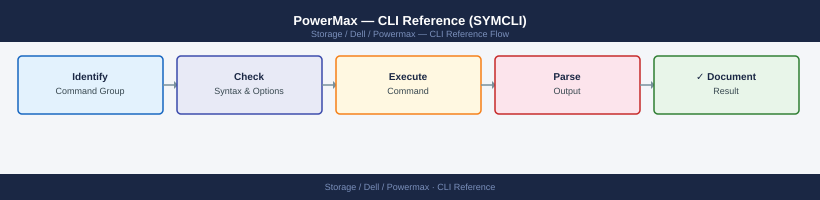
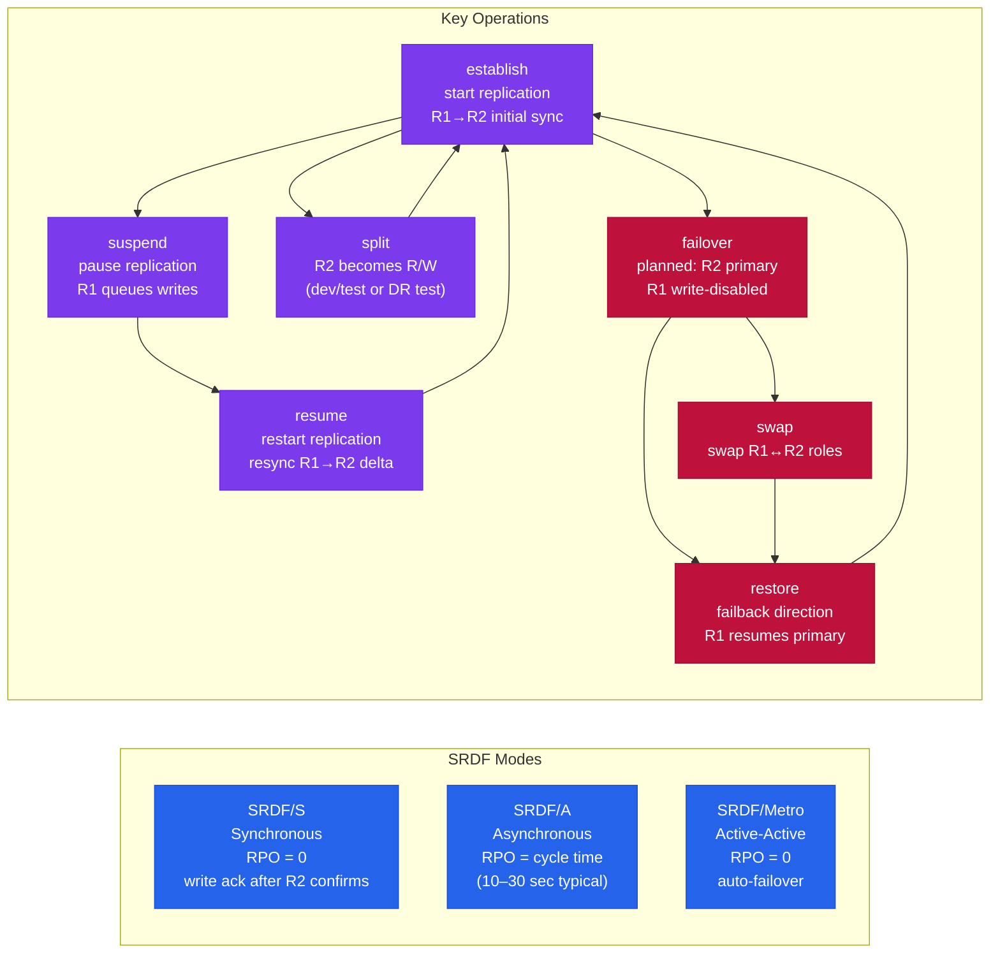

---
tags:
  - dell
  - operations
---
# PowerMax — CLI Reference (SYMCLI)

<div class="kb-summary">
Dell PowerMax (formerly VMAX) is Dell's enterprise all-flash storage platform. The CLI tool is SYMCLI (Solutions Enabler CLI) — commands follow a `sym<object> <action> -sid <SymmID>` pattern. Every command requires the array's SID (Symmetrix ID).

*Applies to: PowerMax 2500 / 8500*
</div>


 Run `symcfg list` first to identify your SID.

> Requires Solutions Enabler installed on a management host with connectivity to the array. All commands target a specific array via `-sid <SymmID>`.

## Before you begin

- **Access:** Storage admin credentials (cluster admin or equivalent)
- **Timing:** safe to run during business hours unless a step is marked ⚠ (causes interruption)
- **Dependencies:** no active upgrades or migrations on the same infrastructure
- **Logging:** capture command output — paste into the change record on completion

---

## Discovery & Array Info

Discover arrays, list directors and ports, view cache usage and storage resource pools.

```bash
# Discover arrays and list what's known
symcfg discover
symcfg list
symcfg list -v                                     # with model, microcode, capacity
symcfg -sid <sid> show
symcfg -sid <sid> list -v

# Directors and ports
symcfg -sid <sid> list -dir all
symcfg -sid <sid> list -port all
symcfg -sid <sid> show -dir <director_id>
symcfg -sid <sid> show -dir <director_id> -p <port_number>
symcfg -sid <sid> list -fa -online               # only online FA ports

# Cache and storage pools
symcfg -sid <sid> list -cache
symcfg -sid <sid> list -pool -all
symcfg -sid <sid> show -pool -thin -demand        # thin pool subscription and usage
symcfg -sid <sid> list -srp                       # storage resource pools

# Software version and licenses
symcfg -sid <sid> list | grep -i "microcode\|Enginuity\|HYPERMAX"
symlmf -sid <sid> list

# Solutions Enabler version
symcfg -V
syminq -symmids
symgate list -sid <sid>
```

## Devices

Devices (TDEVs) are the thin volumes presented to hosts. All production volumes on PowerMax should be thin (TDEV). Create devices within storage groups so they inherit service level settings.

```bash
# List devices
symdev list -sid <sid>
symdev list -sid <sid> -v
symdev list -sid <sid> -assigned              # in a masking view
symdev list -sid <sid> -unassigned            # not presented to any host
symdev list -sid <sid> -mapped               # mapped to hosts
symdev list -sid <sid> -tdev                 # thin devices (should be all production)
symdev list -sid <sid> -failed               # failed or degraded
symdev list -sid <sid> -spare

# Device details
symdev show <devname> -sid <sid>
symdev show <devname> -sid <sid> -v
symdev show <devname> -sid <sid> | grep -E "RDF|Pair State|R1|R2"
symdev show <devname> -sid <sid> | grep "Storage Group"

# Create thin devices (add directly to storage group)
symconfigure -sid <sid> -cmd \
    "create dev count=10, size=100GB, emulation=FBA, config=TDEV, sg=<sg_name>;" \
    commit -noprompt

# Delete a device (must be unmasked first)
symdev -sid <sid> not_ready <devname> -noprompt
symconfigure -sid <sid> -cmd "delete dev <devname>;" commit -noprompt

# Device properties
symdev show <devname> -sid <sid> | grep "Write Disable"
symcfg -sid <sid> show -pool -thin -demand | grep -E "Total|Subscribed|Free"
symdev list -sid <sid> -rdfg <rdfg_number>

# Performance stats
symstat -sid <sid> list -type dev -devn <devname>
symstat -sid <sid> list -type dev
symstat -sid <sid> list -type dev | sort -k4 -rn | head -20
```

## Storage Groups

Storage Groups are the primary logical grouping in PowerMax. Every device presented to a host must be in a storage group that is part of a masking view. Storage groups can be nested — parent SGs contain child SGs.

```bash
# List and inspect
symsg list -sid <sid>
symsg list -sid <sid> -v
symsg show <sg_name> -sid <sid>
symsg show <sg_name> -sid <sid> -v
symsg show <sg_name> -sid <sid> | grep -E "SRP|Service Level|Compression"

# Create
symsg create <sg_name> -sid <sid> -type regular
symsg create <sg_name> -sid <sid> -srp SRP_1 -slo Diamond   # with service level
symsg create <parent_sg> -sid <sid> -type parent

# Delete (must have no devices and no masking views)
symsg delete <sg_name> -sid <sid>

# Add and remove devices
symsg -sid <sid> -sg <sg_name> add dev <devname>
symsg -sid <sid> -sg <sg_name> add dev <start>:<end>         # range of devices
symsg -sid <sid> -sg <sg_name> remove dev <devname>
symsg -sid <sid> -sg <sg_name> addnew dev count=5 emulation=FBA size=100GB

# Parent / child hierarchy
symsg -sid <sid> -sg <parent_sg> add sg <child_sg>
symsg -sid <sid> -sg <parent_sg> remove sg <child_sg>
symsg show <parent_sg> -sid <sid> | grep -A 20 "Child Storage Group"

# Modify
symsg rename <old_sg> -new_sg_name <new_sg> -sid <sid>
symsg -sid <sid> -sg <sg_name> set -slo Platinum
symsg -sid <sid> -sg <sg_name> set -compression enabled
```

## Masking Views & Access

A masking view binds a storage group (devices), a port group (array ports), and an initiator group (host WWNs) together — this is what makes LUNs visible to a host.

```bash
# Masking views
symaccess list view -sid <sid>
symaccess show view <view_name> -sid <sid>
symaccess create view -name <view_name> -sg <sg_name> -pg <pg_name> -ig <ig_name> -sid <sid>
symaccess delete view -name <view_name> -sid <sid>

# Initiator groups (list of host WWNs/IQNs allowed to see the devices)
symaccess list -sid <sid> -type initiator
symaccess show <ig_name> -sid <sid> -type initiator
symaccess create -name <ig_name> -type initiator -sid <sid>
symaccess delete -name <ig_name> -type initiator -sid <sid>
symaccess -sid <sid> -name <ig_name> -type initiator add devport -wwn <wwn>
symaccess -sid <sid> -name <ig_name> -type initiator remove devport -wwn <wwn>

# Port groups (which array front-end ports to use)
symaccess list -sid <sid> -type port
symaccess show <pg_name> -sid <sid> -type port
symaccess create -name <pg_name> -type port -sid <sid>
symaccess delete -name <pg_name> -type port -sid <sid>
symaccess -sid <sid> -name <pg_name> -type port add devport <dir>:<port>
symaccess -sid <sid> -name <pg_name> -type port remove devport <dir>:<port>

# Storage groups in access context
symaccess list -sid <sid> -type storage

# Check host connectivity
symaccess -sid <sid> list logins -dirport <dir>:<port>
symaccess -sid <sid> -type initiator show <ig_name> -detail
```

## Ports & Hardware

Check front-end port status and FC logins, and manage physical disks.

```bash
# Ports
symport list -sid <sid>
symport list -sid <sid> -v
symport -sid <sid> -dir <dir> -p <port> show

# Fibre Channel host logins on a port
symport list -sid <sid> -logged_in
symport -sid <sid> -dir <dir> -p <port> list -logged_in

# Physical disks
sympd list -sid <sid>
sympd list -sid <sid> -failed
sympd list -sid <sid> -spare
sympd show <pd_name> -sid <sid>

# Disk groups
symdisk list -sid <sid>
symdisk list -sid <sid> -failed
symdisk list -sid <sid> -v

# Hardware status
symcfg -sid <sid> list -disk
symcfg -sid <sid> list -bay
```

## SRDF — Replication

SRDF (Symmetrix Remote Data Facility) replicates data between PowerMax arrays.



| Mode | Description | RPO |
|---|---|---|
| SRDF/S (Synchronous) | Write acknowledged only after replicated | Zero |
| SRDF/A (Asynchronous) | Writes batched in cycles | Seconds to minutes |
| SRDF/Metro | Active-active with automatic failover | Zero |

```bash
# List SRDF groups and status
symrdf -sid <sid> list
symrdf -sid <sid> -rdfg <rdfg_num> list
symrdf -sid <sid> -rdfg <rdfg_num> query

# Storage group operations
symrdf -sid <sid> -sg <sg_name> query        # current state
symrdf -sid <sid> -sg <sg_name> establish    # start replication
symrdf -sid <sid> -sg <sg_name> split        # make R2 writable for testing
symrdf -sid <sid> -sg <sg_name> suspend      # pause replication
symrdf -sid <sid> -sg <sg_name> resume       # resume after suspend
symrdf -sid <sid> -sg <sg_name> update       # force delta resync
symrdf -sid <sid> -sg <sg_name> failover     # planned failover (R2 becomes primary)
symrdf -sid <sid> -sg <sg_name> failback     # failback to original R1
symrdf -sid <sid> -sg <sg_name> swap         # swap R1/R2 roles
symrdf -sid <sid> -sg <sg_name> verify

# SRDF/A specific
symrdf -sid <sid> -sg <sg_name> query -srdf_a
symrdf -sid <sid> -rdfg <rdfg_num> verify -srdf_a
symrdf -sid <sid> -rdfg <rdfg_num> list -v
```

## SnapVX — Snapshots

SnapVX provides near-instantaneous space-efficient snapshots of storage groups.

```bash
# List snapshots
symsnapvx list -sid <sid>
symsnapvx list -sid <sid> -sg <sg_name>
symsnapvx list -sid <sid> -sg <sg_name> -snapshot_name <snap_name>

# Create a snapshot
symsnapvx -sid <sid> snap -sg <sg_name> -name <snap_name> establish

# Delete (terminate) a snapshot
symsnapvx -sid <sid> snap -sg <sg_name> -name <snap_name> terminate
symsnapvx -sid <sid> snap -sg <sg_name> -name <snap_name> terminate --force

# Link snapshot to a target SG (expose for testing)
symsnapvx -sid <sid> snap -sg <sg_name> -name <snap_name> link -lnsg <target_sg>
symsnapvx -sid <sid> snap -sg <sg_name> -name <snap_name> link -lnsg <target_sg> -copy

# Unlink
symsnapvx -sid <sid> snap -sg <sg_name> -name <snap_name> unlink -lnsg <target_sg>

# Restore (overwrites source — offline devices from host first)
symsnapvx -sid <sid> snap -sg <sg_name> -name <snap_name> restore

# Rename
symsnapvx -sid <sid> snap -sg <sg_name> -name <snap_name> rename -new_name <new_snap_name>
```

## Performance & Statistics

`symstat` provides real-time performance data by storage group, device, director, or cache.

```bash
# Storage group stats
symstat -sid <sid> list -type sg
symstat -sid <sid> list -type sg -sg <sg_name>
symstat -sid <sid> list -type sg -i 30             # refresh every 30 seconds

# Device stats
symstat -sid <sid> list -type dev
symstat -sid <sid> list -type dev -devn <devname>
symstat -sid <sid> list -type dev | sort -k4 -rn | head -20   # top by IOPS

# Director and port stats
symstat -sid <sid> list -type dir
symstat -sid <sid> list -type dir -dir <director_id>
symstat -sid <sid> list -type port
symstat -sid <sid> list -type port -dir <director_id> -p <port_id>

# Cache stats (write pending % — warn at 31%, critical at 50%)
symstat -sid <sid> list -type cache

# Back-end and SRDF stats
symstat -sid <sid> list -type be
symstat -sid <sid> list -type rdf

# Collect 15-minute snapshot for Dell TAC
symstat -sid <sid> list -type sg -i 60 -c 15 > /tmp/sg-perf-$(date +%Y%m%d).txt &
symstat -sid <sid> list -type dev -i 60 -c 15 > /tmp/dev-perf-$(date +%Y%m%d).txt &
symstat -sid <sid> list -type cache -i 60 -c 15 > /tmp/cache-perf-$(date +%Y%m%d).txt &
wait
```

## Events & Audit

```bash
# System events
symevent list -sid <sid>
symevent list -sid <sid> -v
symevent list -sid <sid> -start_time "01/01/2026 00:00:00"
symevent list -sid <sid> -start_time "01/01/2026 00:00:00" -end_time "01/02/2026 00:00:00"
symevent list -sid <sid> -v | grep -i "WARNING\|ERROR\|FATAL"
symevent list -sid <sid> -v | grep -i "uncleared\|active"
symevent list -sid <sid> -v | grep -i "disk\|drive\|BE\|DAE"
symevent list -sid <sid> -v | grep -i "RDF\|SRDF\|replication"
symevent list -sid <sid> -v | grep -i "port\|director\|link"

# Audit log
symaudit list -sid <sid>
symaudit list -sid <sid> -v
symaudit list -sid <sid> -start_time "01/01/2026 00:00:00"
symaudit list -sid <sid> -user <username>
symaudit list -sid <sid> -v | grep -i "Create\|Delete\|Modify\|SRDF"

# Export for support case
symevent list -sid <sid> -v -output csv > /tmp/events-$(date +%Y%m%d).csv
symaudit list -sid <sid> -v > /tmp/audit-$(date +%Y%m%d).txt
```

## Device Groups (Legacy)

Device groups are the legacy SYMCLI grouping mechanism (pre-Unisphere for PowerMax). For current deployments, use storage groups via `symsg`. Device groups remain relevant for SRDF scripts and older Solutions Enabler workflows.

```bash
# List and inspect
symdg list -sid <sid>
symdg list -sid <sid> -v
symdg show <dg_name> -sid <sid>
symdg show <dg_name> -sid <sid> -v
symdg list -dev <devname> -sid <sid>

# Create
symdg create <dg_name> -type regular -sid <sid>
symdg create <dg_name> -type RDF1 -sid <sid>   # R1 side
symdg create <dg_name> -type RDF2 -sid <sid>   # R2 side
symdg delete <dg_name> -sid <sid>

# Add and remove devices
symdg -g <dg_name> add dev <devname> -sid <sid>
symdg -g <dg_name> add dev <start_dev>:<end_dev> -sid <sid>
symdg -g <dg_name> remove dev <devname> -sid <sid>
symdev list -g <dg_name> -sid <sid>

# SRDF operations via device group
symrdf -g <dg_name> -sid <sid> query
symrdf -g <dg_name> -sid <sid> suspend -noprompt
symrdf -g <dg_name> -sid <sid> establish -noprompt
symrdf -g <dg_name> -sid <sid> failover -noprompt
symrdf -g <dg_name> -sid <sid> restore -noprompt
```

---

## Verify

- Confirm the operation completed without errors in the log or management UI
- Verify the expected state change is visible (service running, object created, config applied)
- Document the outcome in the change record

---

## See also

- [Powermax — Procedures](procedures/)
- [Powermax — Scripts](scripts/)
- [Powermax — Health Checks](health-checks/)
