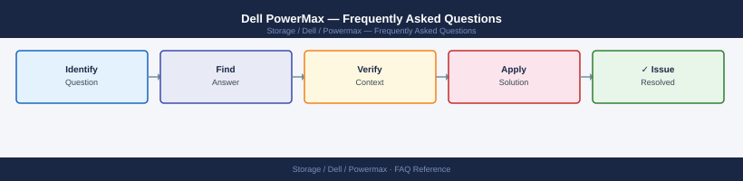

---
tags:
  - dell-powermax
  - faq
  - operations
---
# Dell PowerMax — Frequently Asked Questions

Common questions about Dell PowerMax operations, configuration, and troubleshooting. For step-by-step procedures, see the <a href="index.md">Operations</a> section.

## General

**Q: What PowerMaxOS version is recommended?**
A: PowerMaxOS 10.1.x (5978.x) is the current recommendation for PowerMax 2500/8500. Check via Unisphere: System → System Overview → Microcode Version.

**Q: How do I check the current Dell PowerMax version?**
A: `Unisphere → System → System Overview → Microcode Version`

## Configuration

**Q: What is the default Service Level Objective (SLO) for new storage groups?**
A: Diamond SLO is the default for PowerMax — targets <1ms response time. Use lower SLOs (Platinum, Gold) only for workloads with relaxed latency requirements to avoid over-provisioning NVMe cache.

**Q: How do I enable SRDF/A (asynchronous replication) on PowerMax?**
A: Create SRDF/A group via Unisphere: Storage → SRDF → Create SRDF Group, select Asynchronous mode. Assign storage groups. Configure cycle time (minimum 30 seconds). Requires SRDF FoD licence on both arrays.

## Operations

**Q: How do I upgrade PowerMaxOS without disrupting production workloads?**
A: PowerMaxOS upgrades are non-disruptive (NDU). Use Unisphere: System → Upgrade. The upgrade rolls across directors sequentially. No host-side changes required. Schedule during low-activity window for reduced risk.

**Q: What is the correct procedure to provision a new LUN on PowerMax?**
A: Create storage group, add volumes, add host/initiator group, create masking view. Via Unisphere or SYMCLI: `symconfigure -sid <sid> -cmd 'create dev count=1, size=100 GB, emulation=FBA, config=TDEV;' commit`. Verify with `symdev list -sid <sid>`.

## Troubleshooting

**Q: PowerMax shows 'Alert: SLO Compliance < 95%'. What does it mean?**
A: Workloads are not meeting their target SLO. Check CloudIQ for hot volumes. Review if workload has grown beyond what the SLO tier can serve. Promote volumes to a higher SLO or rebalance across storage groups.

**Q: PowerMax latency increased after a workload migration — where do I start?**
A: Check Unisphere Performance tab for the affected storage group. Review front-end port utilisation. Verify SLO is correctly assigned. Check cache hit ratio — low cache hits indicate working set exceeds NVMe cache. Contact Dell if performance is unexpected.

## Backup and Recovery

**Q: How often should I back up PowerMax configuration?**
A: Weekly SYMCLI configuration export: `symconfigure -sid <sid> -f config_backup.txt list`. Also enable Unisphere scheduled config backup under System → Backup Configuration. Store off-array.

**Q: Can I restore a single storage group's masking view without a full config restore?**
A: Yes — recreate the masking view via Unisphere or SYMCLI using the backed-up configuration. Masking view components (storage group, host group, port group) are independent objects and can be recreated individually.

## See Also

- [Dell PowerMax Operations](index.md)
- [Dell PowerMax Troubleshooting](../../../troubleshooting/index.md)
