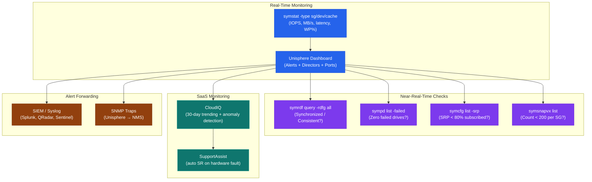
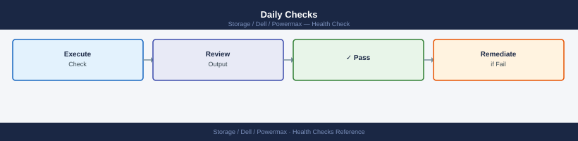
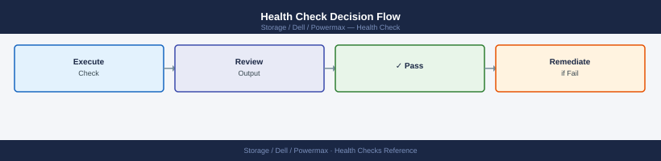

---
tags:
  - dell
  - operations
---
# PowerMax — Health Checks

<div class="kb-summary">
Health Checks reference covering Monitoring Hierarchy, Daily Checks, Health Check, Array Connectivity and Status, Director and Port Status and 7 more sections.

*Applies to: PowerMax 2500 / 8500*
</div>

## Before you begin

- **Access:** Storage admin credentials (cluster admin or equivalent)
- **Timing:** safe to run during business hours unless a step is marked ⚠ (causes interruption)
- **Dependencies:** no active upgrades or migrations on the same infrastructure
- **Logging:** capture command output — paste into the change record on completion

---

## Run This Routine

1. **System health:** `symcli -sid <sid> list -v | grep -i health`
2. **Disk group status:** `symdisk -sid <sid> list -failed` — should return empty
3. **Array performance:** `symstat -sid <sid> -type array` — check utilisation %
4. **SRDF group health:** `symrdf -sid <sid> list -v | grep -i state`
5. **Port health:** `symcfg -sid <sid> list -dir -v | grep -i status`
6. **Snapshot and clone status:** `symsnapvx -sid <sid> list -expired` — review expired snaps
7. **License status:** `symcfg -sid <sid> list -licenses`
8. **Open alerts:** Unisphere for PowerMax → Alerts → open/unacknowledged count

## Monitoring Hierarchy




## Daily Checks



| Check | Command | Notes |
|---|---|---|
| [ ] Open Unisphere for PowerMax → Dashboard and review the Alerts pane | | |
| [ ] Run `symcfg list` to confirm all registered arrays are online | `symcfg list` | |
| [ ] Check SRDF pair states | `symrdf list -sid XXXX` | All R1/R2 pairs should show `Synchronized` (SRDF/S) or `Consistent` (SRDF/A); investigate any pair showing `Transmit Idle`, `R1 Updated`, or `Suspended` |
| [ ] Check failed or degraded physical drives | `sympd list -sid XXXX -failed` | Output should be empty |
| [ ] Review active SnapVX sessions | `symsnap list -sid XXXX` | Confirm no device is approaching the 256-snapshot limit; expire stale snaps |
| [ ] Check thin device pool utilisation in Unisphere → Storage → Thin Pools | | Alert if any pool exceeds 80% consumed |
| [ ] Review Unisphere → Performance → Array for I/O response time and throughput | | |
| [ ] Confirm CloudIQ shows no critical findings for the array | | |

## Health Check


Run these commands from a host with Solutions Enabler installed to get a complete picture of array health before any change or incident response.

- [ ] `symcfg list` returns the expected array SIDs with status `Online`
- [ ] `symcfg -sid XXXX show` shows all directors and ports in a healthy state with no fault indicators
- [ ] `sympd list -sid XXXX -failed` returns no output (no failed drives)
- [ ] `symrdf list -sid XXXX` shows all SRDF groups and pair states — note any that are not `Synchronized` or `Consistent`
- [ ] `symdg list -sid XXXX` lists all device groups without errors
- [ ] `symsg list -sid XXXX` lists all storage groups and confirms no group is reporting capacity issues
- [ ] `symsnap list -sid XXXX` shows all active SnapVX sessions with no expired or stuck sessions
- [ ] Unisphere → System → Hardware confirms no director, drive, or port faults
- [ ] CloudIQ risk score is green or within accepted threshold

```bash
# List all Symmetrix arrays and confirm they are Online
symcfg list

# Full array health and director/port status for a specific SID
symcfg -sid XXXX show

# List all physical drives — check for Failed or Degraded state
sympd list -sid XXXX

# Filter for failed drives only (should return empty on a healthy array)
sympd list -sid XXXX -failed

# List SRDF groups and pair states
symrdf list -sid XXXX

# Show detailed SRDF pair state for a specific RDF group
symrdf -sid XXXX -rdfg <group> query

# List all device groups
symdg list -sid XXXX

# List all storage groups
symsg list -sid XXXX

# List all SnapVX snapshots across the array
symsnap list -sid XXXX

# Show replication sessions (SRDF and SnapVX combined view)
symreplicate list -sid XXXX
```

## Array Connectivity and Status


```bash
# Verify Solutions Enabler can reach the array
symcfg list
symcfg -sid <sid> show | grep -E "Product|Microcode|Online"

# Check array health via Unisphere REST (requires curl + valid token)
curl -sk -X GET "https://<unisphere-ip>:8443/univmax/restapi/system/symmetrix/<sid>" \
    -H "Authorization: Bearer <token>" | python3 -m json.tool | grep -E "model|health|microcode"
```

## Director and Port Status


```bash
# Check all directors — flag any offline
symcfg -sid <sid> list -dir all | grep -v Online

# Check all ports — flag any not RDY
symcfg -sid <sid> list -port all | grep -v RDY

# FA port login count (host connectivity)
symcfg -sid <sid> list -fa -online | grep -E "Port|Logins"
```

## Events and Alerts


```bash
# Active/uncleared events
symevent list -sid <sid> -v | grep -i "uncleared\|Warning\|Error\|Fatal" | head -20

# Events in last 24 hours
symevent list -sid <sid> -start_time "$(date -d 'yesterday' '+%m/%d/%Y') 00:00:00" -v | head -30
```

## Storage Pool (SRP) Capacity


```bash
# SRP subscription and free capacity
symcfg -sid <sid> list -srp

# Thin pool usage detail
symcfg -sid <sid> show -pool -thin -demand

# Flag SRP above 80% subscribed
symcfg -sid <sid> list -srp | awk '$5+0 > 80 {print "WARNING:", $0}'
```

## SRDF Replication State


```bash
# Check all SRDF groups
symrdf -sid <sid> list -rdfg all

# Check for any pairs not in Synchronized state
symrdf -sid <sid> query -rdfg all | grep -v "Synchronized\|InSync" | grep -v "^$\|Group\|Pair\|---"
```

## Device Status


```bash
# Failed or degraded devices
symdev list -sid <sid> -failed

# Devices not ready
symdev list -sid <sid> -NR

# Spare devices available
symdev list -sid <sid> -spare
```

## Cache Health


```bash
# Cache write pending percentage — alert if > 50%
symstat -sid <sid> list -type cache | grep -E "WP\|Write Pending"
```

## Health Check Decision Flow



```d2
direction: right

START: "Begin Health Check" {shape: rectangle}
A: "symcfg list\nArray Online?" {shape: rectangle}
A1: "Check SE connectivity\nCheck array power\nCheck netcnfg" {shape: rectangle}
B: "symcfg show\nAll directors Online?" {shape: rectangle}
B1: "Raise P2 case with Dell\nCheck director LEDs\nCapture symcfg show output" {shape: rectangle}
C: "sympd list -failed\nFailed drives?" {shape: rectangle}
C1: "Check RAID protection\nMark spare drive\nRaise Dell hardware case" {shape: rectangle}
D: "symrdf query -rdfg all\nAll pairs Synchronized?" {shape: rectangle}
D1: "Check WAN link\nCheck R2 array\nReview SRDF state table" {shape: rectangle}
E: "symcfg list -srp\nSRP < 80% subscribed?" {shape: rectangle}
E1: "Expire stale SnapVX snaps\nReview thin provisioning\nPlan capacity expansion" {shape: rectangle}
F: "symstat list -type cache\nCache WP% < 31%?" {shape: rectangle}
F1: "Check for I/O spike\nIdentify hot SGs\nReview FAST VP placement" {shape: rectangle}
G: "symevent list\nUncleared critical events?" {shape: rectangle}
G1: "Triage events by severity\nCorrelate with Unisphere alerts\nEscalate if hardware-related" {shape: rectangle}
PASS: "All checks PASSED\nArray healthy" {shape: rectangle}

START -> A
A -> A1
A -> B
B -> B1
B -> C
C -> C1
C -> D
D -> D1
D -> E
E -> E1
E -> F
F -> F1
F -> G
G -> G1
G -> PASS
```

## Health Check Summary


| Check | Command | Healthy |
|---|---|---|
| Array reachable | `symcfg list` | Array listed, Online |
| All directors online | `symcfg list -dir all` | All = Online |
| All ports ready | `symcfg list -port all` | All = RDY |
| No active events | `symevent list -v` | 0 uncleared |
| SRP < 80% subscribed | `symcfg list -srp` | < 80% used |
| SRDF synchronized | `symrdf query -rdfg all` | All = Synchronized |
| No failed devices | `symdev list -failed` | 0 failed |
| Cache WP < 31% | `symstat list -type cache` | WP% < 31% |

---

## Verify

- Confirm the operation completed without errors in the log or management UI
- Verify the expected state change is visible (service running, object created, config applied)
- Document the outcome in the change record

---

## See also

- [Powermax — Procedures](../procedures/)
- [Powermax — CLI Reference](../cli-reference/)
- [Powermax — Common Issues](../../troubleshooting/common-issues/)
