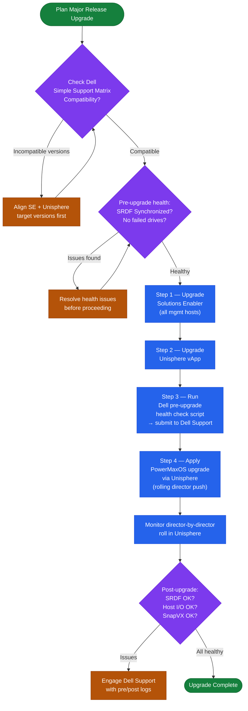

# PowerMax — Install & Upgrade

## Software Version Matrix

| PowerMaxOS Release | Solutions Enabler | Unisphere for PowerMax | Notes |
|---|---|---|---|
| 10.1 (Foxtail) | 10.1.x | 10.1.x | Current GA; NVMe/TCP support, enhanced CloudIQ integration |
| 10.0 (Elm) | 10.0.x | 10.0.x | Generally available; improved SRDF/Metro support |
| 5978.x (Dandelion) | 9.2.x | 9.2.x | Long-term support release for PowerMax 2000/8000 |
| 5977.x (Cypress) | 9.1.x | 9.1.x | End of general availability; security patches only |
| 5978.669.669 | 9.2.2 | 9.2.2 | Minimum supported for NVMe/FC host access |

Always confirm the compatibility matrix in the Dell Simple Support Matrix before upgrading SE or Unisphere independently of PowerMaxOS.

## Upgrade Paths

- **Within a major release** (e.g., 5978.x → 5978.y): apply microcode patches via Unisphere → System → Upgrade. Non-disruptive rolling push across directors.
- **Major release upgrade** (e.g., 5977 → 5978 or 5978 → 10.0): requires pre-upgrade validation report from Dell Support. Solutions Enabler and Unisphere must be upgraded to the target-compatible version **before** the array microcode upgrade.
- **Downgrade**: PowerMaxOS does not support in-place downgrades. Rolling back requires Dell Support engagement and a service restoration procedure.

Upgrade sequence for a major release:

1. Upgrade Solutions Enabler on all management hosts.
2. Upgrade Unisphere for PowerMax vApp.
3. Run the Dell pre-upgrade health check script and submit the output to Dell Support.
4. Apply the PowerMaxOS upgrade via Unisphere; monitor director-by-director roll.
5. Post-upgrade: validate SRDF pairs, SnapVX sessions, and host I/O on all masking views.

## Refresh Planning

| Trigger | Action |
|---|---|
| Array approaching 80% raw capacity | Evaluate drive expansion (add NVMe shelves) or add an additional engine |
| PowerMaxOS release approaching EOS | Begin upgrade project; target minimum N-1 from current GA |
| Model end-of-life announced | Initiate data migration project to next-generation platform 18–24 months in advance |
| SLO response time consistently degraded | Review FAST VP tier placement; consider capacity expansion or workload redistribution |
| SRDF replication bandwidth saturated | Evaluate ICL bandwidth upgrade or shift to SRDF/A to reduce synchronous write overhead |

Technology refresh timeline:
- PowerMax hardware typically has a 5–7 year lifecycle before end of extended support.
- Dell publishes end-of-service-life (EOSL) notices 12–18 months in advance.
- Plan data migration using SRDF migration or EMC Storage Analytics export; avoid last-minute forced migrations.

## EOL Tracking

| Component | End of General Availability | End of Service Life |
|---|---|---|
| VMAX 950F (predecessor) | Q4 2020 | Q4 2025 |
| PowerMax 2000 (Gen 1) | Q2 2023 (model discontinued) | Check Dell EOS portal |
| PowerMaxOS 5977 | Q1 2024 | Q1 2026 |
| PowerMaxOS 5978 | TBD (active LTS) | TBD |
| Solutions Enabler 9.1 | Q1 2024 | Q1 2026 |

Check current EOL status at: https://www.dell.com/support/home/en-us/product-support/product/powermax2000/drivers
