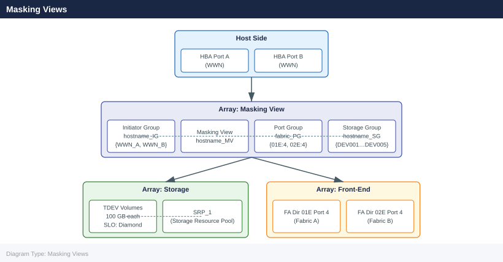

---
tags:
  - dell
  - operations
---
# PowerMax — Procedures

<div class="kb-summary">
Procedures reference covering Change Readiness, Maintenance Window, Post-Change Validation, Masking Views, Provisioning.

*Applies to: PowerMax 2500 / 8500*
</div>

## Before you begin

- **Access:** Storage admin credentials (cluster admin or equivalent)
- **Timing:** safe to run during business hours unless a step is marked ⚠ (causes interruption)
- **Dependencies:** no active upgrades or migrations on the same infrastructure
- **Logging:** capture command output — paste into the change record on completion

---

## Change Readiness

Verify these items before performing any change on the PowerMax — array configuration changes, code upgrades, or DR tests.

- [ ] SRDF state confirmed: `symrdf list -sid XXXX` shows all pairs `Synchronized` or `Consistent` — do not proceed if any pair is in a degraded state without a plan to handle it
- [ ] Take a SnapVX snapshot of source devices before making masking or storage group changes: `symsnap -sid XXXX create -sg <sg-name> -name pre-change-$(date +%Y%m%d)`
- [ ] Confirm no active SRDF sessions are in the middle of a mode change or link recovery
- [ ] Verify host I/O path health: `powermt display dev=all` on connected hosts shows no dead paths
- [ ] Confirm no outstanding Unisphere alerts that could indicate a pre-existing fault
- [ ] Validate thin pool headroom — confirm the pool has at least 20% free before adding devices or expanding storage groups
- [ ] Confirm Solutions Enabler version matches the running PowerMaxOS version to avoid CLI compatibility issues
- [ ] Inform application owners of the change window and confirm I/O drain or application quiesce plan if needed

| Item | Status | Notes |
|---|---|---|
| SRDF pairs Synchronized / Consistent | | |
| SnapVX pre-change snapshot created | | |
| No active Unisphere alerts | | |
| Host path health verified (powermt / multipath) | | |
| Thin pool headroom ≥ 20% | | |

## Maintenance Window

Steps for planned maintenance on a PowerMax array — applies to firmware upgrades, director replacements, and SRDF maintenance.

1. Notify application owners and confirm the maintenance window; record the start and end time
2. Take a full SnapVX snapshot of all production storage groups: `symsnap -sid XXXX create -sg <sg-name> -name maint-pre-$(date +%Y%m%d)`
3. If the maintenance involves SRDF, confirm the current SRDF state with `symrdf list -sid XXXX` and suspend replication if directed by the change procedure: `symrdf -sid XXXX -rdfg <group> suspend`
4. Quiesce or drain host I/O if the change requires a storage group or masking view modification — coordinate with the application team for a clean I/O halt
5. Perform the change per the approved runbook (firmware upgrade, configuration change, or hardware swap)
6. After the change, run `symcfg -sid XXXX show` to confirm all directors and ports returned to a healthy state
7. If SRDF was suspended, resume and monitor resync: `symrdf -sid XXXX -rdfg <group> resume` then `symrdf list -sid XXXX` until all pairs return to `Synchronized` or `Consistent`
8. Validate host I/O has resumed and confirm application health with application owners before closing the window

## Post-Change Validation

Run these checks after any change to the PowerMax to confirm the array is healthy and hosts are unaffected.

- [ ] `symcfg -sid XXXX show` — all directors and ports in healthy state, no new faults introduced
- [ ] `symrdf list -sid XXXX` — all SRDF pairs back to `Synchronized` (SRDF/S) or `Consistent` (SRDF/A); resync time noted if SRDF was suspended
- [ ] `sympd list -sid XXXX -failed` — no failed drives; confirm no drive fault was introduced during the change
- [ ] Host multipath validation: `powermt display dev=all` on each affected host shows all paths alive with the expected path count
- [ ] Unisphere Dashboard shows no new alerts introduced by the change
- [ ] CloudIQ shows no new critical findings post-change
- [ ] Application owners confirm I/O has resumed and application is healthy
- [ ] SnapVX pre-change snapshot retained until the post-change validation period has passed (minimum 24 hours)

## Masking Views

A Masking View on PowerMax connects three components — a Storage Group (volumes), a Port Group (FA ports), and an Initiator Group (host HBAs) — to grant a host access to storage. All three must exist before the Masking View can be created.



### List and Inspect


```bash
# List all masking views
symaccess list -sid <sid> view

# Show a specific masking view
symaccess show view <view_name> -sid <sid>

# Show which masking views a host's initiators are in
symaccess show -inits <wwn> -sid <sid>

# Show all masking views for a storage group
symaccess list -sid <sid> view -sg <sg_name>
```


```text title="Expected output"
Masking View Name                               Storage Group Name
---------------------------------------------------------------------------
prod-app-mv-001                                 prod-app-sg-001
prod-app-mv-002                                 prod-app-sg-002
dev-db-mv-001                                   dev-db-sg-001
uat-web-mv-001                                  uat-web-sg-001
dr-backup-mv-001                                dr-backup-sg-001

Masking View Name:  prod-app-mv-001
Storage Group:      prod-app-sg-001
Port Group:         pg-fc-01
Initiator Group:    ig-app-hosts-01
Host Initiators:    50:00:14:40:12:ab:cd:ef, 50:00:14:40:12:ab:cd:f0

Initiator                       Masking View Name
---------------------------------------------------------------------------
50:00:14:40:12:ab:cd:ef        prod-app-mv-001
50:00:14:40:12:ab:cd:f0        prod-app-mv-001

Masking View Name                               Storage Group Name
---------------------------------------------------------------------------
prod-app-mv-001                                 prod-app-sg-001
prod-app-mv-002                                 prod-app-sg-002
```

!!! warning "Common errors"
    **`Symmetrix ID <sid> is invalid`** — Verify the correct Symmetrix SID with `symcfg list` and ensure you are connected to the correct array.
    **`Masking view <view_name> does not exist`** — Confirm the masking view name spelling and check available views with `symaccess list -sid <sid> view`.
    **`No initiators found for WWN <wwn>`** — Verify the initiator WWN is correct and registered on the array using `symaccess list -sid <sid> initiator`.
### Initiator Groups


```bash
# List all initiator groups
symaccess list -sid <sid> -type initiator

# Show initiators in a group
symaccess show <ig_name> -sid <sid> -type initiator

# Create an initiator group
symaccess create -sid <sid> -name <ig_name> -type initiator

# Add host HBA WWN to initiator group
symaccess -sid <sid> -name <ig_name> -type initiator add -wwn <wwn>

# Remove initiator
symaccess -sid <sid> -name <ig_name> -type initiator remove -wwn <wwn>

# Create a cascaded (parent) initiator group
symaccess create -sid <sid> -name <parent_ig> -type initiator
symaccess -sid <sid> -name <parent_ig> -type initiator add -ig <child_ig>
```


```text title="Expected output"
Initiator Group Name                           Symmetrix ID
------------------------------------------------------
prod_linux_hosts                               000296802151
prod_windows_hosts                             000296802151
dev_esxi_cluster                               000296802151
backup_servers                                 000296802151

Initiator Group: prod_linux_hosts
Symmetrix ID: 000296802151
Type: Fibre
Num of Initiators: 3

Initiator Name                                 WWPN
------------------------------------------------------
host01_hba0                                    50:00:14:40:5b:2a:1c:01
host02_hba0                                    50:00:14:40:5b:2a:1c:02
host03_hba0                                    50:00:14:40:5b:2a:1c:03

Initiator Group prod_windows_hosts created successfully.
WWPN 50:00:14:40:5b:2a:1d:04 added to Initiator Group prod_windows_hosts.
WWPN 50:00:14:40:5b:2a:1c:02 removed from Initiator Group prod_linux_hosts.
Parent Initiator Group parent_cluster created successfully.
Child Initiator Group dev_esxi_cluster added to parent_cluster.
```

!!! warning "Common errors"
    **`Symmetrix ID <sid> does not exist`** — Verify the correct Symmetrix ID with `symcfg list` and ensure it matches your array's actual ID.
    **`Initiator Group <ig_name> already exists`** — Use a unique initiator group name or remove the existing group with `symaccess delete -sid <sid> -name <ig_name> -type initiator` before recreating.
    **`WWPN <wwn> is already assigned to another Initiator Group`** — Remove the WWN from its current group before adding it to a new one, or use a different HBA port.
### Port Groups


```bash
# List all port groups
symaccess list -sid <sid> -type port

# Show ports in a group
symaccess show <pg_name> -sid <sid> -type port

# Create a port group
symaccess create -sid <sid> -name <pg_name> -type port

# Add FA port to port group
symaccess -sid <sid> -name <pg_name> -type port add -dirport <dir_id>:<port_id>

# Remove port
symaccess -sid <sid> -name <pg_name> -type port remove -dirport <dir_id>:<port_id>
```


```text title="Expected output"
# List all port groups
Port Groups for Symmetrix ID 000296900001:
  PG_PROD_FC_01
  PG_PROD_FC_02
  PG_DR_ISCSI_01
  PG_TEST_FC_03

# Show ports in a group
Port Group Name: PG_PROD_FC_01
Symmetrix ID: 000296900001
Director:Port  | Port WWN           | Link Status | Speed
2a:0           | 50:00:14:40:1a:2b:3c:4d | Up          | 16 Gbps
2a:1           | 50:00:14:40:1a:2b:3c:4e | Up          | 16 Gbps
2b:0           | 50:00:14:40:1a:2b:3c:4f | Up          | 16 Gbps

# Create a port group
Created Port Group: PG_PROD_FC_04
Symmetrix ID: 000296900001

# Add FA port to port group
Port 3a:2 successfully added to Port Group PG_PROD_FC_04

# Remove port
Port 3a:2 successfully removed from Port Group PG_PROD_FC_04
```

!!! warning "Common errors"
    **`SYMAPI Error: Could not find the specified port group`** — Verify the port group name matches exactly with `symaccess list` output and check the SID is correct.
    **`SYMAPI Error: Director port <dir_id>:<port_id> does not exist`** — Confirm the director and port IDs are valid by running `symcfg list -dir` to see available FA ports.
    **`SYMAPI Error: Port is already a member of this port group`** — Remove the port first with the `remove` command before attempting to add it again.
### Creating a Masking View


```bash
# Prerequisites: SG, IG, and PG must all exist
# Create the masking view linking all three
symaccess create view -sid <sid> -name <view_name> \
    -sg <sg_name> \
    -ig <ig_name> \
    -pg <pg_name>
```


```text title="Expected output"
Creating Masking View...
Masking View 'PROD_MV_001' created successfully.
Symmetrix ID: 000297900001
Storage Group: SG_PROD_HOSTS
Initiator Group: IG_PROD_ESXi_Cluster
Port Group: PG_FC_4_5_6_7
View Name: PROD_MV_001
```

!!! warning "Common errors"
    **`Error: Storage Group '<sg_name>' does not exist`** — Verify the storage group exists with `symsg list` and use the correct name.
    **`Error: Initiator Group '<ig_name>' does not exist`** — Confirm the initiator group is created with `symaccess list -type initiator` before creating the masking view.
    **`Error: Port Group '<pg_name>' does not exist`** — Check that the port group exists using `symaccess list -type port` and verify the correct spelling.
### Deleting a Masking View


```bash
# Delete masking view (does not delete SG/IG/PG)
symaccess delete view <view_name> -sid <sid>

# Delete an initiator group (must not be in any masking view)
symaccess delete -sid <sid> -name <ig_name> -type initiator

# Delete a port group
symaccess delete -sid <sid> -name <pg_name> -type port
```


```text title="Expected output"
Deleting masking view 'PROD_MV_001'...
Masking view 'PROD_MV_001' deleted successfully.

Deleting initiator group 'LINUX_IG_GRP'...
Initiator group 'LINUX_IG_GRP' deleted successfully.

Deleting port group 'SYMMETRIX_PG_FC'...
Port group 'SYMMETRIX_PG_FC' deleted successfully.
```

!!! warning "Common errors"
    **`Error: Masking view 'PROD_MV_001' is still in use by storage group`** — Remove the masking view from all active storage groups before deletion using `symaccess delete view <view_name> -sid <sid> -force`.
    **`Error: Initiator group 'LINUX_IG_GRP' is in use by masking view 'PROD_MV_002'`** — Delete or modify the masking view that references this initiator group before attempting to delete the initiator group.
    **`Error: Port group 'SYMMETRIX_PG_FC' not found on array <sid>`** — Verify the port group name and array SID are correct using `symaccess list -sid <sid> -type port`.
### Troubleshooting Host Access


```bash
# Verify host WWN is registered with the array
symcfg -sid <sid> list -dir all | grep <wwn>

# Check which LUNs a host can see
symaccess show view <view_name> -sid <sid> | grep -A 20 "Storage Group"

# Verify host-to-LUN assignment is correct
symdev show <devname> -sid <sid> | grep -A 5 "Host"
```


```text title="Expected output"
# symcfg -sid 000123456789 list -dir all | grep 50:00:09:73:00:1a:2b:3c
Director 4e, Port 0: 50:00:09:73:00:1a:2b:3c (FA-4e:0)
Director 4e, Port 1: 50:00:09:73:00:1a:2b:3c (FA-4e:1)

# symaccess show view prod_view_001 -sid 000123456789 | grep -A 20 "Storage Group"
Storage Group Name: SG_PROD_DB_01
  Symmetrix ID: 000123456789
  Storage Group Type: RDF1+SRDF
  Workload: OLTP
  SLO: Diamond
  Compression: Enabled
  Replication: Enabled
  Host Initiators: 4
  LUN Count: 12
  ...

# symdev show 0ABC -sid 000123456789 | grep -A 5 "Host"
Host Mapping:
  Initiator: 50:00:09:73:00:1a:2b:3c (Port 0e:0)
  Initiator: 50:00:09:73:00:1a:2b:3d (Port 0e:1)
  LUN: 5
  Access: RW
```

!!! warning "Common errors"
    **`SYMCFG ERROR (0): Could not open the Symmetrix device driver`** — Verify the Symmetrix CLI is installed and the daemon (symcfg_daemon) is running with `symcfg_daemon -start`.
    **`Error: View '<view_name>' not found in Symmetrix <sid>`** — Confirm the view name is correct and exists on the array using `symaccess list view -sid <sid>`.
    **`SYMDEV ERROR (0): Device <devname> not found`** — Verify the device name (e.g., 0ABC) is valid and exists on the array with `symdev list -sid <sid>`.
## Provisioning

End-to-end workflow for provisioning storage on Dell PowerMax: create volumes, add to a storage group, and create (or update) a masking view so the host can see the storage.

```d2
direction: right

PREREQ: "PREREQ" {shape: rectangle}
FIX_PRE: "Fix Fabric Zoning\n+ confirm HBA logins" {shape: rectangle}
CHK_SG: "SG already\nexists for host?" {shape: rectangle}
USE_SG: "Use existing SG" {shape: rectangle}
CREATE_SG: "Step 1 — Create SG\nsymsg create hostname_SG\n-srp SRP_1 -slo Diamond" {shape: rectangle}
CREATE_DEV: "Step 2 — Create TDEVs\nsymconfigure: create dev\ncount=N size=XGB sg=hostname_SG" {shape: rectangle}
VERIFY_DEV: "Verify: symsg show hostname_SG" {shape: rectangle}
CREATE_IG: "Step 3 — Create Initiator Group\nsymaccess create hostname_IG\nAdd host HBA WWNs" {shape: rectangle}
CHK_PG: "Port Group\nexists for fabric?" {shape: rectangle}
CREATE_PG: "Step 4 — Create Port Group\nsymaccess create fabric_PG\nAdd FA dir:port pairs" {shape: rectangle}
USE_PG: "Use existing PG" {shape: rectangle}
CREATE_MV: "Step 5 — Create Masking View\nsymaccess create view hostname_MV\n-sg hostname_SG -ig hostname_IG -pg fabric_PG" {shape: rectangle}
HOST_SCAN: "Step 6 — Host Rescan\nrescan-scsi-bus / multipath -ll" {shape: rectangle}
VERIFY: "VERIFY" {shape: rectangle}
TSHOOT: "Troubleshoot:\nsymaccess show view\ncheck zone, WWN, port state" {shape: rectangle}
DONE: "Done — Storage Provisioned" {shape: rectangle}
START: "Start: New Host Needs Storage" {shape: rectangle}

PREREQ -> FIX_PRE
FIX_PRE -> PREREQ
PREREQ -> CHK_SG
CHK_SG -> USE_SG
CHK_SG -> CREATE_SG
CREATE_SG -> USE_SG
USE_SG -> CREATE_DEV
CREATE_DEV -> VERIFY_DEV
VERIFY_DEV -> CREATE_IG
CREATE_IG -> CHK_PG
CHK_PG -> CREATE_PG
CHK_PG -> USE_PG
CREATE_PG -> USE_PG
USE_PG -> CREATE_MV
CREATE_MV -> HOST_SCAN
VERIFY -> TSHOOT
TSHOOT -> VERIFY
VERIFY -> DONE
```

### Prerequisites


Before provisioning, confirm:
- Host HBA WWNs are logged into the fabric and registered with the array
- An appropriate Storage Resource Pool (SRP) and service level exist
- Zoning is in place (if Fibre Channel)

### Step 1 — Create or Identify the Storage Group


```bash
# Check if a suitable SG already exists
symsg list -sid <sid> | grep <hostname>

# Create a new storage group with SRP and service level
symsg create <hostname>_SG -sid <sid> -srp SRP_1 -slo Diamond
```


```text title="Expected output"
Symmetrix ID: 000297123456789
                                    Storage Group Name
------------------------------------------------------------------------
prod-db-01_SG
prod-db-02_SG
web-app-03_SG

(no output — command completes silently)
```

!!! warning "Common errors"
    **`symsg: CLI Exception: Could not connect to the Symmetrix array`** — Verify the Symmetrix ID (sid) is correct and the management station has network connectivity to the array.
    **`symsg: CLI Exception: SRP_1 does not exist on array 000297123456789`** — Run `symcfg list -srp` to confirm available SRP names and use the correct one in the command.
### Step 2 — Create Thin Devices


```bash
# Create 5 x 100 GB TDEV devices and add directly to the SG
symconfigure -sid <sid> -cmd \
    "create dev count=5, size=100GB, emulation=FBA, config=TDEV, sg=<hostname>_SG;" \
    commit -noprompt

# Verify devices were created and added
symsg show <hostname>_SG -sid <sid>
```


```text title="Expected output"
Executing SYMCONFIGURE operation...

Checking Device Group <hostname>_SG...
Device Group Name: <hostname>_SG
Symmetrix ID: 000297123456789
Number of Devices: 5
Device List:
  Dev_000: 0001E (100 GB) - TDEV - Online
  Dev_001: 0001F (100 GB) - TDEV - Online
  Dev_002: 00020 (100 GB) - TDEV - Online
  Dev_003: 00021 (100 GB) - TDEV - Online
  Dev_004: 00022 (100 GB) - TDEV - Online

Total Capacity: 500 GB
Symmetrix Capacity Available: 2.4 TB
```

!!! warning "Common errors"
    **`SYMCONFIGURE: Error: Device Group <hostname>_SG does not exist`** — Create the storage group first using `symsg create -sid <sid> -sgname <hostname>_SG` before adding devices.
    **`SYMCONFIGURE: Error: Insufficient free space in Symmetrix`** — Verify available capacity with `symcapacity -sid <sid>` and reduce device count or size accordingly.
### Step 3 — Create the Initiator Group


```bash
# Create initiator group for the host
symaccess create -sid <sid> -name <hostname>_IG -type initiator

# Add host HBA WWNs (one per port)
symaccess -sid <sid> -name <hostname>_IG -type initiator add -wwn <wwn_port_a>
symaccess -sid <sid> -name <hostname>_IG -type initiator add -wwn <wwn_port_b>
```


```text title="Expected output"
Creating initiator group <hostname>_IG on array <sid>...
Initiator group <hostname>_IG created successfully.

Adding WWN 50:00:14:40:5a:2b:c1:e3 to initiator group <hostname>_IG...
WWN 50:00:14:40:5a:2b:c1:e3 added successfully.

Adding WWN 50:00:14:40:5a:2b:c1:e4 to initiator group <hostname>_IG...
WWN 50:00:14:40:5a:2b:c1:e4 added successfully.
```

!!! warning "Common errors"
    **`Error: Initiator group <hostname>_IG already exists on array <sid>`** — Use a unique initiator group name or delete the existing group with `symaccess delete -sid <sid> -name <hostname>_IG -type initiator`.
    **`Error: Invalid WWN format <wwn_port_a> for array <sid>`** — Verify the WWN is 16 hexadecimal characters (e.g., `50:00:14:40:5a:2b:c1:e3`) and matches the HBA port configuration.
    **`Error: WWN <wwn_port_a> is already assigned to another initiator group`** — Confirm the WWN is not already in use by running `symaccess list -sid <sid> -type initiator` and remove it from the conflicting group first.
### Step 4 — Create or Identify the Port Group


```bash
# List existing port groups
symaccess list -sid <sid> -type port

# Create a new port group (or reuse an existing one for the fabric)
symaccess create -sid <sid> -name <fabric>_PG -type port
symaccess -sid <sid> -name <fabric>_PG -type port add -dirport 01E:4
symaccess -sid <sid> -name <fabric>_PG -type port add -dirport 02E:4
```


```text title="Expected output"
Symmetrix ID: 000296802151

                                Port Group Name
                                _______________
                                PROD_PG
                                DR_PG
                                TEST_PG

Port Group Name: FABRIC_PG
Symmetrix ID: 000296802151
Type: Port
Last Updated: 01/15/2025 14:32:15

Director:Port
_____________
01E:4
02E:4
```

!!! warning "Common errors"
    **`SYMCLI Exception: Could not open Symmetrix <sid>`** — Verify the Symmetrix ID is correct and the array is reachable via `symcfg list -v`.
    **`SYMCLI Exception: Port Group <fabric>_PG already exists`** — Either reuse the existing port group with `symaccess -sid <sid> -name <fabric>_PG -type port add -dirport` or choose a different name.
    **`SYMCLI Exception: Director port 01E:4 is already assigned to another port group`** — Check existing port group assignments with `symaccess list -sid <sid> -type port -detail` and use an unassigned director:port pair.
### Step 5 — Create the Masking View


```bash
# Create masking view linking SG + IG + PG
symaccess create view -sid <sid> -name <hostname>_MV \
    -sg <hostname>_SG \
    -ig <hostname>_IG \
    -pg <fabric>_PG

# Verify masking view
symaccess show view <hostname>_MV -sid <sid>
```


```text title="Expected output"
Creating Masking View <hostname>_MV...
Masking View <hostname>_MV created successfully.

Masking View Name:    <hostname>_MV
Storage Group:        <hostname>_SG
Initiator Group:      <hostname>_IG
Port Group:           <fabric>_PG
Storage Array SID:    000123456789
View State:           Active
Last Modified:        2024-01-15 14:32:18
Symmetrix ID:         000123456789
Num of Initiators:    4
Num of Ports:         8
Num of Devices:       24
```

!!! warning "Common errors"
    **`Masking View <hostname>_MV already exists`** — Use a unique name or delete the existing masking view with `symaccess delete view -sid <sid> -name <hostname>_MV -force`.
    **`Storage Group <hostname>_SG does not exist`** — Verify the storage group name exists with `symaccess show sg -sid <sid>` before creating the masking view.
    **`Port Group <fabric>_PG not found`** — Confirm the port group name is correct and exists using `symaccess show pg -sid <sid>`.
### Step 6 — Host-Side Validation


```bash
# On Linux — rescan for new devices
rescan-scsi-bus.sh
echo "- - -" > /sys/class/scsi_host/host*/scan
multipath -ll

# On Windows — rescan via PowerShell
Update-HostStorageCache
Get-Disk | Where-Object OperationalStatus -eq "Offline"
```


```text title="Expected output"
Scanning for SCSI devices...
Scanning host 0...
Scanning host 1...
Scanning host 2...
Scanning host 3...
0 new or changed device(s) found.

mpatha (360000970000192700533533030303030) dm-0 DELL,VMAX450F
size=2.0T features='1 queue_if_no_path' hwhandler='1 alua' wp=rw
`-+- policy='service-time 0' prio=50 status=active
  |- 2:0:0:0 sdb 8:16  active ready running
  |- 3:0:0:0 sdc 8:32  active ready running
  `- 4:0:0:0 sdd 8:48  active ready running

mpathb (360000970000192700533533030303031) dm-1 DELL,VMAX450F
size=5.0T features='1 queue_if_no_path' hwhandler='1 alua' wp=rw
`-+- policy='service-time 0' prio=50 status=active
  |- 2:0:1:0 sde 8:64  active ready running
  |- 3:0:1:0 sdf 8:80  active ready running
  `- 4:0:1:0 sdg 8:96  active ready running
```

!!! warning "Common errors"
    **`bash: rescan-scsi-bus.sh: command not found`** — Install sg3-utils package with `apt-get install sg3-utils` or `yum install sg3_utils`.
    **`bash: multipath: command not found`** — Install device-mapper-multipath with `apt-get install multipath-tools` or `yum install device-mapper-multipath`.
    **`Permission denied`** — Run the script with `sudo` or as root user.
### Adding More Devices to an Existing Host


```bash
# Create additional devices in existing SG
symconfigure -sid <sid> -cmd \
    "create dev count=2, size=500GB, emulation=FBA, config=TDEV, sg=<hostname>_SG;" \
    commit -noprompt

# No masking view change needed — new devices in existing SG are automatically visible
```


```text title="Expected output"
Configuring Symmetrix ID: 000297123456789

Establishing connection to Symmetrix array...
Connected to Symmetrix 000297123456789

Processing command:
create dev count=2, size=500GB, emulation=FBA, config=TDEV, sg=prod-host01_SG;

Creating 2 TDEV devices...
Device 000AB created (500 GB)
Device 000AC created (500 GB)

Adding devices to storage group: prod-host01_SG
Devices added successfully.

Job completed successfully.
Configuration committed.
```

!!! warning "Common errors"
    **`Error: Storage Group '<hostname>_SG' not found`** — Verify the storage group name matches exactly with `symsg list -sid <sid>` and ensure the SID is correct.
    **`Error: Insufficient free capacity in pool`** — Check available pool capacity with `sympools -sid <sid> -pool <pool_name>` and reduce device count or size accordingly.
    **`Error: Invalid emulation type 'FBA'`** — Confirm the array supports FBA emulation; use `symcfg list -sid <sid> -detail` to verify supported device types.
### Capacity Checks Before Provisioning


```bash
# SRP free capacity
symcfg -sid <sid> list -srp

# Thin pool subscription
symcfg -sid <sid> show -pool -thin -demand
# Warning: do not exceed 85% subscribed on the SRP
```


```text title="Expected output"
Symmetrix ID: 000297123456789

                                SRP Information
SRP#  SRP_Name      Usable_Cap(GB)  Used_Cap(GB)  Free_Cap(GB)  Free_%
0     SRP_0         524288.0        412160.5      112127.5      21.4
1     SRP_1         524288.0        498245.2      26042.8        5.0
2     SRP_2         524288.0        445632.1      78655.9        15.0

Symmetrix ID: 000297123456789

                    Thin Pool Subscription Information
Pool_Name      Pool_ID  Provisioned(GB)  Subscribed(GB)  Subscription_%
ThinPool_01    1        204800.0         168640.0        82.3
ThinPool_02    2        153600.0         142848.0        93.0
ThinPool_03    3        102400.0         76800.0         75.0
```

!!! warning "Common errors"
    **`SYMCFG: Error: Invalid SID <sid>`** — Replace `<sid>` with the actual Symmetrix ID (e.g., `000297123456789`).
    **`SYMCFG: Error: Symmetrix does not respond`** — Verify network connectivity to the PowerMax array and confirm the Symmetrix ID is reachable from the management host.
## Create a Storage Group and Add Devices

A Storage Group (SG) is the logical container that groups volumes under a common service level and host access policy. Create the SG first, then add devices to it.

```bash
# Step 1 — Create the storage group with an SRP and service level
symsg -sid <sid> create <sg-name> -srp SRP_1 -slo Diamond

# Step 2 — Add an existing device to the storage group
symsg -sid <sid> -sg <sg-name> add dev <device-id>

# Step 3 — Verify the storage group contents
symsg -sid <sid> show <sg-name>
```


```text title="Expected output"
Creating storage group SG-PROD-01 on array 000123456789...
Storage group SG-PROD-01 created successfully.

Adding device 0123 to storage group SG-PROD-01...
Device 0123 added to storage group SG-PROD-01.

Storage Group: SG-PROD-01
   SRP: SRP_1
   Service Level: Diamond
   Num Devices: 1
   Device IDs: 0123
   Num Initiators: 0
   Num Masking Views: 0
   Allocated Capacity (GB): 500.0
   Used Capacity (GB): 125.3
```

!!! warning "Common errors"
    **`Device 0123 is already in use by another storage group`** — Verify the device is not already assigned using `symdev -sid <sid> list` and choose an available device.
    **`Service Level Diamond not found on SRP SRP_1`** — Confirm the SLO name with `symsloprovisioning -sid <sid> list` and use a valid service level like Gold or Silver.
Verify the output shows the device listed under the storage group with the correct service level applied. If adding multiple devices, repeat the `add dev` command for each device ID or use a device range: `add dev <first-id>:<last-id>`.

## Create a Masking View

A Masking View grants host access by linking a Storage Group (volumes), a Port Group (FA ports), and an Initiator Group (host HBAs). All three components must exist before the Masking View can be created.

```bash
# Create the masking view linking SG, PG, and IG
symaccess -sid <sid> create view \
    -name <view-name> \
    -sg <sg-name> \
    -pg <port-group> \
    -ig <initiator-group>

# Verify the masking view was created
symaccess show view <view-name> -sid <sid>
```


```text title="Expected output"
Symmetrix ID: 000297900001
Masking View Name: PROD_MV_001
Storage Group: PROD_SG_01
Port Group: FA_PG_02
Initiator Group: PROD_IG_LINUX
View Status: Created Successfully

Symmetrix ID: 000297900001
Masking View Name: PROD_MV_001
  Storage Group: PROD_SG_01 (3 LUNs, 500 GB total)
  Port Group: FA_PG_02 (Ports: FA-2E:0, FA-2F:0)
  Initiator Group: PROD_IG_LINUX (4 initiators)
  LUN Mapping: LUN 0-2 mapped
  View Status: Active
```

!!! warning "Common errors"
    **`SYMAPI Error: Storage Group '<sg-name>' does not exist`** — Verify the storage group name with `symsg list -sid <sid>` and ensure it exists before creating the masking view.
    **`SYMAPI Error: Initiator Group '<initiator-group>' not found`** — Confirm the initiator group exists using `symaccess show ig -sid <sid>` and check the spelling matches exactly.
    **`SYMAPI Error: Port Group '<port-group>' is already in use by another masking view`** — Either use a different port group or remove the existing masking view using `symaccess delete view` before reassigning the port group.
After creating the masking view, rescan the host to confirm it sees the expected LUNs:

```bash
# Linux
rescan-scsi-bus.sh
multipath -ll

# VMware
esxcli storage core adapter rescan --all
```


```text title="Expected output"
rescan-scsi-bus.sh
Scanning for new SCSI devices...
Scanning host 0 for SCSI target IDs 0-127...
Scanning host 1 for SCSI target IDs 0-127...
Scanning host 2 for SCSI target IDs 0-127...
3 new device(s) found.

multipath -ll
mpatha (360060e8007000900000700009d5a3c11) dm-0 DELL,VRAID
size=500G features='1 queue_if_no_path' hwhandler='1 alua' wp=rw
|-+- policy='service-time 0' prio=50 status=active
| |- 2:0:0:1 sdb 8:16 active ready running
| `- 3:0:0:1 sdc 8:32 active ready running
`-+- policy='service-time 0' prio=10 status=enabled
  |- 4:0:0:1 sdd 8:48 active ready running
  `- 5:0:0:1 sde 8:64 active ready running
mpathb (360060e8007000900000700009d5a3c12) dm-1 DELL,VRAID
size=1T features='1 queue_if_no_path' hwhandler='1 alua' wp=rw
|-+- policy='service-time 0' prio=50 status=active
| |- 2:0:1:1 sdf 8:80 active ready running
| `- 3:0:1:1 sdg 8:96 active ready running

esxcli storage core adapter rescan --all
(no output — command completes silently)
```

!!! warning "Common errors"
    **`rescan-scsi-bus.sh: command not found`** — Install sg3-utils package with `apt-get install sg3-utils` or `yum install sg3-utils`.
    **`multipath: command not found`** — Install device-mapper-multipath with `apt-get install multipath-tools` or `yum install device-mapper-multipath`.
    **`Error: Unknown command or namespace rescan`** — Verify ESXi version supports the command and run `esxcli storage core adapter list` first to confirm adapter names.
Confirm the host sees the correct number of LUNs and paths before closing the change.

## Create a SnapVX Snapshot

SnapVX provides space-efficient point-in-time snapshots of a storage group. Snapshots can be linked to a target storage group for read/write access without affecting the source.

```bash
# Step 1 — Create a SnapVX snapshot of a storage group
symsnap -sid <sid> -sg <sg-name> create -name <snap-name>

# Step 2 — Link the snapshot to a target storage group (for access/testing)
symsnap -sid <sid> -sg <sg-name> link \
    -name <snap-name> \
    -lnsg <target-sg>

# Verify the snapshot exists
symsnap list -sid <sid> -sg <sg-name>

# Verify the link is established
symsnap list -sid <sid> -sg <sg-name> -linked
```


```text title="Expected output"
Symmetrix ID: 000297900001

Creating snapshot...
SnapVX Snapshot Created Successfully
Snapshot Name: prod_backup_20240115
Source Storage Group: sg_prod_db
Timestamp: 01/15/2024 14:32:18

Linking snapshot to target storage group...
SnapVX Link Created Successfully
Link Name: prod_backup_20240115
Target Storage Group: sg_prod_db_test
Timestamp: 01/15/2024 14:32:45

Snapshot List for Storage Group: sg_prod_db
Name                          Created              Linked  Size(GB)
prod_backup_20240115          01/15/2024 14:32:18  Yes     256.5
prod_backup_20240114          01/14/2024 15:10:02  No      256.5
prod_backup_20240113          01/13/2024 16:45:33  No      256.5

Linked Snapshots for Storage Group: sg_prod_db
Name                          Target SG            Status
prod_backup_20240115          sg_prod_db_test      Linked
```

!!! warning "Common errors"
    **`Symmetrix ID <sid> is not valid or not found`** — Verify the Symmetrix ID with `symcfg list` and ensure the array is reachable via the Symmetrix management interface.
    **`Storage Group <sg-name> does not exist`** — Confirm the storage group name with `symsg list -sid <sid>` and check for typos.
    **`Target Storage Group <target-sg> does not have sufficient free capacity`** — Ensure the target storage group has enough unallocated capacity to accommodate the snapshot size.
The target SG must already exist. Linked snapshots can be used for data validation, test/dev access, or backup offload. Unlink when no longer needed: `symsnap -sid <sid> -sg <sg-name> unlink -name <snap-name> -lnsg <target-sg>`.

## Perform SRDF Failover and Failback

SRDF failover moves production access from the source (R1) site to the target (R2) site. Use for DR testing or an actual site failure. Always confirm SRDF state before and after each step.

```bash
# Confirm SRDF pair state before failover
symrdf query -sid <sid> -rdfg <group>
# Expected: Synchronized (SRDF/S) or Consistent (SRDF/A)

# Step 1 — Perform failover (R2 devices become read/write)
symrdf -sid <sid> -rdfg <group> failover

# Verify R2 is now active
symrdf query -sid <sid> -rdfg <group>
# Expected: Partitioned or Failed Over — R2 devices active

# Step 2 — When ready to return to production, perform failback
symrdf -sid <sid> -rdfg <group> failback

# Verify the pair has returned to synchronized state
symrdf query -sid <sid> -rdfg <group>
# Expected: Synchronized or Consistent
```


```text title="Expected output"
RDF Pair Information
====================
Symmetrix ID: 000297900001
RDF Group: 001
Local (R1) Device: 0001
Remote (R2) Device: 0001
RDF Mode: SRDF/S
State: Synchronized
Link State: OK
Last Update: 2024-01-15 14:32:18

Performing failover on RDF group 001...
Failover completed successfully.
RDF Pair Information
====================
Symmetrix ID: 000297900001
RDF Group: 001
Local (R1) Device: 0001
Remote (R2) Device: 0001
RDF Mode: SRDF/S
State: Failed Over
Link State: OK
R2 Devices: Active (Read/Write)

Performing failback on RDF group 001...
Failback completed successfully.
RDF Pair Information
====================
Symmetrix ID: 000297900001
RDF Group: 001
State: Synchronized
Link State: OK
Last Update: 2024-01-15 14:35:42
```

!!! warning "Common errors"
    **`SRDF pair is not in Synchronized or Consistent state`** — Verify link connectivity and wait for synchronization to complete before attempting failover using `symrdf query`.
    **`Failover failed: RDF link down`** — Check network connectivity between R1 and R2 arrays and confirm the SRDF link status with `symrdf query -sid <sid> -rdfg <group>`.
    **`Cannot perform failback: pair not in Failed Over state`** — Ensure the previous failover completed successfully and the pair is in the correct state before retrying failback.
For SRDF/A (asynchronous), allow time after failback for the delta to resync before confirming the pair as fully consistent. Monitor resync progress with `symrdf list -sid <sid> -rdfg <group>`.

---

## Verify

- Confirm the operation completed without errors in the log or management UI
- Verify the expected state change is visible (service running, object created, config applied)
- Document the outcome in the change record

---

## See also

- [Powermax — Health Checks](../health-checks/)
- [Powermax — CLI Reference](../cli-reference/)
- [Powermax — Common Issues](../../troubleshooting/common-issues/)
