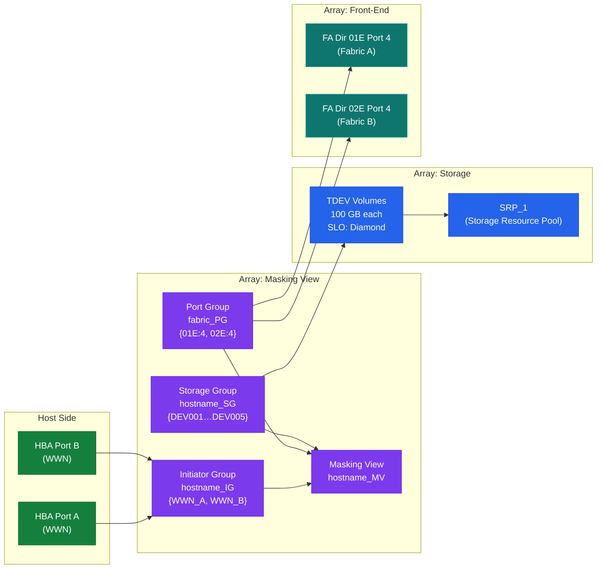
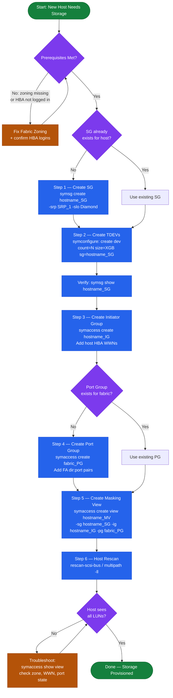

---
tags:
  - dell
  - operations
---
# PowerMax — Procedures


<div class="kb-summary">
Procedures reference covering Change Readiness, Maintenance Window, Post-Change Validation, Masking Views, Provisioning.

*Applies to: PowerMax 2500 / 8500*
</div>


## Before you begin

- **Access:** Storage admin credentials (cluster admin or equivalent)
- **Timing:** safe to run during business hours unless a step is marked ⚠ (causes interruption)
- **Dependencies:** no active upgrades or migrations on the same infrastructure
- **Logging:** capture command output — paste into the change record on completion

---

## Change Readiness

Verify these items before performing any change on the PowerMax — array configuration changes, code upgrades, or DR tests.

- [ ] SRDF state confirmed: `symrdf list -sid XXXX` shows all pairs `Synchronized` or `Consistent` — do not proceed if any pair is in a degraded state without a plan to handle it
- [ ] Take a SnapVX snapshot of source devices before making masking or storage group changes: `symsnap -sid XXXX create -sg <sg-name> -name pre-change-$(date +%Y%m%d)`
- [ ] Confirm no active SRDF sessions are in the middle of a mode change or link recovery
- [ ] Verify host I/O path health: `powermt display dev=all` on connected hosts shows no dead paths
- [ ] Confirm no outstanding Unisphere alerts that could indicate a pre-existing fault
- [ ] Validate thin pool headroom — confirm the pool has at least 20% free before adding devices or expanding storage groups
- [ ] Confirm Solutions Enabler version matches the running PowerMaxOS version to avoid CLI compatibility issues
- [ ] Inform application owners of the change window and confirm I/O drain or application quiesce plan if needed

| Item | Status | Notes |
|---|---|---|
| SRDF pairs Synchronized / Consistent | | |
| SnapVX pre-change snapshot created | | |
| No active Unisphere alerts | | |
| Host path health verified (powermt / multipath) | | |
| Thin pool headroom ≥ 20% | | |

## Maintenance Window

Steps for planned maintenance on a PowerMax array — applies to firmware upgrades, director replacements, and SRDF maintenance.

1. Notify application owners and confirm the maintenance window; record the start and end time
2. Take a full SnapVX snapshot of all production storage groups: `symsnap -sid XXXX create -sg <sg-name> -name maint-pre-$(date +%Y%m%d)`
3. If the maintenance involves SRDF, confirm the current SRDF state with `symrdf list -sid XXXX` and suspend replication if directed by the change procedure: `symrdf -sid XXXX -rdfg <group> suspend`
4. Quiesce or drain host I/O if the change requires a storage group or masking view modification — coordinate with the application team for a clean I/O halt
5. Perform the change per the approved runbook (firmware upgrade, configuration change, or hardware swap)
6. After the change, run `symcfg -sid XXXX show` to confirm all directors and ports returned to a healthy state
7. If SRDF was suspended, resume and monitor resync: `symrdf -sid XXXX -rdfg <group> resume` then `symrdf list -sid XXXX` until all pairs return to `Synchronized` or `Consistent`
8. Validate host I/O has resumed and confirm application health with application owners before closing the window

## Post-Change Validation

Run these checks after any change to the PowerMax to confirm the array is healthy and hosts are unaffected.

- [ ] `symcfg -sid XXXX show` — all directors and ports in healthy state, no new faults introduced
- [ ] `symrdf list -sid XXXX` — all SRDF pairs back to `Synchronized` (SRDF/S) or `Consistent` (SRDF/A); resync time noted if SRDF was suspended
- [ ] `sympd list -sid XXXX -failed` — no failed drives; confirm no drive fault was introduced during the change
- [ ] Host multipath validation: `powermt display dev=all` on each affected host shows all paths alive with the expected path count
- [ ] Unisphere Dashboard shows no new alerts introduced by the change
- [ ] CloudIQ shows no new critical findings post-change
- [ ] Application owners confirm I/O has resumed and application is healthy
- [ ] SnapVX pre-change snapshot retained until the post-change validation period has passed (minimum 24 hours)

## Masking Views

A Masking View on PowerMax connects three components — a Storage Group (volumes), a Port Group (FA ports), and an Initiator Group (host HBAs) — to grant a host access to storage. All three must exist before the Masking View can be created.



### List and Inspect


```bash
# List all masking views
symaccess list -sid <sid> view

# Show a specific masking view
symaccess show view <view_name> -sid <sid>

# Show which masking views a host's initiators are in
symaccess show -inits <wwn> -sid <sid>

# Show all masking views for a storage group
symaccess list -sid <sid> view -sg <sg_name>
```

### Initiator Groups


```bash
# List all initiator groups
symaccess list -sid <sid> -type initiator

# Show initiators in a group
symaccess show <ig_name> -sid <sid> -type initiator

# Create an initiator group
symaccess create -sid <sid> -name <ig_name> -type initiator

# Add host HBA WWN to initiator group
symaccess -sid <sid> -name <ig_name> -type initiator add -wwn <wwn>

# Remove initiator
symaccess -sid <sid> -name <ig_name> -type initiator remove -wwn <wwn>

# Create a cascaded (parent) initiator group
symaccess create -sid <sid> -name <parent_ig> -type initiator
symaccess -sid <sid> -name <parent_ig> -type initiator add -ig <child_ig>
```

### Port Groups


```bash
# List all port groups
symaccess list -sid <sid> -type port

# Show ports in a group
symaccess show <pg_name> -sid <sid> -type port

# Create a port group
symaccess create -sid <sid> -name <pg_name> -type port

# Add FA port to port group
symaccess -sid <sid> -name <pg_name> -type port add -dirport <dir_id>:<port_id>

# Remove port
symaccess -sid <sid> -name <pg_name> -type port remove -dirport <dir_id>:<port_id>
```

### Creating a Masking View


```bash
# Prerequisites: SG, IG, and PG must all exist
# Create the masking view linking all three
symaccess create view -sid <sid> -name <view_name> \
    -sg <sg_name> \
    -ig <ig_name> \
    -pg <pg_name>
```

### Deleting a Masking View


```bash
# Delete masking view (does not delete SG/IG/PG)
symaccess delete view <view_name> -sid <sid>

# Delete an initiator group (must not be in any masking view)
symaccess delete -sid <sid> -name <ig_name> -type initiator

# Delete a port group
symaccess delete -sid <sid> -name <pg_name> -type port
```

### Troubleshooting Host Access


```bash
# Verify host WWN is registered with the array
symcfg -sid <sid> list -dir all | grep <wwn>

# Check which LUNs a host can see
symaccess show view <view_name> -sid <sid> | grep -A 20 "Storage Group"

# Verify host-to-LUN assignment is correct
symdev show <devname> -sid <sid> | grep -A 5 "Host"
```

## Provisioning

End-to-end workflow for provisioning storage on Dell PowerMax: create volumes, add to a storage group, and create (or update) a masking view so the host can see the storage.



### Prerequisites


Before provisioning, confirm:
- Host HBA WWNs are logged into the fabric and registered with the array
- An appropriate Storage Resource Pool (SRP) and service level exist
- Zoning is in place (if Fibre Channel)

### Step 1 — Create or Identify the Storage Group


```bash
# Check if a suitable SG already exists
symsg list -sid <sid> | grep <hostname>

# Create a new storage group with SRP and service level
symsg create <hostname>_SG -sid <sid> -srp SRP_1 -slo Diamond
```

### Step 2 — Create Thin Devices


```bash
# Create 5 x 100 GB TDEV devices and add directly to the SG
symconfigure -sid <sid> -cmd \
    "create dev count=5, size=100GB, emulation=FBA, config=TDEV, sg=<hostname>_SG;" \
    commit -noprompt

# Verify devices were created and added
symsg show <hostname>_SG -sid <sid>
```

### Step 3 — Create the Initiator Group


```bash
# Create initiator group for the host
symaccess create -sid <sid> -name <hostname>_IG -type initiator

# Add host HBA WWNs (one per port)
symaccess -sid <sid> -name <hostname>_IG -type initiator add -wwn <wwn_port_a>
symaccess -sid <sid> -name <hostname>_IG -type initiator add -wwn <wwn_port_b>
```

### Step 4 — Create or Identify the Port Group


```bash
# List existing port groups
symaccess list -sid <sid> -type port

# Create a new port group (or reuse an existing one for the fabric)
symaccess create -sid <sid> -name <fabric>_PG -type port
symaccess -sid <sid> -name <fabric>_PG -type port add -dirport 01E:4
symaccess -sid <sid> -name <fabric>_PG -type port add -dirport 02E:4
```

### Step 5 — Create the Masking View


```bash
# Create masking view linking SG + IG + PG
symaccess create view -sid <sid> -name <hostname>_MV \
    -sg <hostname>_SG \
    -ig <hostname>_IG \
    -pg <fabric>_PG

# Verify masking view
symaccess show view <hostname>_MV -sid <sid>
```

### Step 6 — Host-Side Validation


```bash
# On Linux — rescan for new devices
rescan-scsi-bus.sh
echo "- - -" > /sys/class/scsi_host/host*/scan
multipath -ll

# On Windows — rescan via PowerShell
Update-HostStorageCache
Get-Disk | Where-Object OperationalStatus -eq "Offline"
```

### Adding More Devices to an Existing Host


```bash
# Create additional devices in existing SG
symconfigure -sid <sid> -cmd \
    "create dev count=2, size=500GB, emulation=FBA, config=TDEV, sg=<hostname>_SG;" \
    commit -noprompt

# No masking view change needed — new devices in existing SG are automatically visible
```

### Capacity Checks Before Provisioning


```bash
# SRP free capacity
symcfg -sid <sid> list -srp

# Thin pool subscription
symcfg -sid <sid> show -pool -thin -demand
# Warning: do not exceed 85% subscribed on the SRP
```

## Create a Storage Group and Add Devices

A Storage Group (SG) is the logical container that groups volumes under a common service level and host access policy. Create the SG first, then add devices to it.

```bash
# Step 1 — Create the storage group with an SRP and service level
symsg -sid <sid> create <sg-name> -srp SRP_1 -slo Diamond

# Step 2 — Add an existing device to the storage group
symsg -sid <sid> -sg <sg-name> add dev <device-id>

# Step 3 — Verify the storage group contents
symsg -sid <sid> show <sg-name>
```

Verify the output shows the device listed under the storage group with the correct service level applied. If adding multiple devices, repeat the `add dev` command for each device ID or use a device range: `add dev <first-id>:<last-id>`.

## Create a Masking View

A Masking View grants host access by linking a Storage Group (volumes), a Port Group (FA ports), and an Initiator Group (host HBAs). All three components must exist before the Masking View can be created.

```bash
# Create the masking view linking SG, PG, and IG
symaccess -sid <sid> create view \
    -name <view-name> \
    -sg <sg-name> \
    -pg <port-group> \
    -ig <initiator-group>

# Verify the masking view was created
symaccess show view <view-name> -sid <sid>
```

After creating the masking view, rescan the host to confirm it sees the expected LUNs:

```bash
# Linux
rescan-scsi-bus.sh
multipath -ll

# VMware
esxcli storage core adapter rescan --all
```

Confirm the host sees the correct number of LUNs and paths before closing the change.

## Create a SnapVX Snapshot

SnapVX provides space-efficient point-in-time snapshots of a storage group. Snapshots can be linked to a target storage group for read/write access without affecting the source.

```bash
# Step 1 — Create a SnapVX snapshot of a storage group
symsnap -sid <sid> -sg <sg-name> create -name <snap-name>

# Step 2 — Link the snapshot to a target storage group (for access/testing)
symsnap -sid <sid> -sg <sg-name> link \
    -name <snap-name> \
    -lnsg <target-sg>

# Verify the snapshot exists
symsnap list -sid <sid> -sg <sg-name>

# Verify the link is established
symsnap list -sid <sid> -sg <sg-name> -linked
```

The target SG must already exist. Linked snapshots can be used for data validation, test/dev access, or backup offload. Unlink when no longer needed: `symsnap -sid <sid> -sg <sg-name> unlink -name <snap-name> -lnsg <target-sg>`.

## Perform SRDF Failover and Failback

SRDF failover moves production access from the source (R1) site to the target (R2) site. Use for DR testing or an actual site failure. Always confirm SRDF state before and after each step.

```bash
# Confirm SRDF pair state before failover
symrdf query -sid <sid> -rdfg <group>
# Expected: Synchronized (SRDF/S) or Consistent (SRDF/A)

# Step 1 — Perform failover (R2 devices become read/write)
symrdf -sid <sid> -rdfg <group> failover

# Verify R2 is now active
symrdf query -sid <sid> -rdfg <group>
# Expected: Partitioned or Failed Over — R2 devices active

# Step 2 — When ready to return to production, perform failback
symrdf -sid <sid> -rdfg <group> failback

# Verify the pair has returned to synchronized state
symrdf query -sid <sid> -rdfg <group>
# Expected: Synchronized or Consistent
```

For SRDF/A (asynchronous), allow time after failback for the delta to resync before confirming the pair as fully consistent. Monitor resync progress with `symrdf list -sid <sid> -rdfg <group>`.

---

## Verify

- Confirm the operation completed without errors in the log or management UI
- Verify the expected state change is visible (service running, object created, config applied)
- Document the outcome in the change record

---

## See also

- [Powermax — Health Checks](health-checks/)
- [Powermax — CLI Reference](cli-reference/)
- [Powermax — Common Issues](../troubleshooting/common-issues/)
