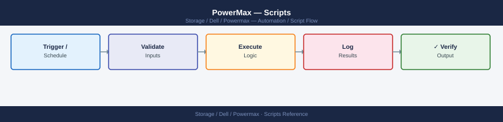

---
tags:
  - dell
  - operations
---
# PowerMax — Scripts


<div class="kb-summary">
Scripts reference covering SRDF State Monitor, Array Health Check, SRDF Planned Failover, Ansible PowerMax Health Playbook, Windows: SRDF Health Check via Unisphere REST API (PowerShell) and 5 more sections.

*Applies to: PowerMax 2500 / 8500*
</div>



```d2
direction: right

hub: "PowerMax\nOperations" {shape: hexagon}
srdf_state_monitor: "SRDF State Monitor" {shape: rectangle}
array_health_check: "Array Health Check" {shape: rectangle}
srdf_planned_failover: "SRDF Planned Failover" {shape: rectangle}
ansible_powermax_health_playbook: "Ansible PowerMax Health Playbook" {shape: rectangle}
windows_srdf_health_check_via_unisph: "Windows: SRDF Health Check via Unisphere REST API (PowerShel" {shape: rectangle}
windows_srdf_state_check_via_plink_c: "Windows: SRDF State Check via Plink (CMD)" {shape: rectangle}

hub -> srdf_state_monitor
hub -> array_health_check
hub -> srdf_planned_failover
hub -> ansible_powermax_health_playbook
hub -> windows_srdf_health_check_via_unisph
hub -> windows_srdf_state_check_via_plink_c
```

## Before you begin

- **Access:** Storage admin credentials (cluster admin or equivalent)
- **Timing:** safe to run during business hours unless a step is marked ⚠ (causes interruption)
- **Dependencies:** no active upgrades or migrations on the same infrastructure
- **Logging:** capture command output — paste into the change record on completion

---

## SRDF State Monitor

Runs `symrdf list` against a PowerMax SID and parses SRDF pair states. Emits a Nagios-compatible result and exits non-zero if any pair is in a degraded state (Split, Failed Over, or Transmit Idle).

```perl
#!/usr/bin/env perl
# powermax_srdf_monitor.pl — SRDF pair state monitor for Dell PowerMax
# Usage: SID=000123456789 SYMCLI_PATH=/usr/symcli/bin ./powermax_srdf_monitor.pl

use strict;
use warnings;

my $sid          = $ENV{SID}          or die "ERROR: SID not set\n";
my $symcli_path  = $ENV{SYMCLI_PATH}  || '/usr/symcli/bin';
my $symrdf       = "$symcli_path/symrdf";

# States considered degraded
my %degraded_states = map { $_ => 1 } qw(
    Split
    Failed_Over
    FailedOver
    Transmit_Idle
    TransmitIdle
    Suspended
    Mixed
    Partitioned
);

# Run symrdf list
my $output = qx{"$symrdf" list -sid "$sid" 2>&1};
if ($? != 0) {
    print "UNKNOWN: symrdf list failed for SID $sid\n$output\n";
    exit 3;
}

my @pairs;
my $worst = 0;   # 0=OK 1=WARN 2=CRIT

for my $line (split /\n/, $output) {
    next if $line =~ /^(Symmetrix|Device|---|\s*$)/;

    my @fields = split /\s+/, $line;
    next if @fields < 5;

    my $dev    = $fields[0];
    my $r1_sid = $fields[1] // $sid;
    my $r2_sid = $fields[2] // 'unknown';
    my $state  = $fields[5] // 'unknown';

    push @pairs, {
        dev    => $dev,
        r1_sid => $r1_sid,
        r2_sid => $r2_sid,
        state  => $state,
    };
}

if (!@pairs) {
    print "UNKNOWN: No SRDF pairs parsed for SID $sid\n";
    exit 3;
}

printf "%-15s  %-14s  %-14s  %-20s  %s\n",
    'DEV', 'R1-SID', 'R2-SID', 'STATE', 'STATUS';
printf "%s\n", '-' x 75;

for my $p (@pairs) {
    my $status = 'OK';
    if ($degraded_states{ $p->{state} }) {
        $status  = 'CRITICAL';
        $worst   = 2 if $worst < 2;
    } elsif ($p->{state} =~ /^(R1_Updated|R1Updated|Syncing)$/) {
        $status  = 'WARNING';
        $worst   = 1 if $worst < 1;
    }
    printf "%-15s  %-14s  %-14s  %-20s  %s\n",
        $p->{dev}, $p->{r1_sid}, $p->{r2_sid}, $p->{state}, $status;
}

print "\n";
if ($worst == 2) {
    print "CRITICAL: One or more SRDF pairs are in a degraded state.\n";
    exit 2;
} elsif ($worst == 1) {
    print "WARNING: One or more SRDF pairs require attention.\n";
    exit 1;
} else {
    print "OK: All SRDF pairs are Synchronized or Consistent.\n";
    exit 0;
}
```

**Usage**: `SID=000123456789 SYMCLI_PATH=/usr/symcli/bin perl powermax_srdf_monitor.pl`

---

## Array Health Check

Runs a series of SYMCLI commands against a PowerMax SID and prints a consolidated health report covering overall array state, failed disks, storage groups, and a short I/O statistics burst.

```bash
#!/bin/bash
# powermax_health_check.sh — Array health check for Dell PowerMax via SYMCLI
# Usage: SID=000123456789 SYMCLI_PATH=/usr/symcli/bin ./powermax_health_check.sh

set -euo pipefail

SID="${SID:-}"
SYMCLI_PATH="${SYMCLI_PATH:-/usr/symcli/bin}"

if [[ -z "$SID" ]]; then
  echo "ERROR: SID is not set." >&2
  exit 1
fi

SYMCFG="$SYMCLI_PATH/symcfg"
SYMPD="$SYMCLI_PATH/sympd"
SYMSG="$SYMCLI_PATH/symsg"
SYMSTAT="$SYMCLI_PATH/symstat"

section() {
  echo ""
  echo "========================================"
  echo "  $1"
  echo "========================================"
}

echo ""
echo "########################################"
echo "  PowerMax Health Check"
echo "  SID  : $SID"
echo "  Date : $(date '+%Y-%m-%d %H:%M:%S')"
echo "########################################"

section "ARRAY OVERVIEW"
"$SYMCFG" -sid "$SID" show

section "FAILED PHYSICAL DRIVES"
FAILED_PD=$("$SYMPD" list -sid "$SID" -failed 2>&1 || true)
if echo "$FAILED_PD" | grep -qi "no.*device\|no.*failed\|empty"; then
  echo "  No failed drives detected."
else
  echo "$FAILED_PD"
fi

section "STORAGE GROUPS"
"$SYMSG" list -sid "$SID"

section "QUICK I/O STATISTICS (5s interval, 3 samples, R2 side)"
"$SYMSTAT" -sid "$SID" -type r2 -i 5 -c 3 || true

echo ""
echo "========================================"
echo "  Health check complete — $(date '+%Y-%m-%d %H:%M:%S')"
echo "========================================"
```

**Usage**: `SID=000123456789 SYMCLI_PATH=/usr/symcli/bin ./powermax_health_check.sh`

---

## SRDF Planned Failover

Orchestrates a planned SRDF DR failover: suspends the consistency group, verifies the suspended state, splits the pair, activates the R2 side, and prints a summary. Each destructive step requires interactive confirmation.

```bash
#!/bin/bash
# powermax_srdf_failover.sh — Planned SRDF failover for Dell PowerMax
# Usage: SID=000123456789 RDF_GROUP=1 CG_NAME=prod-cg ./powermax_srdf_failover.sh
# WARNING: This script performs a DISRUPTIVE failover. Use only during DR tests or actual DR events.

set -euo pipefail

SID="${SID:-}"
RDF_GROUP="${RDF_GROUP:-}"
CG_NAME="${CG_NAME:-}"
SYMCLI_PATH="${SYMCLI_PATH:-/usr/symcli/bin}"
SYMRDF="$SYMCLI_PATH/symrdf"

if [[ -z "$SID" || -z "$RDF_GROUP" || -z "$CG_NAME" ]]; then
  echo "ERROR: SID, RDF_GROUP, and CG_NAME must all be set." >&2
  exit 1
fi

confirm() {
  local msg="$1"
  echo ""
  echo ">>> CONFIRM: $msg"
  read -rp "    Type YES to proceed: " answer
  if [[ "$answer" != "YES" ]]; then
    echo "    Aborted by user."
    exit 1
  fi
}

check_state() {
  local expected="$1"
  echo "  Checking SRDF state (expecting: $expected)..."
  local state
  state=$("$SYMRDF" -sid "$SID" -rdfg "$RDF_GROUP" -cg "$CG_NAME" query \
    | grep -iE "R1 State|R2 State|State" | head -5 || true)
  echo "$state"
  if ! echo "$state" | grep -qi "$expected"; then
    echo "ERROR: Expected state '$expected' not confirmed. Aborting."
    exit 1
  fi
}

echo ""
echo "########################################"
echo "  PowerMax SRDF Planned Failover"
echo "  SID       : $SID"
echo "  RDF Group : $RDF_GROUP"
echo "  CG Name   : $CG_NAME"
echo "  $(date '+%Y-%m-%d %H:%M:%S')"
echo "########################################"

confirm "STEP 1 — Suspend consistency group '${CG_NAME}' (quiesce I/O)."
echo "  Suspending consistency group..."
"$SYMRDF" -sid "$SID" -rdfg "$RDF_GROUP" -cg "$CG_NAME" suspend -force
check_state "Suspended"
echo "  Consistency group suspended successfully."

confirm "STEP 2 — Split SRDF pair for consistency group '${CG_NAME}'."
echo "  Splitting SRDF pair..."
"$SYMRDF" -sid "$SID" -rdfg "$RDF_GROUP" -cg "$CG_NAME" split -force
check_state "Split"
echo "  SRDF pair split successfully."

confirm "STEP 3 — Activate R2 devices (failover). Hosts at R2 site will gain write access."
echo "  Activating R2 devices via failover..."
"$SYMRDF" -sid "$SID" -rdfg "$RDF_GROUP" -cg "$CG_NAME" failover -force
echo "  Failover command issued."

echo ""
echo "========================================"
echo "  FAILOVER SUMMARY"
echo "========================================"
"$SYMRDF" -sid "$SID" -rdfg "$RDF_GROUP" -cg "$CG_NAME" query || true
echo ""
echo "  Planned failover complete — $(date '+%Y-%m-%d %H:%M:%S')"
echo "  Next steps:"
echo "    1. Confirm R2 hosts can see and mount the failed-over devices."
echo "    2. Validate application recovery at the DR site."
echo "    3. When ready to fail back, use: symrdf ... restore"
echo "========================================"
```

**Usage**: `SID=000123456789 RDF_GROUP=1 CG_NAME=prod-cg ./powermax_srdf_failover.sh`

---

## Ansible PowerMax Health Playbook

Playbook targeting an Unisphere API host. Uses the `uri` module to authenticate to the Unisphere REST API, retrieve the array list and active alerts, and print each result.

```yaml
---
# powermax_health.yml — Ansible health check playbook for Dell PowerMax via Unisphere REST API
# Usage: ansible-playbook -i inventory powermax_health.yml

- name: Dell PowerMax Health Check via Unisphere REST API
  hosts: powermax
  gather_facts: false
  vars:
    unisphere_host: unisphere.example.com
    unisphere_user: smc
    unisphere_pass: "{{ vault_unisphere_pass }}"
    sid: "000123456789"
    api_base: "https://{{ unisphere_host }}:8443/univmax/restapi"
    api_version: "100"

  tasks:
    - name: List Symmetrix arrays
      ansible.builtin.uri:
        url: "{{ api_base }}/{{ api_version }}/system/symmetrix"
        method: GET
        user: "{{ unisphere_user }}"
        password: "{{ unisphere_pass }}"
        force_basic_auth: true
        validate_certs: false
        return_content: true
        headers:
          Content-Type: "application/json"
      register: array_list_resp

    - name: Show array list
      ansible.builtin.debug:
        msg: "Arrays visible: {{ array_list_resp.json.symmetrixId | default([]) }}"

    - name: Get array details for SID
      ansible.builtin.uri:
        url: "{{ api_base }}/{{ api_version }}/system/symmetrix/{{ sid }}"
        method: GET
        user: "{{ unisphere_user }}"
        password: "{{ unisphere_pass }}"
        force_basic_auth: true
        validate_certs: false
        return_content: true
        headers:
          Content-Type: "application/json"
      register: array_detail_resp

    - name: Show array health state
      ansible.builtin.debug:
        msg:
          - "SID         : {{ array_detail_resp.json.symmetrixId | default('unknown') }}"
          - "Model       : {{ array_detail_resp.json.model | default('unknown') }}"
          - "Microcode   : {{ array_detail_resp.json.microcode | default('unknown') }}"
          - "All Flash   : {{ array_detail_resp.json.all_flash | default('unknown') }}"

    - name: Get active alerts for array
      ansible.builtin.uri:
        url: "{{ api_base }}/{{ api_version }}/system/alert_summary"
        method: GET
        user: "{{ unisphere_user }}"
        password: "{{ unisphere_pass }}"
        force_basic_auth: true
        validate_certs: false
        return_content: true
        headers:
          Content-Type: "application/json"
      register: alerts_resp

    - name: Show active alerts summary
      ansible.builtin.debug:
        msg: "{{ alerts_resp.json | default({}) }}"

    - name: Fail if critical alerts found
      ansible.builtin.fail:
        msg: "Critical alerts present on array {{ sid }}. Investigate immediately."
      when: >
        alerts_resp.json is defined and
        alerts_resp.json.serverAlertSummary is defined and
        (alerts_resp.json.serverAlertSummary.numCriticalAlerts | default(0) | int) > 0
```

---

## Windows: SRDF Health Check via Unisphere REST API (PowerShell)

```powershell
# powermax_srdf_health.ps1 — PowerMax array health check via Unisphere REST API (Windows PowerShell)
# Requires: PowerShell 5.1+

$UnisphereHost = "192.168.1.100"   # Change to your Unisphere server IP or hostname
$UnisphereUser = "smc"             # Change to your Unisphere username
$UnispherePass = "yourpassword"    # Change to your Unisphere password
$SID           = "000123456789"    # Change to your PowerMax Symmetrix ID (12 digits)

$ApiBase    = "https://${UnisphereHost}:8443/univmax/restapi/100"

add-type @"
    using System.Net;
    using System.Security.Cryptography.X509Certificates;
    public class TrustAllCertsPolicy : ICertificatePolicy {
        public bool CheckValidationResult(ServicePoint srvPoint, X509Certificate certificate,
            WebRequest request, int certificateProblem) { return true; }
    }
"@
[System.Net.ServicePointManager]::CertificatePolicy = New-Object TrustAllCertsPolicy
[Net.ServicePointManager]::SecurityProtocol = [Net.SecurityProtocolType]::Tls12

$Pair    = "${UnisphereUser}:${UnispherePass}"
$Bytes   = [System.Text.Encoding]::ASCII.GetBytes($Pair)
$Base64  = [Convert]::ToBase64String($Bytes)
$Headers = @{ Authorization = "Basic $Base64"; "Content-Type" = "application/json" }

Write-Host "########################################" -ForegroundColor Cyan
Write-Host "  PowerMax Health Check via Unisphere"   -ForegroundColor Cyan
Write-Host "  Host : $UnisphereHost"                 -ForegroundColor Cyan
Write-Host "  SID  : $SID"                           -ForegroundColor Cyan
Write-Host "########################################" -ForegroundColor Cyan

Write-Host "`n[1] Fetching array details for SID $SID ..."
try {
    $ArrayResp = Invoke-RestMethod -Uri "$ApiBase/system/symmetrix/$SID" `
                                   -Method GET -Headers $Headers
    Write-Host "  Array Model    : $($ArrayResp.model)"
    Write-Host "  Microcode      : $($ArrayResp.microcode)"
    Write-Host "  All Flash      : $($ArrayResp.all_flash)"
} catch {
    Write-Host "  ERROR fetching array details: $_" -ForegroundColor Red
}

Write-Host "`n[2] Fetching alert summary ..."
try {
    $AlertResp = Invoke-RestMethod -Uri "$ApiBase/system/alert_summary" `
                                   -Method GET -Headers $Headers
    $Summary = $AlertResp.serverAlertSummary
    Write-Host "  Critical Alerts  : $($Summary.numCriticalAlerts)"
    Write-Host "  Warning Alerts   : $($Summary.numWarningAlerts)"
    if ($Summary.numCriticalAlerts -gt 0) {
        Write-Host "`n  STATUS: CRITICAL" -ForegroundColor Red
    } elseif ($Summary.numWarningAlerts -gt 0) {
        Write-Host "`n  STATUS: WARNING" -ForegroundColor Yellow
    } else {
        Write-Host "`n  STATUS: OK" -ForegroundColor Green
    }
} catch {
    Write-Host "  ERROR fetching alert summary: $_" -ForegroundColor Red
}

Write-Host ""
Write-Host "========================================"
Write-Host "  Health check complete."
Write-Host "========================================"
```

---

## Windows: SRDF State Check via Plink (CMD)

```batch
@echo off
REM powermax_srdf_check.bat — Check SRDF pair states on a remote SYMCLI host via SSH
REM Uses plink.exe (PuTTY) to run symrdf list on the remote host.

set SYMCLI_HOST=192.168.1.50
set SSH_USER=admin
set SID=000123456789
set PLINK=plink.exe

echo.
echo ########################################
echo   PowerMax SRDF State Check
echo   Host : %SYMCLI_HOST%
echo   SID  : %SID%
echo ########################################
echo.

%PLINK% -ssh -l %SSH_USER% -batch %SYMCLI_HOST% "symrdf list -sid %SID%"
if %ERRORLEVEL% neq 0 (
    echo.
    echo ERROR: Could not connect or symrdf failed.
    exit /b 1
)

echo.
echo Done.
```

---

## Daily Check Script (Bash)

```bash
#!/bin/bash
# powermax_daily_check.sh — Run all daily checks in one pass
# Usage: SID=000123456789 SYMCLI_PATH=/usr/symcli/bin ./powermax_daily_check.sh

set -euo pipefail
SID="${SID:-}"; SYMCLI_PATH="${SYMCLI_PATH:-/usr/symcli/bin}"
[[ -z "$SID" ]] && echo "ERROR: SID not set" && exit 1

PASS=0; FAIL=0; WARN=0

check() {
  local label="$1"; shift
  local output; output=$("$@" 2>&1) && { echo "[PASS] $label"; PASS=$((PASS+1)); } || { echo "[FAIL] $label"; echo "$output"; FAIL=$((FAIL+1)); }
}

echo "=== PowerMax Daily Check: SID $SID — $(date) ==="
check "Array config" "$SYMCLI_PATH/symcfg" -sid "$SID" show
check "Failed drives" bash -c "$SYMCLI_PATH/sympd list -sid $SID -failed | grep -qi 'no device' && true || $SYMCLI_PATH/sympd list -sid $SID -failed"
check "SRDF pair states" "$SYMCLI_PATH/symrdf" list -sid "$SID"
check "Storage groups" "$SYMCLI_PATH/symsg" list -sid "$SID"
check "Active alerts" "$SYMCLI_PATH/symcfg" -sid "$SID" list -v

echo ""
echo "Daily check complete: $PASS passed, $WARN warned, $FAIL failed"
[[ $FAIL -gt 0 ]] && exit 2 || exit 0
```

---

## Incident Triage Script (Bash)

```bash
#!/bin/bash
# powermax_triage.sh — Incident triage data collector
# Usage: SID=000123456789 ./powermax_triage.sh

SID="${SID:-}"; SYMCLI_PATH="${SYMCLI_PATH:-/usr/symcli/bin}"
[[ -z "$SID" ]] && echo "ERROR: SID not set" && exit 1

OUTFILE="powermax_triage_${SID}_$(date +%Y%m%d_%H%M%S).txt"
exec > >(tee "$OUTFILE") 2>&1

header() { echo ""; echo "### $1 ###"; echo "$(date '+%Y-%m-%d %H:%M:%S')"; echo ""; }

echo "PowerMax Incident Triage — SID: $SID — $(date)"
header "Array Config"; "$SYMCLI_PATH/symcfg" -sid "$SID" show
header "Active Alerts"; "$SYMCLI_PATH/symcfg" -sid "$SID" list -v 2>/dev/null || true
header "Failed Physical Drives"; "$SYMCLI_PATH/sympd" list -sid "$SID" -failed || true
header "SRDF Pair States"; "$SYMCLI_PATH/symrdf" list -sid "$SID" || true
header "Storage Groups"; "$SYMCLI_PATH/symsg" list -sid "$SID" || true

echo ""; echo "Triage output saved to: $OUTFILE"
```

---

## Change Pre-Check Script (Bash)

```bash
#!/bin/bash
# powermax_precheck.sh — Pre-change validation
# Usage: SID=000123456789 ./powermax_precheck.sh

set -euo pipefail
SID="${SID:-}"; SYMCLI_PATH="${SYMCLI_PATH:-/usr/symcli/bin}"
[[ -z "$SID" ]] && echo "ERROR: SID not set" && exit 1

FAIL=0
check() { local label="$1"; shift; "$@" 2>&1 && echo "[OK] $label" || { echo "[FAIL] $label"; FAIL=$((FAIL+1)); }; }

echo "=== PowerMax Pre-Change Check: SID $SID — $(date) ==="
check "Array visible" "$SYMCLI_PATH/symcfg" -sid "$SID" show -noflags
check "No failed drives" bash -c "$SYMCLI_PATH/sympd list -sid $SID -failed | grep -qi 'no device'"
check "SRDF states OK" bash -c "! $SYMCLI_PATH/symrdf list -sid $SID | grep -qiE 'Split|Failed|Suspended|Partitioned'"
check "No critical alerts" bash -c "! $SYMCLI_PATH/symcfg -sid $SID list -v 2>&1 | grep -qi 'critical'"

echo ""; [[ $FAIL -gt 0 ]] && echo "PRE-CHECK FAILED: $FAIL issue(s) found — do NOT proceed." && exit 2
echo "PRE-CHECK PASSED — safe to proceed with maintenance."
```

---

## Post-Change Validation Script (Bash)

```bash
#!/bin/bash
# powermax_postcheck.sh — Post-change validation
# Usage: SID=000123456789 ./powermax_postcheck.sh

set -euo pipefail
SID="${SID:-}"; SYMCLI_PATH="${SYMCLI_PATH:-/usr/symcli/bin}"
[[ -z "$SID" ]] && echo "ERROR: SID not set" && exit 1

FAIL=0
check() { local label="$1"; shift; "$@" 2>&1 && echo "[OK] $label" || { echo "[FAIL] $label"; FAIL=$((FAIL+1)); }; }

echo "=== PowerMax Post-Change Check: SID $SID — $(date) ==="
check "Array visible and healthy" "$SYMCLI_PATH/symcfg" -sid "$SID" show -noflags
check "No failed drives" bash -c "$SYMCLI_PATH/sympd list -sid $SID -failed | grep -qi 'no device'"
check "All SRDF pairs Synchronized or Consistent" bash -c "! $SYMCLI_PATH/symrdf list -sid $SID | grep -qiE 'Split|Failed|Transmit|Suspended|Partitioned|Mixed'"
check "No new critical alerts" bash -c "! $SYMCLI_PATH/symcfg -sid $SID list -v 2>&1 | grep -qi 'critical'"
check "Storage group listing OK" "$SYMCLI_PATH/symsg" list -sid "$SID"

echo ""; [[ $FAIL -gt 0 ]] && echo "POST-CHECK FAILED: $FAIL issue(s) — investigate before closing change." && exit 2
echo "POST-CHECK PASSED — change completed successfully."
```

---

## Verify

- Confirm the operation completed without errors in the log or management UI
- Verify the expected state change is visible (service running, object created, config applied)
- Document the outcome in the change record

---

## See also

- [Powermax — Procedures](procedures/)
- [Powermax — CLI Reference](cli-reference/)
- [Powermax — Health Checks](health-checks/)
