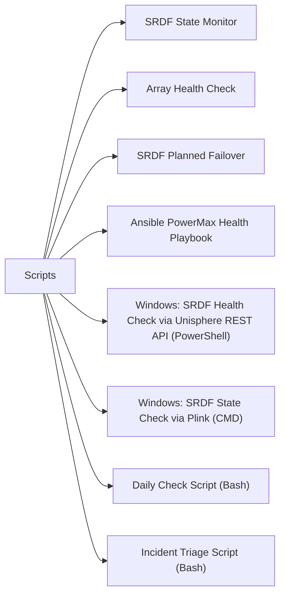

# Scripts

> Part of the [Dell PowerMax](../) reference.

---



## SRDF State Monitor

Runs `symrdf list` against a PowerMax SID and parses SRDF pair states. Emits a Nagios-compatible result and exits non-zero if any pair is in a degraded state (Split, Failed Over, or Transmit Idle).

~~~perl
#!/usr/bin/env perl
# powermax_srdf_monitor.pl — SRDF pair state monitor for Dell PowerMax
# Usage: SID=000123456789 SYMCLI_PATH=/usr/symcli/bin ./powermax_srdf_monitor.pl

use strict;
use warnings;

my $sid          = $ENV{SID}          or die "ERROR: SID not set\n";
my $symcli_path  = $ENV{SYMCLI_PATH}  || '/usr/symcli/bin';
my $symrdf       = "$symcli_path/symrdf";

# States considered degraded
my %degraded_states = map { $_ => 1 } qw(
    Split
    Failed_Over
    FailedOver
    Transmit_Idle
    TransmitIdle
    Suspended
    Mixed
    Partitioned
);

# Run symrdf list
my $output = qx{"$symrdf" list -sid "$sid" 2>&1};
if ($? != 0) {
    print "UNKNOWN: symrdf list failed for SID $sid\n$output\n";
    exit 3;
}

my @pairs;
my $worst = 0;   # 0=OK 1=WARN 2=CRIT

# Parse tabular output — columns vary; we look for device and state fields
# Typical format: DEV  R1-SID  R2-SID  RDFG  MODE  STATE  R2-STATE
for my $line (split /\n/, $output) {
    next if $line =~ /^(Symmetrix|Device|---|\s*$)/;

    my @fields = split /\s+/, $line;
    next if @fields < 5;

    my $dev    = $fields[0];
    my $r1_sid = $fields[1] // $sid;
    my $r2_sid = $fields[2] // 'unknown';
    my $state  = $fields[5] // 'unknown';

    push @pairs, {
        dev    => $dev,
        r1_sid => $r1_sid,
        r2_sid => $r2_sid,
        state  => $state,
    };
}

if (!@pairs) {
    print "UNKNOWN: No SRDF pairs parsed for SID $sid\n";
    exit 3;
}

# Print table header
printf "%-15s  %-14s  %-14s  %-20s  %s\n",
    'DEV', 'R1-SID', 'R2-SID', 'STATE', 'STATUS';
printf "%s\n", '-' x 75;

for my $p (@pairs) {
    my $status = 'OK';
    if ($degraded_states{ $p->{state} }) {
        $status  = 'CRITICAL';
        $worst   = 2 if $worst < 2;
    } elsif ($p->{state} =~ /^(R1_Updated|R1Updated|Syncing)$/) {
        $status  = 'WARNING';
        $worst   = 1 if $worst < 1;
    }
    printf "%-15s  %-14s  %-14s  %-20s  %s\n",
        $p->{dev}, $p->{r1_sid}, $p->{r2_sid}, $p->{state}, $status;
}

print "\n";
if ($worst == 2) {
    print "CRITICAL: One or more SRDF pairs are in a degraded state.\n";
    exit 2;
} elsif ($worst == 1) {
    print "WARNING: One or more SRDF pairs require attention.\n";
    exit 1;
} else {
    print "OK: All SRDF pairs are Synchronized or Consistent.\n";
    exit 0;
}
~~~

#### How to run this script — step by step

**Before you start — what you need**
- A Linux or macOS system with Perl installed (Perl is pre-installed on most Linux distros and macOS)
- Dell SYMCLI tools installed on the same system (the `symrdf` command must be accessible)
- Network access to the PowerMax array from the machine running the script
- The SID (Symmetrix ID) of your PowerMax array — a 12-digit number (e.g., `000123456789`)

**Step 1 — Save the file**

1. Open a text editor (on Windows use Notepad, on Linux/macOS use any editor)
2. Copy the entire code block above
3. Save it as `powermax_srdf_monitor.pl`

**Step 2 — Fill in your details**

Open the saved file and check these values — or set them as environment variables before running:

| What to change | Where to find it |
|---|---|
| `SID` (environment variable) | Your PowerMax array's 12-digit Symmetrix ID, shown in Unisphere or via `symcfg list` |
| `SYMCLI_PATH` (environment variable) | The directory where SYMCLI is installed, default `/usr/symcli/bin` |

**Step 3 — Open a terminal**

On Linux/macOS, open a terminal. On Windows, install Git for Windows (gitforwindows.org) and use Git Bash, or install WSL and use a Linux terminal. Perl is not available natively in Windows Command Prompt.

**Step 4 — Run it**

```
cd /path/to/script
SID=000123456789 SYMCLI_PATH=/usr/symcli/bin perl powermax_srdf_monitor.pl
```

**What you should see**

A table of SRDF device pairs with columns DEV, R1-SID, R2-SID, STATE, and STATUS. Each row is marked OK, WARNING, or CRITICAL based on the pair's replication state. The final line reports the overall result (OK / WARNING / CRITICAL) and the script exits with code 0, 1, or 2 accordingly.

---

## Array Health Check

Runs a series of SYMCLI commands against a PowerMax SID and prints a consolidated health report covering overall array state, failed disks, storage groups, and a short I/O statistics burst.

~~~bash
#!/bin/bash
# powermax_health_check.sh — Array health check for Dell PowerMax via SYMCLI
# Usage: SID=000123456789 SYMCLI_PATH=/usr/symcli/bin ./powermax_health_check.sh

set -euo pipefail

SID="${SID:-}"
SYMCLI_PATH="${SYMCLI_PATH:-/usr/symcli/bin}"

if [[ -z "$SID" ]]; then
  echo "ERROR: SID is not set." >&2
  exit 1
fi

SYMCFG="$SYMCLI_PATH/symcfg"
SYMPD="$SYMCLI_PATH/sympd"
SYMSG="$SYMCLI_PATH/symsg"
SYMSTAT="$SYMCLI_PATH/symstat"

section() {
  echo ""
  echo "========================================"
  echo "  $1"
  echo "========================================"
}

echo ""
echo "########################################"
echo "  PowerMax Health Check"
echo "  SID  : $SID"
echo "  Date : $(date '+%Y-%m-%d %H:%M:%S')"
echo "########################################"

section "ARRAY OVERVIEW"
"$SYMCFG" -sid "$SID" show

section "FAILED PHYSICAL DRIVES"
FAILED_PD=$("$SYMPD" list -sid "$SID" -failed 2>&1 || true)
if echo "$FAILED_PD" | grep -qi "no.*device\|no.*failed\|empty"; then
  echo "  No failed drives detected."
else
  echo "$FAILED_PD"
fi

section "STORAGE GROUPS"
"$SYMSG" list -sid "$SID"

section "QUICK I/O STATISTICS (5s interval, 3 samples, R2 side)"
"$SYMSTAT" -sid "$SID" -type r2 -i 5 -c 3 || true

echo ""
echo "========================================"
echo "  Health check complete — $(date '+%Y-%m-%d %H:%M:%S')"
echo "========================================"
~~~

#### How to run this script — step by step

**Before you start — what you need**
- A Linux or macOS system with Bash (version 4+)
- Dell SYMCLI tools installed (`symcfg`, `sympd`, `symsg`, `symstat` must be in the SYMCLI bin directory)
- Network/Fibre Channel connectivity to the PowerMax array
- The SID (12-digit Symmetrix ID) of the array you want to check

**Step 1 — Save the file**

1. Open a text editor
2. Copy the entire code block above
3. Save it as `powermax_health_check.sh`
4. Make it executable: run `chmod +x powermax_health_check.sh` in your terminal

**Step 2 — Fill in your details**

Set these environment variables before running, or edit the defaults at the top of the script:

| What to change | Where to find it |
|---|---|
| `SID` | Your PowerMax 12-digit array ID, visible in Unisphere or via `symcfg list` |
| `SYMCLI_PATH` | Full path to the SYMCLI bin directory, default is `/usr/symcli/bin` |

**Step 3 — Open a terminal**

On Linux/macOS, open a terminal. On Windows, use Git Bash or WSL — standard Windows Command Prompt does not support Bash scripts.

**Step 4 — Run it**

```
cd /path/to/script
SID=000123456789 SYMCLI_PATH=/usr/symcli/bin ./powermax_health_check.sh
```

**What you should see**

A multi-section health report printed to your terminal: array overview (model, microcode, cache), a list of any failed physical drives (or a "No failed drives" message), a table of storage groups, and a short burst of I/O statistics. The script exits 0 on success or 1 if SYMCLI commands fail.

---

## SRDF Planned Failover

Orchestrates a planned SRDF DR failover: suspends the consistency group, verifies the suspended state, splits the pair, activates the R2 side, and prints a summary. Each destructive step requires interactive confirmation.

~~~bash
#!/bin/bash
# powermax_srdf_failover.sh — Planned SRDF failover for Dell PowerMax
# Usage: SID=000123456789 RDF_GROUP=1 CG_NAME=prod-cg ./powermax_srdf_failover.sh
# WARNING: This script performs a DISRUPTIVE failover. Use only during DR tests or actual DR events.

set -euo pipefail

SID="${SID:-}"
RDF_GROUP="${RDF_GROUP:-}"
CG_NAME="${CG_NAME:-}"
SYMCLI_PATH="${SYMCLI_PATH:-/usr/symcli/bin}"
SYMRDF="$SYMCLI_PATH/symrdf"

if [[ -z "$SID" || -z "$RDF_GROUP" || -z "$CG_NAME" ]]; then
  echo "ERROR: SID, RDF_GROUP, and CG_NAME must all be set." >&2
  exit 1
fi

confirm() {
  local msg="$1"
  echo ""
  echo ">>> CONFIRM: $msg"
  read -rp "    Type YES to proceed: " answer
  if [[ "$answer" != "YES" ]]; then
    echo "    Aborted by user."
    exit 1
  fi
}

check_state() {
  local expected="$1"
  echo "  Checking SRDF state (expecting: $expected)..."
  local state
  state=$("$SYMRDF" -sid "$SID" -rdfg "$RDF_GROUP" -cg "$CG_NAME" query \
    | grep -iE "R1 State|R2 State|State" | head -5 || true)
  echo "$state"
  if ! echo "$state" | grep -qi "$expected"; then
    echo "ERROR: Expected state '$expected' not confirmed. Aborting."
    exit 1
  fi
}

echo ""
echo "########################################"
echo "  PowerMax SRDF Planned Failover"
echo "  SID       : $SID"
echo "  RDF Group : $RDF_GROUP"
echo "  CG Name   : $CG_NAME"
echo "  $(date '+%Y-%m-%d %H:%M:%S')"
echo "########################################"

# --- Step 1: Suspend consistency group ---
confirm "STEP 1 — Suspend consistency group '${CG_NAME}' (quiesce I/O)."
echo "  Suspending consistency group..."
"$SYMRDF" -sid "$SID" -rdfg "$RDF_GROUP" -cg "$CG_NAME" suspend -force
check_state "Suspended"
echo "  Consistency group suspended successfully."

# --- Step 2: Split SRDF pair ---
confirm "STEP 2 — Split SRDF pair for consistency group '${CG_NAME}'."
echo "  Splitting SRDF pair..."
"$SYMRDF" -sid "$SID" -rdfg "$RDF_GROUP" -cg "$CG_NAME" split -force
check_state "Split"
echo "  SRDF pair split successfully."

# --- Step 3: Activate R2 devices ---
confirm "STEP 3 — Activate R2 devices (failover). Hosts at R2 site will gain write access."
echo "  Activating R2 devices via failover..."
"$SYMRDF" -sid "$SID" -rdfg "$RDF_GROUP" -cg "$CG_NAME" failover -force
echo "  Failover command issued."

# --- Summary ---
echo ""
echo "========================================"
echo "  FAILOVER SUMMARY"
echo "========================================"
"$SYMRDF" -sid "$SID" -rdfg "$RDF_GROUP" -cg "$CG_NAME" query || true
echo ""
echo "  Planned failover complete — $(date '+%Y-%m-%d %H:%M:%S')"
echo "  Next steps:"
echo "    1. Confirm R2 hosts can see and mount the failed-over devices."
echo "    2. Validate application recovery at the DR site."
echo "    3. When ready to fail back, use: symrdf ... restore"
echo "========================================"
~~~

#### How to run this script — step by step

**Before you start — what you need**
- A Linux or macOS system with Bash and Dell SYMCLI installed
- The SID, RDF Group number, and Consistency Group name for your SRDF setup
- Authorisation to perform a DR failover — this is a disruptive, production-impacting action
- Confirmation from your team that this is a planned DR test or actual DR event

**Step 1 — Save the file**

1. Copy the code block above into a text editor
2. Save it as `powermax_srdf_failover.sh`
3. Make it executable: `chmod +x powermax_srdf_failover.sh`

**Step 2 — Fill in your details**

Set these as environment variables before running:

| What to change | Where to find it |
|---|---|
| `SID` | 12-digit Symmetrix ID of the R1 (source) array |
| `RDF_GROUP` | RDF group number, found via `symrdf list -sid <SID>` |
| `CG_NAME` | Consistency group name, found via `symrdf -cg list -sid <SID>` |
| `SYMCLI_PATH` | Path to SYMCLI bin directory |

**Step 3 — Open a terminal**

On Linux/macOS, open a terminal. On Windows, use Git Bash or WSL.

**Step 4 — Run it**

```
cd /path/to/script
SID=000123456789 RDF_GROUP=1 CG_NAME=prod-cg ./powermax_srdf_failover.sh
```

**What you should see**

The script pauses at each major step and asks you to type `YES` to confirm before proceeding. You will see confirmations for suspend, split, and failover. If any step does not reach the expected SRDF state, the script aborts automatically. At the end it prints a failover summary and next-step instructions.

---

## Ansible PowerMax Health Playbook

Playbook targeting an Unisphere API host. Uses the `uri` module to authenticate to the Unisphere REST API, retrieve the array list and active alerts, and print each result.

~~~yaml
---
# powermax_health.yml — Ansible health check playbook for Dell PowerMax via Unisphere REST API
# Inventory host: powermax (the Unisphere server)
# Required vars: unisphere_host, unisphere_user, unisphere_pass, sid
# Usage: ansible-playbook -i inventory powermax_health.yml

- name: Dell PowerMax Health Check via Unisphere REST API
  hosts: powermax
  gather_facts: false
  vars:
    unisphere_host: unisphere.example.com
    unisphere_user: smc
    unisphere_pass: "{{ vault_unisphere_pass }}"
    sid: "000123456789"
    api_base: "https://{{ unisphere_host }}:8443/univmax/restapi"
    api_version: "100"

  tasks:
    - name: List Symmetrix arrays
      ansible.builtin.uri:
        url: "{{ api_base }}/{{ api_version }}/system/symmetrix"
        method: GET
        user: "{{ unisphere_user }}"
        password: "{{ unisphere_pass }}"
        force_basic_auth: true
        validate_certs: false
        return_content: true
        headers:
          Content-Type: "application/json"
      register: array_list_resp

    - name: Show array list
      ansible.builtin.debug:
        msg: "Arrays visible: {{ array_list_resp.json.symmetrixId | default([]) }}"

    - name: Get array details for SID
      ansible.builtin.uri:
        url: "{{ api_base }}/{{ api_version }}/system/symmetrix/{{ sid }}"
        method: GET
        user: "{{ unisphere_user }}"
        password: "{{ unisphere_pass }}"
        force_basic_auth: true
        validate_certs: false
        return_content: true
        headers:
          Content-Type: "application/json"
      register: array_detail_resp

    - name: Show array health state
      ansible.builtin.debug:
        msg:
          - "SID         : {{ array_detail_resp.json.symmetrixId | default('unknown') }}"
          - "Model       : {{ array_detail_resp.json.model | default('unknown') }}"
          - "Microcode   : {{ array_detail_resp.json.microcode | default('unknown') }}"
          - "All Flash   : {{ array_detail_resp.json.all_flash | default('unknown') }}"

    - name: Get active alerts for array
      ansible.builtin.uri:
        url: "{{ api_base }}/{{ api_version }}/system/alert_summary"
        method: GET
        user: "{{ unisphere_user }}"
        password: "{{ unisphere_pass }}"
        force_basic_auth: true
        validate_certs: false
        return_content: true
        headers:
          Content-Type: "application/json"
      register: alerts_resp

    - name: Show active alerts summary
      ansible.builtin.debug:
        msg: "{{ alerts_resp.json | default({}) }}"

    - name: Fail if critical alerts found
      ansible.builtin.fail:
        msg: "Critical alerts present on array {{ sid }}. Investigate immediately."
      when: >
        alerts_resp.json is defined and
        alerts_resp.json.serverAlertSummary is defined and
        (alerts_resp.json.serverAlertSummary.numCriticalAlerts | default(0) | int) > 0
~~~

#### How to run this script — step by step

**Before you start — what you need**
- Ansible installed on your control machine (`pip install ansible` or via your package manager)
- Network access from your control machine to the Unisphere server on port 8443
- Unisphere for PowerMax credentials (username and password)
- The SID of your PowerMax array

**Step 1 — Save the file**

1. Copy the code block above into a text editor
2. Save it as `powermax_health.yml`

**Step 2 — Fill in your details**

Edit the `vars` section near the top of the file:

| What to change | Where to find it |
|---|---|
| `unisphere_host` | Hostname or IP of your Unisphere for PowerMax server |
| `unisphere_user` | Unisphere username (default is `smc`) |
| `vault_unisphere_pass` | Replace with your actual password in plain text for testing, or use Ansible Vault for security |
| `sid` | Your PowerMax 12-digit Symmetrix ID |

Also create a simple inventory file (`inventory`) with one line:
```
powermax ansible_host=your-unisphere-hostname ansible_connection=local
```

**Step 3 — Open a terminal**

On Linux/macOS, open a terminal. On Windows, use WSL or Git Bash.

**Step 4 — Run it**

```
cd /path/to/playbook
ansible-playbook -i inventory powermax_health.yml
```

**What you should see**

Ansible will print a task-by-task log. You will see the list of Symmetrix arrays visible to Unisphere, details about the specific SID (model, microcode, all-flash status), and the active alerts summary. If critical alerts exist, the playbook will fail and report them. Otherwise it completes with all tasks in OK or changed=0 state.

---

## Windows: SRDF Health Check via Unisphere REST API (PowerShell)

Connect to the Unisphere for PowerMax REST API from a Windows PC and print a formatted array health summary including model, microcode, and active alert counts — no SYMCLI install required.

~~~powershell
# powermax_srdf_health.ps1 — PowerMax array health check via Unisphere REST API (Windows PowerShell)
# Run: .\powermax_srdf_health.ps1
# Requires: PowerShell 5.1+ (built into Windows 10/11) — no extra install needed

$UnisphereHost = "192.168.1.100"   # Change to your Unisphere server IP or hostname
$UnisphereUser = "smc"             # Change to your Unisphere username
$UnispherePass = "yourpassword"    # Change to your Unisphere password
$SID           = "000123456789"    # Change to your PowerMax Symmetrix ID (12 digits)

$ApiBase    = "https://${UnisphereHost}:8443/univmax/restapi/100"

# Allow self-signed certificates (Unisphere uses these by default in most deployments)
add-type @"
    using System.Net;
    using System.Security.Cryptography.X509Certificates;
    public class TrustAllCertsPolicy : ICertificatePolicy {
        public bool CheckValidationResult(ServicePoint srvPoint, X509Certificate certificate,
            WebRequest request, int certificateProblem) { return true; }
    }
"@
[System.Net.ServicePointManager]::CertificatePolicy = New-Object TrustAllCertsPolicy
[Net.ServicePointManager]::SecurityProtocol = [Net.SecurityProtocolType]::Tls12

# Build Basic auth header
$Pair    = "${UnisphereUser}:${UnispherePass}"
$Bytes   = [System.Text.Encoding]::ASCII.GetBytes($Pair)
$Base64  = [Convert]::ToBase64String($Bytes)
$Headers = @{ Authorization = "Basic $Base64"; "Content-Type" = "application/json" }

Write-Host ""
Write-Host "########################################" -ForegroundColor Cyan
Write-Host "  PowerMax Health Check via Unisphere"   -ForegroundColor Cyan
Write-Host "  Host : $UnisphereHost"                 -ForegroundColor Cyan
Write-Host "  SID  : $SID"                           -ForegroundColor Cyan
Write-Host "########################################" -ForegroundColor Cyan

# --- Get array details ---
Write-Host "`n[1] Fetching array details for SID $SID ..."
try {
    $ArrayResp = Invoke-RestMethod -Uri "$ApiBase/system/symmetrix/$SID" `
                                   -Method GET -Headers $Headers
    Write-Host ""
    Write-Host "  Array Model    : $($ArrayResp.model)"
    Write-Host "  Microcode      : $($ArrayResp.microcode)"
    Write-Host "  All Flash      : $($ArrayResp.all_flash)"
    Write-Host "  Display Name   : $($ArrayResp.display_name)"
    Write-Host "  Local          : $($ArrayResp.local)"
} catch {
    Write-Host "  ERROR fetching array details: $_" -ForegroundColor Red
}

# --- Get alert summary ---
Write-Host "`n[2] Fetching alert summary ..."
try {
    $AlertResp = Invoke-RestMethod -Uri "$ApiBase/system/alert_summary" `
                                   -Method GET -Headers $Headers
    $Summary = $AlertResp.serverAlertSummary
    Write-Host ""
    Write-Host "  Critical Alerts  : $($Summary.numCriticalAlerts)"
    Write-Host "  Warning Alerts   : $($Summary.numWarningAlerts)"
    Write-Host "  Info Alerts      : $($Summary.numInfoAlerts)"

    if ($Summary.numCriticalAlerts -gt 0) {
        Write-Host "`n  STATUS: CRITICAL — $($Summary.numCriticalAlerts) critical alert(s) present. Investigate immediately." -ForegroundColor Red
    } elseif ($Summary.numWarningAlerts -gt 0) {
        Write-Host "`n  STATUS: WARNING — $($Summary.numWarningAlerts) warning alert(s) present." -ForegroundColor Yellow
    } else {
        Write-Host "`n  STATUS: OK — No critical or warning alerts." -ForegroundColor Green
    }
} catch {
    Write-Host "  ERROR fetching alert summary: $_" -ForegroundColor Red
}

# --- Get SRDF pair states ---
Write-Host "`n[3] Fetching SRDF replication state for SID $SID ..."
try {
    $RdfResp = Invoke-RestMethod -Uri "$ApiBase/replication/symmetrix/$SID/rdf_group" `
                                  -Method GET -Headers $Headers
    $Groups = $RdfResp.rdfGroupID
    if ($Groups) {
        Write-Host ""
        Write-Host ("  {0,-10}  {1,-15}  {2}" -f "RDF-GROUP", "TYPE", "MODES")
        Write-Host ("  " + "-" * 45)
        foreach ($g in $Groups) {
            Write-Host ("  {0,-10}  {1,-15}  {2}" -f $g.rdfgNumber, $g.label, ($g.modes -join ","))
        }
    } else {
        Write-Host "  No RDF groups found for SID $SID."
    }
} catch {
    Write-Host "  Could not retrieve RDF group list: $_" -ForegroundColor Yellow
}

Write-Host ""
Write-Host "========================================"
Write-Host "  Health check complete."
Write-Host "========================================"
~~~

#### How to run this script — step by step

**Before you start — what you need**
- A Windows 10 or Windows 11 PC (PowerShell 5.1 is built in — nothing to install)
- Network access from your PC to the Unisphere for PowerMax server on port 8443
- A valid Unisphere username and password
- The 12-digit Symmetrix ID (SID) of your PowerMax array

**Step 1 — Save the file**

1. Open **Notepad** on your Windows PC (search in the Start menu)
2. Copy the entire code block above
3. Click **File → Save As**
4. In "Save as type" drop-down, select **All Files**
5. Name it `powermax_srdf_health.ps1` and click Save (Desktop is a fine location)

**Step 2 — Fill in your details**

Open the saved file in Notepad and change these four lines near the top:

| What to change | Where to find it |
|---|---|
| `$UnisphereHost` | IP address or hostname of your Unisphere for PowerMax server |
| `$UnisphereUser` | Your Unisphere login username (commonly `smc`) |
| `$UnispherePass` | Your Unisphere login password |
| `$SID` | Your PowerMax array's 12-digit Symmetrix ID |

**Step 3 — Open a terminal**

Press **Windows key**, type `PowerShell`, right-click, choose **Run as Administrator**.

**Step 4 — Allow scripts to run (one-time, per session)**

In PowerShell, run this once:
```
Set-ExecutionPolicy -Scope Process -ExecutionPolicy Bypass
```

**Step 5 — Run it**

```
cd C:\Users\YourName\Desktop
.\powermax_srdf_health.ps1
```

**What you should see**

Three sections printed to the PowerShell window: (1) array details including model, microcode version, and whether it is all-flash; (2) alert counts broken down by critical, warning, and info, with a colour-coded overall status; (3) a table of RDF groups with their type and replication modes. If critical alerts are found, the status line prints in red.

---

## Windows: SRDF State Check via Plink (CMD)

Run `symrdf list` on your Unisphere/SYMCLI host from a Windows Command Prompt using plink.exe (part of the PuTTY toolkit) over SSH — no Linux required on your desktop.

~~~batch
@echo off
REM powermax_srdf_check.bat — Check SRDF pair states on a remote SYMCLI host via SSH
REM Uses plink.exe (PuTTY) to run symrdf list on the remote host.
REM
REM Prerequisites:
REM   1. Download and install PuTTY from https://www.putty.org
REM      plink.exe is included with PuTTY.
REM   2. First-time use: run plink manually once to accept the host key:
REM        plink -ssh admin@192.168.1.50
REM      Type "yes" when prompted to store the host key, then Ctrl+C.
REM   3. For password-less automation, set up SSH key auth or use -pw flag (see below).

set SYMCLI_HOST=192.168.1.50
set SSH_USER=admin
set SID=000123456789
REM Set PLINK to the full path if plink.exe is not in your PATH:
set PLINK=plink.exe

echo.
echo ########################################
echo   PowerMax SRDF State Check
echo   Host : %SYMCLI_HOST%
echo   SID  : %SID%
echo ########################################
echo.

echo Connecting to %SYMCLI_HOST% and running symrdf list ...
echo.

%PLINK% -ssh -l %SSH_USER% -batch %SYMCLI_HOST% "symrdf list -sid %SID%"
if %ERRORLEVEL% neq 0 (
    echo.
    echo ERROR: Could not connect or symrdf failed.
    echo   - Check that %SYMCLI_HOST% is reachable (try: ping %SYMCLI_HOST%)
    echo   - Check that %SSH_USER% has SSH access to the SYMCLI host
    echo   - Make sure you accepted the host key (see Prerequisites above^)
    echo   - If using a password, add -pw YourPassword after -batch
    exit /b 1
)

echo.
echo Done.
~~~

#### How to run this script — step by step

**Before you start — what you need**
- A Windows 10 or Windows 11 PC
- PuTTY installed — download the installer from https://www.putty.org (free, no account needed). `plink.exe` is included with the standard PuTTY install.
- SSH access to the server where SYMCLI is installed (the Unisphere/SYMCLI host)
- The SID of your PowerMax array

**Step 1 — Save the file**

1. Open **Notepad** on your Windows PC
2. Copy the entire code block above
3. Click **File → Save As**
4. In "Save as type" drop-down, select **All Files**
5. Name it `powermax_srdf_check.bat` and click Save (Desktop is fine)

**Step 2 — Fill in your details**

Open the saved file in Notepad and change these lines:

| What to change | Where to find it |
|---|---|
| `SYMCLI_HOST` | IP address or hostname of the server where SYMCLI/Unisphere is installed |
| `SSH_USER` | Your SSH username on that server (e.g., `admin` or `root`) |
| `SID` | Your PowerMax 12-digit Symmetrix ID |

**Step 3 — Accept the host key (first time only)**

Open Command Prompt and run:
```
plink -ssh admin@192.168.1.50
```
When asked "Store key in cache?", type `y` and press Enter, then press Ctrl+C. You only need to do this once per server.

**Step 4 — Open a terminal**

Press **Windows key**, type `cmd`, press Enter to open Command Prompt.

**Step 5 — Run it**

```
cd C:\Users\YourName\Desktop
powermax_srdf_check.bat
```

**What you should see**

The script SSH-connects to your SYMCLI host and prints the output of `symrdf list -sid <SID>` directly to your Command Prompt window. You will see a table of SRDF device pairs with their replication states (e.g., Synchronized, Split, Suspended). If the connection fails, a plain-English error message is displayed with troubleshooting steps.

---

## Daily Check Script (Bash)

Runs all standard PowerMax daily checks in sequence: array status, failed drives, SRDF pair states, storage group capacity, and active alerts. Exits non-zero if any check fails.

~~~bash
#!/bin/bash
# powermax_daily_check.sh — Run all daily checks in one pass
# Usage: SID=000123456789 SYMCLI_PATH=/usr/symcli/bin ./powermax_daily_check.sh

set -euo pipefail
SID="${SID:-}"; SYMCLI_PATH="${SYMCLI_PATH:-/usr/symcli/bin}"
[[ -z "$SID" ]] && echo "ERROR: SID not set" && exit 1

PASS=0; FAIL=0; WARN=0

check() {
  local label="$1"; shift
  local output; output=$("$@" 2>&1) && { echo "[PASS] $label"; PASS=$((PASS+1)); } || { echo "[FAIL] $label"; echo "$output"; FAIL=$((FAIL+1)); }
}

echo "=== PowerMax Daily Check: SID $SID — $(date) ==="
check "Array config" "$SYMCLI_PATH/symcfg" -sid "$SID" show
check "Failed drives" bash -c "$SYMCLI_PATH/sympd list -sid $SID -failed | grep -qi 'no device' && true || $SYMCLI_PATH/sympd list -sid $SID -failed"
check "SRDF pair states" "$SYMCLI_PATH/symrdf" list -sid "$SID"
check "Storage groups" "$SYMCLI_PATH/symsg" list -sid "$SID"
check "Active alerts" "$SYMCLI_PATH/symcfg" -sid "$SID" list -v

echo ""
echo "Daily check complete: $PASS passed, $WARN warned, $FAIL failed"
[[ $FAIL -gt 0 ]] && exit 2 || exit 0
~~~

---

## Incident Triage Script (Bash)

Rapidly gathers diagnostic output for PowerMax incident response. Captures array state, alerts, failed devices, SRDF status, and storage group details to a timestamped file for sharing with support.

~~~bash
#!/bin/bash
# powermax_triage.sh — Incident triage data collector
# Usage: SID=000123456789 ./powermax_triage.sh
# Output: powermax_triage_<SID>_<timestamp>.txt

SID="${SID:-}"; SYMCLI_PATH="${SYMCLI_PATH:-/usr/symcli/bin}"
[[ -z "$SID" ]] && echo "ERROR: SID not set" && exit 1

OUTFILE="powermax_triage_${SID}_$(date +%Y%m%d_%H%M%S).txt"
exec > >(tee "$OUTFILE") 2>&1

header() { echo ""; echo "### $1 ###"; echo "$(date '+%Y-%m-%d %H:%M:%S')"; echo ""; }

echo "PowerMax Incident Triage — SID: $SID — $(date)"
header "Array Config"; "$SYMCLI_PATH/symcfg" -sid "$SID" show
header "Active Alerts"; "$SYMCLI_PATH/symcfg" -sid "$SID" list -v 2>/dev/null || true
header "Failed Physical Drives"; "$SYMCLI_PATH/sympd" list -sid "$SID" -failed || true
header "SRDF Pair States"; "$SYMCLI_PATH/symrdf" list -sid "$SID" || true
header "Storage Groups"; "$SYMCLI_PATH/symsg" list -sid "$SID" || true

echo ""; echo "Triage output saved to: $OUTFILE"
~~~

---

## Change Pre-Check Script (Bash)

Validates PowerMax readiness before a maintenance window. Confirms no degraded SRDF pairs, no failed drives, array health is GREEN, and capacity headroom exists.

~~~bash
#!/bin/bash
# powermax_precheck.sh — Pre-change validation
# Usage: SID=000123456789 ./powermax_precheck.sh

set -euo pipefail
SID="${SID:-}"; SYMCLI_PATH="${SYMCLI_PATH:-/usr/symcli/bin}"
[[ -z "$SID" ]] && echo "ERROR: SID not set" && exit 1

FAIL=0
check() { local label="$1"; shift; "$@" 2>&1 && echo "[OK] $label" || { echo "[FAIL] $label"; FAIL=$((FAIL+1)); }; }

echo "=== PowerMax Pre-Change Check: SID $SID — $(date) ==="
check "Array visible" "$SYMCLI_PATH/symcfg" -sid "$SID" show -noflags
check "No failed drives" bash -c "$SYMCLI_PATH/sympd list -sid $SID -failed | grep -qi 'no device'"
check "SRDF states OK" bash -c "! $SYMCLI_PATH/symrdf list -sid $SID | grep -qiE 'Split|Failed|Suspended|Partitioned'"
check "No critical alerts" bash -c "! $SYMCLI_PATH/symcfg -sid $SID list -v 2>&1 | grep -qi 'critical'"

echo ""; [[ $FAIL -gt 0 ]] && echo "PRE-CHECK FAILED: $FAIL issue(s) found — do NOT proceed." && exit 2
echo "PRE-CHECK PASSED — safe to proceed with maintenance."
~~~

---

## Post-Change Validation Script (Bash)

Confirms PowerMax health after a maintenance window. Same checks as pre-check plus confirms SRDF pairs are resynchronized and capacity is unchanged.

~~~bash
#!/bin/bash
# powermax_postcheck.sh — Post-change validation
# Usage: SID=000123456789 ./powermax_postcheck.sh

set -euo pipefail
SID="${SID:-}"; SYMCLI_PATH="${SYMCLI_PATH:-/usr/symcli/bin}"
[[ -z "$SID" ]] && echo "ERROR: SID not set" && exit 1

FAIL=0
check() { local label="$1"; shift; "$@" 2>&1 && echo "[OK] $label" || { echo "[FAIL] $label"; FAIL=$((FAIL+1)); }; }

echo "=== PowerMax Post-Change Check: SID $SID — $(date) ==="
check "Array visible and healthy" "$SYMCLI_PATH/symcfg" -sid "$SID" show -noflags
check "No failed drives" bash -c "$SYMCLI_PATH/sympd list -sid $SID -failed | grep -qi 'no device'"
check "All SRDF pairs Synchronized or Consistent" bash -c "! $SYMCLI_PATH/symrdf list -sid $SID | grep -qiE 'Split|Failed|Transmit|Suspended|Partitioned|Mixed'"
check "No new critical alerts" bash -c "! $SYMCLI_PATH/symcfg -sid $SID list -v 2>&1 | grep -qi 'critical'"
check "Storage group listing OK" "$SYMCLI_PATH/symsg" list -sid "$SID"

echo ""; [[ $FAIL -gt 0 ]] && echo "POST-CHECK FAILED: $FAIL issue(s) — investigate before closing change." && exit 2
echo "POST-CHECK PASSED — change completed successfully."
~~~
