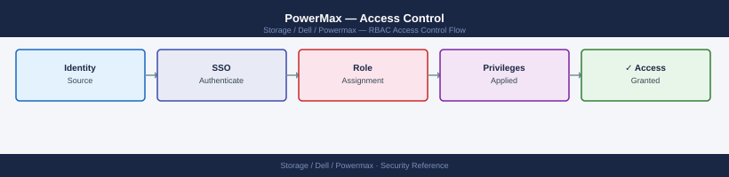
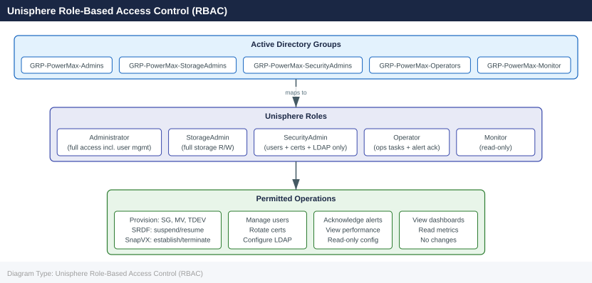
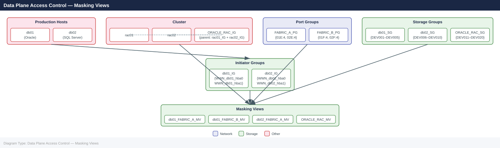

---
tags:
  - dell
  - security
---
# PowerMax — Access Control

<div class="kb-summary">
Access Control reference covering Overview, Unisphere Role-Based Access Control (RBAC), Solutions Enabler CLI Access Control, Data Plane Access Control — Masking Views, Access Control Reviews and 1 more sections.

*Applies to: PowerMax 2500 / 8500*
</div>


## Before you begin

- **Access:** Storage admin credentials (cluster admin or equivalent)
- **Change management:** security changes require CAB approval in most environments
- **Rollback plan:** document current state before any security control change
- **Testing:** validate in a non-production environment first where possible

---

## Overview

Access control on PowerMax operates at two levels: **management plane access** (who can administer the array) and **data plane access** (which hosts can see which storage). Management plane access is controlled through Unisphere RBAC and Solutions Enabler daemon authentication. Data plane access is controlled through masking views — the combination of storage groups, port groups, and initiator groups that determine LUN visibility.

## Unisphere Role-Based Access Control (RBAC)

Unisphere for PowerMax implements RBAC through five built-in roles. There are no custom roles — access must be delegated using these predefined tiers.



| Role | Storage Operations | Security / User Mgmt | Alert Mgmt | Read-Only Access | Notes |
|---|---|---|---|---|---|
| `Administrator` | Full | Full | Full | Full | Equivalent to root; restrict to storage architects and security admins only |
| `StorageAdmin` | Full read/write | None | View only | Full | Day-to-day storage engineering role; cannot manage users or certificates |
| `SecurityAdmin` | None | Full | View only | Full | Manages users, LDAP, certificates; cannot provision storage |
| `Operator` | Limited (operations tasks) | None | Acknowledge/resolve | Full | Helpdesk and NOC roles; cannot create or delete storage objects |
| `Monitor` | None | None | View only | Full | Read-only; suitable for capacity reporting and monitoring integrations |

> `StorageAdminLocal` is a variant of `StorageAdmin` scoped to a single array SID. Use this role in multi-tenancy environments where different teams manage different arrays registered on the same Unisphere instance.

### Role Assignment via Unisphere

Roles are assigned to individual users or to LDAP/AD groups:

```yaml
Unisphere → Settings → Security → Users → Add User
  - Select: Local User or LDAP User
  - Assign: Role
  - Scope: All arrays or specific SID
```

```bash
# List users and roles via REST API
curl -sk -u admin:password \
  https://<unisphere-host>:8443/univmax/restapi/100/system/user \
  | python3 -m json.tool

# Example response includes: username, role, auth_type (LOCAL or LDAP)
```


```text title="Expected output"
{
  "user": [
    {
      "username": "admin",
      "role": "Administrator",
      "auth_type": "LOCAL",
      "created_date": "2023-01-15 09:22:14",
      "last_login": "2024-01-10 14:35:22"
    },
    {
      "username": "storage_ops",
      "role": "Storage Administrator",
      "auth_type": "LDAP",
      "created_date": "2023-06-20 11:45:00",
      "last_login": "2024-01-09 16:12:55"
    },
    {
      "username": "readonly_user",
      "role": "Viewer",
      "auth_type": "LDAP",
      "created_date": "2023-11-02 08:30:22",
      "last_login": "2024-01-08 10:05:33"
    },
    {
      "username": "audit_monitor",
      "role": "Auditor",
      "auth_type": "LOCAL",
      "created_date": "2023-09-12 13:18:44",
      "last_login": "2024-01-07 09:44:11"
    }
  ]
}
```

!!! warning "Common errors"
    **`curl: (60) SSL certificate problem: self signed certificate`** — Add `-k` flag to skip certificate verification (already present in example; if error persists, verify Unisphere host is reachable on port 8443).
    **`curl: (7) Failed to connect to <unisphere-host>:8443: Connection refused`** — Confirm the Unisphere hostname/IP is correct and the REST API service is running with `systemctl status unisphere-api` on the Unisphere appliance.
    **`jq: parse error: Invalid JSON`** — Ensure `python3 -m json.tool` is available; if not, pipe to `jq .` instead or remove the formatter to see raw response for debugging.
### LDAP Group to Role Mapping

Map Active Directory groups to Unisphere roles so that group membership in AD automatically confers the appropriate role:

```yaml
Unisphere → Settings → Security → LDAP → Role Mapping
  - Group DN: CN=GRP-PowerMax-StorageAdmins,OU=Groups,DC=corp,DC=example,DC=com
  - Role: StorageAdmin
  - Scope: All arrays
```

| AD Group | Unisphere Role | Who Should Be Members |
|---|---|---|
| `GRP-PowerMax-Admins` | Administrator | Storage architects, security leads |
| `GRP-PowerMax-StorageAdmins` | StorageAdmin | Storage engineers, on-call storage ops |
| `GRP-PowerMax-SecurityAdmins` | SecurityAdmin | Security team only |
| `GRP-PowerMax-Operators` | Operator | NOC / Level-1 support |
| `GRP-PowerMax-Monitor` | Monitor | Capacity management tools, read-only audit accounts |

## Solutions Enabler CLI Access Control

SYMCLI access is controlled at the OS level on the management host and via the SYMAPI daemon configuration. Anyone who can run SYMCLI as the correct OS user has the equivalent of `StorageAdmin` access to all arrays the SE host is connected to.

### daemon_users File

The `daemon_users` file controls which OS users are permitted to connect to the SYMAPI daemon and what role they hold:

```bash
# Location (Linux/Unix):
/var/symapi/config/daemon_users

# Format: <os_username> <SE_role> <permitted_host_or_IP>
# Roles: Administrator, StorageAdmin, SecurityAdmin, Operator, Monitor

# Example production configuration:
storadm      StorageAdmin   192.168.10.0/24
secadm       SecurityAdmin  192.168.10.0/24
monitor_svc  Monitor        192.168.20.50
root         Administrator  127.0.0.1
```


```text title="Expected output"
(no output — command completes silently)
```

!!! warning "Common errors"
    **`Permission denied`** — Ensure you have root or sudo privileges before editing `/var/symapi/config/daemon_users`.
    **`File not found: /var/symapi/config/daemon_users`** — Verify the Symmetrix daemon is installed and the symapi package is properly initialized with `symcfg discover`.
Best practices:
- Never grant `Administrator` role to generic or shared accounts.
- Restrict by source IP where the SE host is accessed from known management subnets.
- The `root` user should only be able to connect from `127.0.0.1` (localhost).
- Create a dedicated service account (`storadm`) for scripted automation; do not use individual engineer accounts for cron jobs.

### netcnfg File

The `netcnfg` file controls which arrays the SE host can communicate with. Restricting this file limits the blast radius if the SE host is compromised.

```bash
# Location (Linux/Unix):
/var/symapi/config/netcnfg

# Only list the arrays this SE host should manage
# SYMAPI_SERVER - IP_ADDRESS - SID - PORT [SECURE]
SYMAPI_SERVER - 192.168.1.10 - 000123456789 - 2707 SECURE
SYMAPI_SERVER - 192.168.1.11 - 000987654321 - 2707 SECURE

# Verify SE connectivity after editing
symcfg discover
symcfg list
```


```text title="Expected output"
Symmetrix ID: 000123456789
        Symmetrix Version: T10.1.0.0
        Microcode Version: 5978.1147.1147
        Local Director Version: 7.0.45
        Cache: 384 GB
        SE Port: 2707
        SE Host: se-prod-01.corp.local
        Connection: SECURE

Symmetrix ID: 000987654321
        Symmetrix Version: T10.1.0.0
        Microcode Version: 5978.1147.1147
        Local Director Version: 7.0.45
        Cache: 384 GB
        SE Port: 2707
        SE Host: se-prod-02.corp.local
        Connection: SECURE

Symmetrix ID           Symmetrix Version  Local Dir Version
000123456789          T10.1.0.0          7.0.45
000987654321          T10.1.0.0          7.0.45
```

!!! warning "Common errors"
    **`symcfg: error: Cannot connect to SYMAPI server at 192.168.1.10:2707`** — Verify the IP address and port are correct in `/var/symapi/config/netcnfg`, and confirm the PowerMax SE service is running with `systemctl status symapi`.
    **`symcfg: error: Invalid Symmetrix ID 000123456789 in configuration`** — Ensure the SID matches the actual array identifier by running `symcfg discover` without the netcnfg file to auto-detect arrays, then update the configuration.
    **`Permission denied: /var/symapi/config/netcnfg`** — Run the command with appropriate privileges (`sudo symcfg discover`) or verify the file permissions with `ls -l /var/symapi/config/netcnfg`.
### Sudo Configuration for SYMCLI

On multi-user management hosts, restrict SYMCLI execution using sudo:

```bash
# /etc/sudoers.d/powermax-symcli
# Allow storage engineers to run SYMCLI as the storadm service account
%storage-engineers  ALL=(storadm) NOPASSWD: /usr/symcli/bin/sym*

# Allow NOC to run read-only SYMCLI commands only
%noc-team ALL=(storadm) NOPASSWD: /usr/symcli/bin/symcfg, /usr/symcli/bin/symsg, /usr/symcli/bin/symrdf

# Deny destructive commands for all non-admins
%storage-engineers ALL=(storadm) !/usr/symcli/bin/symconfigure
```


```text title="Expected output"
(no output — command completes silently)
```

!!! warning "Common errors"
    **`sudoers: parse error near line 7`** — Check for trailing whitespace or missing newline at end of file, and ensure each line uses tabs (not spaces) for indentation between fields.
    **`user is not in the sudoers file. This incident will be reported.`** — Verify the user's group membership with `id username` and confirm the group name in the sudoers file matches exactly (groups are case-sensitive).
## Data Plane Access Control — Masking Views

LUN visibility is controlled by **masking views**. A host can only read or write to a device if that device's storage group is part of a masking view that includes the host's initiator (WWN or IQN) and an appropriate array port. No masking view = no LUN visibility, regardless of physical connectivity.



### Masking View Components

| Component | Object Type | Purpose |
|---|---|---|
| Storage Group (SG) | Logical collection of devices (LUNs) | Defines which volumes are exposed |
| Initiator Group (IG) | List of host WWNs or iSCSI IQNs | Defines which hosts can see the SG |
| Port Group (PG) | List of array FA/FE port identifiers | Defines which array ports the LUNs are presented through |
| Masking View | Binding of SG + IG + PG | The actual access grant |

### Masking View Principles

- **One SG per masking view** — a storage group can be in multiple masking views, but each masking view has exactly one SG, one IG, and one PG.
- **Host isolation** — never put two different application hosts in the same initiator group unless they form a cluster that genuinely shares the same storage.
- **Port group design** — use separate port groups for Fabric A and Fabric B ports to provide path redundancy. A host should have masking views on both port groups.
- **Cascaded initiator groups** — for clusters (Oracle RAC, Windows Failover Cluster), create a parent IG containing child IGs for each node. This simplifies masking view management.

### Creating Isolated Host Access

```bash
# Step 1: Create the initiator group for the host
symaccess create -sid <SID> -name <hostname>_IG -type initiator

# Step 2: Add host HBA WWNs (one per HBA port)
symaccess -sid <SID> -name <hostname>_IG -type initiator add -wwn 10:00:00:00:c9:12:34:56
symaccess -sid <SID> -name <hostname>_IG -type initiator add -wwn 10:00:00:00:c9:12:34:57

# Step 3: Create port groups (one per fabric — Fabric A and Fabric B)
symaccess create -sid <SID> -name FABRIC_A_PG -type port
symaccess -sid <SID> -name FABRIC_A_PG -type port add -dirport 01E:4
symaccess -sid <SID> -name FABRIC_A_PG -type port add -dirport 02E:4

symaccess create -sid <SID> -name FABRIC_B_PG -type port
symaccess -sid <SID> -name FABRIC_B_PG -type port add -dirport 01F:4
symaccess -sid <SID> -name FABRIC_B_PG -type port add -dirport 02F:4

# Step 4: Create the storage group and add devices
symsg create <hostname>_SG -sid <SID> -srp SRP_1 -slo Diamond

# Step 5: Create masking views — one per fabric
symaccess create view -sid <SID> -name <hostname>_FABRIC_A_MV \
  -sg <hostname>_SG -ig <hostname>_IG -pg FABRIC_A_PG

symaccess create view -sid <SID> -name <hostname>_FABRIC_B_MV \
  -sg <hostname>_SG -ig <hostname>_IG -pg FABRIC_B_PG

# Verify
symaccess show view <hostname>_FABRIC_A_MV -sid <SID>
```


```text title="Expected output"
Creating initiator group <hostname>_IG on array 000297123456789...
Initiator group <hostname>_IG created successfully.
Adding WWN 10:00:00:00:c9:12:34:56 to initiator group <hostname>_IG...
WWN 10:00:00:00:c9:12:34:56 added successfully.
Adding WWN 10:00:00:00:c9:12:34:57 to initiator group <hostname>_IG...
WWN 10:00:00:00:c9:12:34:57 added successfully.
Creating port group FABRIC_A_PG on array 000297123456789...
Port group FABRIC_A_PG created successfully.
Adding port 01E:4 to port group FABRIC_A_PG...
Port 01E:4 added successfully.
Adding port 02E:4 to port group FABRIC_A_PG...
Port 02E:4 added successfully.
Creating port group FABRIC_B_PG on array 000297123456789...
Port group FABRIC_B_PG created successfully.
Adding port 01F:4 to port group FABRIC_B_PG...
Port 01F:4 added successfully.
Adding port 02F:4 to port group FABRIC_B_PG...
Port 02F:4 added successfully.
Creating storage group <hostname>_SG on array 000297123456789...
Storage group <hostname>_SG created successfully.
Creating masking view <hostname>_FABRIC_A_MV...
Masking view <hostname>_FABRIC_A_MV created successfully.
Creating masking view <hostname>_FABRIC_B_MV...
Masking view <hostname>_FABRIC_B_MV created successfully.

Masking View: <hostname>_FABRIC_A_MV
  Storage Group: <hostname>_SG
  Initiator Group: <hostname>_IG
  Port Group: FABRIC_A_PG
  Status: Active
```

!!! warning "Common errors"
    **`SYMAPI_C_ARRAY_NOT_FOUND (M20101401401)`** — Verify the SID is correct and the array is online with `symcfg list`.
    **`SYMAPI_C_INVALID_INPUT (M20101400001)`** — Ensure WWN format is correct (10:00:xx:xx:xx:xx:xx:xx) and the HBA port exists on the host.
    **`SYMAPI_C_OBJECT_ALREADY_EXISTS (M20101401409)`** — Check if the initiator group or masking view already exists with `symaccess show view -sid <SID>` and use a unique name or delete the existing object first.
### Cluster Access (Cascaded Initiator Groups)

```bash
# Create child initiator groups per node
symaccess create -sid <SID> -name rac01_IG -type initiator
symaccess -sid <SID> -name rac01_IG -type initiator add -wwn <wwn_rac01_hba0>
symaccess -sid <SID> -name rac01_IG -type initiator add -wwn <wwn_rac01_hba1>

symaccess create -sid <SID> -name rac02_IG -type initiator
symaccess -sid <SID> -name rac02_IG -type initiator add -wwn <wwn_rac02_hba0>
symaccess -sid <SID> -name rac02_IG -type initiator add -wwn <wwn_rac02_hba1>

# Create parent (cascaded) initiator group
symaccess create -sid <SID> -name ORACLE_RAC_IG -type initiator
symaccess -sid <SID> -name ORACLE_RAC_IG -type initiator add -ig rac01_IG
symaccess -sid <SID> -name ORACLE_RAC_IG -type initiator add -ig rac02_IG

# Use parent IG in masking view — both nodes get access via the parent
symaccess create view -sid <SID> -name ORACLE_RAC_MV \
  -sg ORACLE_RAC_SG -ig ORACLE_RAC_IG -pg FABRIC_A_PG
```


```text title="Expected output"
Creating initiator group rac01_IG...
Initiator group rac01_IG created successfully.
Adding WWN 50:00:14:40:5a:2c:d1:e0 to rac01_IG...
WWN 50:00:14:40:5a:2c:d1:e0 added to rac01_IG.
Adding WWN 50:00:14:40:5a:2c:d1:e1 to rac01_IG...
WWN 50:00:14:40:5a:2c:d1:e1 added to rac01_IG.
Creating initiator group rac02_IG...
Initiator group rac02_IG created successfully.
Adding WWN 50:00:14:40:5b:3d:e2:f0 to rac02_IG...
WWN 50:00:14:40:5b:3d:e2:f0 added to rac02_IG.
Adding WWN 50:00:14:40:5b:3d:e2:f1 to rac02_IG...
WWN 50:00:14:40:5b:3d:e2:f1 added to rac02_IG.
Creating initiator group ORACLE_RAC_IG...
Initiator group ORACLE_RAC_IG created successfully.
Adding child IG rac01_IG to ORACLE_RAC_IG...
Child IG rac01_IG added to ORACLE_RAC_IG.
Adding child IG rac02_IG to ORACLE_RAC_IG...
Child IG rac02_IG added to ORACLE_RAC_IG.
Creating masking view ORACLE_RAC_MV...
Masking view ORACLE_RAC_MV created successfully.
```

!!! warning "Common errors"
    **`Error: Initiator group rac01_IG already exists`** — Delete the existing initiator group with `symaccess delete -sid <SID> -name rac01_IG -type initiator` before recreating it.
    **`Error: WWN 50:00:14:40:5a:2c:d1:e0 is already assigned to another initiator group`** — Verify the WWN is not already in use with `symaccess list -sid <SID> -name <existing_IG> -type initiator` and remove it first if needed.
    **`Error: Masking view ORACLE_RAC_MV already exists`** — Delete the existing masking view with `symaccess delete view -sid <SID> -name ORACLE_RAC_MV` before recreating it.
### Auditing LUN Access

```bash
# List all masking views
symaccess list -sid <SID> view

# Show the full contents of a masking view (SG, IG, PG members)
symaccess show view <view_name> -sid <SID>

# Find which masking views a device is part of
symdev show <devname> -sid <SID> | grep -A 5 "Masking View"

# Find which masking views a specific host WWN is in
symaccess list -sid <SID> -type initiator | grep -i <wwn>
symaccess show <ig_name> -sid <SID> -type initiator

# Check which hosts have logged in to each FA port
symaccess -sid <SID> list logins -dirport <dir>:<port>

# Full host-to-LUN access map (useful for access reviews)
symaccess list -sid <SID> view -v > /tmp/masking_view_audit_$(date +%Y%m%d).txt
```


```text title="Expected output"
Symmetrix ID: 000297900001

Masking View Name                                    SymmID
---------------------------------------------------  ----------
PROD_DB_MV_01                                        000297900001
PROD_DB_MV_02                                        000297900001
PROD_APP_MV_03                                       000297900001
DEV_TEST_MV_04                                       000297900001
...

Masking View Name: PROD_DB_MV_01
Storage Group Name: PROD_DB_SG_01
  Device                                 Cap(MB)  Attr
  ---------------------------------------------------
  0ABC                                   102400   RW
  0ABD                                   102400   RW
  0ABE                                   102400   RW

Initiator Group Name: PROD_DB_IG_01
  Initiator                              On Fa  Flags
  ---------------------------------------------------
  50:00:14:40:5a:2b:c1:01               FA-7E:0  (default)
  50:00:14:40:5a:2b:c1:02               FA-7E:1  (default)

Port Group Name: PROD_DB_PG_01
  Director:Port                          Type  Flags
  ---------------------------------------------------
  FA-7E:0                                FA    (default)
  FA-7E:1                                FA    (default)

Masking View: PROD_DB_MV_01
  Device 0ABC
    Masking View                         LUN
    ---------------------------------------------------
    PROD_DB_MV_01                        0

Initiator: 50:00:14:40:5a:2b:c1:01
  Masking View Name                      SymmID
  ---------------------------------------------------
  PROD_DB_MV_01                          000297900001
  PROD_APP_MV_03                         000297900001

Initiator Group: PROD_DB_IG_01
  Initiator                              On Fa  Flags
  ---------------------------------------------------
  50:00:14:40:5a:2b:c1:01               FA-7E:0  (default)
  50:00:14:40:5a:2b:c1:02               FA-7E:1  (default)

FA-7E:0 Logins
  Initiator                              Login Time           Logout Time
  ---------------------------------------------------
  50:00:14:40:5a:2b:c1:01               2024-01-15 09:23:45  2024-01-15 17:30:12
  50:00:14:40:5a:2b:c1:02               2024-01-15 09:25:10  (still logged in)

(no output — command completes silently)
```

!!! warning "Common errors"
    **`SYMCLI_ERROR_DB (191): Could not open the database file`** — Ensure Symmetrix Metadata Server (SMD) is running and accessible with `sudo service emc-smd status`.
    **`Error: Masking View '<view_name>' not found`** — Verify the masking view name spelling and that you are querying the correct SID with `symcfg list -sid <SID>`.
    **`SYMCLI_ERROR_
### Removing Access

```bash
# Remove a device from a storage group (removes from masking view implicitly)
symsg -sid <SID> -sg <sg_name> remove dev <devname>

# Remove a host WWN from an initiator group (revokes all access for that HBA)
symaccess -sid <SID> -name <ig_name> -type initiator remove -wwn <wwn>

# Delete an entire masking view (revokes all LUN access for the IG+PG combination)
symaccess delete view <view_name> -sid <SID>

# Delete an initiator group (must not be in any masking view first)
symaccess delete -sid <SID> -name <ig_name> -type initiator

# Decommission: remove host access, delete IG, then clean up empty SG and devices
symaccess delete view <view_name> -sid <SID>
symaccess delete -sid <SID> -name <hostname>_IG -type initiator
symsg delete <hostname>_SG -sid <SID>
# Delete devices via symconfigure if decommissioning storage entirely
```


```text title="Expected output"
Removing device DEV001 from storage group prod_sg...
Device DEV001 successfully removed from storage group prod_sg
Masking view prod_mv updated

Removing WWN 50:00:14:40:5a:2b:c1:e0 from initiator group app_ig...
WWN 50:00:14:40:5a:2b:c1:e0 successfully removed from initiator group app_ig

Deleting masking view prod_mv...
Masking view prod_mv successfully deleted
All LUN access revoked for initiator group app_ig and port group pg_fc01

Deleting initiator group web_ig...
Initiator group web_ig successfully deleted

Decommissioning host webserver01...
Masking view webserver01_mv deleted
Initiator group webserver01_IG deleted
Storage group webserver01_SG deleted
Cleanup complete
```

!!! warning "Common errors"
    **`SYMCLI_ERROR (4) : The specified masking view is in use`** — Delete all dependent masking views before attempting to remove the initiator group.
    **`SYMCLI_ERROR (6) : Device not found in storage group`** — Verify the device name and storage group name are correct using `symsg list -sid <SID>`.
    **`SYMCLI_ERROR (12) : Initiator group is referenced by masking view`** — Remove the initiator group from all masking views using `symaccess delete view` before deleting the group itself.
## Access Control Reviews

Periodic access reviews should validate that masking views reflect current host connectivity and that no stale or unauthorized access grants exist.

### Access Review Checklist

```bash
# 1. List all initiator groups and confirm each has a known owner
symaccess list -sid <SID> -type initiator -v

# 2. For each IG, verify all WWNs are currently active host HBAs
#    (cross-reference with SAN fabric zone membership)
symaccess show <ig_name> -sid <SID> -type initiator

# 3. List all masking views and confirm each references a live host
symaccess list -sid <SID> view

# 4. Identify any initiator groups with no current host logins
symaccess -sid <SID> list logins | sort -u  # compare to all IGs

# 5. List devices not in any masking view (unassigned/orphaned)
symdev list -sid <SID> -unassigned

# 6. List masking views associated with decommissioned hostnames
symaccess list -sid <SID> view | grep -iE "old|decom|unused|retired"
```


```text title="Expected output"
Symmetrix ID: 000297123456789

                                Initiator Group Names
                                    
PROD-ESXi-IG-01
PROD-ESXi-IG-02
PROD-DB-IG-03
LEGACY-APP-IG-04
TEST-IG-05

Initiator Group PROD-ESXi-IG-01
  Symmetrix ID: 000297123456789
  Type: Fibre
  Num of PDs: 2
  PD Names: esx01-hba0, esx01-hba1
  WWN: 50:00:14:40:5a:2b:c1:01, 50:00:14:40:5a:2b:c1:02

                                Masking View Names
                                    
PROD-ESXi-MV-01
PROD-ESXi-MV-02
PROD-DB-MV-03
LEGACY-APP-MV-04

Symmetrix ID: 000297123456789
Last Login: 2024-01-15 09:47:23
  PROD-ESXi-IG-01: esx01.prod.local
  PROD-DB-IG-03: dbsrv02.prod.local
  TEST-IG-05: testhost.lab.local

                                Unassigned Devices
                                    
Dev 0ABC (RAID-5, 500GB)
Dev 0DEF (RAID-1, 250GB)

LEGACY-APP-MV-04
```

!!! warning "Common errors"
    **`SYMCLI_C_ARRAY_CONNECTIVITY_ERROR: Cannot connect to Symmetrix array`** — Verify the Symmetrix ID is correct and the management port is reachable with `ping` and `telnet <array_ip> 5988`.
    **`SYMCLI_C_INVALID_INITIATOR_GROUP: Initiator group <ig_name> not found`** — Confirm the initiator group name spelling and that it exists on this array using `symaccess list -sid <SID> -type initiator`.
    **`SYMCLI_C_INSUFFICIENT_PRIVILEGES: User does not have permission to execute this command`** — Request elevated privileges or run commands as the `symadmin` user with appropriate role-based access control.
### Quarterly Access Review Export

```bash
# Full access map export for security review
{
  echo "=== Masking Views ==="
  symaccess list -sid <SID> view -v

  echo "=== Initiator Groups ==="
  symaccess list -sid <SID> -type initiator -v

  echo "=== Port Groups ==="
  symaccess list -sid <SID> -type port -v

  echo "=== Current Host Logins ==="
  for dir in $(symcfg -sid <SID> list -dir all | awk 'NR>2{print $1}'); do
    symaccess -sid <SID> list logins -dirport "$dir":0 2>/dev/null || true
  done
} > /tmp/powermax_access_review_$(date +%Y%m%d).txt
```


```text title="Expected output"
=== Masking Views ===
Symmetrix ID: 000297900001

                                       Initiator
                                       --------- 
View Name                              Groups    Port Groups   Host LUNs
---------                              ------    -----------   ---------
PROD_ESX_CLUSTER_01                    2         3             24
PROD_DB_SERVERS                        1         2             16
DEV_WORKSTATION_VIEW                   1         1             8
DR_REPLICATION_PATH                    3         4             32

=== Initiator Groups ===
Symmetrix ID: 000297900001

                                       Fibre
                                       -----
Initiator Group Name                   Members   
-----------                            -------   
ESX_CLUSTER_INITIATORS                 4
DB_SERVER_WWNS                         2
WORKSTATION_PORTS                      1

=== Port Groups ===
Symmetrix ID: 000297900001

                                       Fibre
                                       -----
Port Group Name                        Members   
-----------                            -------   
FA_PORTS_0_1_2_3                       4
FA_PORTS_4_5                           2
RP_PORTS_6_7                           2

=== Current Host Logins ===
Director 0:  No active logins
Director 1:  No active logins
Director 2:  No active logins
Director 3:  No active logins
```

!!! warning "Common errors"
    **`symaccess: Command not found`** — Ensure the PowerMax CLI tools are installed and the PATH includes the Symmetrix bin directory (typically `/opt/emc/SYMCLI/bin`).
    **`Error: Invalid SID <SID>`** — Replace `<SID>` with an actual Symmetrix ID (e.g., `000297900001`) or verify the array is reachable via `symcfg list`.
    **`Permission denied`** — Run the command with appropriate credentials or sudo; the user must have read access to the Symmetrix configuration files in `/var/symapi/db`.
## Service Account Management

| Account | Purpose | Minimum Required Role | Notes |
|---|---|---|---|
| `svc-powermax-veeam` | Veeam backup integration | StorageAdmin | Scoped to specific SIDs |
| `svc-powermax-netbackup` | NetBackup SYMCLI calls | StorageAdmin | OS-level SYMCLI account on NBU media server |
| `svc-powermax-cloudiq` | CloudIQ telemetry | Monitor | Read-only; outbound HTTPS only |
| `svc-powermax-ansible` | Ansible playbook automation | StorageAdmin | Store credential in Ansible Vault |
| `svc-powermax-monitoring` | Zabbix/Prometheus metrics | Monitor | Read-only API account |
| `svc-powermax-cmdb` | CMDB discovery | Monitor | Read-only; schedule off-peak |

- Rotate all service account passwords on a 6-month schedule minimum.
- Use Ansible Vault, HashiCorp Vault, or CyberArk to store service account credentials — never in plain text in scripts or config files.
- Audit service account last-login dates quarterly; disable accounts not used in 90 days.

---

## See also

- [Powermax — Authentication](../authentication/)
- [Powermax — Hardening](../hardening/)
- [Powermax — Encryption](../encryption/)
