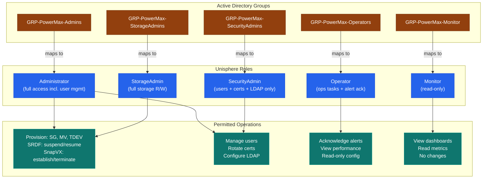
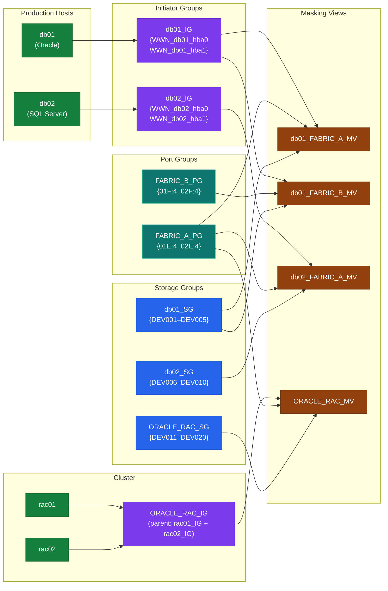

---
tags:
  - dell
  - security
---
# PowerMax — Access Control


<div class="kb-summary">
Access Control reference covering Overview, Unisphere Role-Based Access Control (RBAC), Solutions Enabler CLI Access Control, Data Plane Access Control — Masking Views, Access Control Reviews and 1 more sections.

*Applies to: PowerMax 2500 / 8500*
</div>
```text
┌─────────────────────────────────── Dell PowerMax — Access Control ────────────────────────────────────┐
│                                                                                                       │
│   ┌───────────────────────────────────────────────────────────────────────────────────────────────┐   │
│   │         PowerMax access control: RBAC roles, least-privilege, and access audit logging        │   │
│   │        Roles: admin (full), operator (read/modify), read-only (view); map to AD groups        │   │
│   │       Authentication: local accounts, LDAP/AD integration, and MFA for privileged users       │   │
│   │          Audit: log all admin actions; review access logs monthly; rotate credentials         │   │
│   └───────────────────────────────────────────────────────────────────────────────────────────────┘   │
│                                                                                                       │
│    Identify user → assign role → enforce MFA → audit → review quarterly                               │
│                                                                                                       │
│                  ▼                                ▼                                ▼                  │
│                                                                                                       │
│   ┌─────────────────────────────┐  ┌─────────────────────────────┐  ┌─────────────────────────────┐   │
│   │            Layer            │  │          Component          │  │           Function          │   │
│   │            Cache            │  │          DRAM 2 TB+         │  │        Sub-ms latency       │   │
│   │         FE director         │  │        FC/iSCSI ports       │  │         Host facing         │   │
│   │         BE director         │  │         NVMe drives         │  │        Storage facing       │   │
│   │             SRDF            │  │         RDF director        │  │       Metro/remote DR       │   │
│   │          TimeFinder         │  │         SnapVX/Clone        │  │       Local protection      │   │
│   └─────────────────────────────┘  └─────────────────────────────┘  └─────────────────────────────┘   │
│                                                                                                       │
│                          ▼                                                 ▼                          │
│                                                                                                       │
│   ┌───────────────────────────────────────────────────────────────────────────────────────────────┐   │
│   │       Role       │   Permissions    │       Scope       │       Auth       │   Review cycle   │   │
│   │      Admin       │    Full CRUD     │       Global      │   MFA required   │     Monthly      │   │
│   │     Operator     │   Read/modify    │      Assigned     │   MFA required   │    Quarterly     │   │
│   │    Read-only     │    View only     │      Assigned     │     Password     │    Quarterly     │   │
│   │   Service acct   │     API only     │    Specific API   │    Token/cert    │      Annual      │   │
│   └───────────────────────────────────────────────────────────────────────────────────────────────┘   │
│                                                                                                       │
│    Physical: PowerMax 2500/8500 engine · FE/BE/RDF directors · DRAM cache · expansion bays            │
│                                                                                                       │
│    Key terms:                                                                                         │
│                                                                                                       │
│    PowerMax           = Dell flagship NVMe all-flash array; millions of IOPS at sub-millisecond lat...│
│    SRDF               = Symmetrix Remote Data Facility; sync/async metro and remote site replication  │
│    TimeFinder SnapVX  = space-efficient snapshot technology; up to 256 snapshots per storage group    │
│    Storage group      = logical container for volumes sharing service level and host access policy    │
│    Service level      = performance target for a storage group: Diamond, Platinum, Gold, Silver       │
│    FE director        = front-end director providing FC or iSCSI host-facing ports on the engine      │
│    BE director        = back-end director connecting engine cache to NVMe flash drive bays            │
│    RDF director       = SRDF director providing dedicated bandwidth for replication traffic           │
│    Solutions Enabler  = CLI and API toolkit; symcli commands cover all PowerMax management            │
│    Unisphere          = web GUI and REST API server for PowerMax; unified management interface        │
│    DCM                = Dynamic Cache Management; auto-balances workloads across available cache re...│
│    Service level obj. = workload performance class assigned to storage group; enforced by DPTM        │
│                                                                                                       │
└───────────────────────────────────────────────────────────────────────────────────────────────────────┘
```


## Before you begin

- **Access:** Storage admin credentials (cluster admin or equivalent)
- **Change management:** security changes require CAB approval in most environments
- **Rollback plan:** document current state before any security control change
- **Testing:** validate in a non-production environment first where possible

---

## Overview

Access control on PowerMax operates at two levels: **management plane access** (who can administer the array) and **data plane access** (which hosts can see which storage). Management plane access is controlled through Unisphere RBAC and Solutions Enabler daemon authentication. Data plane access is controlled through masking views — the combination of storage groups, port groups, and initiator groups that determine LUN visibility.

## Unisphere Role-Based Access Control (RBAC)

Unisphere for PowerMax implements RBAC through five built-in roles. There are no custom roles — access must be delegated using these predefined tiers.



| Role | Storage Operations | Security / User Mgmt | Alert Mgmt | Read-Only Access | Notes |
|---|---|---|---|---|---|
| `Administrator` | Full | Full | Full | Full | Equivalent to root; restrict to storage architects and security admins only |
| `StorageAdmin` | Full read/write | None | View only | Full | Day-to-day storage engineering role; cannot manage users or certificates |
| `SecurityAdmin` | None | Full | View only | Full | Manages users, LDAP, certificates; cannot provision storage |
| `Operator` | Limited (operations tasks) | None | Acknowledge/resolve | Full | Helpdesk and NOC roles; cannot create or delete storage objects |
| `Monitor` | None | None | View only | Full | Read-only; suitable for capacity reporting and monitoring integrations |

> `StorageAdminLocal` is a variant of `StorageAdmin` scoped to a single array SID. Use this role in multi-tenancy environments where different teams manage different arrays registered on the same Unisphere instance.

### Role Assignment via Unisphere

Roles are assigned to individual users or to LDAP/AD groups:

```yaml
Unisphere → Settings → Security → Users → Add User
  - Select: Local User or LDAP User
  - Assign: Role
  - Scope: All arrays or specific SID
```

```bash
# List users and roles via REST API
curl -sk -u admin:password \
  https://<unisphere-host>:8443/univmax/restapi/100/system/user \
  | python3 -m json.tool

# Example response includes: username, role, auth_type (LOCAL or LDAP)
```

### LDAP Group to Role Mapping

Map Active Directory groups to Unisphere roles so that group membership in AD automatically confers the appropriate role:

```yaml
Unisphere → Settings → Security → LDAP → Role Mapping
  - Group DN: CN=GRP-PowerMax-StorageAdmins,OU=Groups,DC=corp,DC=example,DC=com
  - Role: StorageAdmin
  - Scope: All arrays
```

| AD Group | Unisphere Role | Who Should Be Members |
|---|---|---|
| `GRP-PowerMax-Admins` | Administrator | Storage architects, security leads |
| `GRP-PowerMax-StorageAdmins` | StorageAdmin | Storage engineers, on-call storage ops |
| `GRP-PowerMax-SecurityAdmins` | SecurityAdmin | Security team only |
| `GRP-PowerMax-Operators` | Operator | NOC / Level-1 support |
| `GRP-PowerMax-Monitor` | Monitor | Capacity management tools, read-only audit accounts |

## Solutions Enabler CLI Access Control

SYMCLI access is controlled at the OS level on the management host and via the SYMAPI daemon configuration. Anyone who can run SYMCLI as the correct OS user has the equivalent of `StorageAdmin` access to all arrays the SE host is connected to.

### daemon_users File

The `daemon_users` file controls which OS users are permitted to connect to the SYMAPI daemon and what role they hold:

```bash
# Location (Linux/Unix):
/var/symapi/config/daemon_users

# Format: <os_username> <SE_role> <permitted_host_or_IP>
# Roles: Administrator, StorageAdmin, SecurityAdmin, Operator, Monitor

# Example production configuration:
storadm      StorageAdmin   192.168.10.0/24
secadm       SecurityAdmin  192.168.10.0/24
monitor_svc  Monitor        192.168.20.50
root         Administrator  127.0.0.1
```

Best practices:
- Never grant `Administrator` role to generic or shared accounts.
- Restrict by source IP where the SE host is accessed from known management subnets.
- The `root` user should only be able to connect from `127.0.0.1` (localhost).
- Create a dedicated service account (`storadm`) for scripted automation; do not use individual engineer accounts for cron jobs.

### netcnfg File

The `netcnfg` file controls which arrays the SE host can communicate with. Restricting this file limits the blast radius if the SE host is compromised.

```bash
# Location (Linux/Unix):
/var/symapi/config/netcnfg

# Only list the arrays this SE host should manage
# SYMAPI_SERVER - IP_ADDRESS - SID - PORT [SECURE]
SYMAPI_SERVER - 192.168.1.10 - 000123456789 - 2707 SECURE
SYMAPI_SERVER - 192.168.1.11 - 000987654321 - 2707 SECURE

# Verify SE connectivity after editing
symcfg discover
symcfg list
```

### Sudo Configuration for SYMCLI

On multi-user management hosts, restrict SYMCLI execution using sudo:

```bash
# /etc/sudoers.d/powermax-symcli
# Allow storage engineers to run SYMCLI as the storadm service account
%storage-engineers  ALL=(storadm) NOPASSWD: /usr/symcli/bin/sym*

# Allow NOC to run read-only SYMCLI commands only
%noc-team ALL=(storadm) NOPASSWD: /usr/symcli/bin/symcfg, /usr/symcli/bin/symsg, /usr/symcli/bin/symrdf

# Deny destructive commands for all non-admins
%storage-engineers ALL=(storadm) !/usr/symcli/bin/symconfigure
```

## Data Plane Access Control — Masking Views

LUN visibility is controlled by **masking views**. A host can only read or write to a device if that device's storage group is part of a masking view that includes the host's initiator (WWN or IQN) and an appropriate array port. No masking view = no LUN visibility, regardless of physical connectivity.



### Masking View Components

| Component | Object Type | Purpose |
|---|---|---|
| Storage Group (SG) | Logical collection of devices (LUNs) | Defines which volumes are exposed |
| Initiator Group (IG) | List of host WWNs or iSCSI IQNs | Defines which hosts can see the SG |
| Port Group (PG) | List of array FA/FE port identifiers | Defines which array ports the LUNs are presented through |
| Masking View | Binding of SG + IG + PG | The actual access grant |

### Masking View Principles

- **One SG per masking view** — a storage group can be in multiple masking views, but each masking view has exactly one SG, one IG, and one PG.
- **Host isolation** — never put two different application hosts in the same initiator group unless they form a cluster that genuinely shares the same storage.
- **Port group design** — use separate port groups for Fabric A and Fabric B ports to provide path redundancy. A host should have masking views on both port groups.
- **Cascaded initiator groups** — for clusters (Oracle RAC, Windows Failover Cluster), create a parent IG containing child IGs for each node. This simplifies masking view management.

### Creating Isolated Host Access

```bash
# Step 1: Create the initiator group for the host
symaccess create -sid <SID> -name <hostname>_IG -type initiator

# Step 2: Add host HBA WWNs (one per HBA port)
symaccess -sid <SID> -name <hostname>_IG -type initiator add -wwn 10:00:00:00:c9:12:34:56
symaccess -sid <SID> -name <hostname>_IG -type initiator add -wwn 10:00:00:00:c9:12:34:57

# Step 3: Create port groups (one per fabric — Fabric A and Fabric B)
symaccess create -sid <SID> -name FABRIC_A_PG -type port
symaccess -sid <SID> -name FABRIC_A_PG -type port add -dirport 01E:4
symaccess -sid <SID> -name FABRIC_A_PG -type port add -dirport 02E:4

symaccess create -sid <SID> -name FABRIC_B_PG -type port
symaccess -sid <SID> -name FABRIC_B_PG -type port add -dirport 01F:4
symaccess -sid <SID> -name FABRIC_B_PG -type port add -dirport 02F:4

# Step 4: Create the storage group and add devices
symsg create <hostname>_SG -sid <SID> -srp SRP_1 -slo Diamond

# Step 5: Create masking views — one per fabric
symaccess create view -sid <SID> -name <hostname>_FABRIC_A_MV \
  -sg <hostname>_SG -ig <hostname>_IG -pg FABRIC_A_PG

symaccess create view -sid <SID> -name <hostname>_FABRIC_B_MV \
  -sg <hostname>_SG -ig <hostname>_IG -pg FABRIC_B_PG

# Verify
symaccess show view <hostname>_FABRIC_A_MV -sid <SID>
```

### Cluster Access (Cascaded Initiator Groups)

```bash
# Create child initiator groups per node
symaccess create -sid <SID> -name rac01_IG -type initiator
symaccess -sid <SID> -name rac01_IG -type initiator add -wwn <wwn_rac01_hba0>
symaccess -sid <SID> -name rac01_IG -type initiator add -wwn <wwn_rac01_hba1>

symaccess create -sid <SID> -name rac02_IG -type initiator
symaccess -sid <SID> -name rac02_IG -type initiator add -wwn <wwn_rac02_hba0>
symaccess -sid <SID> -name rac02_IG -type initiator add -wwn <wwn_rac02_hba1>

# Create parent (cascaded) initiator group
symaccess create -sid <SID> -name ORACLE_RAC_IG -type initiator
symaccess -sid <SID> -name ORACLE_RAC_IG -type initiator add -ig rac01_IG
symaccess -sid <SID> -name ORACLE_RAC_IG -type initiator add -ig rac02_IG

# Use parent IG in masking view — both nodes get access via the parent
symaccess create view -sid <SID> -name ORACLE_RAC_MV \
  -sg ORACLE_RAC_SG -ig ORACLE_RAC_IG -pg FABRIC_A_PG
```

### Auditing LUN Access

```bash
# List all masking views
symaccess list -sid <SID> view

# Show the full contents of a masking view (SG, IG, PG members)
symaccess show view <view_name> -sid <SID>

# Find which masking views a device is part of
symdev show <devname> -sid <SID> | grep -A 5 "Masking View"

# Find which masking views a specific host WWN is in
symaccess list -sid <SID> -type initiator | grep -i <wwn>
symaccess show <ig_name> -sid <SID> -type initiator

# Check which hosts have logged in to each FA port
symaccess -sid <SID> list logins -dirport <dir>:<port>

# Full host-to-LUN access map (useful for access reviews)
symaccess list -sid <SID> view -v > /tmp/masking_view_audit_$(date +%Y%m%d).txt
```

### Removing Access

```bash
# Remove a device from a storage group (removes from masking view implicitly)
symsg -sid <SID> -sg <sg_name> remove dev <devname>

# Remove a host WWN from an initiator group (revokes all access for that HBA)
symaccess -sid <SID> -name <ig_name> -type initiator remove -wwn <wwn>

# Delete an entire masking view (revokes all LUN access for the IG+PG combination)
symaccess delete view <view_name> -sid <SID>

# Delete an initiator group (must not be in any masking view first)
symaccess delete -sid <SID> -name <ig_name> -type initiator

# Decommission: remove host access, delete IG, then clean up empty SG and devices
symaccess delete view <view_name> -sid <SID>
symaccess delete -sid <SID> -name <hostname>_IG -type initiator
symsg delete <hostname>_SG -sid <SID>
# Delete devices via symconfigure if decommissioning storage entirely
```

## Access Control Reviews

Periodic access reviews should validate that masking views reflect current host connectivity and that no stale or unauthorized access grants exist.

### Access Review Checklist

```bash
# 1. List all initiator groups and confirm each has a known owner
symaccess list -sid <SID> -type initiator -v

# 2. For each IG, verify all WWNs are currently active host HBAs
#    (cross-reference with SAN fabric zone membership)
symaccess show <ig_name> -sid <SID> -type initiator

# 3. List all masking views and confirm each references a live host
symaccess list -sid <SID> view

# 4. Identify any initiator groups with no current host logins
symaccess -sid <SID> list logins | sort -u  # compare to all IGs

# 5. List devices not in any masking view (unassigned/orphaned)
symdev list -sid <SID> -unassigned

# 6. List masking views associated with decommissioned hostnames
symaccess list -sid <SID> view | grep -iE "old|decom|unused|retired"
```

### Quarterly Access Review Export

```bash
# Full access map export for security review
{
  echo "=== Masking Views ==="
  symaccess list -sid <SID> view -v

  echo "=== Initiator Groups ==="
  symaccess list -sid <SID> -type initiator -v

  echo "=== Port Groups ==="
  symaccess list -sid <SID> -type port -v

  echo "=== Current Host Logins ==="
  for dir in $(symcfg -sid <SID> list -dir all | awk 'NR>2{print $1}'); do
    symaccess -sid <SID> list logins -dirport "$dir":0 2>/dev/null || true
  done
} > /tmp/powermax_access_review_$(date +%Y%m%d).txt
```

## Service Account Management

| Account | Purpose | Minimum Required Role | Notes |
|---|---|---|---|
| `svc-powermax-veeam` | Veeam backup integration | StorageAdmin | Scoped to specific SIDs |
| `svc-powermax-netbackup` | NetBackup SYMCLI calls | StorageAdmin | OS-level SYMCLI account on NBU media server |
| `svc-powermax-cloudiq` | CloudIQ telemetry | Monitor | Read-only; outbound HTTPS only |
| `svc-powermax-ansible` | Ansible playbook automation | StorageAdmin | Store credential in Ansible Vault |
| `svc-powermax-monitoring` | Zabbix/Prometheus metrics | Monitor | Read-only API account |
| `svc-powermax-cmdb` | CMDB discovery | Monitor | Read-only; schedule off-peak |

- Rotate all service account passwords on a 6-month schedule minimum.
- Use Ansible Vault, HashiCorp Vault, or CyberArk to store service account credentials — never in plain text in scripts or config files.
- Audit service account last-login dates quarterly; disable accounts not used in 90 days.

---

## See also

- [Powermax — Authentication](authentication/)
- [Powermax — Hardening](hardening/)
- [Powermax — Encryption](encryption/)
