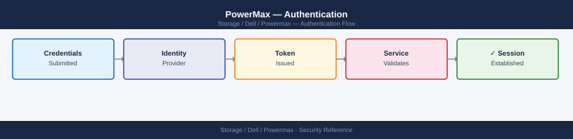
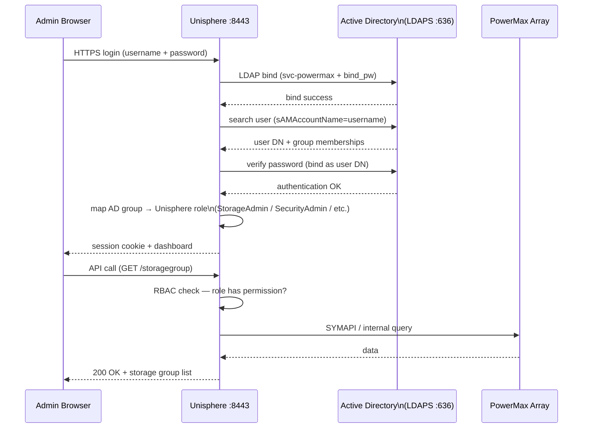

---
tags:
  - dell
  - security
---
# PowerMax — Authentication

<div class="kb-summary">
Authentication reference covering Overview, Unisphere Local Accounts, Active Directory / LDAP Integration, Role Mapping, Multi-Factor Authentication (MFA) and 5 more sections.

*Applies to: PowerMax 2500 / 8500*
</div>


## Before you begin

- **Access:** Storage admin credentials (cluster admin or equivalent)
- **Change management:** security changes require CAB approval in most environments
- **Rollback plan:** document current state before any security control change
- **Testing:** validate in a non-production environment first where possible

---

## Overview

PowerMax has two primary authentication surfaces: **Unisphere for PowerMax** (GUI and REST API) and **Solutions Enabler (SYMCLI)** running on management hosts. Both must be secured independently. Unisphere supports local accounts and external directory integration (LDAP/Active Directory). Solutions Enabler authentication is controlled at the OS level and via the SYMAPI daemon configuration.

## Unisphere Local Accounts

By default, Unisphere is provisioned with a local administrative account (`smc`) during array installation. Local accounts are stored in the Unisphere user database on the management appliance.

| Account | Default Role | Usage |
|---|---|---|
| `smc` | Administrator | Factory default admin account; should be replaced with named accounts after LDAP setup |
| Custom local accounts | Any role | Created via Unisphere → Settings → Security → Users |

```bash
# Check local user accounts via Unisphere REST API
curl -sk -u admin:password \
  https://<unisphere-host>:8443/univmax/restapi/100/system/user \
  | python3 -m json.tool

# List users from SYMCLI (solutions enabler CLI)
symuserdb list -sid <SID>
```


```text title="Expected output"
{
  "id": "0c47c925-3f8a-4a12-b8e9-2a1f5c8d9e3b",
  "resourceLink": "/univmax/restapi/100/system/user",
  "expirationTime": 1735689600,
  "maxPageSize": 100,
  "pageSize": 50,
  "pageStartIndex": 0,
  "resultList": {
    "result": [
      {
        "user_id": "admin",
        "user_name": "Administrator",
        "role_id": "system_admin",
        "created_date": "2023-01-15T08:30:22Z",
        "last_login": "2024-01-12T14:22:15Z"
      },
      {
        "user_id": "svc_monitor",
        "user_name": "Monitoring Service",
        "role_id": "monitor",
        "created_date": "2023-06-20T10:15:00Z",
        "last_login": "2024-01-12T16:45:33Z"
      },
      {
        "user_id": "backup_user",
        "user_name": "Backup Operator",
        "role_id": "operator",
        "created_date": "2023-11-02T09:22:18Z",
        "last_login": "2024-01-11T23:10:05Z"
      }
    ]
  }
}

Symmetrix ID: 000297900001
User Database:
  User Name          Role              Created              Last Login
  admin              system_admin      2023-01-15 08:30     2024-01-12 14:22
  svc_monitor        monitor           2023-06-20 10:15     2024-01-12 16:45
  backup_user        operator          2023-11-02 09:22     2024-01-11 23:10
  local_audit        auditor           2023-09-08 14:33     2024-01-10 11:02
```

!!! warning "Common errors"
    **`curl: (60) SSL certificate problem: self signed certificate`** — Add the `-k` flag (already present) or import the Unisphere certificate into your system's CA bundle.
    **`symuserdb: Command not found`** — Install Solutions Enabler CLI package or verify the PATH includes the SymCLI bin directory (typically `/opt/emc/SYMCLI/bin`).
    **`HTTP/1.1 401 Unauthorized`** — Verify the admin credentials are correct and the user account has REST API access permissions in Unisphere.
**Break-glass account policy:**
- Always retain at least one named local admin account in a privileged access vault (CyberArk, Thycotic, etc.) even when LDAP is the primary authentication method.
- The `smc` account should be disabled in production after LDAP is configured and tested. Re-enable only under emergency conditions.
- Rotate local account passwords on a 90-day schedule or per your organisation's password policy.

## Active Directory / LDAP Integration

Unisphere for PowerMax supports LDAP (including Active Directory via LDAP) for centrally-managed authentication. Users authenticate with their AD credentials; Unisphere maps AD group membership to internal roles.



### Configuration Steps

1. Navigate to **Unisphere → Settings → Security → LDAP Configuration**.
2. Enter the LDAP server address (use the fully-qualified domain name, not an IP, to facilitate failover to another DC).
3. Set the LDAP port: `389` (LDAP) or `636` (LDAPS — recommended).
4. Provide bind credentials — use a service account with read-only directory access (not a personal account).
5. Set the base DN for user searches: e.g., `DC=corp,DC=example,DC=com`.
6. Set the user filter: e.g., `(sAMAccountName=%s)` for Active Directory.
7. Map AD groups to Unisphere roles (see Role Mapping below).
8. Test LDAP connectivity using the built-in test button in Unisphere.
9. Log in with an AD account to validate before disabling local accounts.

### LDAP Configuration Parameters

| Parameter | Example Value | Notes |
|---|---|---|
| LDAP Server | `ldap.corp.example.com` | Use FQDN; configure secondary server for HA |
| Port | `636` (LDAPS) or `389` (LDAP) | Always use LDAPS in production |
| Bind DN | `CN=svc-powermax,OU=Service Accounts,DC=corp,DC=example,DC=com` | Read-only service account |
| Bind Password | (stored encrypted in Unisphere) | Rotate per password policy |
| Base DN | `DC=corp,DC=example,DC=com` | Top-level search base |
| User Search Filter | `(sAMAccountName=%s)` | AD attribute for username matching |
| Group Search Filter | `(member=%s)` | Used to enumerate group membership |
| LDAP Timeout | `10` seconds | Increase for slow WAN-linked DCs |
| Follow Referrals | Disabled | Enable only if using cross-domain referrals |

### LDAP Connectivity Test (Pre-configuration Validation)

Before configuring LDAP in Unisphere, test connectivity from the Unisphere management host:

```bash
# Test LDAP bind from the Unisphere host (Linux)
ldapsearch -H ldap://ldap.corp.example.com:389 \
  -D "CN=svc-powermax,OU=Service Accounts,DC=corp,DC=example,DC=com" \
  -w 'ServiceAccountPassword' \
  -b "DC=corp,DC=example,DC=com" \
  "(sAMAccountName=testuser)" cn sAMAccountName

# Test LDAPS (port 636 — TLS)
ldapsearch -H ldaps://ldap.corp.example.com:636 \
  -D "CN=svc-powermax,OU=Service Accounts,DC=corp,DC=example,DC=com" \
  -w 'ServiceAccountPassword' \
  -b "DC=corp,DC=example,DC=com" \
  "(sAMAccountName=testuser)" cn
```


```text title="Expected output"
# LDAP (port 389) search result:
dn: CN=testuser,OU=Users,DC=corp,DC=example,DC=com
cn: Test User
sAMAccountName: testuser

search result
result: 0 Success
numResponses: 2
numEntries: 1

# LDAPS (port 636) search result:
dn: CN=testuser,OU=Users,DC=corp,DC=example,DC=com
cn: Test User

search result
result: 0 Success
numResponses: 2
numEntries: 1
```

!!! warning "Common errors"
    **`ldap_bind: Invalid credentials (49)`** — Verify the service account password is correct and the account is not locked in Active Directory.
    **`Can't contact LDAP server (-1)`** — Confirm the LDAP server hostname resolves and port 389/636 is reachable from the Unisphere host (test with `nc -zv ldap.corp.example.com 389`).
    **`TLS: peer certificate cannot be authenticated with known CA certificates`** — Add the LDAP server's CA certificate to the system trust store or disable certificate validation by adding `-o LDAPTLS_REQCERT=never` to the ldapsearch command.
A successful bind returning the test user's attributes confirms LDAP connectivity. If the test fails, resolve the connectivity issue before configuring Unisphere — an incorrect LDAP configuration can lock administrators out.

## Role Mapping

Unisphere roles are assigned to AD groups. A user's effective role is the highest-privileged role among all their group memberships.

| Unisphere Role | Permissions | Suggested AD Group Name |
|---|---|---|
| `Administrator` | Full access including user management, security settings, and all storage operations | `GRP-PowerMax-Admins` |
| `StorageAdmin` | Full read/write on storage provisioning (SGs, masking views, pools, SnapVX, SRDF). No access to security or user management | `GRP-PowerMax-StorageAdmins` |
| `SecurityAdmin` | Manage users, roles, certificates, and LDAP configuration. Cannot provision storage | `GRP-PowerMax-SecurityAdmins` |
| `Operator` | Read/write for routine operations (alert acknowledgement, scheduled tasks). Cannot create or delete storage objects | `GRP-PowerMax-Operators` |
| `Monitor` | Read-only across all array objects; can view performance data. No configuration changes | `GRP-PowerMax-Monitor` |

> **Separation of duties:** Do not assign the same AD group to both `StorageAdmin` and `SecurityAdmin`. These roles should be held by different teams — storage engineering and security engineering respectively.

## Multi-Factor Authentication (MFA)

Unisphere for PowerMax does not natively enforce MFA. To enforce MFA for Unisphere access:

- Place Unisphere behind a reverse proxy or application delivery controller (F5, Nginx) that enforces MFA via SAML 2.0 or OIDC.
- Use your organisation's Privileged Access Workstation (PAW) or jump server with MFA as the only access point to the management network where Unisphere is accessible.
- For REST API automation, use service accounts with locked-down source IP restrictions rather than personal credentials.

## Solutions Enabler (SYMCLI) Authentication

SYMCLI runs on management hosts and communicates with the array via the SYMAPI daemon. Authentication is controlled at the OS and daemon level — there is no separate login prompt for SYMCLI commands.

### Daemon User Configuration

```bash
# File controlling which OS users can connect to the SYMAPI daemon
/var/symapi/config/daemon_users   # Linux/Unix

# Format: <username> <role> <host>
# Example entries:
admin    Administrator  *
storadm  StorageAdmin   192.168.10.0/24
monitor  Monitor        192.168.10.50
```


```text title="Expected output"
(no output — command completes silently)
```

!!! warning "Common errors"
    **`Permission denied`** — Ensure the daemon_users file is readable by the SYMAPI daemon process (typically owned by root with 644 permissions).
    **`Invalid host specification in daemon_users`** — Use valid CIDR notation (e.g., 192.168.10.0/24) or specific IPs; wildcards (*) are only valid for the host field when granting access to all hosts.
Restrict SYMAPI daemon access:
- Only named service accounts and operations users should appear in `daemon_users`.
- Restrict by source IP where possible.
- Do not use `root` as the SYMAPI runtime account.

### SYMAPI Network Configuration

```bash
# File listing which arrays the SE host can connect to
/var/symapi/config/netcnfg   # Linux/Unix

# Example: restrict to specific array and SE host
# SYMAPI_SERVER - IP_ADDRESS - <sid> - <port>
SYMAPI_SERVER - 192.168.1.10 - 000123456789 - 2707 SECURE

# Confirm SE daemon is running
service storsrvd status      # Red Hat/CentOS/Oracle Linux
systemctl status storsrvd    # systemd-based Linux
```


```text title="Expected output"
● storsrvd.service - EMC Solutions Enabler Storage Server Daemon
     Loaded: loaded (/usr/lib/systemd/system/storsrvd.service; enabled; vendor preset: enabled)
     Active: active (running) since Wed 2024-01-17 14:32:18 UTC; 2 days ago
       Docs: man:storsrvd(8)
    Process: 4521 ExecStart=/opt/emc/SYMCLI/bin/storsrvd -daemon (code=exited, status=0/SUCCESS)
   Main PID: 4522 (storsrvd)
      Tasks: 8 (limit: 4096)
     Memory: 156.2M
        CPU: 2h 14m 32s
     CGroup: /system.slice/storsrvd.service
             └─4522 /opt/emc/SYMCLI/bin/storsrvd -daemon
```

!!! warning "Common errors"
    **`Unit storsrvd.service could not be found.`** — Verify Solutions Enabler is installed with `rpm -qa | grep -i emc` and reinstall if missing.
    **`Active: inactive (dead) since Wed 2024-01-17 09:15:42 UTC`** — Start the daemon with `systemctl start storsrvd` and check `/var/log/messages` for startup errors.
    **`Permission denied` when reading `/var/symapi/config/netcnfg`** — Ensure your user is in the `symapi` group or run the command with `sudo`.
### SE Authentication for Scripts

For automation scripts that run SYMCLI commands, use a dedicated service account:

```bash
# Check which user SYMCLI is running as
whoami
id

# Run SYMCLI via sudo as the dedicated service account
sudo -u storadm symcfg -sid <SID> show

# For scripted workflows using Solutions Enabler environment variables
export SYMCLI_OFFLINE=0
export SYMCLI_SID=000123456789
symcfg list
```


```text title="Expected output"
root
uid=0(root) gid=0(root) groups=0(root)

Symmetrix ID: 000123456789
Symmetrix Version: PowerMax OS 10.1.0.0.0.1234
Local Director Version: 5978.1091.1091

Symmetrix ID: 000123456789
Symmetrix ID: 000987654321
Symmetrix ID: 000555444333
```

!!! warning "Common errors"
    **`sudo: user storadm is not in the sudoers file.  This incident will be reported.`** — Add the storadm user to sudoers with `visudo` and grant SYMCLI command permissions.
    **`SYMCLI_SID environment variable not set or invalid`** — Verify the SID format is 12 digits and matches an actual array with `symcfg list` before setting SYMCLI_SID.
## Audit Logging

All configuration changes on PowerMax are recorded as audit events accessible via SYMCLI and Unisphere. Audit logs capture the user, timestamp, action, affected object, and result.

### View Audit Events

```bash
# List all recent audit events (SYMCLI)
symaudit list -sid <SID>

# Verbose listing with timestamps and user information
symaudit list -sid <SID> -v

# Filter audit events for a specific user
symaudit list -sid <SID> -v | grep -i "<username>"

# Filter for destructive operations only
symaudit list -sid <SID> -v | grep -iE "Delete|Remove|Terminate|Failover|Split"

# Export audit log to file
symaudit list -sid <SID> -v > /tmp/powermax_audit_$(date +%Y%m%d).txt

# Array system events (includes hardware and state events)
symevent list -sid <SID> -v

# Events from a specific time window
symevent list -sid <SID> -start_time "05/01/2026 00:00:00" \
  -end_time "05/07/2026 23:59:59" -v
```


```text title="Expected output"
Audit Event ID: 12847 | Timestamp: 05/06/2026 14:32:18 | User: admin | Operation: Create_Snapshot | Resource: SID_000297123456 | Status: Success
Audit Event ID: 12846 | Timestamp: 05/06/2026 13:15:42 | User: storage_ops | Operation: Modify_Policy | Resource: SRDF_Link_001 | Status: Success
Audit Event ID: 12845 | Timestamp: 05/06/2026 12:08:09 | User: admin | Operation: Delete_Snapshot | Resource: snap_20260505_prod | Status: Success
Audit Event ID: 12844 | Timestamp: 05/06/2026 11:22:33 | User: backup_svc | Operation: Failover_SRDF | Resource: SRDF_Link_002 | Status: Success
Audit Event ID: 12843 | Timestamp: 05/06/2026 10:45:17 | User: admin | Operation: Split_Clone | Resource: clone_dev_0150 | Status: Success
...
Total Audit Events: 847 | Filtered Results: 5

System Event ID: 5621 | Timestamp: 05/06/2026 14:28:55 | Type: Hardware_Alert | Severity: Warning | Component: Director_5a | Message: Temperature threshold exceeded (68°C)
System Event ID: 5620 | Timestamp: 05/06/2026 13:10:22 | Type: State_Change | Severity: Info | Component: Port_5e | Message: Link state changed to Online
System Event ID: 5619 | Timestamp: 05/06/2026 12:05:44 | Type: Capacity_Event | Severity: Info | Component: Pool_SSD_01 | Message: Utilization at 78%
System Event ID: 5618 | Timestamp: 05/06/2026 11:18:33 | Type: Hardware_Alert | Severity: Critical | Component: PSU_2 | Message: Power supply unit failure detected
...
Total System Events in window: 342
```

!!! warning "Common errors"
    **`Error: Invalid SID format or SID not found`** — Verify the SID value is correct and the array is reachable by running `symcfg list -sid <SID>` first.
    **`Error: symaudit: command not found`** — Ensure SYMCLI is installed and the `$PATH` includes the SYMCLI bin directory (typically `/opt/emc/SYMCLI/bin`).
    **`Error: Permission denied accessing audit database`** — Confirm your user account has appropriate RBAC permissions for audit log access on the PowerMax array.
### Audit Log Forwarding to SIEM

Export audit logs to a SIEM (Splunk, IBM QRadar, Microsoft Sentinel) via syslog from the Unisphere host:

1. Configure syslog forwarding on the Unisphere vApp: **Unisphere → Settings → Alert Policies → Syslog**.
2. Enter the SIEM syslog receiver IP and port (UDP 514 or TCP 514/6514).
3. Select the event categories to forward: `Audit`, `Configuration`, `Performance Alert`.
4. Validate that events appear in the SIEM within 5 minutes of generating a test configuration change.

| Audit Event Category | SIEM Use Case |
|---|---|
| Configuration changes | Change tracking; alert on changes outside maintenance windows |
| User authentication | Failed login detection; brute-force alerting |
| SRDF state changes | DR event tracking |
| SnapVX create/terminate | Backup compliance verification |
| Masking view modifications | Unauthorized LUN presentation detection |

### Audit Log Retention

- Retain array audit logs for a minimum of **12 months** for general compliance.
- **PCI-DSS** requires 12 months with 3 months immediately available.
- **SOX** and **HIPAA** typically require 6–7 years of archived log data.
- Export audit logs to immutable SIEM storage or a write-once archive. Array local logs are finite and will roll over.

## Session and Token Management

### Unisphere Session Timeout

Configure session idle timeout in **Unisphere → Settings → Security → Session Management**:

| Setting | Recommended Value | Notes |
|---|---|---|
| Session idle timeout | 15 minutes | Reduces exposure from unattended browser sessions |
| Maximum session duration | 8 hours | Force re-authentication at the end of a working shift |
| Concurrent sessions per user | 2 | Prevents session sprawl; alert on violations |

### REST API Token Authentication

For programmatic access to the Unisphere REST API, use session tokens rather than passing credentials in every request:

```bash
# Obtain a session token (POST to /session endpoint)
TOKEN=$(curl -sk -X POST \
  -H "Content-Type: application/json" \
  -u "admin:password" \
  https://<unisphere-host>:8443/univmax/restapi/system/Version \
  -c /tmp/pmx_session_cookies.txt \
  -o /dev/null -w "%{http_code}")

echo "HTTP Status: $TOKEN"

# Use session cookie for subsequent requests
curl -sk -b /tmp/pmx_session_cookies.txt \
  https://<unisphere-host>:8443/univmax/restapi/100/system/symmetrix \
  | python3 -m json.tool

# PyU4V (Python library) — handles token management automatically
pip install PyU4V

python3 <<'EOF'
import PyU4V
conn = PyU4V.PyU4V(username="admin", password="password",
                   server_ip="unisphere-host", port=8443, verify=False,
                   array_id="000123456789")
arrays = conn.common.get_array_list()
print(arrays)
conn.close_session()
EOF
```


```text title="Expected output"
HTTP Status: 200
{
  "symmetrixId": [
    "000123456789",
    "000987654321",
    "000456789012"
  ],
  "symmetrixCapabilities": [
    "REPLICATION",
    "SNAPSHOTS",
    "THIN_PROVISIONING"
  ]
}
Collecting PyU4V
  Downloading PyU4V-9.2.1.0-py3-none-any.whl (156 kB)
Installing collected packages: PyU4V
Successfully installed PyU4V-9.2.1.0
['000123456789', '000987654321', '000456789012']
```

!!! warning "Common errors"
    **`curl: (60) SSL certificate problem: self signed certificate`** — Add `-k` flag to curl command to skip SSL verification (already present in example, but verify it's not being overridden by environment variables).
    **`curl: (7) Failed to connect to <unisphere-host>:8443: Name or service not known`** — Verify the Unisphere hostname is resolvable and reachable; check DNS or use the IP address directly instead of hostname.
    **`ModuleNotFoundError: No module named 'PyU4V'`** — Install PyU4V in the correct Python environment using `pip3 install PyU4V` or ensure the virtual environment is activated before running the script.
## Certificate Management

Unisphere uses TLS certificates for HTTPS. Replacing the default self-signed certificate with a CA-signed certificate is required for production environments.

```bash
# Generate a CSR from the Unisphere host (Linux vApp)
openssl req -new -newkey rsa:4096 -nodes \
  -keyout /tmp/unisphere.key \
  -out /tmp/unisphere.csr \
  -subj "/C=GB/O=Example Corp/CN=unisphere.corp.example.com"

# Submit CSR to internal CA; receive signed certificate (unisphere.crt)

# Import certificate into Unisphere:
# Unisphere → Settings → Security → Certificates → Import Certificate
# Upload: unisphere.crt (signed cert) + unisphere.key (private key)
# Unisphere service restarts automatically after import
```


```text title="Expected output"
Generating a 4096 bit RSA private key
.....................................................................++
.....................................................................++
writing new certificate request to /tmp/unisphere.csr
-----BEGIN CERTIFICATE REQUEST-----
MIIEnjCCAoUCAQAwXjELMAkGA1UEBhMCR0IxFjAUBgNVBAoTDUV4YW1wbGUgQ29y
cDElMCMGA1UEAxMcdW5pc3BoZXJlLmNvcnAuZXhhbXBsZS5jb20wggIiMA0GCSqG
...
-----END CERTIFICATE REQUEST-----

Certificate request successfully created at /tmp/unisphere.csr
Private key successfully created at /tmp/unisphere.key
```

!!! warning "Common errors"
    **`unable to load Private Key`** — Verify the private key file exists at `/tmp/unisphere.key` and has read permissions (chmod 600 /tmp/unisphere.key).
    **`error on line 1 of /tmp/unisphere.csr`** — Ensure the CSR file was generated successfully and is not corrupted; regenerate if necessary using the same openssl command.
    **`[Unisphere UI] Certificate import failed: Key and certificate do not match`** — Confirm that the unisphere.crt and unisphere.key files were generated as a matched pair from the same CSR.
| Certificate | Renewal Trigger | Notes |
|---|---|---|
| Unisphere HTTPS certificate | 30 days before expiry | Monitor expiry with `openssl s_client` or a cert monitoring tool |
| SYMAPI daemon certificate | Per SE major version upgrade | Automatically managed by Solutions Enabler |
| SRDF encryption certificate | Per array code upgrade | Managed by PowerMaxOS; no manual renewal required |

```bash
# Check Unisphere certificate expiry from a management host
echo | openssl s_client -connect <unisphere-host>:8443 2>/dev/null \
  | openssl x509 -noout -dates

# Monitor certificate expiry (cron-friendly; exits non-zero if <30 days remain)
expiry=$(echo | openssl s_client -connect <unisphere-host>:8443 2>/dev/null \
  | openssl x509 -noout -enddate | cut -d= -f2)
days=$(( ( $(date -d "$expiry" +%s) - $(date +%s) ) / 86400 ))
echo "Certificate expires in $days days"
[[ $days -lt 30 ]] && echo "WARNING: Certificate renewal required" && exit 1
exit 0
```

```text title="Expected output"
notBefore=Jan 15 10:22:33 2023 GMT
notAfter=Jan 15 10:22:33 2025 GMT
Certificate expires in 187 days
```

!!! warning "Common errors"
    **`unable to connect to <unisphere-host>:8443`** — Verify the Unisphere hostname/IP is correct and port 8443 is reachable (use `telnet <unisphere-host> 8443` to test connectivity).
    **`date: invalid date '<expiry>'`** — Ensure the openssl command successfully extracted the certificate; check that Unisphere is responding on port 8443 and the certificate is valid.
    **`command not found: openssl`** — Install openssl on the management host using `apt-get install openssl` (Debian/Ubuntu) or `yum install openssl` (RHEL/CentOS).
---

## Related Reference

- [Standard LDAP Integration](../../../../security/ldap-integration/index.md) — field reference, service account standards, TLS requirements, and connectivity testing
- [Standard SAML Configuration](../../../../security/saml-configuration/index.md) — SP/IdP setup, Azure AD and Okta steps, attribute mapping, and security requirements

---

## See also

- [Powermax — Access Control](../access-control/)
- [Powermax — Hardening](../hardening/)
- [Powermax — Encryption](../encryption/)
