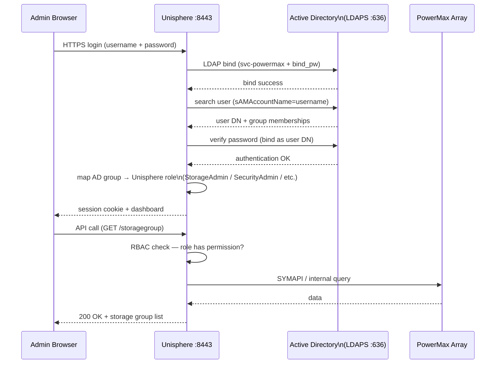

# PowerMax — Authentication

## Overview

PowerMax has two primary authentication surfaces: **Unisphere for PowerMax** (GUI and REST API) and **Solutions Enabler (SYMCLI)** running on management hosts. Both must be secured independently. Unisphere supports local accounts and external directory integration (LDAP/Active Directory). Solutions Enabler authentication is controlled at the OS level and via the SYMAPI daemon configuration.

## Unisphere Local Accounts

By default, Unisphere is provisioned with a local administrative account (`smc`) during array installation. Local accounts are stored in the Unisphere user database on the management appliance.

| Account | Default Role | Usage |
|---|---|---|
| `smc` | Administrator | Factory default admin account; should be replaced with named accounts after LDAP setup |
| Custom local accounts | Any role | Created via Unisphere → Settings → Security → Users |

```bash
# Check local user accounts via Unisphere REST API
curl -sk -u admin:password \
  https://<unisphere-host>:8443/univmax/restapi/100/system/user \
  | python3 -m json.tool

# List users from SYMCLI (solutions enabler CLI)
symuserdb list -sid <SID>
```

**Break-glass account policy:**
- Always retain at least one named local admin account in a privileged access vault (CyberArk, Thycotic, etc.) even when LDAP is the primary authentication method.
- The `smc` account should be disabled in production after LDAP is configured and tested. Re-enable only under emergency conditions.
- Rotate local account passwords on a 90-day schedule or per your organisation's password policy.

## Active Directory / LDAP Integration

Unisphere for PowerMax supports LDAP (including Active Directory via LDAP) for centrally-managed authentication. Users authenticate with their AD credentials; Unisphere maps AD group membership to internal roles.



### Configuration Steps

1. Navigate to **Unisphere → Settings → Security → LDAP Configuration**.
2. Enter the LDAP server address (use the fully-qualified domain name, not an IP, to facilitate failover to another DC).
3. Set the LDAP port: `389` (LDAP) or `636` (LDAPS — recommended).
4. Provide bind credentials — use a service account with read-only directory access (not a personal account).
5. Set the base DN for user searches: e.g., `DC=corp,DC=example,DC=com`.
6. Set the user filter: e.g., `(sAMAccountName=%s)` for Active Directory.
7. Map AD groups to Unisphere roles (see Role Mapping below).
8. Test LDAP connectivity using the built-in test button in Unisphere.
9. Log in with an AD account to validate before disabling local accounts.

### LDAP Configuration Parameters

| Parameter | Example Value | Notes |
|---|---|---|
| LDAP Server | `ldap.corp.example.com` | Use FQDN; configure secondary server for HA |
| Port | `636` (LDAPS) or `389` (LDAP) | Always use LDAPS in production |
| Bind DN | `CN=svc-powermax,OU=Service Accounts,DC=corp,DC=example,DC=com` | Read-only service account |
| Bind Password | (stored encrypted in Unisphere) | Rotate per password policy |
| Base DN | `DC=corp,DC=example,DC=com` | Top-level search base |
| User Search Filter | `(sAMAccountName=%s)` | AD attribute for username matching |
| Group Search Filter | `(member=%s)` | Used to enumerate group membership |
| LDAP Timeout | `10` seconds | Increase for slow WAN-linked DCs |
| Follow Referrals | Disabled | Enable only if using cross-domain referrals |

### LDAP Connectivity Test (Pre-configuration Validation)

Before configuring LDAP in Unisphere, test connectivity from the Unisphere management host:

```bash
# Test LDAP bind from the Unisphere host (Linux)
ldapsearch -H ldap://ldap.corp.example.com:389 \
  -D "CN=svc-powermax,OU=Service Accounts,DC=corp,DC=example,DC=com" \
  -w 'ServiceAccountPassword' \
  -b "DC=corp,DC=example,DC=com" \
  "(sAMAccountName=testuser)" cn sAMAccountName

# Test LDAPS (port 636 — TLS)
ldapsearch -H ldaps://ldap.corp.example.com:636 \
  -D "CN=svc-powermax,OU=Service Accounts,DC=corp,DC=example,DC=com" \
  -w 'ServiceAccountPassword' \
  -b "DC=corp,DC=example,DC=com" \
  "(sAMAccountName=testuser)" cn
```

A successful bind returning the test user's attributes confirms LDAP connectivity. If the test fails, resolve the connectivity issue before configuring Unisphere — an incorrect LDAP configuration can lock administrators out.

## Role Mapping

Unisphere roles are assigned to AD groups. A user's effective role is the highest-privileged role among all their group memberships.

| Unisphere Role | Permissions | Suggested AD Group Name |
|---|---|---|
| `Administrator` | Full access including user management, security settings, and all storage operations | `GRP-PowerMax-Admins` |
| `StorageAdmin` | Full read/write on storage provisioning (SGs, masking views, pools, SnapVX, SRDF). No access to security or user management | `GRP-PowerMax-StorageAdmins` |
| `SecurityAdmin` | Manage users, roles, certificates, and LDAP configuration. Cannot provision storage | `GRP-PowerMax-SecurityAdmins` |
| `Operator` | Read/write for routine operations (alert acknowledgement, scheduled tasks). Cannot create or delete storage objects | `GRP-PowerMax-Operators` |
| `Monitor` | Read-only across all array objects; can view performance data. No configuration changes | `GRP-PowerMax-Monitor` |

> **Separation of duties:** Do not assign the same AD group to both `StorageAdmin` and `SecurityAdmin`. These roles should be held by different teams — storage engineering and security engineering respectively.

## Multi-Factor Authentication (MFA)

Unisphere for PowerMax does not natively enforce MFA. To enforce MFA for Unisphere access:

- Place Unisphere behind a reverse proxy or application delivery controller (F5, Nginx) that enforces MFA via SAML 2.0 or OIDC.
- Use your organisation's Privileged Access Workstation (PAW) or jump server with MFA as the only access point to the management network where Unisphere is accessible.
- For REST API automation, use service accounts with locked-down source IP restrictions rather than personal credentials.

## Solutions Enabler (SYMCLI) Authentication

SYMCLI runs on management hosts and communicates with the array via the SYMAPI daemon. Authentication is controlled at the OS and daemon level — there is no separate login prompt for SYMCLI commands.

### Daemon User Configuration

```bash
# File controlling which OS users can connect to the SYMAPI daemon
/var/symapi/config/daemon_users   # Linux/Unix

# Format: <username> <role> <host>
# Example entries:
admin    Administrator  *
storadm  StorageAdmin   192.168.10.0/24
monitor  Monitor        192.168.10.50
```

Restrict SYMAPI daemon access:
- Only named service accounts and operations users should appear in `daemon_users`.
- Restrict by source IP where possible.
- Do not use `root` as the SYMAPI runtime account.

### SYMAPI Network Configuration

```bash
# File listing which arrays the SE host can connect to
/var/symapi/config/netcnfg   # Linux/Unix

# Example: restrict to specific array and SE host
# SYMAPI_SERVER - IP_ADDRESS - <sid> - <port>
SYMAPI_SERVER - 192.168.1.10 - 000123456789 - 2707 SECURE

# Confirm SE daemon is running
service storsrvd status      # Red Hat/CentOS/Oracle Linux
systemctl status storsrvd    # systemd-based Linux
```

### SE Authentication for Scripts

For automation scripts that run SYMCLI commands, use a dedicated service account:

```bash
# Check which user SYMCLI is running as
whoami
id

# Run SYMCLI via sudo as the dedicated service account
sudo -u storadm symcfg -sid <SID> show

# For scripted workflows using Solutions Enabler environment variables
export SYMCLI_OFFLINE=0
export SYMCLI_SID=000123456789
symcfg list
```

## Audit Logging

All configuration changes on PowerMax are recorded as audit events accessible via SYMCLI and Unisphere. Audit logs capture the user, timestamp, action, affected object, and result.

### View Audit Events

```bash
# List all recent audit events (SYMCLI)
symaudit list -sid <SID>

# Verbose listing with timestamps and user information
symaudit list -sid <SID> -v

# Filter audit events for a specific user
symaudit list -sid <SID> -v | grep -i "<username>"

# Filter for destructive operations only
symaudit list -sid <SID> -v | grep -iE "Delete|Remove|Terminate|Failover|Split"

# Export audit log to file
symaudit list -sid <SID> -v > /tmp/powermax_audit_$(date +%Y%m%d).txt

# Array system events (includes hardware and state events)
symevent list -sid <SID> -v

# Events from a specific time window
symevent list -sid <SID> -start_time "05/01/2026 00:00:00" \
  -end_time "05/07/2026 23:59:59" -v
```

### Audit Log Forwarding to SIEM

Export audit logs to a SIEM (Splunk, IBM QRadar, Microsoft Sentinel) via syslog from the Unisphere host:

1. Configure syslog forwarding on the Unisphere vApp: **Unisphere → Settings → Alert Policies → Syslog**.
2. Enter the SIEM syslog receiver IP and port (UDP 514 or TCP 514/6514).
3. Select the event categories to forward: `Audit`, `Configuration`, `Performance Alert`.
4. Validate that events appear in the SIEM within 5 minutes of generating a test configuration change.

| Audit Event Category | SIEM Use Case |
|---|---|
| Configuration changes | Change tracking; alert on changes outside maintenance windows |
| User authentication | Failed login detection; brute-force alerting |
| SRDF state changes | DR event tracking |
| SnapVX create/terminate | Backup compliance verification |
| Masking view modifications | Unauthorized LUN presentation detection |

### Audit Log Retention

- Retain array audit logs for a minimum of **12 months** for general compliance.
- **PCI-DSS** requires 12 months with 3 months immediately available.
- **SOX** and **HIPAA** typically require 6–7 years of archived log data.
- Export audit logs to immutable SIEM storage or a write-once archive. Array local logs are finite and will roll over.

## Session and Token Management

### Unisphere Session Timeout

Configure session idle timeout in **Unisphere → Settings → Security → Session Management**:

| Setting | Recommended Value | Notes |
|---|---|---|
| Session idle timeout | 15 minutes | Reduces exposure from unattended browser sessions |
| Maximum session duration | 8 hours | Force re-authentication at the end of a working shift |
| Concurrent sessions per user | 2 | Prevents session sprawl; alert on violations |

### REST API Token Authentication

For programmatic access to the Unisphere REST API, use session tokens rather than passing credentials in every request:

```bash
# Obtain a session token (POST to /session endpoint)
TOKEN=$(curl -sk -X POST \
  -H "Content-Type: application/json" \
  -u "admin:password" \
  https://<unisphere-host>:8443/univmax/restapi/system/Version \
  -c /tmp/pmx_session_cookies.txt \
  -o /dev/null -w "%{http_code}")

echo "HTTP Status: $TOKEN"

# Use session cookie for subsequent requests
curl -sk -b /tmp/pmx_session_cookies.txt \
  https://<unisphere-host>:8443/univmax/restapi/100/system/symmetrix \
  | python3 -m json.tool

# PyU4V (Python library) — handles token management automatically
pip install PyU4V

python3 <<'EOF'
import PyU4V
conn = PyU4V.PyU4V(username="admin", password="password",
                   server_ip="unisphere-host", port=8443, verify=False,
                   array_id="000123456789")
arrays = conn.common.get_array_list()
print(arrays)
conn.close_session()
EOF
```

## Certificate Management

Unisphere uses TLS certificates for HTTPS. Replacing the default self-signed certificate with a CA-signed certificate is required for production environments.

```bash
# Generate a CSR from the Unisphere host (Linux vApp)
openssl req -new -newkey rsa:4096 -nodes \
  -keyout /tmp/unisphere.key \
  -out /tmp/unisphere.csr \
  -subj "/C=GB/O=Example Corp/CN=unisphere.corp.example.com"

# Submit CSR to internal CA; receive signed certificate (unisphere.crt)

# Import certificate into Unisphere:
# Unisphere → Settings → Security → Certificates → Import Certificate
# Upload: unisphere.crt (signed cert) + unisphere.key (private key)
# Unisphere service restarts automatically after import
```

| Certificate | Renewal Trigger | Notes |
|---|---|---|
| Unisphere HTTPS certificate | 30 days before expiry | Monitor expiry with `openssl s_client` or a cert monitoring tool |
| SYMAPI daemon certificate | Per SE major version upgrade | Automatically managed by Solutions Enabler |
| SRDF encryption certificate | Per array code upgrade | Managed by PowerMaxOS; no manual renewal required |

```bash
# Check Unisphere certificate expiry from a management host
echo | openssl s_client -connect <unisphere-host>:8443 2>/dev/null \
  | openssl x509 -noout -dates

# Monitor certificate expiry (cron-friendly; exits non-zero if <30 days remain)
expiry=$(echo | openssl s_client -connect <unisphere-host>:8443 2>/dev/null \
  | openssl x509 -noout -enddate | cut -d= -f2)
days=$(( ( $(date -d "$expiry" +%s) - $(date +%s) ) / 86400 ))
echo "Certificate expires in $days days"
[[ $days -lt 30 ]] && echo "WARNING: Certificate renewal required" && exit 1
exit 0
```
