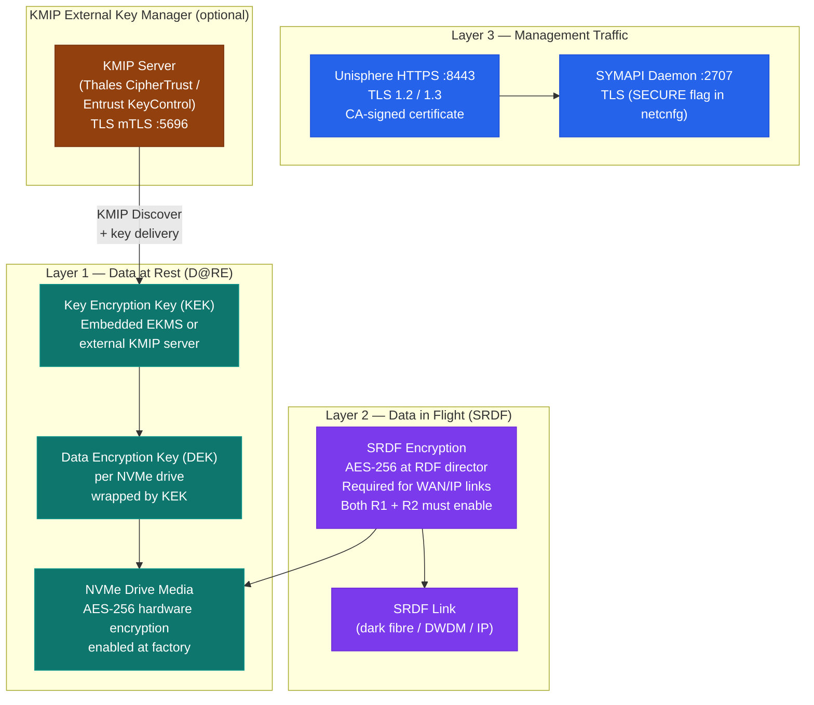

# PowerMax — Encryption


<div class="kb-summary">
Encryption reference covering Overview, Data at Rest Encryption (D@RE), Data in Flight Encryption — SRDF Encryption, Management Traffic — TLS Encryption, Encryption Key Rotation and 2 more sections.
</div>
```text
┌───────────────────────────────────── Dell PowerMax — Encryption ──────────────────────────────────────┐
│                                                                                                       │
│   ┌───────────────────────────────────────────────────────────────────────────────────────────────┐   │
│   │        PowerMax encryption: data at rest and in transit encryption for all stored data        │   │
│   │          At rest: AES-256 encryption using controller-managed or external key manager         │   │
│   │          In transit: TLS 1.2+ for management; protocol encryption for data in flight          │   │
│   │         Key management: external KMIP-compatible KMS or built-in key lifecycle manager        │   │
│   └───────────────────────────────────────────────────────────────────────────────────────────────┘   │
│                                                                                                       │
│    Enable encryption → configure KMS → verify → audit → rotate keys                                   │
│                                                                                                       │
│                  ▼                                ▼                                ▼                  │
│                                                                                                       │
│   ┌─────────────────────────────┐  ┌─────────────────────────────┐  ┌─────────────────────────────┐   │
│   │            Layer            │  │          Component          │  │           Function          │   │
│   │            Cache            │  │          DRAM 2 TB+         │  │        Sub-ms latency       │   │
│   │         FE director         │  │        FC/iSCSI ports       │  │         Host facing         │   │
│   │         BE director         │  │         NVMe drives         │  │        Storage facing       │   │
│   │             SRDF            │  │         RDF director        │  │       Metro/remote DR       │   │
│   │          TimeFinder         │  │         SnapVX/Clone        │  │       Local protection      │   │
│   └─────────────────────────────┘  └─────────────────────────────┘  └─────────────────────────────┘   │
│                                                                                                       │
│                          ▼                                                 ▼                          │
│                                                                                                       │
│   ┌───────────────────────────────────────────────────────────────────────────────────────────────┐   │
│   │      Layer       │     Standard     │     Key source    │       KMS        │      Notes       │   │
│   │     At rest      │     AES-256      │     Controller    │  Internal/KMIP   │    Always on     │   │
│   │    In transit    │     TLS 1.2+     │      PKI cert     │   Internal CA    │   Mgmt + data    │   │
│   │   Key rotation   │      Annual      │     KMS policy    │   External KMS   │    Automated     │   │
│   │    Key escrow    │     Required     │     KMS vault     │   External KMS   │    DR access     │   │
│   └───────────────────────────────────────────────────────────────────────────────────────────────┘   │
│                                                                                                       │
│    Physical: PowerMax 2500/8500 engine · FE/BE/RDF directors · DRAM cache · expansion bays            │
│                                                                                                       │
│    Key terms:                                                                                         │
│                                                                                                       │
│    PowerMax           = Dell flagship NVMe all-flash array; millions of IOPS at sub-millisecond lat...│
│    SRDF               = Symmetrix Remote Data Facility; sync/async metro and remote site replication  │
│    TimeFinder SnapVX  = space-efficient snapshot technology; up to 256 snapshots per storage group    │
│    Storage group      = logical container for volumes sharing service level and host access policy    │
│    Service level      = performance target for a storage group: Diamond, Platinum, Gold, Silver       │
│    FE director        = front-end director providing FC or iSCSI host-facing ports on the engine      │
│    BE director        = back-end director connecting engine cache to NVMe flash drive bays            │
│    RDF director       = SRDF director providing dedicated bandwidth for replication traffic           │
│    Solutions Enabler  = CLI and API toolkit; symcli commands cover all PowerMax management            │
│    Unisphere          = web GUI and REST API server for PowerMax; unified management interface        │
│    DCM                = Dynamic Cache Management; auto-balances workloads across available cache re...│
│    Service level obj. = workload performance class assigned to storage group; enforced by DPTM        │
│                                                                                                       │
└───────────────────────────────────────────────────────────────────────────────────────────────────────┘
```


## Overview

PowerMax provides encryption at three layers: data at rest on NVMe drives, data in flight over SRDF replication links, and management traffic over TLS. All three layers are independently configurable. Data at Rest Encryption (D@RE) is enabled by factory default on PowerMax 2000 and 8000 systems; replication encryption and management TLS require explicit configuration to enforce strong settings.



## Data at Rest Encryption (D@RE)

PowerMax implements D@RE using AES-256 hardware encryption on every NVMe drive. Encryption is transparent to hosts and applications — no performance impact, no configuration required on the host side.

### How D@RE Works

- Every NVMe drive in the array has an embedded encryption engine.
- Data is encrypted before being written to the drive media and decrypted on read.
- Encryption keys are managed per drive (DEK — Data Encryption Key) and wrapped by a Key Encryption Key (KEK) held in the array's key management system.
- When a drive is removed from the array, the DEK is inaccessible without the KEK; the data on the drive is cryptographically unrecoverable.
- Drive retirement and secure disposal do not require physical destruction — a cryptographic erase (key destruction) renders drive data unrecoverable instantly.

### Confirming D@RE Status

```bash
# Check encryption status via Unisphere REST API
curl -sk -u admin:password \
  https://<unisphere-host>:8443/univmax/restapi/100/system/symmetrix/<SID> \
  | python3 -m json.tool | grep -i "encry"

# Check D@RE status via SYMCLI
symcfg -sid <SID> show | grep -i "encrypt\|D@RE\|dare"

# Verify encryption on a specific storage resource pool
symcfg -sid <SID> list -srp | grep -i "encrypt"

# Via Unisphere GUI:
# System → Hardware → Drives → select a drive → Properties → Encryption: Enabled
```

### Key Management Modes

| Mode | Description | Use Case |
|---|---|---|
| Embedded EKMS | Built-in key management service on the array | Default; suitable for environments without an external KMIP server |
| External KMIP | Key management integrated with an external server (e.g., Thales CipherTrust, Vormetric, Entrust KeyControl) | Required for regulatory compliance programs that mandate external key custody |

### KMIP Integration

External KMIP (Key Management Interoperability Protocol) server integration allows you to manage encryption keys independently of the array, enabling:
- Centralized key rotation across multiple arrays
- Separation of duties between storage admin and security admin for key custody
- Key escrow and audit logging in the external key manager

#### KMIP Configuration Steps

1. Provision a KMIP server (Thales CipherTrust, Entrust KeyControl, or equivalent) and create a KMIP client certificate for the PowerMax array.
2. In Unisphere: **Settings → Security → Encryption Key Management → Add KMIP Server**.
3. Enter the KMIP server address and port (typically `5696`).
4. Upload the KMIP client certificate and CA certificate chain.
5. Test connectivity — Unisphere will attempt a KMIP `Discover` operation.
6. Configure key creation policy on the KMIP server: algorithm AES, length 256, usage mask = Encrypt + Decrypt.
7. Initiate a key rotation on the array to migrate from embedded EKMS to the external KMIP server.

#### KMIP Server Requirements

| Requirement | Specification |
|---|---|
| Protocol version | KMIP 1.1 or later |
| Transport | TLS 1.2 or 1.3 (mandatory) |
| Default port | 5696 |
| Certificate | Mutual TLS (mTLS); array presents client cert, KMIP server presents server cert |
| High availability | KMIP server must be highly available; array cannot decrypt data if KMIP is unreachable |
| Key type | AES-256 symmetric |

> **Critical:** If an external KMIP server becomes unreachable, the array cannot retrieve KEKs to decrypt drive data for new I/O. Ensure the KMIP server has redundant nodes and that the management network path to the KMIP server is fault-tolerant. Test KMIP HA failover before placing the integration into production.

### Drive Retirement and Cryptographic Erase

When retiring a failed or end-of-life drive:

```bash
# Initiate cryptographic erase (key destruction) on a specific physical drive
# This is typically done via Unisphere when removing a drive from an enclosure
# Unisphere → System → Hardware → Drive Bay → select drive → Cryptographic Erase

# Via SYMCLI (requires StorageAdmin or Administrator role):
sympd -sid <SID> erase <pd_name> -noprompt

# Verify the drive shows as erased (all data unrecoverable)
sympd show <pd_name> -sid <SID> | grep -i "erase\|state"
```

After cryptographic erase, drives can be returned to Dell or disposed of via standard e-waste without additional physical destruction. Document the erase event for compliance records.

## Data in Flight Encryption — SRDF Encryption

SRDF replication traffic traverses WAN links (dark fibre, DWDM, or IP) between sites. Without SRDF encryption, this traffic is protected only by the physical security of the link. SRDF encryption uses AES-256 to encrypt replication traffic at the RDF director level before it leaves the array.

> **Important:** SRDF encryption must be enabled on both the R1 and R2 arrays simultaneously. Mixed encrypted/unencrypted RDF groups are not supported.

### SRDF Encryption Configuration

```bash
# Check current encryption state for an RDF group
symrdf -sid <SID> -rdfg <rdfg_id> list -v | grep -i "encrypt"

# Enable SRDF encryption on an RDF group (both arrays must be at compatible code level)
# This is a disruptive operation — suspend SRDF first
symrdf -sid <SID> -rdfg <rdfg_id> suspend -noprompt

# Configure encryption via Unisphere:
# SRDF → RDF Groups → select RDFG → Edit → Enable Encryption

# Or via SYMCLI:
symrdf -sid <SID> -rdfg <rdfg_id> set -encrypt enable -noprompt

# Resume replication after enabling encryption
symrdf -sid <SID> -rdfg <rdfg_id> resume -noprompt

# Verify encryption is active
symrdf -sid <SID> -rdfg <rdfg_id> list -v | grep -i "encrypt"
```

### SRDF Encryption Scope

| SRDF Mode | Encryption Support | Notes |
|---|---|---|
| SRDF/S (Synchronous) | Supported | Encrypts all synchronous write data in flight |
| SRDF/A (Asynchronous) | Supported | Encrypts all asynchronous delta set transmissions |
| SRDF/Metro | Supported | Encrypts active-active metro writes |
| SRDF/IP | Supported | Especially important — IP links are more exposed than FC dark fibre |
| SRDF/FC (dark fibre) | Optional | Physical dark fibre may be considered adequately secured; evaluate per policy |

### When to Enable SRDF Encryption

| Scenario | Recommendation |
|---|---|
| SRDF over leased DWDM or dark fibre between owned data centres | Optional; assess physical security of the fibre path |
| SRDF/IP over MPLS or internet-connected WAN | Required — IP transport cannot be assumed secure |
| SRDF to a co-location facility | Required — shared physical infrastructure |
| SRDF to a cloud provider (SRDF/IP) | Required |
| Regulatory compliance (PCI-DSS, HIPAA, GDPR) | Required regardless of link type |

## Management Traffic — TLS Encryption

All Unisphere for PowerMax management traffic (GUI and REST API) is transported over HTTPS using TLS. Solutions Enabler network daemon traffic (SYMAPI) also supports TLS.

### Unisphere TLS Configuration

| Setting | Recommended Value | Location |
|---|---|---|
| Minimum TLS version | TLS 1.2 | Unisphere → Settings → Security → TLS |
| Maximum TLS version | TLS 1.3 | (automatic if server and client both support it) |
| Disabled protocols | TLS 1.0, TLS 1.1, SSL 3.0 | These must be explicitly disabled |
| Cipher suites | ECDHE-RSA-AES256-GCM-SHA384, ECDHE-RSA-AES128-GCM-SHA256 | Disable RC4, 3DES, and NULL cipher suites |
| Certificate | CA-signed (internal CA or public CA) | Replace default self-signed certificate |

```bash
# Verify TLS version in use from a management host
openssl s_client -connect <unisphere-host>:8443 -tls1_2 2>&1 | grep "Protocol"
openssl s_client -connect <unisphere-host>:8443 -tls1_3 2>&1 | grep "Protocol"

# Confirm TLS 1.0 is disabled (should fail)
openssl s_client -connect <unisphere-host>:8443 -tls1 2>&1 | grep "handshake failure\|no protocols"

# List accepted cipher suites
nmap --script ssl-enum-ciphers -p 8443 <unisphere-host>

# Check certificate details
echo | openssl s_client -connect <unisphere-host>:8443 2>/dev/null \
  | openssl x509 -noout -text | grep -E "Subject:|Issuer:|Not After:|Subject Alternative"
```

### SYMAPI Daemon TLS (Solutions Enabler)

The SYMAPI network daemon supports TLS for client-to-daemon communication. Enable in the `netcnfg` file:

```bash
# /var/symapi/config/netcnfg — SECURE flag enables TLS
SYMAPI_SERVER - 192.168.1.10 - 000123456789 - 2707 SECURE

# Verify daemon is listening on TLS-enabled port
netstat -tlnp | grep 2707

# Test TLS connection to the SYMAPI daemon
openssl s_client -connect 192.168.1.10:2707 2>&1 | grep -E "Protocol|Cipher"
```

## Encryption Key Rotation

Regular key rotation limits the exposure window of any compromised key.

### Embedded EKMS Key Rotation

```bash
# Initiate a key rotation on the embedded EKMS
# This is typically done via Unisphere:
# Settings → Security → Encryption Key Management → Rotate Keys

# Monitor key rotation progress
symcfg -sid <SID> show | grep -i "key\|rotation"

# Key rotation is non-disruptive — production I/O continues during rotation
# Each drive's DEK is re-wrapped with the new KEK without decrypting/re-encrypting drive media
```

### External KMIP Key Rotation

When using an external KMIP server, key rotation is initiated from the KMIP server's management interface:

1. In the KMIP server (e.g., Thales CipherTrust), create a new key for the PowerMax array.
2. Associate the new key with the array's KMIP client registration.
3. Initiate key rotation from Unisphere (Settings → Security → Encryption Key Management → Rotate).
4. Unisphere contacts the KMIP server, retrieves the new KEK, and re-wraps all drive DEKs.
5. Retain the old key in the KMIP server for at least 30 days after rotation (in case of rollback requirement).
6. Archive the old key after 30 days; do not delete it until you are confident the new key is validated across all drives.

## Compliance Reference

| Framework | Applicable Control | PowerMax Capability |
|---|---|---|
| PCI-DSS v4.0 | Req 3.5: Render PAN unreadable anywhere it is stored | D@RE (AES-256) satisfies this for cardholder data stored on PowerMax volumes |
| PCI-DSS v4.0 | Req 4.2.1: Strong cryptography for data in transit | SRDF encryption (AES-256) + TLS 1.2/1.3 for management traffic |
| HIPAA § 164.312(a)(2)(iv) | Encryption and decryption — addressable safeguard for ePHI | D@RE + SRDF encryption satisfy this as a technical safeguard |
| HIPAA § 164.312(e)(2)(ii) | Encryption of ePHI in transit | SRDF encryption for replication; TLS for management |
| NIST 800-53 Rev 5 | SC-28: Protection of information at rest | D@RE with AES-256 maps directly to this control |
| NIST 800-53 Rev 5 | SC-8: Transmission confidentiality and integrity | SRDF encryption + TLS management traffic |
| GDPR Article 32 | Appropriate technical measures including encryption | D@RE and SRDF encryption as pseudonymization/encryption controls |
| ISO 27001:2022 | A.8.24: Use of cryptography | D@RE, SRDF encryption, TLS management, and KMIP key management |
| FIPS 140-2 | Cryptographic module validation | PowerMax D@RE uses FIPS 140-2 validated cryptographic modules (confirm specific firmware level with Dell) |

## Encryption Verification Checklist

| Item | Verification Command / Location | Expected Result |
|---|---|---|
| D@RE enabled on all drives | `symcfg -sid <SID> show \| grep -i encrypt` | `Encryption: Enabled` |
| KMIP connectivity (if external) | Unisphere → Settings → Security → Encryption | Status: Connected |
| SRDF encryption enabled (WAN links) | `symrdf -sid <SID> -rdfg <id> list -v \| grep -i encrypt` | `Encryption: Enabled` |
| TLS 1.0 disabled on Unisphere | `openssl s_client -connect host:8443 -tls1` | Handshake failure |
| TLS 1.2 functional | `openssl s_client -connect host:8443 -tls1_2` | Handshake success |
| CA-signed certificate installed | `openssl s_client -connect host:8443 \| openssl x509 -noout -issuer` | Shows internal or public CA, not self-signed |
| Management cipher strength | `nmap --script ssl-enum-ciphers -p 8443 host` | Only strong GCM ciphers listed |
| SYMAPI daemon TLS enabled | `grep SECURE /var/symapi/config/netcnfg` | SECURE flag present |
