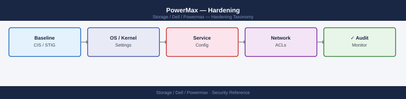
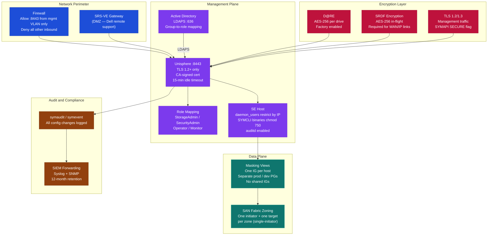
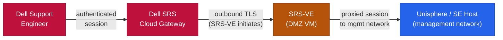

---
tags:
  - dell
  - security
---
# PowerMax — Hardening

<div class="kb-summary">
Hardening reference covering Overview, Unisphere Hardening, Solutions Enabler Hardening, Host Connectivity Hardening, SupportAssist and Remote Access Hardening and 3 more sections.

*Applies to: PowerMax 2500 / 8500*
</div>


## Before you begin

- **Access:** Storage admin credentials (cluster admin or equivalent)
- **Change management:** security changes require CAB approval in most environments
- **Rollback plan:** document current state before any security control change
- **Testing:** validate in a non-production environment first where possible

---

## Overview

PowerMax hardening focuses on three areas: securing the management interfaces (Unisphere and Solutions Enabler), securing replication and host connectivity, and reducing the attack surface through configuration discipline. PowerMax is a closed, purpose-built appliance — the hardening surface is primarily the management plane, not the array OS itself which is not directly user-accessible.



## Unisphere Hardening

### Authentication Hardening

```bash
# 1. Disable the default local 'smc' admin account after LDAP is configured
# Unisphere → Settings → Security → Users → smc → Disable

# 2. Enforce LDAP/AD as primary authentication
# Unisphere → Settings → Security → LDAP Configuration → Enable

# 3. Configure session timeout
# Unisphere → Settings → Security → Session Management
# - Idle timeout: 15 minutes
# - Max session duration: 8 hours

# 4. Test LDAP before disabling local accounts
ldapsearch -H ldaps://ldap.corp.example.com:636 \
  -D "CN=svc-powermax,OU=Service Accounts,DC=corp,DC=example,DC=com" \
  -w 'password' -b "DC=corp,DC=example,DC=com" "(sAMAccountName=<test_user>)"
```

### TLS Hardening

```bash
# Verify TLS 1.0 and 1.1 are disabled (both should fail)
openssl s_client -connect <unisphere-host>:8443 -tls1   2>&1 | grep -i "failure\|error"
openssl s_client -connect <unisphere-host>:8443 -tls1_1 2>&1 | grep -i "failure\|error"

# Verify TLS 1.2 is functional
openssl s_client -connect <unisphere-host>:8443 -tls1_2 2>&1 | grep -i "Protocol"

# Enumerate active cipher suites — check for weak ciphers
nmap --script ssl-enum-ciphers -p 8443 <unisphere-host>
# Remove any ciphers rated 'C' or lower by nmap
# Acceptable: ECDHE-RSA-AES256-GCM-SHA384, ECDHE-RSA-AES128-GCM-SHA256
# Reject: RC4, 3DES, EXPORT, NULL

# Configure TLS settings in Unisphere:
# Settings → Security → TLS Configuration
# - Minimum Version: TLS 1.2
# - Disabled: TLS 1.0, TLS 1.1
# - Preferred ciphers: GCM-based AEAD suites
```

### Certificate Hardening

Replace the factory-installed self-signed certificate before going into production:

```bash
# Step 1: Generate a private key and CSR on the Unisphere vApp
openssl req -new -newkey rsa:4096 -nodes \
  -keyout /tmp/unisphere.key \
  -out /tmp/unisphere.csr \
  -subj "/C=GB/ST=London/O=Example Corp/OU=Storage/CN=unisphere.corp.example.com" \
  -addext "subjectAltName=DNS:unisphere.corp.example.com,IP:192.168.1.100"

# Step 2: Submit CSR to internal CA; receive signed certificate chain

# Step 3: Import into Unisphere
# Settings → Security → Certificates → Import Certificate
# Upload: signed certificate + private key + CA chain

# Step 4: Restart Unisphere web service (may happen automatically after import)
systemctl restart dell-unisphere    # or equivalent on the vApp OS

# Step 5: Verify new certificate is in use
echo | openssl s_client -connect <unisphere-host>:8443 2>/dev/null \
  | openssl x509 -noout -issuer -subject -dates
```

| Certificate Parameter | Requirement |
|---|---|
| Key size | RSA 4096 or ECDSA P-256/P-384 |
| Signature algorithm | SHA-256 or stronger |
| SAN (Subject Alternative Name) | Must include the FQDN and IP address used to access Unisphere |
| Validity period | Maximum 2 years (398 days for public CAs) |
| Renewal trigger | 30 days before expiry — monitor with cron or a cert management tool |

### Network Access Hardening

Restrict access to the Unisphere management port (8443) at the network level:

```bash
# Firewall rules — limit Unisphere access to management subnet only
# Example: Linux firewalld on the Unisphere host
firewall-cmd --zone=public --add-rich-rule=\
  'rule family="ipv4" source address="192.168.10.0/24" port protocol="tcp" port="8443" accept' --permanent
firewall-cmd --zone=public --add-rich-rule=\
  'rule family="ipv4" port protocol="tcp" port="8443" drop' --permanent
firewall-cmd --reload

# Verify only management hosts can reach port 8443
nc -zv <management-host-ip> 8443   # should succeed
nc -zv <untrusted-host-ip> 8443    # should fail/timeout
```

## Solutions Enabler Hardening

### SYMAPI Daemon Hardening

```bash
# 1. Restrict daemon access to management hosts only
# /var/symapi/config/netcnfg — use SECURE flag and limit by SID
cat > /var/symapi/config/netcnfg <<'EOF'
SYMAPI_SERVER - 192.168.1.10 - 000123456789 - 2707 SECURE
SYMAPI_SERVER - 192.168.1.11 - 000987654321 - 2707 SECURE
EOF

# 2. Restrict daemon_users to named accounts only — no wildcards for admin
cat > /var/symapi/config/daemon_users <<'EOF'
storadm      StorageAdmin   192.168.10.0/24
secadm       SecurityAdmin  192.168.10.0/24
monitor_svc  Monitor        192.168.20.50
root         Administrator  127.0.0.1
EOF

# 3. Remove 'any' / '*' entries for powerful roles
grep -E "Administrator|StorageAdmin" /var/symapi/config/daemon_users | grep '\*'
# If this returns entries, replace '*' with specific IP ranges

# 4. Restart SE daemon after changes
systemctl restart storsrvd

# 5. Verify daemon is listening only on expected interfaces
netstat -tlnp | grep 2707
```

### SE Host OS Hardening

The Solutions Enabler host (typically a Linux VM) requires its own OS hardening:

```bash
# Lock down SE installation directory permissions
chmod 750 /usr/symcli/bin
chmod 750 /var/symapi/config
chmod 640 /var/symapi/config/daemon_users
chmod 640 /var/symapi/config/netcnfg
chown root:storadm /var/symapi/config/daemon_users
chown root:storadm /var/symapi/config/netcnfg

# Restrict SYMCLI binaries — only the storadm service account should execute them
chown root:storadm /usr/symcli/bin/sym*
chmod 750 /usr/symcli/bin/sym*

# Audit who has access to SYMCLI
grep -E "storadm|symcli" /etc/sudoers /etc/sudoers.d/*
```

### Logging and Audit on SE Host

```bash
# Enable auditd on the SE host to track SYMCLI execution
systemctl enable auditd
systemctl start auditd

# Add audit rules to track SYMCLI executions
cat >> /etc/audit/rules.d/powermax.rules <<'EOF'
# Track all SYMCLI command executions
-a always,exit -F dir=/usr/symcli/bin -F perm=x -F auid>=1000 -F auid!=4294967295 -k symcli
# Track changes to SE config files
-w /var/symapi/config/daemon_users -p wa -k se_config
-w /var/symapi/config/netcnfg -p wa -k se_config
EOF

augenrules --load

# Verify audit rules are active
auditctl -l | grep symcli
```

## Host Connectivity Hardening

### Zoning and Initiator Group Isolation

```bash
# Principle: each host's initiator group should contain only that host's WWNs
# Never share an initiator group between hosts with different security classifications

# Verify no initiator group contains WWNs from multiple different hosts
# (requires cross-referencing with the SAN fabric zone database)
symaccess list -sid <SID> -type initiator -v \
  > /tmp/ig_audit_$(date +%Y%m%d).txt

# Check for unusually large initiator groups (may indicate shared/misconfigured IG)
symaccess list -sid <SID> -type initiator | awk 'NR>2 && $NF > 4 {print $0}'

# Verify zones match initiator groups (SAN fabric side)
# On Brocade:
# switch:admin> zoneshow | grep <wwn>
# On Cisco MDS:
# switch# show zone member <wwn>
```

### Port Group Isolation

```bash
# Separate port groups for different security zones (e.g., production vs dev/test)
# Production hosts should NOT share port groups with dev/test hosts

# List all port groups and their member ports
symaccess list -sid <SID> -type port -v

# Verify production port groups only contain production FA ports
symaccess show PROD_FABRIC_A_PG -sid <SID> -type port

# Identify any port groups with excessive member ports (may indicate misconfiguration)
symaccess list -sid <SID> -type port | awk 'NR>2 {print $1}' | while read pg; do
  ports=$(symaccess show "$pg" -sid <SID> -type port 2>/dev/null | grep -c "Dir\|Port" || echo 0)
  echo "$pg: $ports ports"
done | sort -t: -k2 -rn | head -10
```

### Unused Object Cleanup

Regularly remove stale masking views, initiator groups, and port groups from decommissioned hosts:

```bash
# Find masking views with no current host logins (potential orphans)
# Step 1: Get all initiator groups referenced in masking views
symaccess list -sid <SID> view | awk 'NR>2 {print $2}' | sort -u > /tmp/igs_in_mvs.txt

# Step 2: Get all initiator groups that have active host logins
symaccess -sid <SID> list logins | awk '{print $4}' | sort -u > /tmp/igs_with_logins.txt

# Step 3: Find IGs in masking views but with no active logins
diff /tmp/igs_with_logins.txt /tmp/igs_in_mvs.txt | grep "^>" | awk '{print $2}'
# Review each result — these are IGs (and their masking views) with no current fabric logins

# Remove stale masking view after confirming host is decommissioned
symaccess delete view <stale_mv_name> -sid <SID>
symaccess delete -sid <SID> -name <stale_ig_name> -type initiator
```

## SupportAssist and Remote Access Hardening

SupportAssist enables Dell to proactively monitor the array and create automated service requests for hardware faults. It also enables remote support sessions.

```bash
# Verify SupportAssist configuration
# Unisphere → Connectivity → SupportAssist
# - Ensure the proxy server is configured (do not allow direct internet access)
# - Enable Connect Home: Yes (for proactive monitoring)
# - Restrict accepted connection types: Dell Support only (no third-party remote access)
```

| SupportAssist Setting | Recommended Value | Rationale |
|---|---|---|
| Connect Home | Enabled | Enables proactive monitoring and automated SR creation |
| Direct internet access | Disabled | Route through authenticated proxy |
| Proxy server | Corporate proxy with TLS inspection bypass for `dell.com` | Maintains outbound control and logging |
| Allowed inbound IP ranges | Dell support IP ranges only | Restrict who can initiate remote sessions |
| SRS Gateway (SRS-VE) | Deployed | Required for inbound remote sessions; provides DMZ isolation |

### Secure Remote Services (SRS-VE)

SRS Virtual Edition is a gateway appliance that proxies Dell remote support sessions through your DMZ, avoiding direct inbound internet access to the Unisphere management network:



Deploy SRS-VE on a dedicated VM in the DMZ. The SRS-VE makes outbound connections to the Dell SRS cloud and allows inbound sessions only from authenticated Dell support engineers.

## Hardening Checklist

### Critical (Must Complete Before Production)

- [ ] Default `smc` account disabled; named admin accounts configured via LDAP
- [ ] LDAP/AD authentication configured and tested with at least two admin accounts
- [ ] Break-glass local admin account in privileged access vault (CyberArk, Thycotic, etc.)
- [ ] Self-signed certificate replaced with CA-signed certificate on Unisphere HTTPS
- [ ] TLS 1.0 and 1.1 disabled on Unisphere (port 8443)
- [ ] Unisphere session idle timeout set to 15 minutes
- [ ] SYMAPI `daemon_users` file restricts access to named accounts by IP range
- [ ] SYMAPI `netcnfg` configured with SECURE flag; only expected SIDs listed
- [ ] D@RE confirmed enabled (factory default — verify explicitly)
- [ ] SRDF encryption enabled on all RDF groups traversing untrusted networks
- [ ] SupportAssist configured with proxy (no direct internet); SRS-VE deployed
- [ ] Unisphere access restricted to management VLAN at network/firewall level

### Important (Complete Within 30 Days)

- [ ] Syslog/audit log forwarding configured to SIEM
- [ ] Alert thresholds configured in Unisphere (response time, port utilisation, pool capacity)
- [ ] CloudIQ registered and showing healthy status
- [ ] Initiator group review completed — no shared IGs between hosts with different security classifications
- [ ] Port group review — production and dev/test port groups separated
- [ ] SE host OS hardened: auditd enabled, SYMCLI binary permissions set, sudo restrictions applied
- [ ] Service accounts for integrations (Veeam, NetBackup, Ansible) using minimum-required roles
- [ ] Certificate expiry monitoring configured (alert at 30 days before expiry)

### Periodic (Quarterly or Annually)

- [ ] Quarterly access review — audit all masking views, initiator groups, and Unisphere user accounts
- [ ] Annual DR test — SRDF failover and failback; validate RTO/RPO
- [ ] Annual penetration test — include Unisphere REST API and SYMAPI daemon in scope
- [ ] Review and rotate all service account credentials
- [ ] Review Dell security advisories for PowerMaxOS and Solutions Enabler; apply patches
- [ ] KMIP key rotation (if using external key management)
- [ ] Review and purge stale snapshots, orphaned masking views, and unused port groups

## Compliance Mapping

| Framework | Control | PowerMax Hardening Action |
|---|---|---|
| PCI-DSS v4.0 | Req 2.2: System components configured to prevent known security vulnerabilities | Disable TLS 1.0/1.1; replace self-signed cert; disable default `smc` account |
| PCI-DSS v4.0 | Req 7: Restrict access to cardholder data by business need | RBAC roles; masking view isolation; IG-per-host principle |
| PCI-DSS v4.0 | Req 8: Identify users and authenticate access | LDAP/AD authentication; named accounts; no shared credentials |
| PCI-DSS v4.0 | Req 10: Log and monitor all access | Audit log to SIEM; retain 12 months |
| NIST 800-53 | AC-2: Account Management | Disable default accounts; review quarterly; rotate service account creds |
| NIST 800-53 | AC-3: Access Enforcement | RBAC; masking view isolation |
| NIST 800-53 | AU-2: Event Logging | Audit log to SIEM; `symaudit` + `symevent` forwarding |
| NIST 800-53 | CM-7: Least Functionality | Remove unused masking views and port groups; restrict SYMAPI by IP |
| NIST 800-53 | IA-5: Authenticator Management | Rotate passwords; enforce complexity via AD policy |
| ISO 27001:2022 | A.8.2: Privileged access rights | Separate `StorageAdmin` and `SecurityAdmin` roles; review quarterly |
| ISO 27001:2022 | A.8.5: Secure authentication | LDAP/AD + MFA via jump server; session timeout |
| CIS Controls v8 | CIS 4: Secure Configuration | Hardening checklist above; periodic review |
| CIS Controls v8 | CIS 5: Account Management | Named accounts; quarterly review; disable stale accounts |

## Vulnerability Management

Monitor Dell security advisories for PowerMax components:

| Component | Advisory Source | Check Frequency |
|---|---|---|
| PowerMaxOS | Dell Security Advisories: https://www.dell.com/support/security | Monthly |
| Solutions Enabler | Same as above | Monthly |
| Unisphere for PowerMax | Same as above | Monthly |
| Unisphere vApp OS (embedded Linux) | Dell releases patched vApp versions | Per major release |

When a security advisory is published:
1. Assess applicability (is your array at the affected code level?).
2. Review workarounds if a patch is not immediately available.
3. Plan and schedule the patch/upgrade within the risk-appropriate timeframe (critical: within 30 days; high: within 60 days; medium: within 90 days).
4. Test the patch in a non-production environment first if available.
5. Document the patch application in the change management system.

---

## See also

- [Powermax — Authentication](authentication/)
- [Powermax — Access Control](access-control/)
- [Powermax — Encryption](encryption/)
