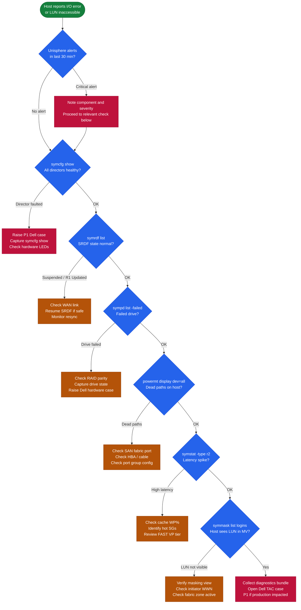

# PowerMax — Common Issues

## Common Issues

| Symptom | Likely Cause | Action |
|---|---|---|
| SRDF pair in `R1 Updated` or `Transmit Idle` | WAN link failure, R2 array unreachable, or RDF director port error | `symrdf -sid <SID> -rdfg <group> query`; check RDF port state with `symcfg -sid <SID> show`; inspect WAN link and switch port between arrays |
| SRDF pair in `Suspended` state | Manual suspend or automatic suspend triggered by I/O error on R2 | Confirm cause in Unisphere alerts; verify R2 is in a consistent state; resume with `symrdf -sid <SID> -rdfg <group> resume` |
| SnapVX session count at 256 per device | Accumulated snapshots not being expired; backup software snap retention too long | `symsnap list -sid <SID> -sg <sg>` to find stale sessions; `symsnap -sid <SID> -sg <sg> -snap <name> terminate` to remove; review backup software retention policy |
| Thin device subscription warning | Thin pool consumed capacity approaching 80–90%; thin devices over-allocated | `symcfg -sid <SID> -pool <pool> show`; expand pool with additional thin devices; identify over-consuming SGs with `symsg list -sid <SID>` |
| Director port I/O errors / link resets | SAN fabric event, failed SFP, cable issue, or host HBA problem | `symcfg -sid <SID> show` for port error counters; check switch interface statistics; inspect HBA and cable at host end |
| Host cannot see LUN after masking view creation | Incorrect port group, initiator WWN mismatch, or zone not active on fabric | Verify masking view with `symmask -sid <SID> list logins`; confirm host WWN is in initiator group; check fabric zone is active and port is online |
| Unisphere GUI inaccessible | Unisphere service stopped, vApp out of resources, or TLS certificate expired | Check Unisphere vApp VM health; restart Unisphere via `service dell-unisphere restart`; renew TLS cert if expired |
| Performance SLO violations (response time >2 ms) | Pool tier imbalance, FAST VP not migrating data, or I/O load spike | Review FAST VP tier placement in Unisphere → Performance; run `symstat -sid <SID>`; check for runaway workloads in storage groups |

## Incident Triage

When a host reports I/O errors, latency, or a LUN is inaccessible, work through this sequence before escalating.

- [ ] Check Unisphere Dashboard immediately for any active alerts flagged in the last 30 minutes — note alert severity and affected component
- [ ] Run `symcfg -sid XXXX show` to confirm array directors and ports are all healthy; look for any director in a degraded or faulted state
- [ ] Check SRDF state: `symrdf list -sid XXXX` — an unexpected `Suspended` or `R1 Updated` state may indicate the cause of host impact
- [ ] Check for failed drives: `sympd list -sid XXXX -failed` — a drive failure can cause I/O latency during rebuild
- [ ] Check host multipath status from the affected host: `powermt display dev=all` — look for dead paths or asymmetric path counts
- [ ] Check Fibre Channel port errors in Unisphere → Hardware → Directors → Ports for CRC errors or login/logout counts
- [ ] Run `symstat -sid XXXX -type r2` to check real-time array I/O statistics for throughput and latency anomalies
- [ ] Review the event log: Unisphere → System → Audit Log and filter by time of the incident

| Question | Answer |
|---|---|
| Which hosts are affected and what is the LUN device ID? | |
| What is the current SRDF state for relevant RDF groups? | |
| Are there active Unisphere alerts at the time of the incident? | |
| What is the host multipath path count and state? | |
| Are there director or port fault indicators in Unisphere? | |
