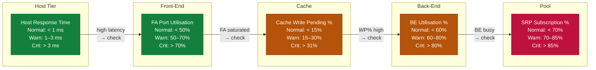

---
tags:
  - dell
  - troubleshooting
search:
  boost: 1.5
---
# PowerMax — Diagnostics


<div class="kb-summary">
Diagnostics reference covering Diagnostic Commands, Log Locations, Performance Analysis, Before Calling Support.

*Applies to: PowerMax 2500 / 8500*
</div>
```text
┌───────────────────────────────────── Dell PowerMax — Diagnostics ─────────────────────────────────────┐
│                                                                                                       │
│   ┌───────────────────────────────────────────────────────────────────────────────────────────────┐   │
│   │         PowerMax diagnostics: log collection, health checks, and performance analysis         │   │
│   │          Tools: management CLI, REST API, vendor support bundle, and system event log         │   │
│   │          Performance: check I/O latency, throughput, queue depth, and cache hit rate          │   │
│   │       Collect support bundle before contacting vendor support to reduce time-to-resolve       │   │
│   └───────────────────────────────────────────────────────────────────────────────────────────────┘   │
│                                                                                                       │
│    Identify issue → collect logs → run diagnostics → analyse → resolve                                │
│                                                                                                       │
│                  ▼                                ▼                                ▼                  │
│                                                                                                       │
│   ┌─────────────────────────────┐  ┌─────────────────────────────┐  ┌─────────────────────────────┐   │
│   │            Layer            │  │          Component          │  │           Function          │   │
│   │            Cache            │  │          DRAM 2 TB+         │  │        Sub-ms latency       │   │
│   │         FE director         │  │        FC/iSCSI ports       │  │         Host facing         │   │
│   │         BE director         │  │         NVMe drives         │  │        Storage facing       │   │
│   │             SRDF            │  │         RDF director        │  │       Metro/remote DR       │   │
│   │          TimeFinder         │  │         SnapVX/Clone        │  │       Local protection      │   │
│   └─────────────────────────────┘  └─────────────────────────────┘  └─────────────────────────────┘   │
│                                                                                                       │
│                          ▼                                                 ▼                          │
│                                                                                                       │
│   ┌───────────────────────────────────────────────────────────────────────────────────────────────┐   │
│   │    Component     │     Purpose      │      Protocol     │       Auth       │      Notes       │   │
│   │    SRDF Sync     │   Zero-RPO DR    │    RDF protocol   │   Certificate    │   Metro <200ms   │   │
│   │    SRDF Async    │  Near-zero RPO   │    RDF protocol   │   Certificate    │   Any distance   │   │
│   │    TimeFinder    │ Local snapshots  │      Internal     │ Solutions Enabl  │   256 snaps/SG   │   │
│   │Solutions Enabler │   CLI/API mgmt   │    HTTPS/symcli   │   Certificate    │     Symm CLI     │   │
│   └───────────────────────────────────────────────────────────────────────────────────────────────┘   │
│                                                                                                       │
│    Physical: PowerMax 2500/8500 engine · FE/BE/RDF directors · DRAM cache · expansion bays            │
│                                                                                                       │
│    Key terms:                                                                                         │
│                                                                                                       │
│    PowerMax           = Dell flagship NVMe all-flash array; millions of IOPS at sub-millisecond lat...│
│    SRDF               = Symmetrix Remote Data Facility; sync/async metro and remote site replication  │
│    TimeFinder SnapVX  = space-efficient snapshot technology; up to 256 snapshots per storage group    │
│    Storage group      = logical container for volumes sharing service level and host access policy    │
│    Service level      = performance target for a storage group: Diamond, Platinum, Gold, Silver       │
│    FE director        = front-end director providing FC or iSCSI host-facing ports on the engine      │
│    BE director        = back-end director connecting engine cache to NVMe flash drive bays            │
│    RDF director       = SRDF director providing dedicated bandwidth for replication traffic           │
│    Solutions Enabler  = CLI and API toolkit; symcli commands cover all PowerMax management            │
│    Unisphere          = web GUI and REST API server for PowerMax; unified management interface        │
│    DCM                = Dynamic Cache Management; auto-balances workloads across available cache re...│
│    Service level obj. = workload performance class assigned to storage group; enforced by DPTM        │
│                                                                                                       │
└───────────────────────────────────────────────────────────────────────────────────────────────────────┘
```


## Before you begin

- **Access:** Storage admin credentials (cluster admin or equivalent)
- **Gather first:** recent error message text, event timestamps, and affected object names
- **Scope:** confirm whether the issue affects a single object, host, cluster, or site
- **Escalation:** open a vendor support ticket before running any destructive step
- **Logging:** document each command and output — required if escalation is needed

---

## Diagnostic Commands

```bash
# Full array health summary
symcfg -sid <SID> show

# List all director and port states
symcfg -sid <SID> list -dir all

# Query SRDF pair state for a specific RDF group
symrdf -sid <SID> -rdfg <group> query

# List all SRDF groups and their pair counts
symdf list -sid <SID>

# List SnapVX snapshots for a storage group
symsnap list -sid <SID> -sg <storage-group>

# Check physical drive state
sympd list -sid <SID>

# Show thin pool capacity
symcfg -sid <SID> -pool <pool-name> show

# Show real-time I/O statistics
symstat -sid <SID> -type rw -i 5 -c 6

# List masking views and their components
symmaskdb -sid <SID> list database

# Show host login (initiator) visibility per port
symmask -sid <SID> list logins
```

## Log Locations

| Log | Location | Notes |
|---|---|---|
| Solutions Enabler daemon log | `/var/symapi/log/se_deamons.log` (Linux) | Main SE service log; check for connection and authentication errors |
| SYMCLI command log | `/var/symapi/log/` | Per-command log files created for each SYMCLI invocation |
| Unisphere application log | Unisphere vApp → `/var/log/emc/` | Web service and API errors |
| Array sysmgr log | Accessible via Dell Support remote session | Internal array operating system logs; not user-accessible |
| Audit log (SYMCLI) | `symevent -sid <SID> list` | Records all configuration change events on the array |

## Performance Analysis

### Quick Performance Check (SYMCLI)

```bash
# Storage Group I/O stats — snapshot
symstat -sid <sid> list -type sg

# Device-level stats — identify hot volumes
symstat -sid <sid> list -type dev | sort -k4 -rn | head -20   # sort by read IOPS

# Cache write pending — should stay below 31%
symstat -sid <sid> list -type cache | grep -E "WP|Write Pending"

# Front-end port utilisation
symstat -sid <sid> list -type port | grep -v "^$" | sort -k5 -rn | head -10
```

### Key Metrics and Thresholds



| Metric | Normal | Warning | Critical |
|---|---|---|---|
| Read Response Time | < 1 ms | 1–3 ms | > 3 ms |
| Write Response Time | < 1 ms | 1–3 ms | > 3 ms |
| Cache Write Pending % | < 15% | 15–30% | > 31% |
| SRP Subscription % | < 70% | 70–85% | > 85% |
| FA Port Utilisation % | < 50% | 50–70% | > 70% |
| BE Utilisation % | < 60% | 60–80% | > 80% |

### Continuous Monitoring

```bash
# Monitor SG stats every 30 seconds for 10 minutes
symstat -sid <sid> list -type sg -i 30 -c 20

# Monitor a specific device
symstat -sid <sid> list -type dev -devn <devname> -i 10 -c 30

# Monitor cache in real time
symstat -sid <sid> list -type cache -i 30
```

### Identify Performance Issues

```bash
# High latency investigation — find the busiest SGs
symstat -sid <sid> list -type sg | sort -k6 -rn | head -10   # sort by response time

# Back-end busy — check disk group saturation
symstat -sid <sid> list -type be | sort -k5 -rn | head -10

# SRDF impact — RDF director stats
symstat -sid <sid> list -type rdf

# Host sending too many IOPS — check IG → SG → device mapping
symaccess show view <view_name> -sid <sid>
```

### Unisphere for PowerMax Performance Dashboard

Unisphere provides 7-day rolling performance history:
- **System → Performance → Array** — overall throughput and latency
- **System → Performance → Storage Group** — per-SG response time, IOPS, MB/s
- **System → Performance → Port** — per-FA-port utilisation and I/O count
- **Alert Policies** — set thresholds to generate email/SNMP alerts

### Dell CloudIQ

CloudIQ provides longer-term performance trending (30+ days) and anomaly detection:
- Automatically collects metrics from connected PowerMax arrays
- Latency forecasting and proactive alerts
- Cross-array comparison and capacity planning
- Access via [cloudiq.dell.com](https://cloudiq.dell.com)

### Performance Data for TAC

```bash
# Collect 15-minute perf data for all subsystems
for type in sg dev dir be cache rdf port; do
    symstat -sid <sid> list -type $type -i 60 -c 15 > /tmp/powermax-${type}-perf-$(date +%Y%m%d).txt &
done
wait
tar czf /tmp/powermax-perf-$(date +%Y%m%d).tar.gz /tmp/powermax-*-perf-*.txt
```

## Before Calling Support

Collect the following before opening a Dell Support case:

1. Symmetrix SID: `symcfg list`
2. PowerMaxOS version: `symcfg -sid <SID> show | grep -i "microcode"`
3. Solutions Enabler version: `symcli -version`
4. Full array health output: `symcfg -sid <SID> show > array_health.txt`
5. SRDF group state (if replication issue): `symrdf -sid <SID> -rdfg <group> query > srdf_state.txt`
6. Director/port status: `symcfg -sid <SID> list -dir all > director_status.txt`
7. Recent Unisphere alerts: export from Unisphere → Alerts → Export
8. Symptom description, time of first occurrence, and business impact

Use Dell SupportAssist (if licensed) to automatically collect and upload diagnostic bundles: accessible from Unisphere → System → SupportAssist.

---

## Verify resolution

- Confirm the original symptom no longer occurs
- Check logs for any residual errors related to the issue
- Monitor for 10–15 minutes to confirm the fix is stable

---

## See also

- [Powermax — Common Issues](common-issues/)
- [Powermax — Escalation](escalation/)
- [Powermax — Health Checks](../operations/health-checks/)
