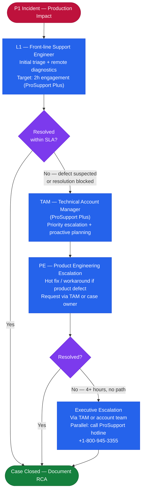

---
tags:
  - dell
  - troubleshooting
---
# PowerMax — Escalation


<div class="kb-summary">
Escalation reference covering Support Portal, Opening a Case, Information to Collect, SLA Tiers, Escalation Path.
</div>
```text
┌───────────────────────────────────── Dell PowerMax — Escalation ──────────────────────────────────────┐
│                                                                                                       │
│   ┌───────────────────────────────────────────────────────────────────────────────────────────────┐   │
│   │      PowerMax escalation: severity triage, vendor support contact, and required artifacts     │   │
│   │         L1: basic checks, restart services; L2: log analysis, config review, vendor SR        │   │
│   │        Severity: P1 production down → immediate SR + on-call page; P2/P3 business hours       │   │
│   │         Before escalating: collect support bundle, event timeline, and change history         │   │
│   └───────────────────────────────────────────────────────────────────────────────────────────────┘   │
│                                                                                                       │
│    Detect issue → triage severity → collect artifacts → open SR → update                              │
│                                                                                                       │
│                  ▼                                ▼                                ▼                  │
│                                                                                                       │
│   ┌─────────────────────────────┐  ┌─────────────────────────────┐  ┌─────────────────────────────┐   │
│   │            Layer            │  │          Component          │  │           Function          │   │
│   │            Cache            │  │          DRAM 2 TB+         │  │        Sub-ms latency       │   │
│   │         FE director         │  │        FC/iSCSI ports       │  │         Host facing         │   │
│   │         BE director         │  │         NVMe drives         │  │        Storage facing       │   │
│   │             SRDF            │  │         RDF director        │  │       Metro/remote DR       │   │
│   │          TimeFinder         │  │         SnapVX/Clone        │  │       Local protection      │   │
│   └─────────────────────────────┘  └─────────────────────────────┘  └─────────────────────────────┘   │
│                                                                                                       │
│                          ▼                                                 ▼                          │
│                                                                                                       │
│   ┌───────────────────────────────────────────────────────────────────────────────────────────────┐   │
│   │     Severity     │     Criteria     │   Response time   │      Owner       │    Vendor SLA    │   │
│   │        P1        │ Production down  │     Immediate     │   On-call + L2   │    1 hr 24x7     │   │
│   │        P2        │  Major degraded  │       1 hour      │   L2 engineer    │   4 hr biz hrs   │   │
│   │        P3        │  Minor degraded  │      4 hours      │   L2 engineer    │   8 hr biz hrs   │   │
│   │        P4        │    No impact     │    Next biz day   │    L1 support    │    2 biz days    │   │
│   └───────────────────────────────────────────────────────────────────────────────────────────────┘   │
│                                                                                                       │
│    Physical: PowerMax 2500/8500 engine · FE/BE/RDF directors · DRAM cache · expansion bays            │
│                                                                                                       │
│    Key terms:                                                                                         │
│                                                                                                       │
│    PowerMax           = Dell flagship NVMe all-flash array; millions of IOPS at sub-millisecond lat...│
│    SRDF               = Symmetrix Remote Data Facility; sync/async metro and remote site replication  │
│    TimeFinder SnapVX  = space-efficient snapshot technology; up to 256 snapshots per storage group    │
│    Storage group      = logical container for volumes sharing service level and host access policy    │
│    Service level      = performance target for a storage group: Diamond, Platinum, Gold, Silver       │
│    FE director        = front-end director providing FC or iSCSI host-facing ports on the engine      │
│    BE director        = back-end director connecting engine cache to NVMe flash drive bays            │
│    RDF director       = SRDF director providing dedicated bandwidth for replication traffic           │
│    Solutions Enabler  = CLI and API toolkit; symcli commands cover all PowerMax management            │
│    Unisphere          = web GUI and REST API server for PowerMax; unified management interface        │
│    DCM                = Dynamic Cache Management; auto-balances workloads across available cache re...│
│    Service level obj. = workload performance class assigned to storage group; enforced by DPTM        │
│                                                                                                       │
└───────────────────────────────────────────────────────────────────────────────────────────────────────┘
```


## Before you begin

- **Access:** Storage admin credentials (cluster admin or equivalent)
- **Gather first:** recent error message text, event timestamps, and affected object names
- **Scope:** confirm whether the issue affects a single object, host, cluster, or site
- **Escalation:** open a vendor support ticket before running any destructive step
- **Logging:** document each command and output — required if escalation is needed

---

## Support Portal

Dell support for PowerMax is managed through: https://www.dell.com/support

- Log in with your My Dell account (company entitlement required).
- Register the array serial number under **My Products** to attach the support contract.
- **SupportAssist**: Enable SupportAssist on the array (Unisphere → Connectivity → SupportAssist) to allow Dell to proactively monitor the system and auto-create service requests for hardware faults.
- **CloudIQ**: Linked to the support contract; provides health scores, capacity forecasts, and anomaly alerts that can feed directly into support cases.
- **Secure Remote Services (SRS)**: Dell's secure remote access gateway; required for remote support sessions. Deploy the SRS virtual edition (SRS-VE) on the management network.

## Opening a Case

Required information for every support case:

| Field | How to Obtain |
|---|---|
| Array serial number (SID) | `symcfg list` — the 12-digit Symmetrix ID |
| PowerMaxOS version | `symcfg -sid <SID> show \| grep -i microcode` |
| Solutions Enabler version | `symcli -version` |
| Symptom description | Clear statement of observed behaviour and affected objects |
| Time of first occurrence | Exact timestamp from Unisphere alert or symevent log |
| Business impact | Number of hosts/applications affected; production or non-production |

Open a case at: https://www.dell.com/support → My Service Requests → Create Service Request

## Information to Collect

Run the following before or immediately after opening the case:

```bash
# Full array health and configuration snapshot
symcfg -sid <SID> show > /tmp/pmx_health_$(date +%Y%m%d).txt

# Director and port status
symcfg -sid <SID> list -dir all >> /tmp/pmx_health_$(date +%Y%m%d).txt

# Physical drive state
sympd list -sid <SID> >> /tmp/pmx_health_$(date +%Y%m%d).txt

# SRDF group and pair state
symdf list -sid <SID> >> /tmp/pmx_health_$(date +%Y%m%d).txt
symrdf -sid <SID> -rdfg <rdfg-number> query >> /tmp/pmx_health_$(date +%Y%m%d).txt

# Audit events from the last 24 hours
symevent -sid <SID> list -last 500 >> /tmp/pmx_health_$(date +%Y%m%d).txt

# Collect a full SE diagnostic bundle (requires SE host root or sudo)
seconfig collect -out /tmp/se_diag_$(date +%Y%m%d).zip
```

For hardware faults (drive failure, director offline), Dell SupportAssist can collect and upload a diagnostic bundle automatically if enabled. Confirm auto-collection is running in Unisphere → Connectivity → SupportAssist.

## SLA Tiers

Dell ProSupport Plus SLA response times:

| Severity | Definition | ProSupport Plus Response |
|---|---|---|
| P1 – Critical | Complete loss of production functionality; no workaround | 2 hours onsite or remote support engagement |
| P2 – High | Significant degradation; workaround exists but not sustainable | 4 hours remote support engagement |
| P3 – Medium | Partial degradation; workaround available | Next business day |
| P4 – Low | General guidance, documentation, or non-urgent request | Next business day |

ProSupport (standard, without Plus) carries P1 = 4-hour response, P2 = next business day.

## Escalation Path



1. **Front-line support engineer**: Initial case triage and remote diagnostics.
2. **Technical Account Manager (TAM)**: Assigned under ProSupport Plus. Use for proactive planning, upgrade guidance, and priority case escalation.
3. **Product Engineering (PE) escalation**: Request via the TAM or case owner when a suspected product defect is involved. PE can issue hot fixes and workarounds.
4. **Executive escalation**: For critical production outages with no resolution path after 4+ hours. Request through the TAM or account team.

Always reference the case number in all communications. For P1 issues, also call the Dell ProSupport phone line directly in parallel with the web case to ensure immediate engagement.

Dell ProSupport phone (US): 1-800-945-3355

---

## Verify resolution

- Confirm the original symptom no longer occurs
- Check logs for any residual errors related to the issue
- Monitor for 10–15 minutes to confirm the fix is stable
