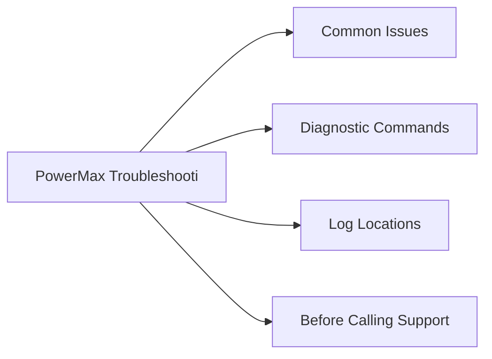

# PowerMax Troubleshooting



## Common Issues

| Symptom | Likely Cause | Action |
|---|---|---|
| SRDF pair in `R1 Updated` or `Transmit Idle` | WAN link failure, R2 array unreachable, or RDF director port error | `symrdf -sid <SID> -rdfg <group> query`; check RDF port state with `symcfg -sid <SID> show`; inspect WAN link and switch port between arrays |
| SRDF pair in `Suspended` state | Manual suspend or automatic suspend triggered by I/O error on R2 | Confirm cause in Unisphere alerts; verify R2 is in a consistent state; resume with `symrdf -sid <SID> -rdfg <group> resume` |
| SnapVX session count at 256 per device | Accumulated snapshots not being expired; backup software snap retention too long | `symsnap list -sid <SID> -sg <sg>` to find stale sessions; `symsnap -sid <SID> -sg <sg> -snap <name> terminate` to remove; review backup software retention policy |
| Thin device subscription warning | Thin pool consumed capacity approaching 80–90%; thin devices over-allocated | `symcfg -sid <SID> -pool <pool> show`; expand pool with additional thin devices; identify over-consuming SGs with `symsg list -sid <SID>` |
| Director port I/O errors / link resets | SAN fabric event, failed SFP, cable issue, or host HBA problem | `symcfg -sid <SID> show` for port error counters; check switch interface statistics; inspect HBA and cable at host end |
| Host cannot see LUN after masking view creation | Incorrect port group, initiator WWN mismatch, or zone not active on fabric | Verify masking view with `symmask -sid <SID> list logins`; confirm host WWN is in initiator group; check fabric zone is active and port is online |
| Unisphere GUI inaccessible | Unisphere service stopped, vApp out of resources, or TLS certificate expired | Check Unisphere vApp VM health; restart Unisphere via `service dell-unisphere restart`; renew TLS cert if expired |
| Performance SLO violations (response time >2 ms) | Pool tier imbalance, FAST VP not migrating data, or I/O load spike | Review FAST VP tier placement in Unisphere → Performance; run `symstat -sid <SID>`; check for runaway workloads in storage groups |

## Diagnostic Commands

```bash
# Full array health summary
symcfg -sid <SID> show

# List all director and port states
symcfg -sid <SID> list -dir all

# Query SRDF pair state for a specific RDF group
symrdf -sid <SID> -rdfg <group> query

# List all SRDF groups and their pair counts
symdf list -sid <SID>

# List SnapVX snapshots for a storage group
symsnap list -sid <SID> -sg <storage-group>

# Check physical drive state
sympd list -sid <SID>

# Show thin pool capacity
symcfg -sid <SID> -pool <pool-name> show

# Show real-time I/O statistics
symstat -sid <SID> -type rw -i 5 -c 6

# List masking views and their components
symmaskdb -sid <SID> list database

# Show host login (initiator) visibility per port
symmask -sid <SID> list logins
```

## Log Locations

| Log | Location | Notes |
|---|---|---|
| Solutions Enabler daemon log | `/var/symapi/log/se_deamons.log` (Linux) | Main SE service log; check for connection and authentication errors |
| SYMCLI command log | `/var/symapi/log/` | Per-command log files created for each SYMCLI invocation |
| Unisphere application log | Unisphere vApp → `/var/log/emc/` | Web service and API errors |
| Array sysmgr log | Accessible via Dell Support remote session | Internal array operating system logs; not user-accessible |
| Audit log (SYMCLI) | `symevent -sid <SID> list` | Records all configuration change events on the array |

## Before Calling Support

Collect the following before opening a Dell Support case:

1. Symmetrix SID: `symcfg list`
2. PowerMaxOS version: `symcfg -sid <SID> show | grep -i "microcode"`
3. Solutions Enabler version: `symcli -version`
4. Full array health output: `symcfg -sid <SID> show > array_health.txt`
5. SRDF group state (if replication issue): `symrdf -sid <SID> -rdfg <group> query > srdf_state.txt`
6. Director/port status: `symcfg -sid <SID> list -dir all > director_status.txt`
7. Recent Unisphere alerts: export from Unisphere → Alerts → Export
8. Symptom description, time of first occurrence, and business impact

Use Dell SupportAssist (if licensed) to automatically collect and upload diagnostic bundles: accessible from Unisphere → System → SupportAssist.
