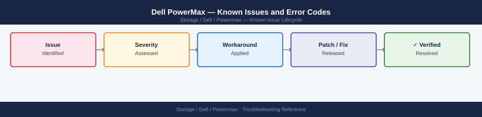

---
tags:
  - troubleshooting
  - powermax
  - dell
  - known-issues
---
# Dell PowerMax — Known Issues and Error Codes

Catalog of known PowerMax bugs, error codes, and workarounds covering Unisphere, SRDF, host connectivity, and Solutions Enabler.

*Applies to: PowerMax 2000/8000, Unisphere 10.x, SE 10.x*

## Before you begin

- PowerMax alerts appear in Unisphere for PowerMax → Alerts Dashboard.
- Use `symcfg list -health` via Solutions Enabler to get array health status.
- ESRS / SRS must be active for Dell proactive support and SRDF remote replication monitoring.

## Host Connectivity

| Error / Symptom | Affected Versions | Cause | Workaround / Fix | Fixed In |
|---|---|---|---|---|
| Host sees LUN but cannot write — `No access` | PowerMax | Masking view not including host initiator | Add host initiator to correct masking view in Unisphere → Host Groups | N/A |
| iSCSI host loses path after PowerMax iSCSI IP change | PowerMax | Host iSCSI discovery DB not updated | Run `iscsiadm -m discovery -t st -p <new-ip>`; reconnect sessions | N/A |

## SRDF

| Error / Symptom | Affected Versions | Cause | Workaround / Fix | Fixed In |
|---|---|---|---|---|
| SRDF/S pair shows `Not Ready` | PowerMax | WAN link interruption; SRDF suspended itself | Resume SRDF: `symrdf -g <dev-group> resume`; verify RTT ≤5ms | N/A |
| SRDF/A journal overflow | PowerMax | Delta changes exceed journal capacity during WAN outage | Expand journal LUN; reduce SRDF/A cycle time; ensure WAN recovery before journal fills | N/A |

## Unisphere

| Error / Symptom | Affected Versions | Cause | Workaround / Fix | Fixed In |
|---|---|---|---|---|
| Unisphere UI shows `Array unavailable` | Unisphere 10.x | SYMAPI server not running on Unisphere host | Restart: `symapid stop; symapid start` | N/A |
| Performance dashboard shows `No data` | Unisphere 10.x | Performance data collection not enabled | Enable: Unisphere → System → Manage → Performance Collection | N/A |

## Solutions Enabler

| Error / Symptom | Affected Versions | Cause | Workaround / Fix | Fixed In |
|---|---|---|---|---|
| `stordaemon` not running — all SE commands fail | SE 10.x | `stordaemon` service crashed | Restart: `stordaemon restart all` | N/A |
| `Error 40: No devices discovered` | SE 10.x | SYMAPI server not connected to PowerMax | Check SYMAPI config: `cat /opt/emc/SYMCLI/bin/symapi/config/options` | N/A |

## See also

- [Dell PowerMax — Common Issues](common-issues/)
- [Dell SRDF-A — Known Issues](../../srdf-a/troubleshooting/known-issues.md)
- [Dell SRDF-S — Known Issues](../../srdf-s/troubleshooting/known-issues.md)
