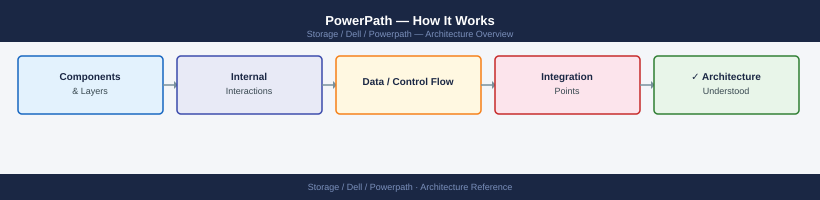
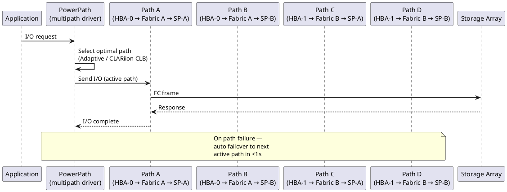

---
tags:
  - architecture
  - dell
---
# PowerPath — How It Works

<div class="kb-summary">
How It Works reference covering Overview, Host-Side MPIO Stack, Path States, Load-Balancing Policies, Failover and Recovery and 2 more sections.

*Applies to: PowerPath*
</div>




## Overview

Dell PowerPath is a host-side multipath I/O driver that sits between the OS block device layer and the physical HBA/iSCSI initiator layer. It intercepts I/O destined for storage LUNs and distributes it across all available physical paths, providing automatic failover on path loss and load balancing across healthy paths. PowerPath presents a single virtual (pseudo) device per LUN to the OS regardless of how many physical paths exist.

## Host-Side MPIO Stack

```d2
direction: right

HOST: "Host — Linux / Windows / VMware" {shape: rectangle}
PP: "PowerPath\n(MPIO driver" {shape: rectangle}
P1: "HBA0 → Fabric A → SP-A" {shape: rectangle}
P2: "HBA0 → Fabric A → SP-B" {shape: rectangle}
P3: "HBA1 → Fabric B → SP-A" {shape: rectangle}
P4: "HBA1 → Fabric B → SP-B" {shape: rectangle}
ARRAY: "Storage Array\nPowerMax / Unity" {shape: rectangle}

HOST -> PP
PP -> P1
PP -> P2
PP -> P3
PP -> P4
P1 -> P2
P2 -> P3
P3 -> P4
P4 -> ARRAY
```

## Path States

On startup, PowerPath discovers all LUNs visible across all HBA ports and groups paths to the same LUN into a single pseudo device.

| State | Meaning |
|---|---|
| `alive` | Path is healthy and eligible for I/O |
| `dead` | Path has failed I/O tests; excluded from routing |
| `unlic` | Path is not licensed; I/O will not be sent over this path |

## Load-Balancing Policies

| Policy | Code | Description |
|---|---|---|
| CLAROpt | `co` | Dell/EMC optimised — ALUA-aware; prefers active-optimised paths on PowerMax, Unity |
| RoundRobin | `rr` | Even distribution across all paths regardless of ALUA state (not recommended for Dell arrays) |
| BasicFailover | `bf` | Uses one path; fails over to another on failure; no load balancing |

CLAROpt is the recommended policy for all Dell/EMC arrays. It respects ALUA path preferences and avoids non-optimised paths under normal conditions.

## Failover and Recovery

On path failure, PowerPath automatically marks the path `dead` and re-routes I/O to remaining `alive` paths within milliseconds. Path restoration is automatic — when a failed path recovers, `powermt restore` (run periodically by the daemon or manually) retests dead paths and promotes them back to `alive`.

## Supported Platforms

| OS | Notes |
|---|---|
| Linux (RHEL, SLES, Ubuntu) | RPM/DEB package; integrates with dm-multipath (replaces it) |
| Windows Server | MSI installer; presents pseudo devices as disk objects |
| VMware ESXi | vSphere plug-in; used with PowerMax and Unity |
| AIX, HP-UX, Solaris | Legacy OS support — check PowerPath compatibility matrix |

## Key Commands

```bash
powermt display              # show all pseudo devices and path states
powermt display dev=all      # verbose path detail per device
powermt restore              # retest dead paths and restore alive
powermt check_registration   # verify PowerPath license is registered
```


```text title="Expected output"
Symmetrix ID: 000123456789ABCD
Logical Device ID: 0001
state=alive; policy=SymmOpt; queued-IOs=0; total-IOs=12847392
------------ Host --------- -- Logical Device -- -- Dev -- -- Symmetrix -- -- Logical
Initiator    Name          Sym ID             Attr Sts Logical  ID          Device
c0t0d0       emc0          000123456789ABCD   N   U   0001      000123456789ABCD 0001
c1t1d0       emc0          000123456789ABCD   N   U   0001      000123456789ABCD 0001
c2t2d0       emc0          000123456789ABCD   N   D   0001      000123456789ABCD 0001
c3t3d0       emc0          000123456789ABCD   N   U   0001      000123456789ABCD 0001

Restore: 1 dead path(s) restored, 0 path(s) still dead
Registration: PowerPath license registered for Symmetrix ID 000123456789ABCD
```

!!! warning "Common errors"
    **`powermt: command not found`** — Install EMC PowerPath software or add /opt/PowerPath/bin to your PATH environment variable.
    **`Restore: 0 dead path(s) restored, 0 path(s) still dead`** — All paths are already alive; this is normal output if no paths were previously marked dead.
---

## See also

- [Powerpath — Design Standards](../design-standards/)
- [Powerpath — Integrations](../integrations/)
