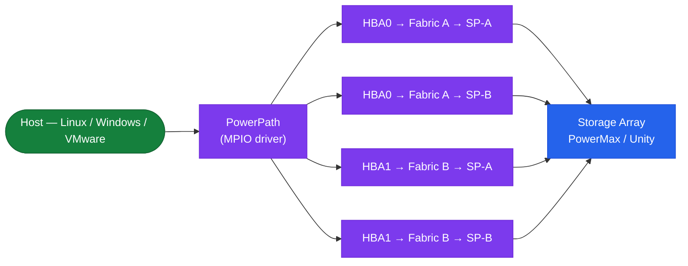

# PowerPath — How It Works


<div class="kb-summary">
How It Works reference covering Overview, Host-Side MPIO Stack, Path States, Load-Balancing Policies, Failover and Recovery and 2 more sections.
</div>
```text
┌──────────────────────────────────── Dell PowerPath — How It Works ────────────────────────────────────┐
│                                                                                                       │
│   ┌───────────────────────────────────────────────────────────────────────────────────────────────┐   │
│   │     PowerPath operational flow: request → controller → data service → host acknowledgement    │   │
│   │         Data path: host I/O → PowerPath controller → storage media → persistent write         │   │
│   │ Management: powermt CLI / PowerPath Management Appliance provides unified control for all ope │   │
│   │           Protection: snapshots, replication, and redundancy ensure data durability           │   │
│   └───────────────────────────────────────────────────────────────────────────────────────────────┘   │
│                                                                                                       │
│    Host I/O → PowerPath controller → storage media → acknowledge → replicate                          │
│                                                                                                       │
│                  ▼                                ▼                                ▼                  │
│                                                                                                       │
│   ┌─────────────────────────────┐  ┌─────────────────────────────┐  ┌─────────────────────────────┐   │
│   │            Layer            │  │          Component          │  │            Notes            │   │
│   │            Driver           │  │        powermt daemon       │  │           OS-level          │   │
│   │            Paths            │  │        Active-active        │  │         ≥4 paths/LUN        │   │
│   │            Policy           │  │        Adaptive/ALUA        │  │        Array-specific       │   │
│   │           Failover          │  │         Auto reroute        │  │          <5 sec RTO         │   │
│   │          Management         │  │           pp_mgmt           │  │         Centralised         │   │
│   └─────────────────────────────┘  └─────────────────────────────┘  └─────────────────────────────┘   │
│                                                                                                       │
│                          ▼                                                 ▼                          │
│                                                                                                       │
│   ┌───────────────────────────────────────────────────────────────────────────────────────────────┐   │
│   │    Component     │     Purpose      │      Command      │      Notes       │    Frequency     │   │
│   │ powermt display  │ Show path state  │  powermt display  │   Active/dead    │   Daily check    │   │
│   │  powermt check   │  Refresh paths   │   powermt check   │  After changes   │   Post-zoning    │   │
│   │  powermt config  │  Apply license   │  powermt config l │     Per host     │   Install time   │   │
│   │     pp_mgmt      │ Central monitor  │       Web UI      │     Optional     │    Multi-host    │   │
│   └───────────────────────────────────────────────────────────────────────────────────────────────┘   │
│                                                                                                       │
│    Physical: Host OS (Windows/Linux) · HBA or iSCSI NIC ports · FC/IP switches · Dell arrays          │
│                                                                                                       │
│    Key terms:                                                                                         │
│                                                                                                       │
│    PowerPath          = Dell multipath driver; manages multiple I/O paths to storage for HA/perform...│
│    powermt            = CLI utility; powermt display, powermt check, powermt save are core commands   │
│    Pseudo device      = virtual block device created by PowerPath aggregating physical I/O paths      │
│    Path health        = alive or dead status per path; dead paths trigger automatic I/O failover      │
│    Adaptive policy    = load-balancing that distributes I/O across all active paths evenly            │
│    CLARiiON policy    = active/passive policy for older VNX/CLARiiON arrays (one active path)         │
│    ALUA               = Asymmetric Logical Unit Access; array signals preferred vs. non-preferred p...│
│    Trespass           = LUN ownership movement between SP-A and SP-B on Unity or VNX arrays           │
│    Ghost path         = stale path entry in PowerPath no longer backed by a physical device           │
│    powermt check      = validates all paths and refreshes device table; run after fabric changes      │
│    pp_mgmt            = PowerPath Management Appliance; central monitoring for all PowerPath hosts    │
│    License key        = host-based license required per server; applied via powermt config license    │
│                                                                                                       │
└───────────────────────────────────────────────────────────────────────────────────────────────────────┘
```


## Overview

Dell PowerPath is a host-side multipath I/O driver that sits between the OS block device layer and the physical HBA/iSCSI initiator layer. It intercepts I/O destined for storage LUNs and distributes it across all available physical paths, providing automatic failover on path loss and load balancing across healthy paths. PowerPath presents a single virtual (pseudo) device per LUN to the OS regardless of how many physical paths exist.

## Host-Side MPIO Stack



## Path States

On startup, PowerPath discovers all LUNs visible across all HBA ports and groups paths to the same LUN into a single pseudo device.

| State | Meaning |
|---|---|
| `alive` | Path is healthy and eligible for I/O |
| `dead` | Path has failed I/O tests; excluded from routing |
| `unlic` | Path is not licensed; I/O will not be sent over this path |

## Load-Balancing Policies

| Policy | Code | Description |
|---|---|---|
| CLAROpt | `co` | Dell/EMC optimised — ALUA-aware; prefers active-optimised paths on PowerMax, Unity |
| RoundRobin | `rr` | Even distribution across all paths regardless of ALUA state (not recommended for Dell arrays) |
| BasicFailover | `bf` | Uses one path; fails over to another on failure; no load balancing |

CLAROpt is the recommended policy for all Dell/EMC arrays. It respects ALUA path preferences and avoids non-optimised paths under normal conditions.

## Failover and Recovery

On path failure, PowerPath automatically marks the path `dead` and re-routes I/O to remaining `alive` paths within milliseconds. Path restoration is automatic — when a failed path recovers, `powermt restore` (run periodically by the daemon or manually) retests dead paths and promotes them back to `alive`.

## Supported Platforms

| OS | Notes |
|---|---|
| Linux (RHEL, SLES, Ubuntu) | RPM/DEB package; integrates with dm-multipath (replaces it) |
| Windows Server | MSI installer; presents pseudo devices as disk objects |
| VMware ESXi | vSphere plug-in; used with PowerMax and Unity |
| AIX, HP-UX, Solaris | Legacy OS support — check PowerPath compatibility matrix |

## Key Commands

```bash
powermt display              # show all pseudo devices and path states
powermt display dev=all      # verbose path detail per device
powermt restore              # retest dead paths and restore alive
powermt check_registration   # verify PowerPath license is registered
```
