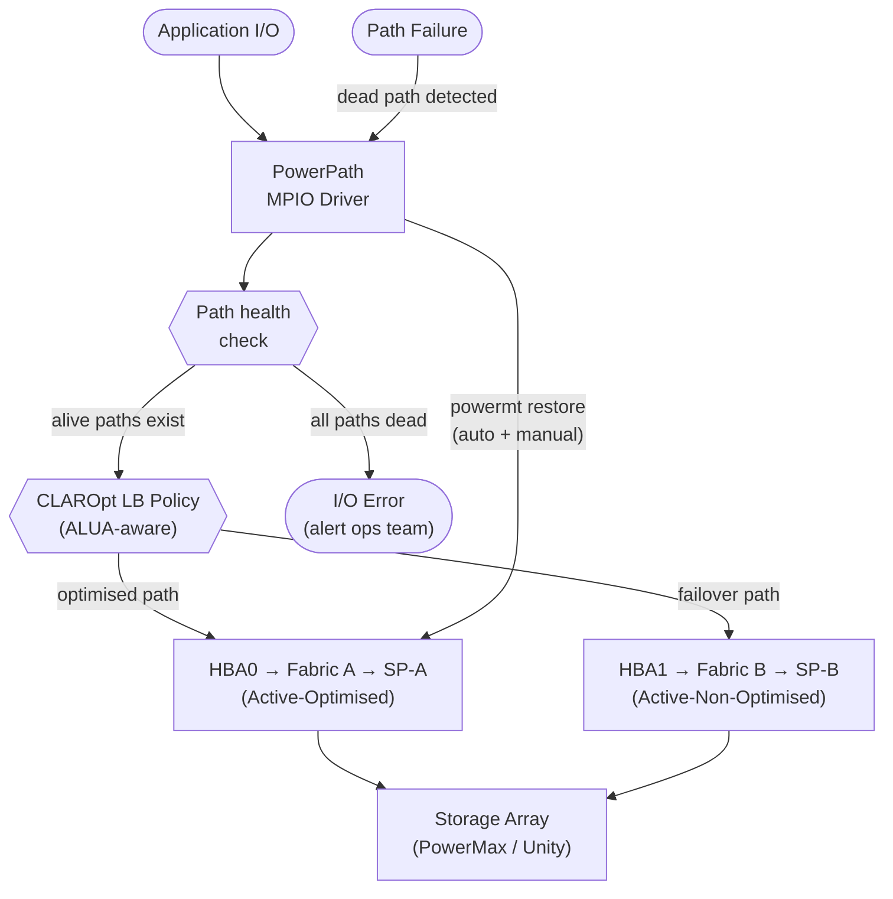

# PowerPath — Overview

## Overview

Dell PowerPath is a host-side multipath I/O driver that sits between the operating system's block device layer and the physical HBA/iSCSI initiator layer. It intercepts I/O destined for storage LUNs and distributes it intelligently across all available physical paths, providing automatic failover on path loss and load balancing across healthy paths. PowerPath presents a single virtual (pseudo) device per LUN to the OS, regardless of how many physical paths exist.

## Host-Side MPIO Stack

## How It Works

On startup, PowerPath discovers all LUNs visible across all HBA ports and groups paths to the same LUN into a single pseudo device. Each path has a state:
- `alive` — path is healthy and eligible for I/O
- `dead` — path has failed I/O tests; excluded from routing
- `unlic` — path is not licensed; I/O will not be sent over this path

PowerPath load-balancing policies determine how I/O is distributed across `alive` paths:
- **CLAROpt** (`co`) — Dell/EMC optimised policy; aware of active/passive or ALUA path groupings on PowerMax, Unity, and CLARiiON arrays; sends I/O preferentially over optimised paths
- **RoundRobin** (`rr`) — distributes I/O evenly across all paths regardless of ALUA state (not recommended for Dell/EMC arrays)
- **BasicFailover** (`bf`) — uses one path, fails over to another on failure; no load balancing

On path failure, PowerPath automatically marks the path `dead` and re-routes I/O to remaining `alive` paths within milliseconds. When `powermt restore` is run (or periodically by the daemon), dead paths are retested and promoted back to `alive` if they recover.

## High Availability Design

PowerPath provides host-side HA through multipath redundancy. Key design principles:

- Minimum 2 paths per LUN (one per fabric/HBA) for basic redundancy
- Recommended 4 paths (two fabrics x two HBA ports per fabric) for full redundancy
- CLAROpt policy ensures I/O uses ALUA-optimised paths preferentially, failing over automatically on path loss
- The PowerPath daemon continuously monitors path health and triggers failover/restore events without manual intervention
- Path restoration is automatic — when a failed path recovers, PowerPath promotes it back to `alive` state

---

## In this section

<a class="kb-card" href="components/"><strong>Components</strong>Core components, services, and technical specifications.</a>
<a class="kb-card" href="integrations/"><strong>Integrations</strong>Integration with other platforms and external systems.</a>
<a class="kb-card" href="standards/"><strong>Standards</strong>Sizing guidelines, design standards, and best practices.</a>

