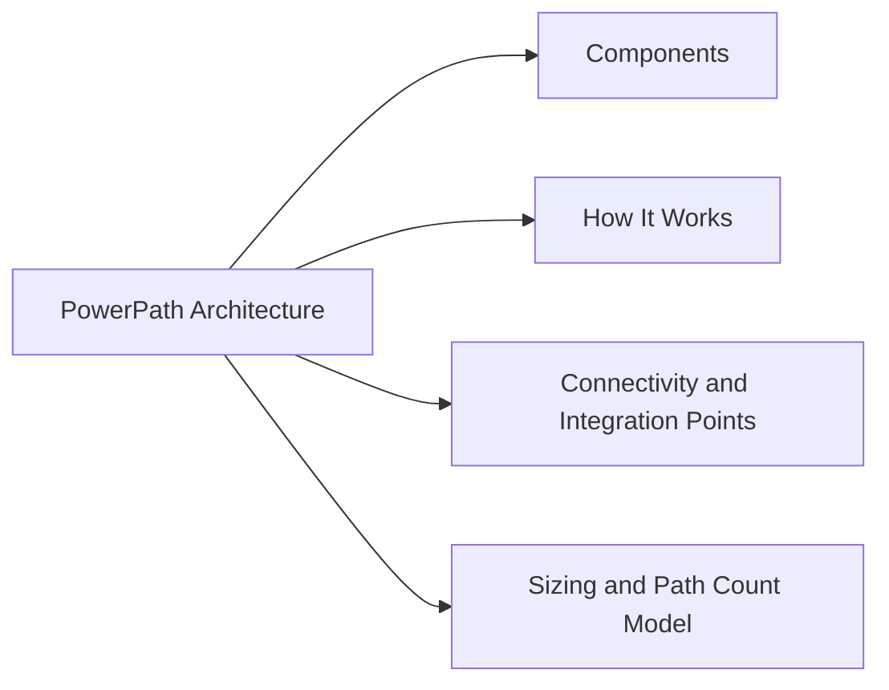

# PowerPath Architecture

## Overview

Dell PowerPath is a host-side multipath I/O driver that sits between the operating system's block device layer and the physical HBA/iSCSI initiator layer. It intercepts I/O destined for storage LUNs and distributes it intelligently across all available physical paths, providing automatic failover on path loss and load balancing across healthy paths. PowerPath presents a single virtual (pseudo) device per LUN to the OS, regardless of how many physical paths exist.

## Components

| Component | Role |
|---|---|
| PowerPath kernel module | Loaded at boot; intercepts block I/O and routes it across physical paths |
| Pseudo device | Virtual block device presented to the OS per LUN (e.g., `/dev/emcpowera` on Linux) |
| `powermt` CLI | Management tool for viewing path state, changing policies, and performing configuration operations |
| PowerPath license (registration key) | Entitlement applied per host; required for paths to be managed (unlicensed paths show as `unlic`) |
| PowerPath configuration file | Persists path policy and device settings across reboots; saved with `powermt save` |
| PowerPath daemon (`PowerPath` service) | Userspace service that monitors path health and triggers failover/restore events |

## How It Works

On startup, PowerPath discovers all LUNs visible across all HBA ports and groups paths to the same LUN into a single pseudo device. Each path has a state:
- `alive` — path is healthy and eligible for I/O
- `dead` — path has failed I/O tests; excluded from routing
- `unlic` — path is not licensed; I/O will not be sent over this path

PowerPath load-balancing policies determine how I/O is distributed across `alive` paths:
- **CLAROpt** (`co`) — Dell/EMC optimised policy; aware of active/passive or ALUA path groupings on PowerMax, Unity, and CLARiiON arrays; sends I/O preferentially over optimised paths
- **RoundRobin** (`rr`) — distributes I/O evenly across all paths regardless of ALUA state (not recommended for Dell/EMC arrays)
- **BasicFailover** (`bf`) — uses one path, fails over to another on failure; no load balancing

On path failure, PowerPath automatically marks the path `dead` and re-routes I/O to remaining `alive` paths within milliseconds. When `powermt restore` is run (or periodically by the daemon), dead paths are retested and promoted back to `alive` if they recover.

## Connectivity and Integration Points

| Layer | Protocol / Interface | Notes |
|---|---|---|
| Fibre Channel | FC HBA → FC switch → array FA port | Most common in enterprise environments |
| iSCSI | iSCSI initiator → IP network → array iSCSI port | Requires iSCSI initiator configured before PowerPath |
| Host OS | Linux (RHEL, SLES, OEL), Windows Server, AIX, HP-UX, Solaris | Platform-specific PowerPath packages; refer to support matrix |
| Array side | PowerMax, VMAX, Unity, CLARiiON, VNX, PowerStore | PowerPath CLAROpt policy works with ALUA on these platforms |
| VMware | PowerPath/VE for ESXi | Separate product for ESXi; integrates with VAAI for offloaded operations |

## Sizing and Path Count Model

PowerPath does not consume significant CPU or memory — it is a kernel module. The key sizing consideration is path count per host:

| Parameter | Guideline |
|---|---|
| Minimum paths per LUN | 2 (one per fabric / HBA) for redundancy |
| Recommended paths per LUN | 4 (two fabrics × two HBA ports per fabric) |
| Maximum paths per LUN | 32 (PowerPath supports up to 32 paths per pseudo device) |
| Baseline documentation | Record expected path count per device per host; compare after every fabric change |

A host with 2 dual-port HBAs connected to 2 storage ports per fabric typically has 4 paths per LUN. Confirm the expected count matches the array LUN masking configuration.
