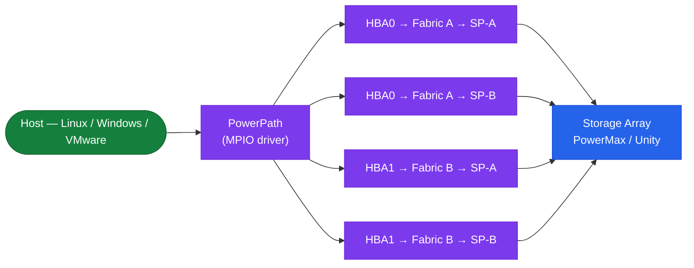

---
tags:
  - architecture
  - dell
---
# PowerPath — Architecture

<div class="kb-summary">
Host-side multipath I/O driver for Dell/EMC arrays. Intercepts block I/O and distributes it across all available HBA paths with ALUA-aware load balancing (CLAROpt policy) and automatic sub-millisecond failover on path loss.

*Applies to: PowerPath*
</div>

```text
┌─────────────────────────── Dell PowerPath — Host Multipathing Architecture ───────────────────────────┐
│                                                                                                       │
│  Host-based multipathing software managing FC and iSCSI paths to Dell storage;                        │
│  Adaptive load balancing across paths; replaces native MPIO for Dell arrays.                          │
│                                                                                                       │
│   ┌──────────────────────────────────────────────┐  ┌─────────────────────────────────────────────┐   │
│   │                   Function                   │  │             Supported Platforms             │   │
│   │          Manages multiple SAN paths          │  │             PowerMax, PowerStore            │   │
│   │        Presents single virtual device        │  │           Unity, VNX, VMAX legacy           │   │
│   │         Balances IO across FC paths          │  │             Windows, Linux, AIX             │   │
│   │           Fails over on path loss            │  │                Solaris, HP-UX               │   │
│   │           Replaces native OS MPIO            │  │              FC, iSCSI, NVMe-oF             │   │
│   └──────────────────────────────────────────────┘  └─────────────────────────────────────────────┘   │
│                                                                                                       │
│  PowerPath is installed on each host; one instance manages all paths from that host.                  │
│                                                                                                       │
│                          ▼                                                 ▼                          │
│                                                                                                       │
│   ┌──────────────────────────────────────────────┐  ┌─────────────────────────────────────────────┐   │
│   │           Load Balancing Policies            │  │                  Management                 │   │
│   │         Adaptive: queue-depth aware          │  │         powermt display: show paths         │   │
│   │            Least-Blocks: IO count            │  │          powermt manage: add/remove         │   │
│   │           Round-Robin: equal share           │  │            emcpowervt: path test            │   │
│   │         Symm-Optimized: array-aware          │  │             PPMA: multi-host GUI            │   │
│   │             No-Rebalance: manual             │  │          REST API: PPMA automation          │   │
│   └──────────────────────────────────────────────┘  └─────────────────────────────────────────────┘   │
│                                                                                                       │
│  Physical Infrastructure (the hardware everything above runs on):                                     │
│  HBA cards in host servers; FC cables to SAN switches; zoned to storage ports;                        │
│  minimum 2 paths per LUN (dual-fabric A+B) required for true redundancy.                              │
│                                                                                                       │
│  Key terms:                                                                                           │
│                                                                                                       │
│  PowerPath      = Dell host multipathing software; manages paths from host to array                   │
│  Multipathing   = using multiple physical connections to same LUN; HA + load balance                  │
│  Path           = one physical connection: HBA port → FC switch → storage port                        │
│  MPIO           = Microsoft/OS native multipath; PowerPath replaces this for Dell                     │
│  Adaptive       = default policy; monitors queue depth per path; moves busy load                      │
│  powermt        = PowerPath CLI tool; display, save, restore, manage paths                            │
│  PPMA           = PowerPath Management Appliance; central multi-host management                       │
│  Failover       = automatic reroute when a path goes down; transparent to host IO                     │
│  Trespass       = legacy VNX path ownership transfer; PowerPath handles silently                      │
│  FC path        = Fibre Channel path from HBA WWN to storage port WWPN                                │
│  iSCSI path     = TCP/IP path from initiator IQN to storage target IQN                                │
│  emcpowervt     = PowerPath path verification tool; tests individual paths                            │
│                                                                                                       │
└───────────────────────────────────────────────────────────────────────────────────────────────────────┘
```




<div class="kb-grid kb-grid-3">
<a class="kb-card" href="how-it-works/"><strong>How It Works</strong><span>How it works, integrations, and design standards.</span></a>
<a class="kb-card" href="integrations/"><strong>Integrations</strong><span>Integration with PowerMax, Unity, and host OS multipath frameworks.</span></a>
<a class="kb-card" href="design-standards/"><strong>Design Standards</strong><span>Path count requirements, CLAROpt policy standards, and installation best practices.</span></a>
</div>

## Load-Balancing Policies

| Policy | Code | Description |
|---|---|---|
| CLAROpt | `co` | ALUA-aware; prefers active-optimised paths — recommended for all Dell arrays |
| RoundRobin | `rr` | Even distribution across all paths regardless of ALUA state |
| BasicFailover | `bf` | Single active path; failover only — no load balancing |

## Host-Side MPIO Stack


