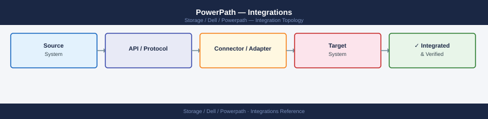
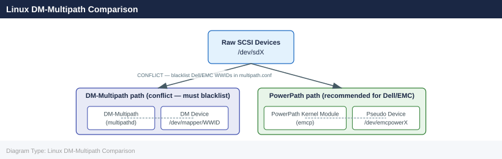

---
tags:
  - architecture
  - dell
---
# PowerPath — Integrations

<div class="kb-summary">
Integrations reference covering Windows HBA Integration, Linux DM-Multipath Comparison, VMware VAAI Integration (PowerPath/VE), AIX MPIO Coexistence, Monitoring Integration.

*Applies to: PowerPath*
</div>


## Windows HBA Integration

On Windows Server, PowerPath installs as a filter driver that intercepts SCSI I/O before it reaches the Windows disk layer. PowerPath pseudo devices appear as standard disks in Disk Management and Device Manager.

Key considerations for Windows:
- Disable the Windows built-in MPIO (MPIO DSM) for Dell/EMC devices that will be managed by PowerPath — running both causes path conflicts
- PowerPath installs its own Dell DSM in Windows MPIO framework; confirm via `mpclaim.exe -s -d` that Dell devices are claimed by the PowerPath DSM, not the default DSM
- After any HBA driver update on Windows, run `powermt config` and `powermt display dev=all` to confirm path rediscovery
- PowerPath on Windows integrates with Windows Server Failover Clustering (WSFC); verify the shared disk path counts from both cluster nodes after any fabric change

## Linux DM-Multipath Comparison



PowerPath and DM-Multipath (`multipathd`) both manage multipath devices on Linux but must not manage the same device simultaneously.

| Feature | PowerPath | DM-Multipath |
|---|---|---|
| Array-aware policies | CLAROpt (ALUA-aware, Dell/EMC optimised) | Vendor-specific via `device` stanza |
| License requirement | Yes (per host) | Free (kernel built-in) |
| Device naming | `/dev/emcpower<x>` | `/dev/mapper/<wwid>` |
| AIX/HP-UX/Solaris support | Yes | No |
| Configuration | `powermt` CLI + `/etc/powermt.custom` | `/etc/multipath.conf` |

To prevent conflicts on Linux, blacklist all Dell/EMC array WWIDs in `/etc/multipath.conf`:

```bash
# /etc/multipath.conf — blacklist Dell/EMC devices from DM-Multipath
blacklist {
    device {
        vendor "DGC"
        product ".*"
    }
    device {
        vendor "EMC"
        product "SYMMETRIX"
    }
}
```


```text title="Expected output"
(no output — command completes silently)
```

!!! warning "Common errors"
    **`syntax error in /etc/multipath.conf at line 3`** — Verify the blacklist block syntax matches the multipath.conf man page format and check for mismatched braces.
    **`multipathd: configuration reload failed`** — Run `multipath -v3` to validate the configuration file syntax before reloading the daemon with `systemctl reload multipathd`.
After modifying `multipath.conf`, reload: `systemctl reload multipathd`

## VMware VAAI Integration (PowerPath/VE)

PowerPath/VE is the ESXi-specific edition. It integrates with VMware vStorage APIs for Array Integration (VAAI) to offload operations such as full copy, block zeroing, and hardware-assisted locking to the array.

- PowerPath/VE is installed as a VIB (vSphere Installation Bundle) on each ESXi host
- Managed via vSphere CLI (`esxcli`) or the vSphere Client plug-in
- CLAROpt policy is supported on ESXi with Dell/EMC arrays
- After any zoning change or LUN masking change, rescan HBAs in vSphere and run `esxcli storage core adapter rescan --all`; then verify path counts in vSphere Client → Storage Adapters

## AIX MPIO Coexistence

On IBM AIX, native AIX MPIO and PowerPath can both exist on the system but must not manage the same LUNs. Configure the ODM (Object Data Manager) to assign Dell/EMC LUNs to PowerPath and not to AIX MPIO:

- Dell/EMC provides an ODM update package (`EMC.CLARiiON.fcp.rte` or equivalent) that configures correct device attributes for PowerPath-managed devices
- After installing PowerPath on AIX, run `powermt config` and confirm devices appear as `emcpower` type, not `hdisk` under MPIO
- Validate with `lsdev -Cc disk | grep emcpower` to confirm PowerPath device visibility

## Monitoring Integration

PowerPath does not have a native SNMP agent, but path state changes are logged to the OS syslog. Feed these into your monitoring platform:

```bash
# Linux — watch for PowerPath path events in syslog
journalctl -f | grep -i "emcp\|PowerPath\|dead path"

# Generate an alert if any device has fewer than expected paths
powermt display dev=all | awk '/Pseudo name=/{dev=$3} /dead/{print "DEAD PATH on " dev}' 
```


```text title="Expected output"
-- Logs begin at Mon 2024-01-15 09:23:14 UTC. --
Jan 15 09:24:31 storage-node-02 kernel: emc: emcp device registered: /dev/emcpoweraa
Jan 15 09:24:32 storage-node-02 kernel: PowerPath: Path failover detected on device emcpoweraa
Jan 15 09:24:45 storage-node-02 kernel: emc: dead path detected on controller A, LUN 0x0042
Jan 15 09:25:12 storage-node-02 kernel: PowerPath: Restored path to device emcpowerab
Jan 15 09:25:18 storage-node-02 kernel: emc: emcp failover complete, 3 active paths
Jan 15 09:26:03 storage-node-02 kernel: PowerPath: dead path on SAN fabric B, initiator 2
DEAD PATH on emcpoweraa
DEAD PATH on emcpowerab
```

!!! warning "Common errors"
    **`journalctl: command not found`** — Install systemd-journal or use `tail -f /var/log/messages` on systems without journald.
    **`powermt: command not found`** — Verify PowerPath is installed with `rpm -qa | grep -i powerpath` and add `/opt/emc/powerpath/bin` to PATH.
Integrate the path health check script from the scripts section into your monitoring platform (Nagios, Zabbix, Prometheus textfile collector) to alert on degraded path counts.

---

## See also

- [Powerpath — How It Works](../how-it-works/)
- [Powerpath — Design Standards](../design-standards/)
