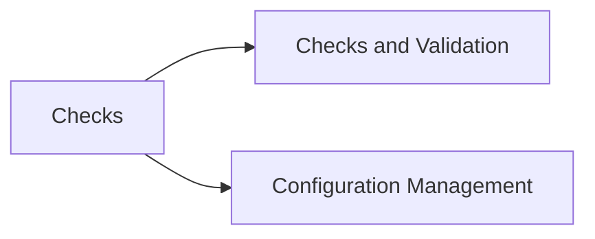

# Configuration & Checks

> Part of the Dell PowerPath CLI Reference.



---

## Checks & Validation

```bash
# Check all paths
powermt check

# Check specific device
powermt check dev=emcpower<n>

# Verify consistency
powermt display options

# Show configuration file
cat /etc/powermt.custom
```

---

## Configuration Management

```bash
# Save configuration
powermt save
powermt save force

# Load / restore config
powermt restore

# Reconfig (after new device attachment)
powermt config

# Remove stale devices
powermt remove dev=emcpower<n>
powermt remove dead
```
