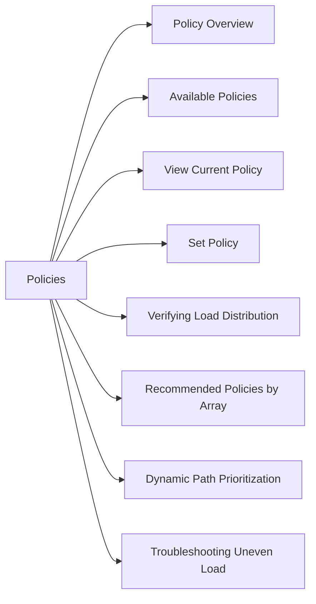

# Load Balancing & Policies

> Part of the Dell PowerPath CLI Reference.



## Policy Overview

PowerPath distributes I/O across available paths using a configurable policy. The right policy depends on the storage array type and workload characteristics.

## Available Policies

| Policy | Code | Description |
|---|---|---|
| CLARiiON Optimized | `co` | Default for Dell EMC arrays — uses active-optimized paths first |
| Round Robin | `rr` | Distributes I/O evenly across all active paths |
| Adaptive | `ad` | Load-based selection — switches to least-loaded path |
| No Redirect | `nr` | Uses first active path only (no load balancing) |
| Single Initiator | `si` | Pins I/O to a single HBA port |

## View Current Policy

```bash
# Policy for a specific device
powermt display dev=emcpower0 | grep -i policy

# Policy for all devices
powermt display dev=all | grep -i policy
```

## Set Policy

```bash
# Set policy on a specific device
powermt set policy=co dev=emcpower0

# Set policy across all devices of a specific class
powermt set policy=co dev=all class=clariion
powermt set policy=rr dev=all class=symmetrix

# Set policy globally (all devices, all classes)
powermt set policy=co dev=all

# Save after changing policy (persists across reboots)
powermt save
```

## Verifying Load Distribution

```bash
# Check path I/O statistics (bytes sent per path)
powermt display dev=emcpower0 | grep -E "Bytes|I/Os"

# Full device detail with path stats
powermt display dev=emcpower0 port
```

## Recommended Policies by Array

| Array | Recommended Policy |
|---|---|
| PowerMax / VMAX | `co` (CLARiiON Optimized) |
| PowerStore | `co` |
| Unity | `co` |
| SC Series (Compellent) | `co` |
| Non-Dell arrays | `rr` (Round Robin) |

## Dynamic Path Prioritization

With `co` policy, PowerPath prefers ALUA-optimized paths. If the owning storage processor fails:

```bash
# Paths will automatically shift to the non-optimized SP
powermt display dev=emcpower0

# After SP failover, confirm no dead paths
powermt display dead
```

## Troubleshooting Uneven Load

```bash
# Check if policy is correctly applied
powermt display dev=all | grep policy

# If paths are unbalanced after array maintenance
powermt restore
powermt save
```
