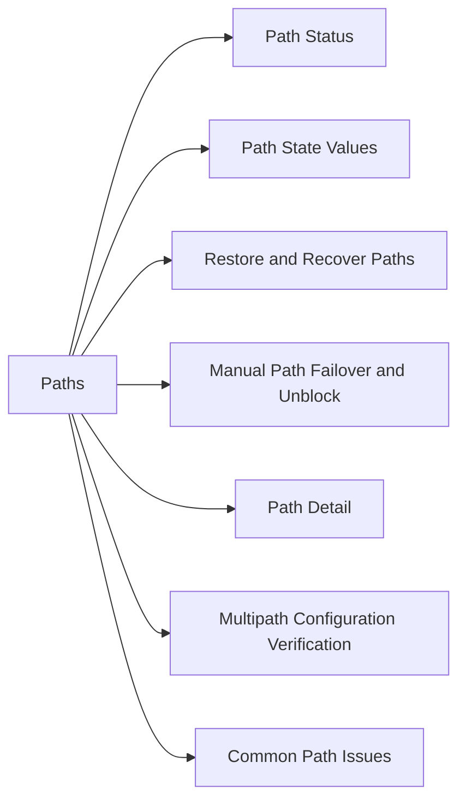

# Paths

> Part of the Dell PowerPath CLI Reference.



## Path Status

```bash
# All devices with all path states
powermt display dev=all

# Count alive vs dead paths
powermt display dev=all | grep -c "alive"
powermt display dev=all | grep -c "dead"

# Show only dead paths (should return nothing in healthy state)
powermt display dead
```

## Path State Values

| State | Meaning |
|---|---|
| `alive` | Path healthy and in use |
| `dead` | Path failed — I/O not sent on this path |
| `failed` | Path HBA or connection failure |
| `unlic` | Path exists but PowerPath license does not cover it |
| `sdsf` | Standby path (used when primary paths fail) |

## Restore and Recover Paths

```bash
# Attempt to restore all dead paths
powermt restore

# Rescan for new devices or newly presented LUNs
powermt config

# Remove dead path records
powermt remove dead

# After SAN maintenance — full recovery sequence
powermt config
powermt restore
powermt display dead   # confirm zero dead paths
powermt save
```

## Manual Path Failover and Unblock

```bash
# Fail a specific path (force I/O off a port — testing/maintenance)
powermt fail dev=emcpower0 path=<hba_port_id>

# Unblock a path (re-enable after manual fail)
powermt unblock dev=emcpower0 path=<hba_port_id>
```

## Path Detail

```bash
# Full detail for a device including each path's I/O stats
powermt display dev=emcpower0

# Output shows: Pseudo device, WWN, each HBA port, path state, bytes I/O
powermt display dev=emcpower0 port
```

## Multipath Configuration Verification

```bash
# Confirm ALUA active-optimized paths are being preferred
powermt display dev=emcpower0 | grep -E "State|ALUA"

# Verify expected number of paths per device
# e.g., 4-path config: 2 HBAs × 2 storage ports
powermt display dev=all | awk '/emcpower/{d=$1;c=0} /alive/{c++} /^$/{if(d) print d" "c; d=""}'
```

## Common Path Issues

| Issue | Likely Cause | Fix |
|---|---|---|
| Dead paths on all HBAs | SAN switch or array port issue | Check zoning and array port health |
| Dead paths on one HBA | HBA failure or cable/SFP | Replace HBA or cable |
| Paths not auto-recovering | `powermt restore` needed | Run `powermt restore` after SAN fix |
| New LUNs not visible | No rescan | Run `powermt config` |
| Unbalanced path I/O | Wrong policy | `powermt set policy=co dev=all` |
