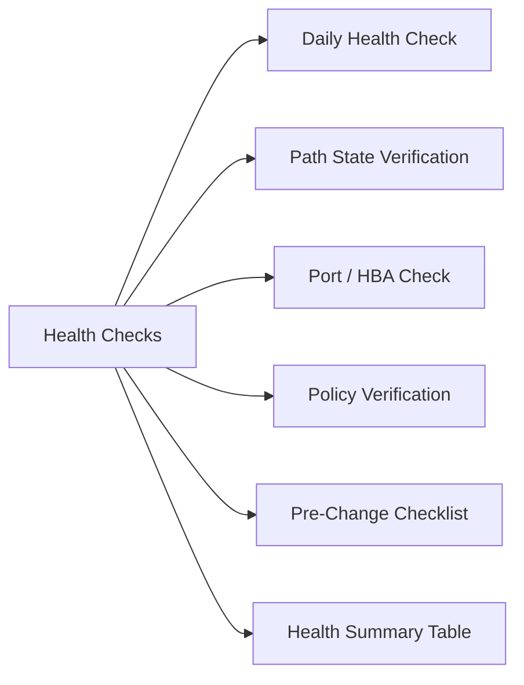

# PowerPath Health Checks



## Daily Health Check

```bash
# Show all PowerPath devices and their state
powermt display dev=all

# Show device summary (path counts, policy, state)
powermt display options

# Show path count per device
powermt display dev=all | grep -E "^Pseudo|Dead|alive"
```

## Path State Verification

All paths should show `alive` under normal conditions:

```bash
powermt display dev=all
```

Expected output per path:
```
============================================================
Pseudo name=hdisk3
CLARiiON/VNX id=CX300-0123 [array_name]
Logical device ID=6000144000000010012345678901234
state=alive; policy=CLAROpt; priority=1; HBA id=fcs0
============================================================
```

| Path State | Meaning | Action |
|---|---|---|
| alive | Path healthy and active | None |
| dead | Path failed or disconnected | Investigate HBA/SAN |
| standby | Path in standby (failover ready) | Normal for some policies |
| degraded | Partial path issue | Investigate urgently |

## Port / HBA Check

```bash
# Show HBA port status
powermt display ports

# Show path counts per HBA
powermt display dev=all | grep -c alive
```

## Policy Verification

```bash
# Display load balance policy per device
powermt display dev=all | grep policy
```

Expected: `CLAROpt` (CLARiiON optimized) or `co` for Active/Optimized.

## Pre-Change Checklist

- [ ] All devices show no `dead` paths
- [ ] Path counts match expected (e.g., 4 paths per device)
- [ ] No degraded devices
- [ ] Policy consistent across devices

## Health Summary Table

| Check | Expected | Action if Not Met |
|---|---|---|
| Path state | All alive | Restore paths; check HBA/SAN |
| Path count | ≥ 2 per device | Investigate missing paths |
| Policy | CLAROpt or co | Correct with `powermt set policy=co dev=all` |
| Devices listed | All LUNs present | Check zoning and host registration |
