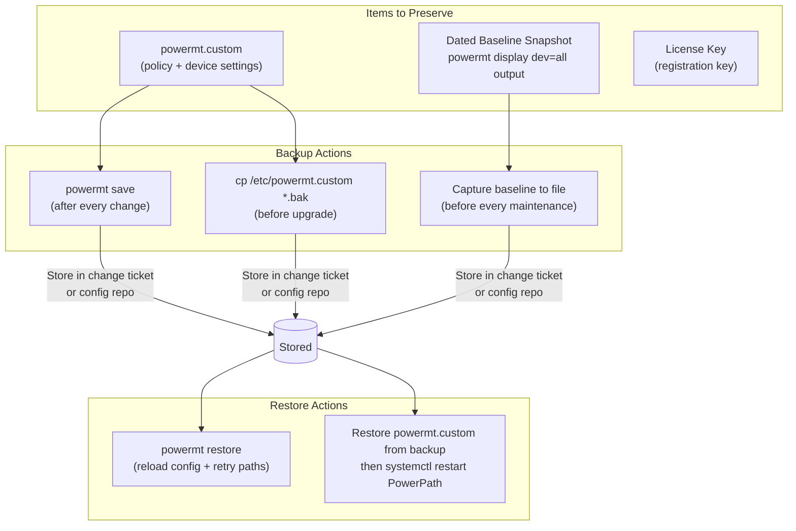

# PowerPath — Backup & Restore


<div class="kb-summary">
Backup & Restore reference covering Overview, Configuration File Location, Configuration Backup, Configuration Restore, Post-Restore Validation and 3 more sections.
</div>
```text
┌───────────────────────────────── Dell PowerPath — Backup and Restore ─────────────────────────────────┐
│                                                                                                       │
│   ┌───────────────────────────────────────────────────────────────────────────────────────────────┐   │
│   │     PowerPath backup: snapshots, replication, and external backup application integration     │   │
│   │        Snapshot schedule: hourly for 24 h, daily for 7 days, weekly for 4 weeks minimum       │   │
│   │            Replication: async or sync to DR site for off-site data protection copy            │   │
│   │       Restore: volume-level or file-level restore from snapshot; test restore quarterly       │   │
│   └───────────────────────────────────────────────────────────────────────────────────────────────┘   │
│                                                                                                       │
│    Snapshot → replicate to DR → verify → document → test restore                                      │
│                                                                                                       │
│                  ▼                                ▼                                ▼                  │
│                                                                                                       │
│   ┌─────────────────────────────┐  ┌─────────────────────────────┐  ┌─────────────────────────────┐   │
│   │            Layer            │  │          Component          │  │            Notes            │   │
│   │            Driver           │  │        powermt daemon       │  │           OS-level          │   │
│   │            Paths            │  │        Active-active        │  │         ≥4 paths/LUN        │   │
│   │            Policy           │  │        Adaptive/ALUA        │  │        Array-specific       │   │
│   │           Failover          │  │         Auto reroute        │  │          <5 sec RTO         │   │
│   │          Management         │  │           pp_mgmt           │  │         Centralised         │   │
│   └─────────────────────────────┘  └─────────────────────────────┘  └─────────────────────────────┘   │
│                                                                                                       │
│                          ▼                                                 ▼                          │
│                                                                                                       │
│   ┌───────────────────────────────────────────────────────────────────────────────────────────────┐   │
│   │       Type       │     Schedule     │     Retention     │     Offsite?     │    Test cycle    │   │
│   │     Snapshot     │   Hourly/daily   │    7/30/90 days   │        No        │     Monthly      │   │
│   │   Replication    │  Policy-driven   │     Per policy    │     Yes (DR)     │    Quarterly     │   │
│   │    Backup app    │ Daily full+incr  │      90+ days     │ Yes (tape/cloud  │    Quarterly     │   │
│   │     Archive      │     Monthly      │      7+ years     │   Yes (object)   │      Annual      │   │
│   └───────────────────────────────────────────────────────────────────────────────────────────────┘   │
│                                                                                                       │
│    Physical: Host OS (Windows/Linux) · HBA or iSCSI NIC ports · FC/IP switches · Dell arrays          │
│                                                                                                       │
│    Key terms:                                                                                         │
│                                                                                                       │
│    PowerPath          = Dell multipath driver; manages multiple I/O paths to storage for HA/perform...│
│    powermt            = CLI utility; powermt display, powermt check, powermt save are core commands   │
│    Pseudo device      = virtual block device created by PowerPath aggregating physical I/O paths      │
│    Path health        = alive or dead status per path; dead paths trigger automatic I/O failover      │
│    Adaptive policy    = load-balancing that distributes I/O across all active paths evenly            │
│    CLARiiON policy    = active/passive policy for older VNX/CLARiiON arrays (one active path)         │
│    ALUA               = Asymmetric Logical Unit Access; array signals preferred vs. non-preferred p...│
│    Trespass           = LUN ownership movement between SP-A and SP-B on Unity or VNX arrays           │
│    Ghost path         = stale path entry in PowerPath no longer backed by a physical device           │
│    powermt check      = validates all paths and refreshes device table; run after fabric changes      │
│    pp_mgmt            = PowerPath Management Appliance; central monitoring for all PowerPath hosts    │
│    License key        = host-based license required per server; applied via powermt config license    │
│                                                                                                       │
└───────────────────────────────────────────────────────────────────────────────────────────────────────┘
```


## Overview



PowerPath does not store data — it manages the path layer between host and storage array. "Backup" in the PowerPath context means preserving three things:

1. **Active configuration** — the policies, device registrations, and options written to disk by `powermt save`
2. **Baseline state snapshots** — dated text captures of `powermt display dev=all` output used to validate path count after changes
3. **License registration** — the registration key file that licenses PowerPath on the host

Losing PowerPath configuration after a reboot is the most common operational failure. The root cause is always the same: `powermt save` was not run after the last configuration change.

---

## Configuration File Location

PowerPath persists its configuration to a file on disk. The location depends on the platform:

| Platform | Configuration File |
|---|---|
| Linux | `/etc/powermt.custom` |
| Windows | `C:\Program Files\EMC\PowerPath\powermt.custom` |
| AIX | `/etc/powermt.custom` |
| HP-UX | `/etc/powermt.custom` |
| Solaris | `/etc/powermt.custom` |

This file is written by `powermt save` and read by the PowerPath daemon on startup. If this file does not exist or contains stale data, PowerPath applies default settings (which may not include the correct load balancing policy).

---

## Configuration Backup

### Save Live Configuration to Disk

```bash
# Save current PowerPath configuration to the powermt.custom file
powermt save

# Force overwrite if prompted (some versions prompt for confirmation)
powermt save force
```

Run `powermt save` after every configuration change. This includes:
- After changing the load balancing policy (`powermt set policy=...`)
- After running `powermt config` to discover new devices
- After running `powermt remove` to clean up stale devices
- Before any OS upgrade, kernel update, or PowerPath upgrade
- Before any SAN fabric maintenance that will change path count

### Capture a Dated Baseline Snapshot

The baseline snapshot is a plain-text record of the full path state at a known-good point in time. Store this in the change record, runbook, or a shared team directory.

```bash
# Capture full path state and policy to a dated file
HOSTNAME=$(hostname -s)
DATE=$(date +%Y-%m-%d)
OUTFILE="${HOSTNAME}-powermt-baseline-${DATE}.txt"

{
  echo "=== PowerPath Baseline: ${HOSTNAME} — ${DATE} ==="
  echo ""
  echo "--- Version ---"
  powermt version

  echo ""
  echo "--- Registration ---"
  powermt check_registration

  echo ""
  echo "--- Options ---"
  powermt display options

  echo ""
  echo "--- All Devices and Paths ---"
  powermt display dev=all

  echo ""
  echo "--- HBA Port States ---"
  powermt display ports class=all
} > "${OUTFILE}"

echo "Baseline written to: ${OUTFILE}"
```

Store these baseline files in a location accessible to your team:
- Change management ticket attachments
- A shared `baselines/` directory under the host's runbook
- Configuration management repository (e.g., Git)

### Backup the Configuration File Directly

In addition to the baseline snapshot, take a copy of the raw configuration file before any upgrade or significant change:

```bash
# Linux — copy the powermt.custom file with a date stamp
cp /etc/powermt.custom /etc/powermt.custom.bak-$(date +%Y-%m-%d)

# Confirm the backup exists
ls -lh /etc/powermt.custom*
```

---

## Configuration Restore

### Restore from Saved Configuration

`powermt restore` reloads configuration from the last saved `powermt.custom` file and instructs PowerPath to retry all paths currently marked dead. It serves double duty: restoring saved settings and attempting path recovery.

```bash
# Restore PowerPath configuration from the saved powermt.custom file
powermt restore

# Verify that the policy was restored correctly
powermt display options

# Verify all paths are alive after restore
powermt display dev=all

# Confirm no dead paths remain
powermt display dev=all | grep -c dead
```

### When to Run powermt restore

| Situation | Action |
|---|---|
| After a reboot where paths are not fully recovered | Run `powermt restore` once the OS is fully up and all HBAs have logged in |
| After SAN fabric maintenance completes | Run `powermt restore` to bring returned paths back to `alive` |
| After resolving a dead HBA or cable | Run `powermt restore` after the physical fix; do not just wait for the daemon |
| After a PowerPath upgrade | Run `powermt restore` to confirm path state is consistent with saved config |
| Policy shows incorrect value after reboot | Run `powermt restore` then `powermt display options` to confirm |

### Manually Restore from a Configuration File Backup

If `powermt.custom` was corrupted or accidentally deleted, restore from the backup:

```bash
# Linux — restore from a dated backup of powermt.custom
cp /etc/powermt.custom.bak-2025-01-15 /etc/powermt.custom

# Restart the PowerPath service to pick up the restored file
systemctl restart PowerPath

# Verify the configuration loaded correctly
powermt display options
powermt display dev=all
```

---

## Post-Restore Validation

After any restore operation, verify the following:

```bash
# 1. Confirm policy is correct (CLAROpt for Dell/EMC arrays)
powermt display options
# Expected: Policy=CLAROpt(co) or similar for all device classes

# 2. Confirm all paths are alive
powermt display dev=all | grep -E "^Pseudo|alive|dead"

# 3. Count dead paths — should be zero after a successful restore
powermt display dev=all | grep -c dead

# 4. Check HBA port states
powermt display ports class=all

# 5. Confirm license is still valid
powermt check_registration

# 6. Compare path count per device against the baseline snapshot
# Open the baseline file and compare device-by-device
```

### Post-Restore Checklist

- [ ] `powermt display options` — policy matches pre-change baseline (CLAROpt for Dell/EMC arrays)
- [ ] `powermt display dev=all` — all pseudo devices visible; no unexpected additions or removals
- [ ] Dead path count is zero — run `powermt display dev=all | grep -c dead` and confirm output is `0`
- [ ] `powermt display ports class=all` — all HBA ports are in `alive` state
- [ ] `powermt check_registration` — license valid, not expired
- [ ] Path count per device matches the baseline snapshot — compare device-by-device
- [ ] `powermt save` run after validation — persist the confirmed-good state

---

## Backup Frequency and Retention

| Event | Backup Action |
|---|---|
| After every configuration change | `powermt save` |
| Before every maintenance window | Capture dated baseline snapshot |
| Before PowerPath upgrade | Copy `powermt.custom` + capture baseline snapshot |
| Before OS kernel upgrade | Capture dated baseline snapshot |
| Quarterly (routine) | Capture dated baseline snapshot; store in runbook |

Retain baseline snapshots for a minimum of 12 months. Path count baselines are the primary evidence used to validate that SAN changes have been fully reversed.

---

## Disaster Recovery Consideration

PowerPath configuration is host-bound — the `powermt.custom` file is not replicated between hosts. In a disaster recovery scenario where a protected host is rebuilt:

1. Re-install PowerPath using the same version that was running on the source host (or a supported upgrade version)
2. Re-apply the license registration key
3. Restore the `powermt.custom` from the most recent backup
4. Run `powermt config` to discover all LUNs presented to the rebuilt host
5. Run `powermt restore` to apply saved policy and attempt path recovery
6. Validate with `powermt display dev=all` — confirm all expected devices and paths are present

If the restored `powermt.custom` references devices or paths that no longer exist (e.g., after storage migration), PowerPath will show stale pseudo devices. Run `powermt remove dead` followed by `powermt config` and `powermt save` to reconcile.

---

## Backup Checklist

- [ ] `powermt save` run after every policy change, device discovery, or path removal
- [ ] Dated baseline snapshot (`powermt display dev=all` + `powermt display options`) captured before every maintenance window and stored in the change record
- [ ] Raw `powermt.custom` file backed up before PowerPath upgrades and OS kernel updates
- [ ] License registration key stored outside the host (support portal, password manager, or team runbook) — required to re-license a rebuilt host
- [ ] Post-restore validation completed after every restore operation: policy, path count, dead paths, and license all checked
- [ ] Baseline snapshots retained for at least 12 months and accessible to the storage team
