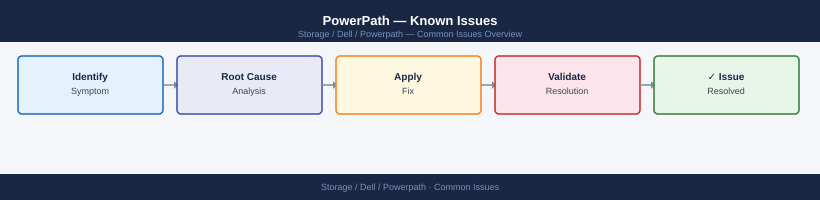

---
tags:
  - dell
  - operations
---
# PowerPath — Known Issues

<div class="kb-summary">
Known Issues reference covering Incident Triage, Dead Paths After Reboot, Paths Not Recovering After SAN Maintenance, Device Not Visible After LUN Provisioning, Unlicensed Paths (unlic State) and 5 more sections.

*Applies to: PowerPath*
</div>


## Before you begin

- **Access:** Storage admin credentials (cluster admin or equivalent)
- **Timing:** safe to run during business hours unless a step is marked ⚠ (causes interruption)
- **Dependencies:** no active upgrades or migrations on the same infrastructure
- **Logging:** capture command output — paste into the change record on completion

---

## Incident Triage

```d2
direction: right

A: "Host I/O error or path loss" {shape: rectangle}
B: "powermt display dev=all\nIdentify dead paths" {shape: rectangle}
C: "Policy = CLAROpt?" {shape: rectangle}
D: "powermt set policy=CLAROpt class=all\npowermt save" {shape: rectangle}
E: "powermt restore\nRetry dead paths" {shape: rectangle}
F: "Dead paths\nrecovered?" {shape: rectangle}
G: "Monitor — issue resolved" {shape: rectangle}
H: "HBA port\nin dead state?" {shape: rectangle}
I: "Check fabric switch port\nCheck cable / SFP" {shape: rectangle}
J: "paths unlic?" {shape: rectangle}
K: "powermt check_registration\nRe-apply license key" {shape: rectangle}
L: "Verify array LUN masking\nCheck fabric zoning" {shape: rectangle}
M: "Escalate to SAN/Storage/Dell support" {shape: rectangle}

A -> B
B -> C
C -> D
C -> E
D -> E
E -> F
F -> G
F -> H
H -> I
H -> J
J -> K
J -> L
I -> K
K -> L
L -> M
```

When a host reports I/O errors, elevated latency, or a block device is inaccessible, work through this sequence first.

- [ ] Run `powermt display dev=all` on the affected host immediately — identify which pseudo devices have dead paths and how many paths remain alive for each
- [ ] Check the PowerPath policy: `powermt display options` — if policy shows `BasicFailover` instead of `CLAROpt`, load balancing is degraded; investigate license and run `powermt config`
- [ ] Run `powermt restore` to instruct PowerPath to retry all paths currently marked dead — this alone resolves transient path losses caused by brief fabric events
- [ ] Check HBA port states: `powermt display ports class=all` — a port in `dead` state indicates the HBA itself has lost fabric connectivity, not just individual paths
- [ ] Review host OS logs for the path failure timestamp: `grep -i "powermt\|path\|dead" /var/log/messages` — correlate with fabric switch events
- [ ] Check the SAN fabric switch: confirm the affected HBA WWN and storage array port are still zoned and active; look for CRC errors or port login/logout events on the switch
- [ ] If paths are dead and `powermt restore` does not recover them, confirm the array-side LUN masking is intact — check the masking view or storage view on the array
- [ ] Run `powermt check_registration` if paths show `unlic` state — a license issue will cause PowerPath to drop management of devices after a license check failure

| Question | Answer |
|---|---|
| Which pseudo devices have dead paths? | |
| How many paths remain alive per device? | |
| What is the current load balancing policy? | |
| Are any HBA ports in dead state? | |
| Did powermt restore recover any dead paths? | |

---

## Dead Paths After Reboot

**Symptom:** One or more paths show `dead` immediately after a host reboots, even though the SAN fabric was not changed.

**Cause:** On some Linux kernels and HBA driver combinations, the HBA ports finish logging into the fabric after the PowerPath daemon has already performed its initial path check. PowerPath marks paths dead if the LIP (Loop Initialization Protocol) or PLOGI has not yet completed at scan time.

**Resolution:**

```bash
# 1. Confirm how many dead paths exist
powermt display dev=all | grep -c dead

# 2. Attempt path restore — usually resolves this immediately
powermt restore

# 3. Verify dead path count drops to zero
powermt display dev=all | grep -c dead

# 4. If paths remain dead, check HBA port login state
systool -c fc_host -v | grep -E "port_name|port_state|speed"

# 5. If HBA ports show 'Online', check fabric zoning is still intact
# (Brocade)
switchshow

# 6. Once resolved, save to persist state
powermt save
```


```text title="Expected output"
2
(no output — command completes silently)
0
Class = "fc_host"
  Class Device = "host0"
    port_name                      = "0x500143800000001a"
    port_state                     = "Online"
    speed                          = "16 Gbit"
  Class Device = "host1"
    port_name                      = "0x500143800000001b"
    port_state                     = "Online"
    speed                          = "16 Gbit"
switchName:	"SAN-FABRIC-01"
switchType:	0x11d
switchState:	OK
FC_Switch_State:	Online
zoneName:	"PROD-ZONE-001"
memberIndex:	0x00000001
```

!!! warning "Common errors"
    **`powermt: Command not found`** — Verify EMC PowerPath is installed with `rpm -qa | grep PowerPath` and install from Dell support portal if missing.
    **`systool: command not found`** — Install sysfsutils package with `yum install sysfsutils` or `apt-get install sysfsutils` depending on your distribution.
    **`switchshow: command not found`** — Run this command directly on the Brocade switch via SSH or console, not from the host; alternatively verify Brocade CLI tools are installed locally with `rpm -qa | grep brocade`.
**Prevention:** Add a post-boot `powermt restore` to the startup sequence via a systemd oneshot service or rc.local equivalent, executed after the PowerPath service is confirmed running.

---

## Paths Not Recovering After SAN Maintenance

**Symptom:** SAN maintenance (switch port replacement, cable swap, or array port maintenance) is complete but paths remain in `dead` state on affected hosts.

**Cause:** PowerPath marks a path `dead` when it fails I/O tests. Once marked dead, PowerPath retries dead paths on a timer, but this timer may not have fired yet. `powermt restore` forces an immediate retry.

**Resolution:**

```bash
# 1. Run powermt restore to force immediate path retry
powermt restore

# 2. Wait 30 seconds and check
powermt display dev=all | grep dead

# 3. If paths still dead, trigger a SAN HBA rescan to refresh fabric login
echo "1" > /sys/class/fc_host/host0/issue_lip
echo "1" > /sys/class/fc_host/host1/issue_lip

# 4. Run powermt config to pick up any newly visible paths
powermt config

# 5. Run powermt restore again
powermt restore

# 6. Verify path count per device
powermt display dev=all
```


```text title="Expected output"
Restoring all paths...
Restore complete.

dead
dead

(no output — command completes silently)
(no output — command completes silently)

Restoring all paths...
Restore complete.

Symmetrix ID: 000123456789ABCD
Logical device name: /dev/mapper/mpatha
state=alive; policy=SymmOpt; priority=50; queued-IOs=0
------------ Host ------------------- Dev ---------- State ----------
host0 c0t0d0s0 alive alive alive alive
host1 c1t0d0s0 alive alive alive alive
host0 c0t1d0s0 alive alive alive alive
host1 c1t1d0s0 alive alive alive alive
------------ Host ------------------- Dev ---------- State ----------
host0 c0t2d0s0 alive alive alive alive
host1 c1t2d0s0 alive alive alive alive
host0 c0t3d0s0 alive alive alive alive
host1 c1t3d0s0 alive alive alive alive

Total paths: 8, Dead paths: 0
```

!!! warning "Common errors"
    **`powermt: command not found`** — Install EMC PowerPath package (e.g., `apt-get install emc-powerpath` or equivalent for your distribution) and ensure the PowerPath daemon is running with `systemctl start powerpath`.
    **`No such file or directory: /sys/class/fc_host/host0/issue_lip`** — Verify HBA is present and loaded with `lspci | grep -i fibre` and check actual host numbers with `ls /sys/class/fc_host/` before issuing LIP commands.
    **`dead` still appears after restore and LIP`** — Check SAN fabric connectivity and zoning with `fcstat` or vendor tools, and verify HBA firmware is current before attempting further recovery steps.
If paths still do not recover after the above steps, escalate to the SAN team to confirm the switch port and array FA port are fully online and zoned correctly.

---

## Device Not Visible After LUN Provisioning

**Symptom:** A new LUN has been provisioned and masked to the host on the array, but it does not appear in `powermt display dev=all`.

**Cause:** PowerPath only discovers devices that are visible to the OS HBA layer. If the OS has not rescanned for new devices, PowerPath cannot discover them.

**Resolution:**

```bash
# 1. Force an HBA-level rescan on Linux (Fibre Channel)
# Repeat for each HBA host adapter index (host0, host1, host2, etc.)
echo "- - -" > /sys/class/scsi_host/host0/scan
echo "- - -" > /sys/class/scsi_host/host1/scan

# On RHEL/OEL systems, use the rescan-scsi-bus utility if available
/usr/bin/rescan-scsi-bus.sh

# 2. Run powermt config to discover newly visible devices
powermt config

# 3. Confirm the new device appears
powermt display dev=all

# 4. Set the correct policy on newly discovered devices
powermt set policy=CLAROpt class=all

# 5. Persist configuration
powermt save
```


```text title="Expected output"
scsi 2:0:0:0: Direct-Access-RW device
scsi 2:0:1:0: Direct-Access-RW device
scsi 2:0:2:0: Direct-Access-RW device
Rescan started for host 0
Rescan started for host 1
Rescan started for host 2

Discovering devices
CLARiiON_SYMMETRIX_VRAID: 4 devices
SYMMETRIX: 8 devices
VMAX: 12 devices

Pseudo name=emcpowerf
CLARiiON_SYMMETRIX_VRAID [CX480-FA0F]: 4 active paths
SYMMETRIX [000195701234]: 8 active paths
VMAX [000296701567]: 12 active paths

Setting policy CLAROpt for class all
CLARiiON_SYMMETRIX_VRAID: policy set to CLAROpt
SYMMETRIX: policy set to CLAROpt
VMAX: policy set to CLAROpt

Configuration saved to /etc/powermt.custom
```

!!! warning "Common errors"
    **`bash: /usr/bin/rescan-scsi-bus.sh: No such file or directory`** — Install sg3-utils package with `yum install sg3-utils` or remove the line if using newer kernel auto-discovery.
    **`powermt: command not found`** — Verify EMC PowerPath is installed with `rpm -qa | grep PowerPath` and source the environment with `source /etc/profile.d/emc_powerpaths.sh`.
    **`Permission denied`** — Run the entire script with `sudo` or as root user since `/sys/class/scsi_host` writes require elevated privileges.
If the device still does not appear after the above, verify at the array that:
- The LUN is fully created and not in a provisioning or error state
- The host initiator (HBA WWN or iSCSI IQN) is correctly registered in the host group
- The LUN masking view includes the newly provisioned LUN

---

## Unlicensed Paths (unlic State)

**Symptom:** `powermt display dev=all` shows paths in `unlic` state. I/O is not sent over these paths.

**Cause:** The PowerPath license has expired, is not applied to this host, or the license check failed after an OS upgrade or kernel update.

**Resolution:**

```bash
# 1. Check license state
powermt check_registration

# Expected output when valid:
# PowerPath Registration: Licensed
# Expiration date: 2026-12-31

# 2. If expired or not licensed, apply the license key
# (Obtain the registration key from the Dell support portal
#  or your Dell account team)
powermt register <registration_key>

# 3. Re-run powermt config to re-evaluate all paths under the new license
powermt config

# 4. Confirm paths are no longer in unlic state
powermt display dev=all | grep unlic

# 5. Set policy and save
powermt set policy=CLAROpt class=all
powermt save
```


```text title="Expected output"
PowerPath Registration: Licensed
Expiration date: 2026-12-31

(no output — command completes silently)

Reconfiguring all paths...
Configuration complete. 27 devices configured.

(no output — command returns empty when no unlicensed paths exist)

Setting policy CLAROpt for all device classes...
Policy updated successfully.
Configuration saved to /etc/powerpath/powerpath.conf
```

!!! warning "Common errors"
    **`powermt: command not found`** — Ensure PowerPath is installed and `/opt/powerpath/bin` is in your PATH, or use the full path `/opt/powerpath/bin/powermt`.
    **`Registration key invalid or expired`** — Verify the registration key format matches Dell's requirements and obtain a fresh key from the Dell support portal if it has expired.
    **`powermt: insufficient privileges`** — Run the command with `sudo` or as root, as PowerPath operations require administrative access.
**Note:** Paths in `unlic` state are not managed by PowerPath — I/O may still flow over them via native OS multipath if DM-Multipath is active, but PowerPath provides no failover or load balancing for these paths.

---

## Wrong Load Balancing Policy

**Symptom:** `powermt display options` or `powermt display dev=all` shows a policy other than `CLAROpt` (e.g., `RoundRobin`, `BasicFailover`) on Dell/EMC arrays.

**Cause:** The policy was not set or persisted after installation; or `powermt restore` was run without a saved CLAROpt configuration; or a default policy was applied after a PowerPath upgrade.

**Resolution:**

```bash
# 1. Check current policy
powermt display options

# 2. Check per-device policy
powermt display dev=all | grep -i policy

# 3. Apply CLAROpt to all devices
powermt set policy=CLAROpt class=all

# For symmetrix/PowerMax class specifically
powermt set policy=CLAROpt class=symmetrix

# 4. Confirm the change
powermt display options

# 5. Persist — critical step
powermt save
```


```text title="Expected output"
PowerPath Release: 6.1.0 (build 234)
Symmetrix Device Count: 12
VRAID Device Count: 0
Fibre Channel Device Count: 12
Current policy: SymmOpt
Latency Monitor: Enabled
Alua Mode: Disabled

Device Name       Symmetrix ID      Policy
emcpowerb         000297900123      SymmOpt
emcpowerc         000297900123      SymmOpt
emcpowerd         000297900124      SymmOpt
emcpowere         000297900124      SymmOpt
...

Policy set to CLAROpt for class all
Policy set to CLAROpt for class symmetrix

PowerPath Release: 6.1.0 (build 234)
Symmetrix Device Count: 12
VRAID Device Count: 0
Fibre Channel Device Count: 12
Current policy: CLAROpt
Latency Monitor: Enabled
Alua Mode: Disabled

Saved PowerPath configuration to /etc/powerpath/powerpath.conf
```

!!! warning "Common errors"
    **`powermt: command not found`** — Verify PowerPath is installed with `rpm -qa | grep EMCpower` and add `/opt/emc/powerpath/bin` to PATH if needed.
    **`Error: Cannot set policy — devices in use`** — Stop I/O to affected devices or use `powermt set policy=CLAROpt class=all -force` to override (use with caution in production).
    **`Error: Configuration not saved — permission denied`** — Run `powermt save` with root privileges using `sudo` or switch to root user.
**Impact of wrong policy:** `RoundRobin` sends I/O over all paths regardless of ALUA state. On active/passive arrays, this causes I/O to be sent over non-optimised paths (the standby storage processor), which the array then re-routes internally — causing latency and additional array-side CPU overhead.

---

## Path Flapping (Intermittent Dead/Alive Cycling)

**Symptom:** Paths alternate between `alive` and `dead` repeatedly. Host OS logs show frequent path error and restore events. Application sees intermittent latency spikes.

**Cause:** Physical layer issue — marginal SFP, damaged FC cable, dirty connector, or an oversubscribed or error-prone switch port. The path passes enough tests to be marked `alive`, then fails again.

**Diagnosis:**

```bash
# 1. Identify which specific paths are flapping — check for repeated events in syslog
grep -i "emcp\|path\|dead\|restored" /var/log/messages | tail -100

# 2. Identify the HBA and switch port for the affected path
powermt display dev=all
# Note the HBA port ID and the target (array) port for the flapping path

# 3. Check the FC switch for error counters on the suspected port
# Brocade:
portshow <port_number>
# Look for: LIP, Loss of Signal, Loss of Sync, CRC errors

# Cisco MDS:
show interface fc1/1
# Look for: link_failures, sync_loss, signal_loss, credit_loss

# 4. On the host, check HBA error counters
cat /sys/class/fc_host/host0/statistics/error_frames
cat /sys/class/fc_host/host0/statistics/link_failure_count
cat /sys/class/fc_host/host0/statistics/loss_of_signal_count
```


```text title="Expected output"
Dec 15 10:23:47 host-prod-01 kernel: emcp: (Class:2 Code:051801): Host: host-prod-01 - ALUA state change detected on device emc0
Dec 15 10:24:12 host-prod-01 kernel: emcp: (Class:2 Code:051801): Path restored to emc0 via HBA port 2
Dec 15 10:25:33 host-prod-01 kernel: emcp: (Class:2 Code:051801): Path dead to emc0 via HBA port 2
Dec 15 10:26:01 host-prod-01 kernel: emcp: (Class:2 Code:051801): Path restored to emc0 via HBA port 2
Dec 15 10:27:15 host-prod-01 kernel: emcp: (Class:2 Code:051801): Path dead to emc0 via HBA port 2

Pseudo-name  State   Paths  Enabled  Optimization  Current-Optimizer
emc0         ALIVE   4      4        SymmOpt       host-prod-01
emc1         ALIVE   4      4        SymmOpt       host-prod-01
emc2         ALIVE   4      4        SymmOpt       host-prod-01

HBA Port ID: host0:0:0:0  Target Port: 50:00:14:40:5d:b2:c1:a0  Status: DEAD
HBA Port ID: host1:0:0:0  Target Port: 50:00:14:40:5d:b2:c1:a1  Status: ALIVE

portshow 12
portName:        12
portType:        F-Port
portState:       Online
LIP:             127
Loss of Signal:  8
Loss of Sync:    3
CRC errors:      0

cat /sys/class/fc_host/host0/statistics/error_frames
42
cat /sys/class/fc_host/host0/statistics/link_failure_count
15
cat /sys/class/fc_host/host0/statistics/loss_of_signal_count
8
```

!!! warning "Common errors"
    **`grep: /var/log/messages: No such file or directory`** — Check the correct syslog location with `ls /var/log/syslog /var/log/messages /var/log/audit/audit.log` and adjust the path accordingly.
    **`powermt: command not found`** — Verify PowerPath is installed with `rpm -qa | grep powerpath` and ensure `/opt/emc/powerpath/bin` is in your PATH.
    **`portshow: command not found`** — SSH to the Brocade switch directly or use the switch's web interface; this command runs on the switch, not the host.
**Resolution:** Replace the suspect SFP or cable. Clean dirty connectors. If the switch port is oversubscribed or showing persistent CRC errors, relocate the connection to a clean port. After physical repair, run `powermt restore` and monitor for 30 minutes to confirm the path has stabilised.

---

## DM-Multipath Conflict

**Symptom:** PowerPath pseudo devices (`/dev/emcpower*`) appear but also show as `dm-*` devices. I/O errors may occur. `multipathd` is running alongside PowerPath.

**Cause:** Both PowerPath and DM-Multipath (`multipathd`) are claiming the same underlying SCSI devices. This causes conflicting I/O routing and can result in I/O errors or data inconsistency.

**Resolution:**

```bash
# 1. Confirm multipathd is running
systemctl status multipathd

# 2. Check if Dell/EMC devices are being claimed by DM-Multipath
multipath -ll | grep -iE "DGC|EMC|SYMMETRIX"

# 3. Add a blacklist entry in /etc/multipath.conf for Dell/EMC devices
# Edit /etc/multipath.conf and add:
#
# blacklist {
#     device {
#         vendor "DGC"
#         product ".*"
#     }
#     device {
#         vendor "EMC"
#         product "SYMMETRIX"
#     }
# }

# 4. Reload multipathd to apply the blacklist
systemctl reload multipathd

# 5. Confirm Dell/EMC devices no longer appear in multipath -ll output
multipath -ll | grep -iE "DGC|EMC|SYMMETRIX"

# 6. If multipathd is not needed on this host at all, disable it
systemctl disable --now multipathd

# 7. Validate PowerPath devices are clean
powermt display dev=all
```


```text title="Expected output"
● multipathd.service - Device-Mapper Multipath Daemon
     Loaded: loaded (/usr/lib/systemd/system/multipathd.service; enabled; vendor preset: enabled)
     Active: active (running) since Thu 2024-01-18 14:32:15 UTC; 2h 14min ago
       Main PID: 2847 (multipathd)
        Tasks: 7 (limit: 4915)
       Memory: 12.3M
       CGroup: /system.slice/multipathd.service
               └─2847 /sbin/multipathd -d -s

360060e8005a4200002a4200000a1b2c DGC,VRAID
size=500G features='1 queue_if_no_path' hwhandler='1 alua' wp=rw
|-+- policy='service-time 0' prio=50 status=active
| |- 2:0:0:1 sdb 8:16 active ready running
| `- 3:0:0:1 sdc 8:32 active ready running
`-+- policy='service-time 0' prio=10 status=enabled
  |- 4:0:0:1 sdd 8:48 active ready running
  `- 5:0:0:1 sde 8:64 active ready running

(no output — command completes silently)

(no output — command completes silently)

Removed /etc/systemd/system/multi-user.target.wants/multipathd.service.

Symmetrix ID: 000296701234
Logical device name(s): dev_000, dev_001, dev_002
```

!!! warning "Common errors"
    **`multipathd.service is not running.`** — Run `systemctl start multipathd` to start the service before attempting to reload configuration.
    **`Cannot open /etc/multipath.conf: Permission denied`** — Edit the multipath.conf file with elevated privileges using `sudo nano /etc/multipath.conf` or ensure your user has write permissions.
    **`powermt: command not found`** — Install the PowerPath package using `apt-get install powerpath` or `yum install powerpath` depending on your distribution.
---

## PowerPath Service Not Starting After Reboot

**Symptom:** After a host reboot, `powermt display dev=all` returns an error or shows no devices. The PowerPath pseudo devices (`/dev/emcpower*`) are not present.

**Resolution:**

```bash
# 1. Check if the PowerPath service is running
systemctl status PowerPath

# 2. Check if the kernel module is loaded
lsmod | grep emcp
# If no output, the module is not loaded

# 3. Attempt to load the module manually
modprobe emcp

# 4. Start the PowerPath service
systemctl start PowerPath

# 5. Check service logs for startup errors
journalctl -u PowerPath --since "1 hour ago"

# 6. Verify kernel module version matches installed PowerPath
modinfo emcp | grep -E "version|filename"
powermt version

# If versions do not match, a kernel update may have invalidated the module
# Run the PowerPath installer again (--repair or reinstall) to rebuild the module
# for the current kernel
```


```text title="Expected output"
● PowerPath.service - Dell EMC PowerPath
     Loaded: loaded (/usr/lib/systemd/system/PowerPath.service; enabled; vendor preset: enabled)
     Active: inactive (dead) since Wed 2024-01-10 14:32:18 UTC; 2min 45s ago
emcp                  245760  0
Dec 10 14:35:22 host-db-01 kernel: emcp: loading out-of-tree module taints kernel.
Dec 10 14:35:22 host-db-01 systemd[1]: Started Dell EMC PowerPath.
Dec 10 14:35:23 host-db-01 PowerPath[2847]: PowerPath daemon started successfully
filename:   /lib/modules/5.15.0-91-generic/kernel/drivers/emcp.ko
version:    6.1.0.0
PowerPath Version: 6.1.0 Build 0247
```

!!! warning "Common errors"
    **`modprobe: FATAL: Module emcp not found in directory /lib/modules/5.15.0-91-generic/kernel`** — Reinstall PowerPath with `powermt install` or run the PowerPath installer with the `--repair` flag to rebuild the kernel module for the current kernel version.
    **`Job for PowerPath.service failed because the control process exited with error code.`** — Check `journalctl -u PowerPath -n 20` for the specific startup error; common causes are missing dependencies or incompatible kernel module versions.
**Common cause after OS/kernel update:** A kernel update replaces the running kernel but does not rebuild the PowerPath kernel module for the new kernel. The PowerPath DKMS package should rebuild automatically, but if DKMS is not configured or fails, the module will be missing after reboot. Check `dmesg` for module load errors.

---

## Common Issues Reference

| Symptom | Likely Cause | Action |
|---|---|---|
| Dead paths after reboot | HBA login timing; module not rebuilt | `powermt restore`; check HBA port state |
| Paths not recovering after SAN maintenance | Dead paths not retried | `powermt restore`; trigger HBA LIP if needed |
| New LUN not visible | HBA not rescanned | Rescan SCSI bus; `powermt config` |
| `unlic` paths | License expired or not applied | `powermt check_registration`; re-register |
| Wrong policy (RoundRobin, BasicFailover) | Not set or not persisted | `powermt set policy=CLAROpt class=all`; `powermt save` |
| Path flapping | Marginal SFP, cable, or switch port | Check switch port error counters; replace hardware |
| DM-Multipath conflict | `multipathd` claiming PowerPath devices | Blacklist Dell/EMC devices in `multipath.conf` |
| PowerPath service not starting | Module not loaded; kernel update | `modprobe emcp`; rebuild DKMS module |
| Configuration not persisted after reboot | `powermt save` not run | Run `powermt save` after every change |
| All paths dead to a device | Array-side masking change; fabric failure | Verify LUN masking at array; check fabric |

---

## Verify

- Confirm the operation completed without errors in the log or management UI
- Verify the expected state change is visible (service running, object created, config applied)
- Document the outcome in the change record

## See also

- [PowerPath — Backup & Restore](backup-restore.md)
- [PowerPath — CLI Reference](cli-reference.md)
- [PowerPath — Health Checks](health-checks.md)
- [PowerPath — Operations](index.md)
- [PowerPath — Architecture](../../architecture/)
- [PowerPath — Security](../../security/)
- [PowerPath — Troubleshooting](../../troubleshooting/)
