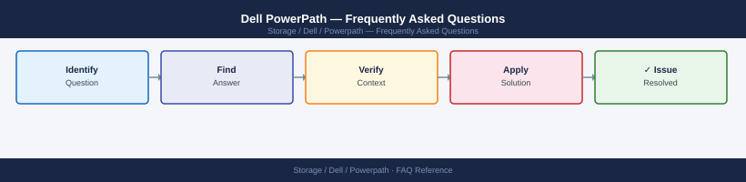

---
tags:
  - dell-powerpath
  - faq
  - operations
---
# Dell PowerPath — Frequently Asked Questions

Common questions about Dell PowerPath operations, configuration, and troubleshooting. For step-by-step procedures, see the <a href="index.md">Operations</a> section.

## General

**Q: What PowerPath version is recommended?**
A: PowerPath 6.4.x for Windows, 6.2.x for Linux are current. Check with `powermt version` on the host. Always align PowerPath version with the array support matrix.

**Q: How do I check the current Dell PowerPath version?**
A: `powermt version`

## Configuration

**Q: What is the default load balancing policy and when should it change?**
A: Adaptive load balancing (`adap`) is the default for PowerMax and VMAX arrays. For all-active arrays (PowerStore, Unity), use `round-robin` or `least-queue-depth`. Check with `powermt display dev=all`.

**Q: How do I enable PowerPath pseudo device persistence after host reboot?**
A: PowerPath pseudo device names persist by default if properly configured. Verify `powermt save` is called after any configuration change. On Linux, ensure `powervt` daemon is enabled: `systemctl enable powermt`.

## Operations

**Q: How do I upgrade PowerPath on a host with active I/O?**
A: PowerPath upgrades require host downtime or migration of workloads. For VMware: use PowerPath/VE, which supports online upgrades. For bare-metal, schedule a maintenance window, stop I/O, upgrade, reboot, verify paths with `powermt display dev=all`.

**Q: What is the correct procedure to add a new storage path to PowerPath?**
A: Zone the new path in the SAN fabric. Rescan the HBA: `echo '- - -' > /sys/class/scsi_host/hostX/scan`. Run `powermt config` to detect new paths. Verify with `powermt display dev=all`. Save config: `powermt save`.

## Troubleshooting

**Q: PowerPath shows 'path degraded' for a device. What does it mean?**
A: One or more paths to a LUN are unavailable. I/O continues on remaining paths. Check the HBA, SAN zoning, and storage port. Run `powermt display dev=<dev>` for path details. Resolve the path failure before another path goes down.

**Q: I/O throughput is unevenly distributed across paths — where do I start?**
A: Check `powermt display dev=all` for per-path I/O statistics. If load is uneven, verify the load balancing policy is set correctly for your array type. For persistent path preference, switch to `rr` (round-robin) policy.

## Backup and Recovery

**Q: How often should I back up PowerPath configuration?**
A: Run `powermt save` after every configuration change. The saved config file (`/etc/powermt.custom` on Linux) should be included in host configuration backup. Back up before any PowerPath upgrade.

**Q: Can I restore PowerPath configuration after a host rebuild?**
A: Yes — install PowerPath, copy `/etc/powermt.custom` from backup, then run `powermt restore`. This restores device aliases and policy settings. Verify paths with `powermt display dev=all` after restore.

## See Also

- [Dell PowerPath Operations](index.md)
- [Dell PowerPath Troubleshooting](../../../troubleshooting/index.md)
