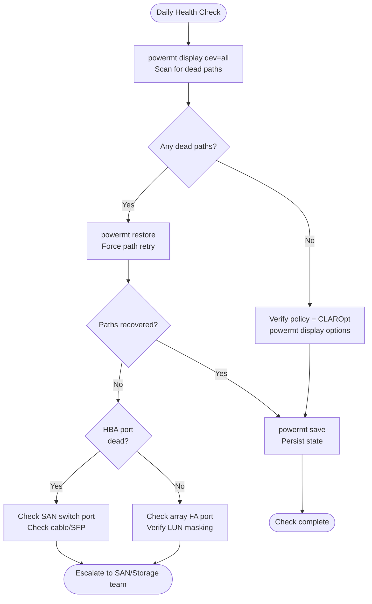

# PowerPath — Health Checks


<div class="kb-summary">
Health Checks reference covering Daily Health Check, Pre-Maintenance Health Check, Path State Verification, Port / HBA Check, Policy Verification and 2 more sections.
</div>
```text
┌─────────────────────────────────── Dell PowerPath — Health Checks ────────────────────────────────────┐
│                                                                                                       │
│   ┌───────────────────────────────────────────────────────────────────────────────────────────────┐   │
│   │      PowerPath health checks: routine verification of operational status and performance      │   │
│   │         Checks include: controller status, drive health, replication lag, and capacity        │   │
│   │         Frequency: daily quick checks; weekly detailed review; monthly capacity report        │   │
│   │        Configure threshold-based alerts for proactive incident prevention and awareness       │   │
│   └───────────────────────────────────────────────────────────────────────────────────────────────┘   │
│                                                                                                       │
│    Check status → review alerts → verify replication → capacity → log                                 │
│                                                                                                       │
│                  ▼                                ▼                                ▼                  │
│                                                                                                       │
│   ┌─────────────────────────────┐  ┌─────────────────────────────┐  ┌─────────────────────────────┐   │
│   │            Layer            │  │          Component          │  │            Notes            │   │
│   │            Driver           │  │        powermt daemon       │  │           OS-level          │   │
│   │            Paths            │  │        Active-active        │  │         ≥4 paths/LUN        │   │
│   │            Policy           │  │        Adaptive/ALUA        │  │        Array-specific       │   │
│   │           Failover          │  │         Auto reroute        │  │          <5 sec RTO         │   │
│   │          Management         │  │           pp_mgmt           │  │         Centralised         │   │
│   └─────────────────────────────┘  └─────────────────────────────┘  └─────────────────────────────┘   │
│                                                                                                       │
│                          ▼                                                 ▼                          │
│                                                                                                       │
│   ┌───────────────────────────────────────────────────────────────────────────────────────────────┐   │
│   │    Check area    │  How to verify   │   Pass criteria   │    Frequency     │       Tool       │   │
│   │   Controllers    │   show status    │    All healthy    │      Daily       │     CLI/GUI      │   │
│   │      Drives      │   show drives    │  No failed/pred.  │      Daily       │     CLI/GUI      │   │
│   │   Replication    │ show replication │  Lag < threshold  │      Daily       │     CLI/GUI      │   │
│   │     Capacity     │  show capacity   │     < 80% used    │      Daily       │     CLI/GUI      │   │
│   └───────────────────────────────────────────────────────────────────────────────────────────────┘   │
│                                                                                                       │
│    Physical: Host OS (Windows/Linux) · HBA or iSCSI NIC ports · FC/IP switches · Dell arrays          │
│                                                                                                       │
│    Key terms:                                                                                         │
│                                                                                                       │
│    PowerPath          = Dell multipath driver; manages multiple I/O paths to storage for HA/perform...│
│    powermt            = CLI utility; powermt display, powermt check, powermt save are core commands   │
│    Pseudo device      = virtual block device created by PowerPath aggregating physical I/O paths      │
│    Path health        = alive or dead status per path; dead paths trigger automatic I/O failover      │
│    Adaptive policy    = load-balancing that distributes I/O across all active paths evenly            │
│    CLARiiON policy    = active/passive policy for older VNX/CLARiiON arrays (one active path)         │
│    ALUA               = Asymmetric Logical Unit Access; array signals preferred vs. non-preferred p...│
│    Trespass           = LUN ownership movement between SP-A and SP-B on Unity or VNX arrays           │
│    Ghost path         = stale path entry in PowerPath no longer backed by a physical device           │
│    powermt check      = validates all paths and refreshes device table; run after fabric changes      │
│    pp_mgmt            = PowerPath Management Appliance; central monitoring for all PowerPath hosts    │
│    License key        = host-based license required per server; applied via powermt config license    │
│                                                                                                       │
└───────────────────────────────────────────────────────────────────────────────────────────────────────┘
```

## Run This Routine

1. **Path status:** `powermt display dev=all` — all paths should show alive
2. **Dead paths:** `powermt display dev=all | grep -i dead` — should return empty
3. **Load balancing:** `powermt display dev=all | grep -i policy` — verify expected policy (ServiceTime, CLARiiON, etc.)
4. **Path count per device:** `powermt display dev=all | grep -c "=sd"` — verify expected path count
5. **PowerPath version:** `powermt version`
6. **HBA status:** `powermt display hba_info` — all HBAs Connected
7. **Save path configuration:** `powermt save` — ensure current config is saved

## Daily Health Check



| Check | Command | Notes |
|---|---|---|
| [ ] Run `powermt display dev=all` on each managed host and scan for dead paths | `powermt display dev=all` | A dead path requires investigation before the next maintenance window |
| [ ] Verify all pseudo devices show the expected number of active paths |  | Compare against the site baseline (typically 4 or 8 paths per device depending on array and fabric redundancy) |
| [ ] Confirm the load balancing policy is `CLAROpt` (co) for all Dell/EMC array classes | `CLAROpt` |  |
| [ ] Check for devices in `pseudo` state with no backing paths | `pseudo` | This indicates a LUN that was removed at the array but not yet cleaned up on the host |
| [ ] Review host OS multipath logs for path flaps | `/var/log/messages` | Recurring path flap events indicate a marginal cable, SFP, or switch port |
| [ ] Run `powermt check_registration` on recently upgraded or newly deployed hosts | `powermt check_registration` |  |

```bash
# Show all PowerPath devices and their state
powermt display dev=all

# Show device summary (path counts, policy, state)
powermt display options

# Show path count per device
powermt display dev=all | grep -E "^Pseudo|Dead|alive"
```

## Pre-Maintenance Health Check

Run these checks before any SAN maintenance or as first-response steps when a host reports I/O errors or path loss.

- [ ] `powermt display dev=all` — all paths for all pseudo devices are in `alive` state; no `dead`, `unlic`, or missing paths
- [ ] Path count per device matches the site baseline — deviations indicate a fabric, zoning, or array-side masking change
- [ ] `powermt display ports class=all` — all HBA ports show `alive`; no ports in `dead` or `inactive` state
- [ ] `powermt display options` — Policy is `CLAROpt` for all Dell/EMC array device classes
- [ ] `powermt check_registration` — license is valid with a future expiry date
- [ ] `powermt version` — installed PowerPath version is within the supported matrix for the OS kernel and array firmware versions
- [ ] No recent path flap entries in `/var/log/messages` or Windows Event Log for the last 24 hours

```bash
# Display all PowerPath managed devices and path states
powermt display dev=all

# Display all HBA port states across all device classes
powermt display ports class=all

# Show current load balancing policy and PowerPath options
powermt display options

# Check PowerPath license registration status and expiry
powermt check_registration

# Show installed PowerPath version
powermt version

# Retry and restore all paths currently marked dead
powermt restore

# Display detailed path information for a specific pseudo device
powermt display dev=<pseudo-device-name>

# Rescan for new or removed devices after LUN mapping changes
powermt config
```

## Path State Verification

All paths should show `alive` under normal conditions:

```bash
powermt display dev=all
```

Expected output per path:
```text
============================================================
Pseudo name=hdisk3
CLARiiON/VNX id=CX300-0123 [array_name]
Logical device ID=6000144000000010012345678901234
state=alive; policy=CLAROpt; priority=1; HBA id=fcs0
============================================================
```

| Path State | Meaning | Action |
|---|---|---|
| alive | Path healthy and active | None |
| dead | Path failed or disconnected | Investigate HBA/SAN |
| standby | Path in standby (failover ready) | Normal for some policies |
| degraded | Partial path issue | Investigate urgently |

## Port / HBA Check

```bash
# Show HBA port status
powermt display ports

# Show path counts per HBA
powermt display dev=all | grep -c alive
```

## Policy Verification

```bash
# Display load balance policy per device
powermt display dev=all | grep policy
```

Expected: `CLAROpt` (CLARiiON optimized) or `co` for Active/Optimized.

## Health Summary Table

| Check | Expected | Action if Not Met |
|---|---|---|
| Path state | All alive | Restore paths; check HBA/SAN |
| Path count | ≥ 2 per device | Investigate missing paths |
| Policy | CLAROpt or co | Correct with `powermt set policy=co dev=all` |
| Devices listed | All LUNs present | Check zoning and host registration |

---

## Host Validation

Validate PowerPath installation and path configuration after host provisioning or changes.

### Check PowerPath Version

```bash
# Linux
powermt version

# Windows (PowerShell or cmd)
powermt version
```

### Verify PowerPath is Running

```bash
# Linux — check PowerPath daemon
/etc/init.d/PowerPath status
# or
systemctl status PowerPath

# Windows
sc query EMCPower
```

### Device Discovery

```bash
# Rescan for new devices
powermt config

# Check device list
powermt display dev=all
```

### Path Count Validation

For each device, confirm expected path count (typically 2 or 4 per LUN):

```bash
powermt display dev=all
```

Count `alive` paths per pseudo device. Compare against expected path count from the storage array zoning design.

### Host Registration on Array

Ensure the host is registered on the array (PowerMax/VNX/Unity) with the correct initiators:

- Check via array management console that all HBA WWNs/iSCSI IQNs are registered
- Confirm LUN masking to the correct host or host group

### After OS Reboot Validation

```bash
# Confirm PowerPath loaded and devices are present
powermt display dev=all

# Confirm no dead paths after reboot
powermt display dev=all | grep -i dead

# Restore paths if needed
powermt restore
```

### Multipath Conflict Check (Linux)

Ensure `multipathd` is disabled when using PowerPath — running both simultaneously causes conflicts:

```bash
systemctl status multipathd
# Should be inactive/disabled when PowerPath is in use
```

### Validation Checklist

| Check | Command | Expected |
|---|---|---|
| PowerPath running | `systemctl status PowerPath` | Active |
| All devices visible | `powermt display dev=all` | All LUNs listed |
| No dead paths | `grep dead` output | 0 dead paths |
| Path count correct | Count `alive` per device | Matches design |
| multipathd disabled | `systemctl status multipathd` | Inactive |
